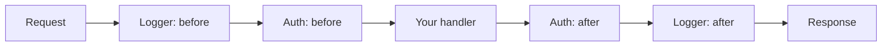

# Middleware

Here's the thing nobody tells you up front: most of the "framework" part of a web framework isn't the routing — it's the stuff that runs *around* every request. Logging. Auth checks. Panic recovery. Timing. CORS headers. You don't want to paste those into all forty of your handlers. You want to write them once and have them wrap everything.

That wrapper is **middleware**, and in Gin it's the same shape as a handler. If you can picture a handler, you already understand 90% of middleware.

## The mental model: a handler that runs around other handlers

> 💡 Middleware is a handler that runs *around* your route handler. Think of it as an onion: the request travels inward through each layer, hits your handler in the center, and then travels back outward through those same layers.

The seam between "going in" and "coming back out" is one function call: **`c.Next()`**. Code you write *before* `c.Next()` runs on the way in. Code *after* it runs on the way out, after the handler (and everything deeper) has finished. That single fact unlocks every middleware pattern there is.



Once you see it as "a chain of handlers with a seam in the middle," the rest is mechanics.

## The signature, and the three ways to register

A middleware *is* a `gin.HandlerFunc` — the exact same `func(c *gin.Context)` your route handlers are. There's no special type, no magic interface. The only convention is that middleware usually calls `c.Next()` (or `c.Abort()`) somewhere.

The common pattern is a function that *returns* a `gin.HandlerFunc`. That outer function is where you do one-time setup (read config, open a logger) and the returned closure is what runs per request:

```go
func Hello() gin.HandlerFunc {
    return func(c *gin.Context) {
        log.Println("a request came in")
        c.Next()
    }
}
```

*What just happened:* `Hello()` runs once, when you register it. The inner `func(c *gin.Context)` it hands back runs on every request. This "function returning a HandlerFunc" shape is the idiom you'll see everywhere — get comfortable with it now.

You attach middleware in one of three scopes:

```go
r := gin.New()

// 1. Global — runs for EVERY route on this engine.
r.Use(Hello())

// 2. Per-group — runs only for routes in this group.
v1 := r.Group("/api/v1")
v1.Use(Hello())

// 3. Per-route — runs only for this one route. List middleware before the handler.
r.GET("/admin", Hello(), adminHandler)
```

*What just happened:* same middleware, three reaches. `r.Use` wraps the whole app; `group.Use` wraps a subtree of routes (this is how you protect `/api/v1/*` without touching public routes); and listing it inline on `r.GET` wraps exactly one endpoint. Pick the narrowest scope that does the job.

> 📝 Order matters. Middleware runs in the order you register it. `r.Use(A); r.Use(B)` means A's "before" code runs first and A's "after" code runs *last* (outermost layer of the onion).

## `c.Next()`, and how to stop the chain with `c.Abort()`

You don't actually have to call `c.Next()` yourself in most middleware — Gin calls the next handler automatically when yours returns. You call `c.Next()` explicitly when you have work to do *after* the rest of the chain finishes. The classic example is timing a request: you note the start, let everything downstream run, then measure on the way out.

```go
func Timer() gin.HandlerFunc {
    return func(c *gin.Context) {
        start := time.Now()
        c.Next()
        log.Printf("%s %s took %v", c.Request.Method, c.FullPath(), time.Since(start))
    }
}
```

*What just happened:* `start := time.Now()` runs on the way in. `c.Next()` hands control to the rest of the chain — the actual handler runs, writes its response, and returns. Only *then* does the `log.Printf` line run, with `time.Since(start)` capturing the full request duration. Without the explicit `c.Next()`, you'd have no "after" point to measure from. This is also exactly how you'd set a response header *after* the handler decides what it's doing.

The other direction is stopping the chain early. When a middleware decides the request shouldn't continue — failed auth, rate limit hit — it calls **`c.Abort()`**. Abort means "no handler after me in this chain will run." Note: `c.Abort()` does *not* write a response by itself; it just halts the chain. Almost always you want **`c.AbortWithStatusJSON(code, obj)`**, which aborts *and* writes a JSON error in one call.

```go
func RequireHeader() gin.HandlerFunc {
    return func(c *gin.Context) {
        if c.GetHeader("X-Demo") == "" {
            c.AbortWithStatusJSON(http.StatusBadRequest, gin.H{"error": "missing X-Demo header"})
            return
        }
        c.Next()
    }
}
```

*What just happened:* if the header is missing, we abort with a 400 and a JSON body — the handler never runs. The bare `return` after the abort is important: `c.AbortWithStatusJSON` flags the chain as stopped, but your own function keeps executing until it returns, so you `return` to avoid running the rest of *this* middleware's code. If the header is present, `c.Next()` lets the request through.

> ⚠️ Forgetting the `return` after an abort is the #1 middleware bug. Without it, your middleware writes the error response *and then keeps going*, often writing a second response and crashing with "headers already written." Abort, then return.

## Passing data down the chain: `c.Set` and `c.Get`

Middleware often needs to hand something to the handler — most commonly, *who the user is* after authenticating them. The context carries a small per-request key/value store for exactly this: `c.Set("key", value)` stashes it, and `c.Get("key")` reads it back later (returning the value and an `ok` bool). There's also `c.MustGet("key")` when you're certain it's there.

Let's wire a real **auth middleware** onto the `/api/v1` group from Phase 2. It reads an `Authorization` header, rejects the request with a 401 if it's missing, and otherwise records the current user for downstream handlers:

```go
func Auth() gin.HandlerFunc {
    return func(c *gin.Context) {
        token := c.GetHeader("Authorization")
        if token == "" {
            c.AbortWithStatusJSON(http.StatusUnauthorized, gin.H{"error": "missing Authorization header"})
            return
        }

        // In a real app you'd verify the token here. We'll fake a lookup.
        user := lookupUser(token) // returns "" if the token is invalid
        if user == "" {
            c.AbortWithStatusJSON(http.StatusUnauthorized, gin.H{"error": "invalid token"})
            return
        }

        c.Set("user", user) // hand the user to downstream handlers
        c.Next()
    }
}
```

*What just happened:* two abort paths (no header, bad token) and one success path. On success we `c.Set("user", user)` and `c.Next()`. The handler can now read that user without re-doing any auth work — the middleware is the single place that knows how to authenticate.

Now apply it to the tasks group and read the user inside a handler:

```go
func main() {
    r := gin.Default()

    v1 := r.Group("/api/v1")
    v1.Use(Auth()) // every route under /api/v1 now requires a valid token

    tasks := v1.Group("/tasks")
    tasks.GET("", listTasks)

    r.Run(":8080")
}

func listTasks(c *gin.Context) {
    user := c.MustGet("user").(string) // we KNOW Auth ran and set this
    c.JSON(http.StatusOK, gin.H{
        "user":  user,
        "tasks": []string{"write tests", "ship it"},
    })
}
```

*What just happened:* because `Auth()` is on the `v1` group, the `/api/v1/tasks` routes are all protected — no token, no entry. Inside `listTasks`, `c.MustGet("user")` retrieves what the middleware stashed; the `.(string)` is a type assertion because the store holds `any`. `MustGet` panics if the key is missing, which is fine *here* because the middleware guarantees it ran first. If you weren't certain, you'd use `user, ok := c.Get("user")` and check `ok`.

Try it: `curl localhost:8080/api/v1/tasks` gets a 401, while `curl -H "Authorization: valid-token" localhost:8080/api/v1/tasks` gets the list.

## The built-ins: Logger and Recovery

You've been using `gin.Default()` this whole guide, and it's been quietly attaching two middlewares for you:

- **`gin.Logger()`** — logs every request (method, path, status, latency) to stdout. It's the colored line you see in your terminal on each request.
- **`gin.Recovery()`** — catches any panic in your handlers, logs the stack trace, and returns a 500 instead of crashing the whole server. Without it, one panic in one handler takes down your process.

```go
// These two lines are equivalent:
r := gin.Default()

r := gin.New()
r.Use(gin.Logger(), gin.Recovery())
```

*What just happened:* `gin.Default()` is literally `gin.New()` plus those two `Use` calls. That's the entire difference. `gin.New()` gives you a bare engine with *no* middleware — useful when you want full control (say, a custom structured JSON logger instead of Gin's default, or no logging at all in a high-throughput service).

> ⚠️ If you switch to `gin.New()`, you almost certainly still want `gin.Recovery()`. Dropping the logger is a reasonable choice; dropping panic recovery means a single nil-pointer dereference in any handler kills your server for *every* user. Add Recovery back unless you have a deliberate reason not to.

## Recap

- Middleware is a `gin.HandlerFunc` — the same `func(c *gin.Context)` as a handler — that runs *around* your handlers. The idiom is a function returning that closure.
- Register it three ways: `r.Use()` (global), `group.Use()` (a subtree, e.g. `/api/v1`), or inline on a route (`r.GET("/x", mw, handler)`). Order of registration is order of execution.
- `c.Next()` is the seam: code before it runs on the way in, code after runs on the way out. Use it to time requests or set response headers post-handler.
- `c.Abort()` stops the chain (remember to `return`); `c.AbortWithStatusJSON(code, obj)` stops it *and* writes a response — your go-to for auth and validation failures.
- `c.Set`/`c.Get` (and `c.MustGet`) pass per-request data down the chain; the canonical use is an auth middleware setting the current user.
- `gin.Default()` = `gin.New()` + `gin.Logger()` + `gin.Recovery()`. `gin.New()` has neither — keep Recovery unless you really mean to drop it.

## Quick check

Lock in the one idea that matters most — the `c.Next()` seam and aborting:

```quiz
[
  {
    "q": "In a middleware, where does code placed AFTER c.Next() run?",
    "choices": ["Before the request reaches the handler", "After the handler (and rest of the chain) has finished, on the way out", "It never runs", "Only if the handler calls c.Next() again"],
    "answer": 1,
    "explain": "c.Next() is the seam: code before it runs on the way in, code after it runs on the way out — which is why Timer() can measure total request duration there."
  },
  {
    "q": "An auth middleware rejects a request. Which call both stops the chain AND writes a JSON error response?",
    "choices": ["c.Next()", "c.Abort()", "c.AbortWithStatusJSON(401, obj)", "c.Set(\"error\", obj)"],
    "answer": 2,
    "explain": "c.Abort() only halts the chain without writing anything; c.AbortWithStatusJSON aborts and writes the response in one call. (Don't forget to return after it.)"
  },
  {
    "q": "What is the difference between gin.Default() and gin.New()?",
    "choices": ["Default() is faster", "Default() adds gin.Logger() and gin.Recovery(); New() adds neither", "New() adds Logger and Recovery; Default() adds neither", "They are identical"],
    "answer": 1,
    "explain": "gin.Default() is just gin.New() with Logger and Recovery attached via Use(). New() is the bare engine — keep Recovery() if you switch to it."
  }
]
```

[← Phase 4: Responses & Rendering](04-responses-and-rendering.md) · [Guide overview](_guide.md) · [Phase 6: Building a REST API →](06-building-a-rest-api.md)
