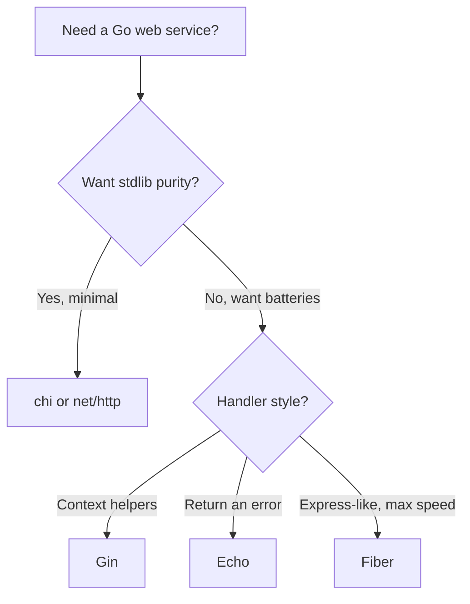

# Where to Go Next

Stop and look at what you can actually do now. You can spin up a Gin server, route requests with path and query parameters, group routes, bind and validate JSON into structs, shape responses with `c.JSON` and the right status codes, write and chain middleware around `c.Next()`, build full CRUD for a resource, handle errors with `c.Error` and `AbortWithStatusJSON`, structure the project past one file, and test the whole thing with `httptest` before shipping it with graceful shutdown. That's a real REST API, not a toy.

And here's the quieter win. Because Gin is so small, you didn't only learn a framework — you saw what one *is*. An **engine** holds the routes, a **context** carries each request, and middleware wraps the chain. Everything else is helpers over the standard library's `net/http`. Nothing was hidden behind magic, which means when something breaks at 2am, you can actually reason about it.

This last phase isn't more handlers — it's the map: where Gin sits among the other Go web frameworks, the layer you'll almost certainly add next, and one concrete thing to go build.

## Gin vs the field

You now know enough to choose a framework *on purpose* rather than by reputation. The good news in Go: these frameworks are far more alike than the JavaScript world's are. They all sit on (or near) `net/http`, they all do routing, params, and middleware. The differences are about *feel* and *tradeoffs*, not whole different universes.



A line on each:

- **Gin** — the most popular, the biggest ecosystem, the most Stack Overflow answers. Handlers take a `*gin.Context` and write to it. This is the safe default and the one you'll meet most in Go jobs. (You're here.)
- **Echo** — very close to Gin in spirit, with one stylistic difference worth knowing: its handlers *return* an `error` (`func(c echo.Context) error`) instead of writing failures into the context. It also ships a bit more built-in middleware. If you prefer the error-returning style, you'll like it. See [Echo From Zero](/guides/echo-from-zero).
- **chi** — minimal and proudly so. It's a router that stays *pure* `net/http` — handlers are plain `http.HandlerFunc`, middleware is standard `func(http.Handler) http.Handler`. Nothing to unlearn, nothing locked in. See [chi From Zero](/guides/chi-from-zero).
- **Fiber** — an Express-like API that feels familiar if you came from Node. The real tradeoff: it's built on **fasthttp**, not `net/http`, so it can be faster but is **not** compatible with the standard library's ecosystem of handlers and middleware. That's a genuine fork in the road, not a free lunch.
- **The standard library alone** — for many services, `net/http` plus the routing improvements in modern Go is genuinely enough. Knowing what Gin saves you starts with knowing what you'd write by hand. See [Web Services With Only net/http](/guides/web-services-with-only-net-http).

> 💡 How to pick: reach for **Gin** when you want batteries plus the biggest ecosystem. Reach for **chi or net/http** when you want stdlib purity and zero lock-in. Reach for **Echo** if you prefer its error-returning handler style. Reach for **Fiber** only if its API and raw speed genuinely win for you — and you've accepted that you're stepping off the `net/http` standard.

📝 None of these is "the best." They're aimed at slightly different tastes. The senior instinct isn't memorizing a winner — it's asking "best for *this* job?" and being able to answer honestly. You have the pieces for that now.

## The layer you'll add next: a real database

Every API in this guide stored tasks in memory. That's perfect for learning and useless in production — restart the server and the data's gone. The very next thing almost every real Gin service grows is a **database**.

Here's the reassuring part: your handlers barely change. Remember how Phase 6 and 7 kept the HTTP logic separate from where the data lived? That paid off. The handler still binds JSON, validates, calls a store, and returns a response. All that swaps underneath is the store — from a map to a database-backed one.

[GORM From Zero](/guides/gorm-from-zero) is the natural next read. GORM is Go's most popular ORM: you define your `Task` struct, point it at SQLite (or Postgres later), and your create/read/update/delete calls become real persistence. The shape of your code from Phases 6 and 7 stays intact — you're replacing the bottom layer, not rewriting the top.

## What to build

Reading more won't make this stick. Building one real thing will. So here's the assignment, and it's deliberately concrete.

Take the **tasks API** you grew across this guide and carry it all the way home:

- **Swap the in-memory store for GORM + SQLite** so tasks survive a restart. The handlers stay; the store changes. ([GORM From Zero](/guides/gorm-from-zero) walks the persistence part.)
- **Add JWT auth middleware** so each request proves who it is, and tasks belong to a user. This is exactly the middleware pattern from Phase 5, applied to a real job.
- **Add request logging** (and, when you're ready, basic metrics) so you can see what your service is doing in production.
- **Generate API docs** with OpenAPI/Swagger via **swaggo**, so other people — and future you — can read the contract.
- **Tidy up config** so secrets and ports come from the environment, not hardcoded values.
- **Deploy it** somewhere you can hit from your phone, with graceful shutdown wired up the way Phase 8 showed.

If the tasks API feels too familiar, build something small and new end to end instead — a **URL shortener** or a **notes API**. Same muscles: routes, binding, a store, middleware, tests, deploy. The point is finishing one project completely, which teaches more than three more tutorials would.

## The honest close

Gin was never magic. Strip the helpers away and it's three things you now understand completely: an **engine** that holds your routes, a **context** that carries each request, and a **middleware chain** that wraps the whole thing — all sitting on the same `net/http` you could write by hand if you had to.

That's why you can read the machine now. You can build a real service on top of Gin, and — more importantly — you can reason about it when it misbehaves. Go finish the tasks API, give it a database, lock it behind auth, deploy it, and show someone. You're ready.

## Recap

1. **You can ship a real Gin API** — routed, bound and validated, middleware-wrapped, structured, tested, and deployed — and you understand *why* each piece works, because Gin hid nothing.
2. **Choose a framework on purpose** — Gin for batteries + ecosystem, chi/net-http for stdlib purity and zero lock-in, Echo for its error-returning handlers, Fiber only when its API/speed wins and you accept the non-`net/http` base.
3. **A database is the next layer** — most Gin services add one, and with the Phase 6/7 separation in place your handlers barely change; you swap the in-memory store for GORM.
4. **Build and finish one thing** — carry the tasks API to GORM + SQLite, JWT auth, request logging, OpenAPI docs, real config, and a deploy. Or build a small URL shortener / notes API end to end.
5. **Gin is small on purpose** — an engine, a context, and a middleware chain over the standard library you now understand. That smallness was the lesson, not a limit.

## Quick check

Three decisions to take with you as you leave this guide:

```quiz
[
  {
    "q": "You want the biggest ecosystem and the most community answers, and you're happy writing handlers that take a context object. Which framework is the on-purpose default?",
    "choices": [
      "Fiber, because it's the fastest",
      "Gin, the most popular Go web framework with context-style handlers",
      "chi, because it's minimal",
      "net/http alone, always"
    ],
    "answer": 1,
    "explain": "Gin is the most popular Go web framework, with the largest ecosystem and context-style handlers. chi and net/http favor stdlib purity; Echo prefers error-returning handlers; Fiber trades net/http compatibility for speed."
  },
  {
    "q": "Which statement about Fiber is the honest tradeoff?",
    "choices": [
      "Fiber is just Gin with a different name",
      "Fiber is built on fasthttp, not net/http, so it can be faster but is not compatible with the standard library's handlers and middleware",
      "Fiber is the only Go framework with middleware",
      "Fiber cannot handle JSON"
    ],
    "answer": 1,
    "explain": "Fiber's Express-like API sits on fasthttp rather than net/http. That can mean more speed, but it steps off the standard library, so net/http-compatible handlers and middleware don't carry over. That's a real tradeoff to accept on purpose."
  },
  {
    "q": "You're adding a real database to your tasks API from Phases 6 and 7. What mostly changes?",
    "choices": [
      "Every handler must be rewritten from scratch",
      "Only the store layer swaps from an in-memory map to a GORM-backed one; the handlers stay roughly the same",
      "You must abandon Gin and switch to Echo",
      "Nothing — Gin stores data in a database automatically"
    ],
    "answer": 1,
    "explain": "Because the HTTP logic was kept separate from where data lives, the handlers still bind, validate, call a store, and respond. You swap the store from a map to GORM + a database — the bottom layer changes, the top stays."
  }
]
```

---

[← Phase 8: Testing & Production](08-testing-and-production.md) · [Guide overview](_guide.md)
