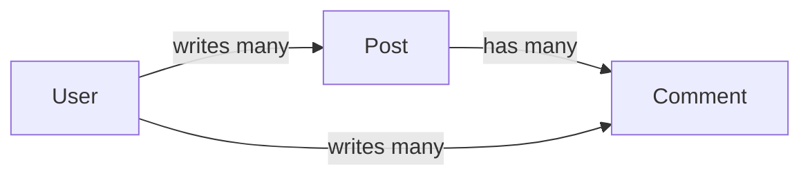

# What GORM Is & Connecting

Here's the situation you're walking into. You've got a Go service, and somewhere it needs to read and
write rows in a SQL database. You *could* hand-write every `INSERT`, `SELECT`, and `UPDATE`, scanning
columns into structs by hand, one `rows.Scan(&u.ID, &u.Name, ...)` at a time. People do. It works. It's
also a lot of repetitive, error-prone plumbing — and the moment your schema changes, you're hunting down
every query that touched that column.

GORM is what most Go web services reach for instead. It's the de-facto ORM for Go, and the trade it
offers is straightforward: you describe your tables as plain Go structs, and GORM writes the SQL for
create, read, update, delete, relationships, and even migrations. Less boilerplate, fewer typos in column
names, and your data shape lives in one place — the struct.

> 📝 This phase teaches the **library**. It assumes you know **Go** (structs, pointers, slices —
> [Go From Zero](/guides/go-from-zero)) and the basics of **databases** (tables, rows, keys —
> [What a Database Is](/guides/what-a-database-is)). If you've used an ORM in another language, the core
> ideas transfer directly — see [SQLAlchemy From Zero](/guides/sqlalchemy-from-zero) for the same
> concepts in Python.

## The honest cost

Every convenience has a bill attached, and it's only fair to name GORM's up front. When a library writes
your SQL for you, you stop *seeing* your SQL — and that's exactly where ORMs earn their bad reputation. A
single innocent-looking method call can fire off a query you'd never have written by hand, and if you're
not watching, you find out in production when something is slow.

⚠️ The cure isn't avoiding GORM — it's **watching the SQL it generates**. Go developers tend to value
knowing what's really happening, and GORM rewards that instinct: it can log every query it runs. Turn
that on while you learn (we'll do it in a minute), and the ORM stops being a black box. You'll see the
`INSERT` behind a `Create`, the `SELECT` behind a `Find`, and you'll know the moment a call does
something expensive.

## The mental model

Before any setup, hold this picture. It's the whole guide in one line:

> **A struct is a table. A `*gorm.DB` is the query you chain. GORM writes the SQL.**

Three pieces:

- **The struct = the table.** You define a `User` struct, and GORM treats it as the `users` table. Fields
  become columns. (Phase 2 covers exactly how.)
- **The `*gorm.DB` = the query you chain.** This is the value you get back from connecting. You build up a
  query by chaining methods on it — `db.Where("age > ?", 18).Order("name").Find(&users)` — and each link
  in the chain adds to the SQL that finally runs.
- **GORM writes the SQL.** You think in structs and method calls; GORM translates that into the real
  `SELECT ... WHERE ... ORDER BY ...` and hands it to the database driver.

💡 And here's the freedom: GORM is a **SQL generator**, not a cage. When the high-level API gets awkward —
a gnarly report, a bulk update — you drop straight to raw SQL with `db.Raw(...)` or `db.Exec(...)`, in the
same program, against the same connection. You never lose access to the database underneath.

## Installing GORM

GORM is two pieces: the core library, and a **driver** for your specific database. We'll use SQLite — it
needs zero setup (the database is just a file), so you can run everything in this guide without installing
a server.

From inside a Go module (`go mod init blog` if you're starting fresh), pull them in:

```bash
go get gorm.io/gorm
go get gorm.io/driver/sqlite
```

*What just happened:* `go get` downloaded two packages and added them to your `go.mod`. The first is GORM
itself. The second is the SQLite driver — the adapter that teaches GORM how to speak SQLite specifically.
GORM ships separate drivers for each database; if you later move to PostgreSQL or MySQL, you swap the
driver (`gorm.io/driver/postgres` or `gorm.io/driver/mysql`) and almost nothing else changes.

## Opening a connection

Now the connection itself. This is the single most important call in the library, because it hands you the
`*gorm.DB` that everything else hangs off of:

```go
package main

import (
	"log"

	"gorm.io/driver/sqlite"
	"gorm.io/gorm"
)

func main() {
	db, err := gorm.Open(sqlite.Open("blog.db"), &gorm.Config{})
	if err != nil {
		log.Fatal(err)
	}

	log.Println("connected:", db)
}
```

Run it with `go run .`.

*What just happened:* `gorm.Open` took two arguments and gave back two values. The first argument is the
**dialector** — `sqlite.Open("blog.db")` says "use the SQLite driver, and point it at a file called
`blog.db`." (That file is created automatically if it doesn't exist.) The second argument, `&gorm.Config{}`,
is GORM's settings bag — empty here, meaning "all defaults." Back out comes `db`, a **`*gorm.DB`** — your
handle to the database, the thing you'll chain every query on — plus an `err`. Checking that error and
bailing with `log.Fatal` is the standard Go move: if the connection failed, there's no point continuing.

📝 `db` is a long-lived value. You open it **once** at startup and pass it around your program — you do
*not* call `gorm.Open` per request. Under the hood it manages a pool of connections for you.

## Turn on the SQL logger

Remember the honest cost — not seeing your SQL? Here's the fix, and it's the single best habit you can
build while learning. GORM has a built-in logger; tell it to log at `Info` level and it prints every query
it runs:

```go
package main

import (
	"gorm.io/driver/sqlite"
	"gorm.io/gorm"
	"gorm.io/gorm/logger"
)

func main() {
	db, err := gorm.Open(sqlite.Open("blog.db"), &gorm.Config{
		Logger: logger.Default.LogMode(logger.Info),
	})
	if err != nil {
		panic(err)
	}

	_ = db
}
```

*What just happened:* the only change is the `Logger` field in the config. `logger.Default` is GORM's
out-of-the-box logger; `.LogMode(logger.Info)` cranks it up so it reports *every* SQL statement (at the
quieter default levels it only speaks up for errors or slow queries). The extra import,
`"gorm.io/gorm/logger"`, is what gives you `logger.Default` and `logger.Info`. From now on, every GORM
call in this guide leaves a trail you can read.

Once it's on, a query you'll meet in Phase 3 shows up in your terminal looking roughly like this:

```sql
[1.204ms] [rows:1] SELECT * FROM `users` WHERE `users`.`id` = 1 ORDER BY `users`.`id` LIMIT 1
```

*What just happened:* GORM printed the exact SQL it generated, how long it took (`1.204ms`), and how many
rows came back (`rows:1`). That one line is the antidote to the "black box" problem — you wrote a Go method
call, and here's the literal SQL it became. 💡 Keep this on the entire time you're learning. The instant a
single call fires five queries, or runs a `SELECT` with no `WHERE`, you'll see it.

## The running example: a blog

Rather than disconnected snippets, this whole guide builds one small, recognizable schema — a **blog** —
and grows it phase by phase. Three tables, and the relationships between them are exactly the ones every
real app runs into:



*What just happened:* the diagram lays out the cast. A **`User`** writes many **`Post`s** and many
**`Comment`s**. A **`Post`** collects many **`Comment`s**. That's a *has-many* relationship in both
directions from `User`, and another from `Post` to `Comment` — the bread and butter of relational data.
Right now they're just boxes and arrows; in Phase 2 we turn `User`, `Post`, and `Comment` into real Go
structs, and from there we'll create rows, query them, update and delete them, and wire up these
relationships with associations and preloading.

For this phase, the win is smaller and concrete: you can open a connection, you've got the logger on, and
you hold the mental model. That's the foundation everything else stands on.

## Recap

1. **GORM is Go's de-facto ORM** — you describe tables as structs and it writes the SQL for CRUD,
   relationships, and migrations, so you skip the hand-written query boilerplate.
2. **The honest cost is invisible SQL.** The cure is GORM's logger: turn it on while learning so you see
   the exact query behind every call.
3. **The mental model:** a struct is a table, a `*gorm.DB` is the query you chain, and GORM generates the
   SQL — and you can always drop to raw SQL with `db.Raw`/`db.Exec`.
4. **Install two pieces** — `gorm.io/gorm` plus a driver (`gorm.io/driver/sqlite` here) — then
   `gorm.Open(sqlite.Open("blog.db"), &gorm.Config{})` returns your long-lived `*gorm.DB`.
5. **Open once at startup**, check the error, and pass `db` around; never call `gorm.Open` per request.
6. The guide builds one **blog** schema — `User`, `Post`, `Comment` — phase by phase.

## Quick check

Three questions on the framing that has to stick before Phase 2:

```quiz
[
  {
    "q": "In GORM's mental model, what is a `*gorm.DB`?",
    "choices": [
      "The handle to the database that you chain query methods on",
      "A single row fetched from a table",
      "The raw SQLite file on disk",
      "A struct that maps directly to one table"
    ],
    "answer": 0,
    "explain": "`gorm.Open` returns a `*gorm.DB` — your long-lived handle to the database and the value you chain methods on, like `db.Where(...).Find(...)`. A struct maps to a table; the `*gorm.DB` is the query builder."
  },
  {
    "q": "Why is enabling `logger.Default.LogMode(logger.Info)` such a good habit while learning GORM?",
    "choices": [
      "It prints the exact SQL behind every call, so the ORM stops being a black box",
      "It makes queries run faster by caching them",
      "It is required or GORM will refuse to connect",
      "It automatically rewrites slow queries for you"
    ],
    "answer": 0,
    "explain": "The honest cost of an ORM is that you stop seeing your SQL. Logging at Info level prints every generated statement (plus timing and row counts), so you catch surprises — like one call firing several queries — immediately."
  },
  {
    "q": "What two packages do you install to use GORM with SQLite?",
    "choices": [
      "`gorm.io/gorm` and `gorm.io/driver/sqlite`",
      "Only `gorm.io/gorm` — drivers are built in",
      "`gorm.io/gorm` and `database/sql`",
      "`gorm.io/orm` and `gorm.io/sqlite`"
    ],
    "answer": 0,
    "explain": "GORM is the core library plus a database-specific driver. For SQLite that's `gorm.io/gorm` and `gorm.io/driver/sqlite`; switching to Postgres or MySQL means swapping the driver for `gorm.io/driver/postgres` or `gorm.io/driver/mysql`."
  }
]
```

---

[Guide overview](_guide.md) · [Phase 2: Models & Auto-Migration →](02-models-and-migration.md)
