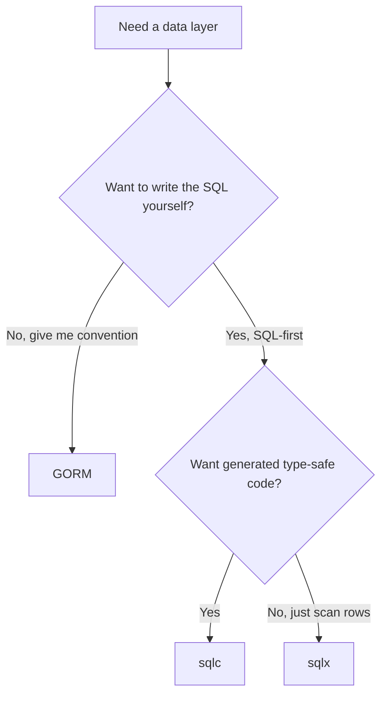

# GORM in the Real World & Where to Go Next

Stop for a second and look at the ground you've covered. You can describe a table as a Go struct and let `AutoMigrate` build it. You can `Create` and read records back. You can chain `Where`, `Order`, `Limit`, and `Select` into the exact query you want, and wrap reusable bits into scopes. You know the zero-value update trap and how to dodge it. You can model has-one, has-many, belongs-to, and many-to-many relationships, and you can spot the N+1 explosion before it ships and reach for `Preload` or `Joins`. You can wrap a sequence of writes in a transaction, hang behavior off lifecycle hooks, and you know why `AutoMigrate` is a starting point rather than a production migration story.

Most of all — and this is the whole point of learning GORM the way we did — you can read the SQL underneath. With the logger on, GORM stopped being a magic box and became a SQL generator whose output you can predict and debug. That's the skill that outlives any one library.

This last phase isn't new mechanics — it's about where GORM actually lives in real codebases, where it isn't the right tool, and what to build to make all of this stick.

## When to drop to raw SQL

Here's a thing worth saying out loud, because it surprises people who expect an ORM to be a cage: **GORM never traps you.** Any time the generated SQL gets awkward, you can go SQL-first for that one query and keep using GORM for everything else.

When does that moment come?

- **Complex reporting queries** — a seven-way join, window functions, a recursive CTE. The ORM fights you here, and you shouldn't fight back.
- **Database-specific features** — something only your engine offers, that GORM's portable layer doesn't expose cleanly.
- **Performance-critical paths** — a hot query where GORM's generated SQL is suboptimal and you want to hand-tune every clause.

Two methods cover it. Use `Raw` for reads and scan into a struct or slice:

```go
type Report struct {
    AuthorID uint
    PostCount int
}

var rows []Report
db.Raw(`
    SELECT author_id, COUNT(*) AS post_count
    FROM posts
    GROUP BY author_id
    HAVING COUNT(*) > ?
`, 5).Scan(&rows)
```

And `Exec` for writes that don't return rows:

```go
db.Exec("UPDATE posts SET published = ? WHERE author_id = ?", true, authorID)
```

📝 Notice the `?` placeholders with arguments passed separately — that's GORM parameterizing the query for you, the same protection against SQL injection you get from the rest of the API. Don't build SQL by gluing strings together with user input. Drop to raw SQL, yes; drop your guard, no.

## GORM vs sqlc, sqlx, and ent

GORM is the popular default in Go, but it isn't the only way to talk to a database — and Go culture in particular has a strong SQL-first streak. Knowing the landscape helps you pick well and read other people's code.

- **GORM** — a full ORM. You describe data as structs and chain methods; it writes the SQL. Optimizes for convention and productivity.
- **sqlc** — SQL-first with no runtime ORM. *You* write the SQL in `.sql` files, and sqlc generates type-safe Go functions from it. Your queries are exactly what you wrote, checked at build time.
- **sqlx** — thin helpers over the standard `database/sql`. You write the SQL; sqlx scans the results into your structs so you skip the tedious `rows.Scan(&a, &b, &c)` boilerplate.
- **ent** — a schema-as-code graph ORM from Meta, strong on traversing relationships as a graph.
- **bun** — another SQL-leaning query builder/ORM, lighter than GORM.



💡 The honest rule: reach for **GORM when you want productivity and convention** — fast CRUD, relationships handled, migrations baked in. Reach for **sqlc or sqlx when you want SQL-first control and predictable queries** — you'd rather own the exact SQL than have it generated for you. None of these is "better." They're different bets about who writes the SQL, and you can now make that call with your eyes open.

## The caveats, honestly — and production tips

A battle-hardened friend tells you where the dragons are. Here's the short list of GORM's, all of which you've already met:

- **The zero-value update trap (Phase 5).** `Updates` with a struct skips fields holding Go zero values (`0`, `""`, `false`), so a "set published to false" silently does nothing. Use a `map[string]interface{}` or `Select` the columns when you mean to write a zero.
- **Forgetting `Preload` → N+1 (Phase 7).** Loading a list and then touching each item's association fires one query per row. Eager-load with `Preload` or `Joins` and watch the count drop.
- **Generated SQL can be suboptimal.** GORM aims for portability, not always the leanest query. Keep the logger on and read what it emits. When a query is slow, the logged SQL is your first clue — see [Why Is My Query Slow?](/guides/why-is-my-query-slow).

And two production habits that matter the moment real traffic shows up:

**Tune the connection pool.** GORM sits on top of `database/sql`, which pools connections. The defaults are fine for a demo and wrong for production:

```go
sqlDB, _ := db.DB()
sqlDB.SetMaxOpenConns(25)
sqlDB.SetMaxIdleConns(25)
sqlDB.SetConnMaxLifetime(5 * time.Minute)
```

**Pass request context.** Wire the incoming request's `context.Context` into your queries so they cancel when the client goes away or the deadline passes — no orphaned queries hammering the database after the user has left:

```go
db.WithContext(ctx).Where("author_id = ?", id).Find(&posts)
```

📝 These two — a sized pool and `WithContext` — are most of what separates a tutorial GORM app from one that survives a busy afternoon.

## What to build

Reading got you here. Building is what makes it last. You already have the perfect sandbox: the **blog** schema this guide grew — users, posts, comments, and tags, with every relationship shape and the N+1 trap baked right in.

Take it further than a script. Put a real web framework on top and serve it as an API:

- **[Gin](/guides/gin-from-zero)** — the most popular Go web framework, fast and minimal.
- **[Echo](/guides/echo-from-zero)** — batteries-included with a clean API.
- **[chi](/guides/chi-from-zero)** — idiomatic routing built on the standard library.

Pick one, expose a few endpoints (`POST /posts`, `GET /posts/:id` with its comments preloaded, `GET /authors/:id/posts`), keep the GORM logger on, and watch the SQL scroll past as requests come in. Then deploy it somewhere — even a tiny instance. Seeing your structs become tables, your handlers become queries, and your queries become logged SQL in production is the most satisfying exercise in this whole guide.

Whichever framework you pick, **finish one.** A small app you actually debugged and deployed teaches more than three half-built ones.

You came in seeing an ORM as a trick that turned objects into rows somehow. You're leaving able to model, migrate, query, relate, beat N+1, transact, and — when the ORM gets in your way — drop to the SQL it was writing for you all along. A **struct is a table**, a **`*gorm.DB` is a query you chain**, and you can always see (and reach past) the SQL underneath. Go build the small thing.

## Recap

1. **GORM never locks you in.** Drop to raw SQL with `db.Raw(...).Scan(&out)` for reads and `db.Exec(...)` for writes when reporting, DB-specific features, or hot paths make GORM's SQL awkward — keep using `?` placeholders so it stays parameterized.
2. **Know the alternatives.** GORM is the full-ORM, convention-and-productivity choice; **sqlc** (generated type-safe Go from your SQL) and **sqlx** (thin scanning helpers) are the SQL-first picks; ent and bun round out the field. Pick by who you want writing the SQL.
3. **Remember the caveats.** The zero-value update trap, forgetting `Preload` and triggering N+1, and occasionally suboptimal generated SQL — all manageable once you keep the logger on and read what GORM emits.
4. **Production needs two habits.** Size the pool via `sqlDB, _ := db.DB()` and `SetMaxOpenConns`/`SetMaxIdleConns`/`SetConnMaxLifetime`, and pass `db.WithContext(ctx)` so queries cancel with the request.
5. **Build the blog for real:** users/posts/comments/tags behind a Gin, Echo, or chi API, deployed, with the SQL logger on. Finish one.

## Quick check

One last check — on how GORM shows up in real Go services:

```quiz
[
  {
    "q": "You need a gnarly reporting query — a multi-table join with window functions — and GORM's generated SQL is awkward. What's the mature move?",
    "choices": [
      "Drop to raw SQL with db.Raw(...).Scan(&out) for that one query and keep using GORM everywhere else",
      "Abandon GORM entirely and rewrite the whole app on database/sql",
      "Force it through Preload no matter how many queries it fires",
      "Build the SQL string by concatenating the user's input directly"
    ],
    "answer": 0,
    "explain": "GORM never traps you. Use db.Raw(...).Scan() (or db.Exec() for writes) for the awkward query and keep the ORM for the rest — and keep ? placeholders so it stays parameterized against injection."
  },
  {
    "q": "Your team wants to write the SQL by hand and get type-safe Go generated from it, with no runtime ORM. Which tool fits?",
    "choices": [
      "sqlc — SQL-first, it generates type-safe Go functions from the SQL you write",
      "GORM — it writes the SQL for you from struct method chains",
      "ent — a schema-as-code graph ORM",
      "AutoMigrate — that's a schema tool, not a query layer"
    ],
    "answer": 0,
    "explain": "sqlc is the SQL-first, code-generation choice: you write the .sql, it generates type-safe Go. GORM is the convention/productivity ORM that writes SQL for you; sqlx is thin scanning helpers; ent is a graph ORM."
  },
  {
    "q": "What are the two production habits that most separate a tutorial GORM app from one that survives real traffic?",
    "choices": [
      "Tune the connection pool via sqlDB, _ := db.DB() with SetMaxOpenConns/SetMaxIdleConns/SetConnMaxLifetime, and pass db.WithContext(ctx) so queries cancel with the request",
      "Turn off the SQL logger and add more Preloads everywhere",
      "Replace every query with db.Raw and never use the ORM",
      "Run AutoMigrate on every request to keep the schema fresh"
    ],
    "answer": 0,
    "explain": "GORM sits on database/sql, so size the pool (max open/idle conns and conn lifetime). And wire the request context with db.WithContext(ctx) so queries cancel when the client or deadline goes away — no orphaned queries hammering the DB."
  }
]
```

---

[← Phase 8: Transactions, Hooks & Migrations](08-transactions-hooks-migrations.md) · [Guide overview](_guide.md)
