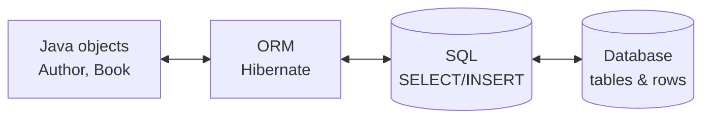
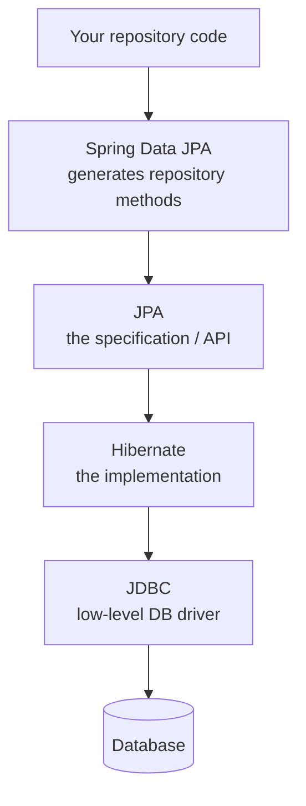

# What an ORM Is & Why Hibernate Exists

Here's the friction that started it all. In Java, you think in **objects**: an `Author` has a name, holds
a `List<Book>`, maybe inherits from some base class. References point from one object to another, and you
navigate them with a dot. But the database your data actually *lives* in thinks in **tables**: rows, columns,
and foreign keys — numbers in one table pointing at numbers in another. Two worlds, two completely different
shapes for the same information.

Hibernate exists because translating between those two shapes by hand — over and over, in every method that
touches the database — is some of the most tedious, error-prone code you'll ever write. This phase covers
*why* that translation is painful, what an ORM does to make it disappear, and the one habit that keeps an
ORM from quietly betraying you. We'll write almost no real code yet — the goal here is the mental model.
The actual domain (authors, books, reviews) starts in [Phase 2](02-entities-and-mapping.md).

## The problem: the object/relational impedance mismatch

📝 **Object/relational impedance mismatch** — the structural gap between the **object** world (classes,
references, inheritance, collections) and the **relational** world (tables, rows, columns, foreign keys).
They model the same data in fundamentally different ways, so moving information between them always takes
translation work.

The phrase sounds intimidating; the idea is concrete. In your Java program an author *contains* a list of
books — you write `author.getBooks()` and you have them. In the database there's no "contains." There's an
`authors` table and a `books` table, and each book row holds an `author_id` column — a number pointing back at
its author. To turn that row-with-a-number into a real `Author` object holding a real `List<Book>`, *someone*
has to do the stitching.

Before ORMs, that someone was you, using raw **JDBC** (Java's low-level database API). Here's the kind of code
you wrote for *every single query*:

```java
// Raw JDBC: turn one ResultSet row into one Author object — by hand.
String sql = "SELECT id, name, born_year FROM authors WHERE id = ?";
try (PreparedStatement ps = connection.prepareStatement(sql)) {
    ps.setLong(1, authorId);                 // bind the parameter by position
    try (ResultSet rs = ps.executeQuery()) {
        if (rs.next()) {
            Author a = new Author();
            a.setId(rs.getLong("id"));           // column -> field, by hand
            a.setName(rs.getString("name"));     // column -> field, by hand
            a.setBornYear(rs.getInt("born_year")); // column -> field, by hand
            return a;
        }
        return null;
    }
}
```

*What just happened:* you wrote the SQL string yourself, bound the `?` parameter by its position (get the
index wrong and you bind the wrong value — with no compiler to stop you), then pulled each column out of the
`ResultSet` *one at a time* and copied it into the matching field. That's the whole translation, done by hand.
Now imagine the author also has books and reviews, imagine doing the *reverse* mapping to save an object, and
imagine repeating all of it across forty different queries. Add one column to the table and you're hunting
through every method that mentions it.

⚠️ Every line of that hand-mapping is a place a typo, a wrong column name, or a mismatched type slips through
silently. The bug doesn't show up at compile time — it shows up at runtime, in production, as a field that's
mysteriously `null` or a `ClassCastException` deep in a stack trace. This boilerplate isn't just boring; it's
where data bugs are *born*. That repetitive, fragile copying is exactly what an ORM removes.

## What an ORM does

📝 **ORM (Object-Relational Mapper)** — a library that maps your **classes to tables** and your **objects to
rows** automatically. You declare the correspondence once ("this `Author` class maps to the `authors`
table"), then work with plain objects: ask for an author, get an `Author`; save an author, and the ORM writes
and runs the `INSERT` for you. It generates the SQL so you don't hand-write it.

With an ORM, that entire JDBC block from above collapses to roughly:

```java
Author a = entityManager.find(Author.class, authorId);  // SQL generated & run for you
```

*What just happened:* you told the ORM "fetch the `Author` with this id," and it figured out the `SELECT`,
ran it, read the `ResultSet`, and built the `Author` object with all its fields populated — the work that took
fifteen lines of JDBC, gone. You stayed entirely in the object world; the SQL happened underneath.



*What just happened:* the diagram is the whole pitch. Your code talks to objects on the left; the database
stores rows on the right; the ORM sits in the middle and translates *both directions* — objects into SQL when
you save, rows into objects when you load.

The trade is real and worth naming up front. You write far less boilerplate, but you've added a layer of
behavior between you and the database — a layer that makes decisions (when to run a query, what SQL to
generate, when to cache) that you don't see unless you go looking. This whole guide is about understanding
that layer so it stays a helper and never becomes a mystery. An ORM doesn't excuse you from knowing SQL —
it sits *on top* of that knowledge.

## JPA vs Hibernate: the distinction everyone trips on

This is the one piece of vocabulary beginners get tangled in, so let's untangle it cleanly. **JPA and
Hibernate are not competitors, and they're not the same thing.** One is a standard; the other follows it.

📝 **JPA (Jakarta Persistence API)** — a *specification*. It's a written standard: a set of annotations and
interfaces (the `jakarta.persistence.*` package) that *describe* how Java objects should map to database
tables. JPA is a rulebook. By itself, it doesn't *do* anything — it defines the contract.

📝 **Hibernate** — an *implementation* of that specification. It's the actual library that reads your
JPA annotations, generates the SQL, and runs it. Hibernate is the engine that does the work the rulebook
describes. It's the most popular JPA implementation by a wide margin; **EclipseLink** is another.

The relationship is the same one you've already met elsewhere: a *standard* and the *products that implement
it*. SQL is a standard; PostgreSQL and MySQL implement it. JPA is the standard; Hibernate implements it.

```java
import jakarta.persistence.Entity;   // <- a JPA annotation (the SPECIFICATION)
import jakarta.persistence.Id;       // <- also JPA

@Entity                              // "map this class to a table" — defined by JPA
public class Author {
    @Id                              // "this field is the primary key" — defined by JPA
    private Long id;
    private String name;
}
```

*What just happened:* every annotation here (`@Entity`, `@Id`) comes from `jakarta.persistence` — the JPA
specification. Your class names the standard, not the engine. At runtime, **Hibernate** reads these
annotations and produces the `CREATE TABLE` and `SELECT`/`INSERT` statements that actually hit the database.
You wrote to the rulebook; Hibernate did the work.

💡 **Code to JPA, run on Hibernate.** This is the practical payoff of the split. If you write your mappings
and queries using only the JPA API, your code isn't welded to Hibernate — in principle you could swap in
EclipseLink and your annotations still mean the same thing. In practice almost everyone runs Hibernate, and
Hibernate offers extra features beyond the standard. The discipline worth keeping: prefer the JPA way when
JPA covers it, and reach for Hibernate-specific features knowingly, aware you're stepping outside the standard.

## Where it sits in the stack

ORMs rarely sit alone. A typical Spring application has a small tower of layers, each a thinner convenience
wrapper over the one below it:



*What just happened:* a `findById` call enters at the top through **Spring Data JPA** (which generated that
method for you), which calls the **JPA** API, which is implemented by **Hibernate**, which builds SQL and
hands it to **JDBC** — the same low-level API from our first example — which finally talks to the database.
Each layer removes boilerplate from the one above it, all the way down to the raw `PreparedStatement` you saw
at the start.

💡 If you've been through [Spring Boot from zero](/guides/spring-boot-from-zero), this is the machinery that
was running *under* your repositories the whole time. Those tidy `findById` and `save` methods didn't talk to
the database directly — they sat on JPA, which sat on Hibernate. This guide is you opening that box and
learning what's inside. (And the JDBC layer at the bottom is the raw approach we'll keep [Java](/guides/java-from-zero)
developers grateful to never touch by hand again.)

## Minimal setup

You don't need much to start, and we'll keep it light — the real domain begins next phase. Four things have
to be in place:

1. **The dependency** — pull Hibernate (and the JPA API) into your project.
2. **Configuration** — either a `persistence.xml` file (plain JPA) or, in Spring, a few properties.
3. **A datasource** — the database URL, username, and password so Hibernate knows where to connect.
4. **`show_sql` turned on** — so you can *see* every SQL statement Hibernate generates.

In a Spring Boot project, the configuration is a handful of lines in `application.properties`:

```properties
# Where the database lives (the datasource)
spring.datasource.url=jdbc:postgresql://localhost:5432/library
spring.datasource.username=app
spring.datasource.password=secret

# THE most important line in this whole guide:
spring.jpa.show-sql=true
spring.jpa.properties.hibernate.format_sql=true
```

*What just happened:* the first three lines tell Hibernate which database to talk to. The last two are the
ones that matter for your sanity: `show-sql` prints every generated SQL statement to your console, and
`format_sql` lays it out readably instead of as one long line. With these on, the queries Hibernate writes
stop being invisible. When you load an author and watch this scroll past, the magic becomes legible:

```console
Hibernate:
    select
        a1_0.id,
        a1_0.name,
        a1_0.born_year
    from
        authors a1_0
    where
        a1_0.id=?
```

*What just happened:* that's Hibernate *showing you its work* — the exact `SELECT` it generated for a
`find(Author.class, id)` call, the same query you'd have hand-written in JDBC, now produced for you. Seeing it
confirms what ran, in what shape, against which tables.

⚠️ **Turn on `show_sql` now and never fly blind.** This is the single most important habit for everything
that follows. An ORM's whole job is to hide SQL from you — which is wonderful right up until it generates
something wasteful (like the dreaded hundreds-of-queries "N+1" problem we'll meet later) and you have no idea,
because you never looked. Reading the generated SQL is how you catch those problems early instead of in a
production incident. Every gotcha in this guide is one you'll *see coming* if `show_sql` is on. Leave it on
while you learn; the noise is the point.

## Recap

1. The **object/relational impedance mismatch** is the structural gap between Java's world (objects,
   references, collections) and the database's world (tables, rows, foreign keys) — bridging it by hand with
   raw **JDBC** is tedious and a breeding ground for silent bugs.
2. An **ORM** maps classes to tables and objects to rows automatically: you work with objects, it generates
   and runs the SQL. The trade is less boilerplate in exchange for a behavior layer you must understand.
3. **JPA is the specification** (the `jakarta.persistence.*` annotations and interfaces — a rulebook);
   **Hibernate is the most popular implementation** (the engine that does the work). EclipseLink is another.
4. **Code to JPA, run on Hibernate** — write to the standard, and Hibernate does the heavy lifting underneath.
5. The stack runs **Spring Data JPA → JPA → Hibernate → JDBC → database** — this is exactly what was powering
   your Spring Boot repositories all along.
6. ⚠️ Minimal setup is a dependency, config, and a datasource — and crucially, turn on **`show_sql`** so you
   *see* every query. Never fly blind; it's the habit that catches every gotcha ahead.

## Quick check

Three questions on the ideas that have to stick before Phase 2:

```quiz
[
  {
    "q": "What is the 'object/relational impedance mismatch'?",
    "choices": [
      "The structural gap between Java's object world (classes, references, collections) and the database's relational world (tables, rows, foreign keys)",
      "A performance problem caused by slow database hardware",
      "A bug that happens when two threads write to the same row at once",
      "The difference in speed between Hibernate and raw JDBC"
    ],
    "answer": 0,
    "explain": "Objects and relational tables model the same data in fundamentally different shapes — objects contain references and collections; tables use rows and foreign-key numbers. Translating between the two is the 'mismatch' an ORM exists to bridge."
  },
  {
    "q": "What is the relationship between JPA and Hibernate?",
    "choices": [
      "JPA is the specification (a standard set of annotations and interfaces); Hibernate is the most popular implementation of it",
      "They are two competing ORMs and you must pick one or the other",
      "Hibernate is the specification and JPA is one implementation of it",
      "They are different names for exactly the same library"
    ],
    "answer": 0,
    "explain": "JPA (Jakarta Persistence API) is the rulebook — the jakarta.persistence.* annotations and interfaces. Hibernate is the engine that reads those annotations and actually generates and runs the SQL. You code to JPA and run on Hibernate."
  },
  {
    "q": "Why is turning on `show_sql` called the single most important habit in this guide?",
    "choices": [
      "An ORM hides SQL by design, so seeing the generated queries is how you catch wasteful or unexpected SQL (like the N+1 problem) early instead of in production",
      "It makes Hibernate generate faster queries automatically",
      "It is required or Hibernate refuses to connect to the database",
      "It encrypts the SQL so the queries are more secure"
    ],
    "answer": 0,
    "explain": "An ORM's job is to hide SQL — which is great until it generates something wasteful and you never notice because you never looked. show_sql prints every generated statement so the ORM's behavior stays visible and you spot problems early."
  }
]
```

---

[Guide overview](_guide.md) · [Phase 2: Entities & Basic Mapping →](02-entities-and-mapping.md)
