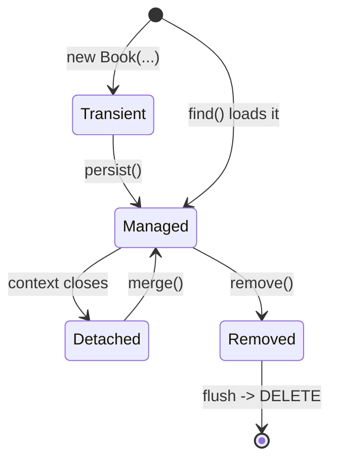

# The EntityManager & Persistence Context

In Phase 2 you mapped a `Book` to a table — `@Entity`, `@Id`, columns, the works. But a mapping just
sits there. Something has to actually *do* things with it: insert a new book, fetch one back, change a
title and have that change reach the database. That something is the **`EntityManager`**, and the place
it does its work is the **persistence context**.

This is the phase. If you take one idea from this whole guide, take this one. Almost every Hibernate
surprise you'll ever hit — a change that saved without you calling save, a lazy load that worked here
but blew up there, the dreaded N+1 — traces straight back to what's in this file. Once the persistence
context clicks, the rest of Hibernate stops being magic and starts being obvious.

## The mental model: a workbench, not a pipe

**What it actually is.** People picture an ORM as a pipe: Java object goes in one end, SQL comes out the
other, row lands in the table. That picture will mislead you for years. Hibernate isn't a pipe — it's a
**workbench**. When you load or save objects, Hibernate lays them out on a workbench it keeps for the
duration of your transaction, watches them, and only sends SQL to the database when it decides it's
time. The `EntityManager` is your handle to that workbench. The **persistence context** *is* the
workbench — the in-memory area holding the objects Hibernate is currently managing for you.

> 💡 **Key point.** Hibernate doesn't write to the database the instant you touch an object. It tracks a
> small set of objects in memory (the persistence context) and synchronizes them with the database on
> *its* schedule. Every "wait, when did *that* SQL run?" question is answered by understanding this one
> idea.

## The `EntityManager` — your handle to JPA

📝 **`EntityManager`** — the single object you use to talk to JPA. Nearly everything goes through it:

| Method | What it does |
|--------|--------------|
| `persist(entity)` | Make a brand-new object managed (schedules an `INSERT`) |
| `find(Class, id)` | Look up one entity by primary key |
| `merge(entity)` | Copy a detached object's state back into a managed one |
| `remove(entity)` | Mark a managed entity for deletion (schedules a `DELETE`) |
| `createQuery(...)` | Run JPQL — the topic of Phase 7 |

> 📝 Hibernate predates JPA, and its own native equivalent of `EntityManager` is called **`Session`**.
> They do the same job; `EntityManager` is the standard JPA name and the one you'll see in Spring. When
> an old Stack Overflow answer says "the Hibernate Session," mentally read "the EntityManager."

Let's save a `Book` and read it back. (We'll treat the transaction boilerplate as a given here —
Phase 4 dissects it.)

```java
EntityManager em = emf.createEntityManager();
em.getTransaction().begin();

Book book = new Book("Dune", "Frank Herbert");  // a plain Java object, nothing special yet
em.persist(book);                                // hand it to the EntityManager

em.getTransaction().commit();
em.close();
```
```sql
insert into book (author, title, id) values ('Frank Herbert', 'Dune', 1)
```
*What just happened:* `new Book(...)` created an ordinary object — at that moment Hibernate knows nothing
about it. `em.persist(book)` placed it on the workbench: now it's *managed*, and Hibernate has scheduled
an `INSERT`. Notice the SQL didn't fire on the `persist` line — it fired at `commit`. That gap between
"I told Hibernate about this object" and "the SQL actually ran" is the whole story of this phase.

Now read it back:

```java
EntityManager em = emf.createEntityManager();

Book found = em.find(Book.class, 1L);   // SELECT by primary key
System.out.println(found.getTitle());

em.close();
```
```sql
select b.id, b.author, b.title from book b where b.id = 1
```
```console
Dune
```
*What just happened:* `find(Book.class, 1L)` asked the EntityManager for the book with primary key `1`.
Not finding it on the workbench, Hibernate ran a `SELECT`, built a `Book` object from the row, placed it
on the workbench (now *managed*), and handed it to you. Plain, predictable. The interesting behavior
shows up when you ask for the *same* book twice.

## The persistence context — an identity map and a first-level cache

This is the core idea. 📝 The **persistence context** is a per-transaction, in-memory area that holds
the entities the EntityManager is currently managing. It does two jobs at once, and both surprise people
the first time:

1. **Identity map** — within one persistence context, a given database row maps to exactly **one** Java
   object. Ask for book `1` ten times and you get the *same instance* back every time.
2. **First-level cache** — once an entity is in the context, looking it up again by id returns it from
   memory. **No second SQL query.**

Here's the proof. Watch how many `SELECT`s come out:

```java
EntityManager em = emf.createEntityManager();

Book first  = em.find(Book.class, 1L);   // hits the database
Book second = em.find(Book.class, 1L);   // same id, same context

System.out.println(first == second);     // not .equals — identity, ==
```
```sql
select b.id, b.author, b.title from book b where b.id = 1
```
```console
true
```
*What just happened:* Two `find` calls, but **only one `SELECT`**. The first call ran the query and put
the `Book` on the workbench. The second call found it already there and returned it straight from
memory — no database round trip. And `first == second` is `true`: not just equal *values*, the very
**same object** (remember `==` vs `.equals()` from
[Java's classes phase](/guides/java-from-zero) — this is `==`, raw identity). That's the identity map
guaranteeing one row, one object, per context.

> ⚠️ This cache is **per persistence context** — it lives and dies with one transaction. It is *not* a
> shared application-wide cache that survives across requests. Open a new `EntityManager` and you get a
> fresh, empty workbench; the next `find` hits the database again. (The shared, long-lived cache is the
> *second*-level cache, and it's a whole separate opt-in feature — Phase 9.)

Why does Hibernate work this way? Because the identity map is what makes the next idea — automatic change
tracking — even possible. If you and three other lines of code each loaded book `1` into a *different*
object, Hibernate couldn't know which one's changes to save. One row, one object means there's exactly
one source of truth on the workbench to watch.

## The four entity states

Every entity, from Hibernate's point of view, is always in exactly one of **four states**. Learn these
names cold — error messages, docs, and your own debugging all speak this language.

📝 The four states:

- **Transient** — a brand-new object you made with `new`. Hibernate has never heard of it; it's not on
  the workbench and has no database row. (`new Book(...)` before any `persist`.)
- **Managed** (also *persistent*) — on the workbench, tracked by the persistence context, tied to a
  database row. Hibernate watches it and will save changes to it. (After `persist`, or anything `find`
  returns.)
- **Detached** — *was* managed, but its persistence context has closed. It still holds data, but nobody's
  watching it anymore; changes to it go nowhere. (A `Book` you loaded, after `em.close()`.)
- **Removed** — a managed entity you've marked for deletion with `remove`. It's scheduled to disappear at
  the next flush.

Here's the lifecycle as a diagram:



Let's walk one object through three of those states:

```java
Book book = new Book("Dune", "Frank Herbert");  // TRANSIENT — Hibernate doesn't know it

EntityManager em = emf.createEntityManager();
em.getTransaction().begin();
em.persist(book);                                // now MANAGED — on the workbench
book.setTitle("Dune (Special Edition)");         // tracked: this change WILL be saved
em.getTransaction().commit();
em.close();

book.setTitle("ignored");                        // now DETACHED — this change goes nowhere
```
```sql
insert into book (author, title, id) values ('Frank Herbert', 'Dune (Special Edition)', 1)
```
*What just happened:* The object started **transient** — a plain object Hibernate ignored. `persist`
made it **managed**, so when we changed the title *before commit*, Hibernate noticed and the `INSERT`
used the new value. After `em.close()` the context was gone, leaving the object **detached** — so the
final `setTitle("ignored")` changed the in-memory object but emitted no SQL, because nothing was watching
it. Same object, three different relationships to the database, depending purely on state. (That
"changing a managed field updates the row with no save call" behavior is *dirty checking* — Phase 4
makes it the star.)

## `persist` vs `merge` — the classic confusion

⚠️ This trips up nearly everyone, so read it twice. `persist` and `merge` sound interchangeable. They are
not, and reaching for the wrong one causes some of the most baffling Hibernate bugs.

- **`persist`** is for a **transient** (brand-new) object. It takes the object you pass and makes *that
  object* managed.
- **`merge`** is for a **detached** object. It does **not** make your object managed. It copies your
  detached object's state onto a managed copy and **returns that managed copy** — and the object you
  passed in *stays detached*.

That return value is the trap. Watch:

```java
// 'book' was loaded in a previous context, which closed — so it's DETACHED.
book.setTitle("New Title");                      // change the detached object

EntityManager em = emf.createEntityManager();
em.getTransaction().begin();

Book managed = em.merge(book);                    // returns the MANAGED copy

managed.setAuthor("Updated Author");              // change THIS one — it's the tracked one
book.setAuthor("goes nowhere");                   // change to the detached one — ignored

em.getTransaction().commit();
em.close();
```
```sql
select b.id, b.author, b.title from book b where b.id = 1
update book set author='Updated Author', title='New Title' where b.id=1
```
*What just happened:* `merge` ran a `SELECT` to load the current managed instance, copied `book`'s state
onto it, and **returned that managed instance** as `managed`. The update saved "New Title" (merged from
`book`) and "Updated Author" (set on `managed`) — but **not** "goes nowhere," because `book` is still
detached and nobody's watching it. The rule to burn in: **after `merge`, work with the returned object,
never the one you passed in.** Calling `persist` on a detached entity instead would throw — `persist` is
strictly for transient objects.

## Why this is the lens for everything that follows

💡 Step back, because this is the payoff. Nearly every Hibernate behavior that feels like magic or
mystery is one of these ideas wearing a costume:

- *"I changed a field and it saved without calling save"* → it was **managed**, and dirty checking caught
  the change (Phase 4).
- *"The same query ran once instead of twice"* → the **first-level cache** served the second call.
- *"`==` returned true for two loads"* → the **identity map** gave you one object per row.
- *"Why did this update fail silently?"* → you changed a **detached** object, or worked with the wrong
  side of a `merge`.
- *The N+1 problem* (Phase 6) → entities loaded one-by-one into the context, each triggering its own
  query.

⚠️ One more forward-reference worth planting now: a **detached entity can't lazy-load**. If you load a
`Book`, close the context, and *then* try to walk to a relationship that wasn't fetched yet, Hibernate
has no open persistence context to run the query through — and you get the infamous
`LazyInitializationException`. We'll meet it properly in Phase 6, but you already understand *why* it
happens: no open context, no workbench, nothing to do the lazy load. That's the whole point of learning
states first.

## Recap

1. The **`EntityManager`** is your handle to JPA — `persist`, `find`, `merge`, `remove`, `createQuery`.
   (Hibernate's native equivalent is the **`Session`**.)
2. The **persistence context** is a per-transaction, in-memory workbench holding managed entities.
   Hibernate syncs it to the database on *its* schedule, not the instant you touch an object.
3. It's a **first-level cache + identity map**: within one context, `find` the same id twice → one
   `SELECT` and the **same** object instance (`==` is true).
4. Every entity is **transient** (new, unknown), **managed** (tracked, tied to a row), **detached**
   (context closed, unwatched), or **removed** (marked for delete).
5. ⚠️ **`persist`** is for transient objects; **`merge`** is for detached ones — and `merge` **returns**
   the managed copy while your original stays detached. Always use the returned object.
6. 💡 This is the lens for the rest of the guide: dirty checking, lazy loading, and N+1 all reduce to the
   persistence context and entity states. A detached entity can't lazy-load (forward-ref Phase 6).

## Quick check

The three ideas that explain the most future bugs:

```quiz
[
  {
    "q": "Inside one persistence context, you call `em.find(Book.class, 1L)` twice. How many SELECT queries does Hibernate run, and is the result the same object?",
    "choices": [
      "One SELECT; both calls return the same object instance (== is true) — the first-level cache and identity map serve the second call from memory",
      "Two SELECTs; you get two separate objects with equal data",
      "Two SELECTs, but Hibernate returns the same object both times",
      "Zero SELECTs; find never touches the database"
    ],
    "answer": 0,
    "explain": "The persistence context is a first-level cache plus an identity map. The first find runs the SELECT and stores the Book; the second find returns that same instance from memory with no new query, so == is true."
  },
  {
    "q": "You call `Book managed = em.merge(detachedBook);` and then change a title on `detachedBook` (not on `managed`). What happens to that change?",
    "choices": [
      "Nothing — `detachedBook` is still detached after merge; only changes to the returned `managed` object are tracked and saved",
      "It's saved, because merge makes `detachedBook` managed",
      "It throws a LazyInitializationException",
      "Both objects are now managed, so the change is saved"
    ],
    "answer": 0,
    "explain": "merge does not make the object you pass in managed. It copies its state onto a managed copy and returns that copy. The original stays detached, so changes to it go nowhere. Always work with the object merge returns."
  },
  {
    "q": "Which entity state describes a `Book` you loaded with `find`, after its EntityManager has been closed?",
    "choices": [
      "Detached — it was managed, but its persistence context is gone, so it's no longer tracked",
      "Transient — it has no connection to Hibernate",
      "Managed — find always returns managed entities",
      "Removed — closing the context schedules it for deletion"
    ],
    "answer": 0,
    "explain": "An entity that was managed but whose persistence context has closed is detached. It still holds its data, but nothing watches it, so changes won't be saved — and it can no longer lazy-load relationships."
  }
]
```

---

[← Phase 2: Entities & Basic Mapping](02-entities-and-mapping.md) · [Guide overview](_guide.md) · [Phase 4: Transactions & the Unit of Work →](04-transactions-and-unit-of-work.md)
