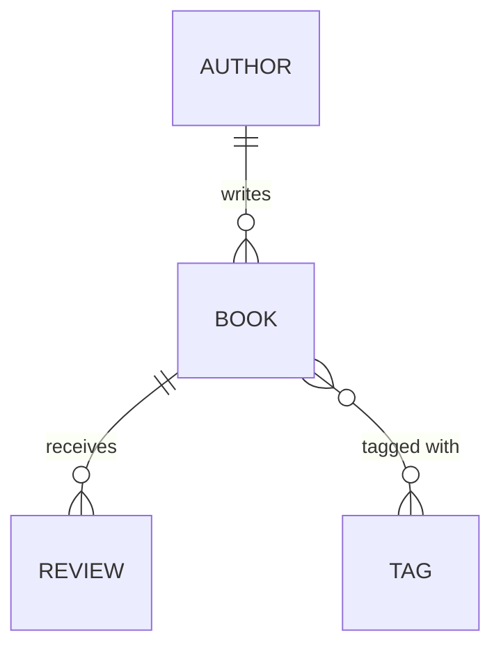

# Mapping Relationships

So far each entity has been an island: one class, one table, a handful of columns. Real data isn't like
that. An author writes many books; a book collects many reviews; a book wears many tags. The whole reason
you reach for a relational database is that things *relate* — and the whole reason ORM relationships feel
fiddly is that the database and your objects describe those relations in two completely different
languages. This phase is the translation guide.

The mental model to hold onto before any annotation: **a relationship is stored as a foreign key in the
database, but it shows up as a reference (or a collection) in your objects, and JPA's job is to keep those
two views in sync.** Get that one sentence into your bones and every annotation below is just spelling out
*which* table holds the key and *which* field points where.

## The mental model: two views of the same link

📝 In the database, "this book was written by that author" is a single column: `book.author_id` holds the
`id` of a row in the `author` table. That's it. A foreign key is just a column whose value matches a
primary key somewhere else. (If that's fuzzy, [Relationships &
Keys](/guides/relationships-and-keys) is the prerequisite, and [SQL Joins
Explained](/guides/sql-joins-explained) shows how you stitch the rows back together.)

In your Java objects, that *same* link looks different. A `Book` object holds a reference:
`book.getAuthor()` hands you the actual `Author` object. And an `Author` can hold a `List<Book>` — the
collection view of the same relationship, walked from the other end. One foreign key column, two object-side
shapes depending on which way you're looking.

Here's our domain for the rest of the guide:



*What just happened:* one author writes many books (`1—*`), one book receives many reviews (`1—*`), and
books and tags form a many-to-many (`*—*`). Three relationship shapes, and JPA has an annotation for each.
We'll do them in order of how often you'll write them — most common first.

## `@ManyToOne`: the foreign-key side

Start here, because this is the side that actually holds the foreign key, and it's the one you'll write
most. Many `Book`s point to one `Author`, so on `Book` we add a reference to its author.

```java
@Entity
public class Book {

    @Id
    @GeneratedValue(strategy = GenerationType.IDENTITY)
    private Long id;

    private String title;

    @ManyToOne                          // many books → one author
    @JoinColumn(name = "author_id")     // the FK column lives in THIS table
    private Author author;

    // getters and setters
}
```

*What just happened:* `@ManyToOne` tells JPA "many of these belong to one of those." `@JoinColumn(name =
"author_id")` names the foreign-key column that JPA will manage in the `book` table — the column that stores
which author this book belongs to. The `author` field isn't an `id`; it's a whole `Author` object, and
Hibernate handles loading it from that `author_id` value behind the scenes.

The table this implies is exactly what you'd write by hand:

```sql
CREATE TABLE book (
    id        BIGINT GENERATED ALWAYS AS IDENTITY PRIMARY KEY,
    title     VARCHAR(255),
    author_id BIGINT REFERENCES author(id)   -- the foreign key
);
```

*What just happened:* `author_id` is an ordinary column on `book` holding the id of a row in `author`. When
you call `book.setAuthor(someAuthor)` and the transaction commits, Hibernate writes `someAuthor`'s id into
that column. The object reference *is* the foreign key — JPA just lets you work with the object instead of
the raw number.

💡 If you only ever need to go from a book to its author, **you can stop here.** A `@ManyToOne` on its own is
a complete, working relationship. You don't have to add the collection on the other side unless you actually
need to walk it that direction.

## `@OneToMany` and the bidirectional link

Sometimes you *do* want the other direction: given an `Author`, list their `Book`s. That's the inverse
view — the same foreign key, walked from the one-side back to the many-side.

```java
@Entity
public class Author {

    @Id
    @GeneratedValue(strategy = GenerationType.IDENTITY)
    private Long id;

    private String name;

    @OneToMany(mappedBy = "author")     // inverse side: "look at Book.author"
    private List<Book> books = new ArrayList<>();

    // getters and setters
}
```

*What just happened:* `@OneToMany(mappedBy = "author")` gives `Author` a collection of its books. The
crucial word is `mappedBy = "author"`: it tells JPA *this side does not own the foreign key — the
relationship is already mapped by the `author` field over on `Book`.* No new column is created for the
author side. There's still exactly one foreign key in the database (`book.author_id`); we've just added a
second way to read it.

📝 **Owning side vs inverse side — the concept that explains everything.** A bidirectional relationship has
two ends but only *one* foreign key column. The end that holds the FK is the **owning side** — for us,
`Book` with its `@ManyToOne` and `@JoinColumn`. The other end is the **inverse side**, marked with
`mappedBy`. Here's the rule that trips up everyone: **Hibernate only looks at the owning side when deciding
what to write to the database.** The inverse collection is read-only as far as persistence goes. Change the
owning side, the FK changes. Change *only* the inverse side, and nothing gets written.

⚠️ **The #1 relationship bug: setting only one side.** Because the owning side is what persists, this looks
right and silently does the wrong thing:

```java
Author author = new Author("Ursula K. Le Guin");
Book book = new Book("A Wizard of Earthsea");

author.getBooks().add(book);   // touched the INVERSE side only...
// book.setAuthor(author) was never called — the owning side is still null!

em.persist(author);
em.persist(book);
// commit → book.author_id is NULL. The link you "made" was never saved.
```

*What just happened:* you added the book to the author's in-memory list, but `book.author` — the side that
owns the foreign key — was never set. Hibernate persists based on the owning side, sees `null`, and writes
`null` into `author_id`. Your objects look connected in memory; the database disagrees. And the next time
you load the author fresh, the books are gone.

The fix is to **keep both sides in sync with a helper method**, so you can never set one without the other:

```java
@Entity
public class Author {
    // ... fields as above ...

    public void addBook(Book book) {
        books.add(book);            // update the inverse collection (for in-memory consistency)
        book.setAuthor(this);       // update the OWNING side (this is what gets persisted)
    }
}
```

*What just happened:* `addBook` does both halves of the link in one call. `book.setAuthor(this)` sets the
owning side — that's the line that actually saves the foreign key. `books.add(book)` keeps your in-memory
object graph honest so the author's list reflects reality without a database round-trip. Calling
`author.addBook(book)` now does the right thing every time. 💡 Make the raw setters less tempting and route
all linking through helpers like this; it's the single highest-leverage habit for avoiding relationship
bugs.

## `@ManyToMany`: a link with no obvious home

Books and tags are many-to-many: a book has many tags, a tag labels many books. Neither table can hold the
foreign key (which row would it point to?), so the database uses a **join table** — a third table whose only
job is to pair ids.

```java
@Entity
public class Book {
    // ... id, title, author as before ...

    @ManyToMany
    @JoinTable(
        name = "book_tag",                              // the join table
        joinColumns = @JoinColumn(name = "book_id"),    // FK back to THIS entity (Book)
        inverseJoinColumns = @JoinColumn(name = "tag_id") // FK to the other entity (Tag)
    )
    private Set<Tag> tags = new HashSet<>();
}
```

*What just happened:* `@ManyToMany` plus `@JoinTable` tells Hibernate to manage a `book_tag` table with two
foreign keys — `book_id` and `tag_id` — where each row means "this book wears this tag." `Book` is the
**owning side** here (it declares the `@JoinTable`); `Tag` would carry `mappedBy = "tags"` if you wanted the
relationship navigable from that end too. The same owning-side rule applies: add to the owning collection to
persist the link.

The join table is exactly:

```sql
CREATE TABLE book_tag (
    book_id BIGINT REFERENCES book(id),
    tag_id  BIGINT REFERENCES tag(id),
    PRIMARY KEY (book_id, tag_id)
);
```

⚠️ **When the link itself has data, `@ManyToMany` is the wrong tool.** A plain `@ManyToMany` join table can
hold *only* the two foreign keys. The moment you need to record anything *about* the relationship — when the
tag was applied, who applied it, a relevance score — you can't, because there's nowhere to put it. The fix
is to promote the join table to a real entity (say `BookTag`) with its own `@Id` and two `@ManyToOne`s back
to `Book` and `Tag`. 💡 Rule of thumb: pure association → `@ManyToMany`; association *with attributes* → a
join entity.

## Cascade and orphan removal

One more pair of settings, because they decide what happens to the *related* rows when you save or delete.

📝 **Cascade** propagates an operation from a parent to its children. With `cascade = CascadeType.ALL` on
`Author`'s `books`, calling `em.persist(author)` also persists every `Book` in the collection, and removing
the author removes its books — you don't have to persist or delete each child by hand.

📝 **Orphan removal** (`orphanRemoval = true`) goes further: if you *remove a child from the collection*,
Hibernate deletes that child's row. The child became an "orphan" — no longer referenced by its parent — so
it's deleted rather than left dangling with a `null` foreign key.

```java
@Entity
public class Book {
    // ... id, title, author ...

    @OneToMany(
        mappedBy = "book",
        cascade = CascadeType.ALL,    // persist/remove a Book → persist/remove its Reviews
        orphanRemoval = true          // remove a Review from the list → DELETE that review
    )
    private List<Review> reviews = new ArrayList<>();
}
```

*What just happened:* a `Review` has no life of its own — it exists only as part of a `Book`, so cascading
all operations and removing orphans is exactly right here. Save the book, its reviews save with it. Delete
the book, its reviews go too. Pull a review out of `book.getReviews()`, and that review's row is deleted on
commit. This is the model where aggressive cascade *belongs*: a true parent-child where the child can't
outlive the parent.

⚠️ **Don't cascade like this on a `@ManyToOne`.** It's tempting to slap `cascade = CascadeType.ALL` on
`Book`'s `author` field, but think about what `REMOVE` would mean: deleting one book would delete its
author — and with the author gone, potentially every *other* book by that author. The `@ManyToOne` points to
something shared and longer-lived; you don't own the author, you just reference it. Cascade belongs on the
side that owns the children's lifecycle (the parent's `@OneToMany`), almost never on the `@ManyToOne` back to
a shared parent.

💡 The throughline of this entire phase: **model the owning side carefully, and be deliberate about
cascade.** Nearly every relationship bug you'll hit in practice is one of two mistakes — setting only the
inverse side so the FK never gets written, or a cascade that deletes more than you meant. Get those two
right and relationships stop being scary. (Fetching — when these related objects actually load from the
database — is its own large topic, and it's next.)

## Recap

1. A relationship is **one foreign key** in the database but **a reference or collection** in your objects;
   JPA's job is to translate between the two views.
2. **`@ManyToOne` + `@JoinColumn`** is the owning side — it holds the FK and is the simplest, most common
   mapping. On its own it's a complete relationship.
3. **`@OneToMany(mappedBy = "...")`** adds the inverse collection without a new column. Hibernate persists
   based on the **owning side only**, so a bidirectional link needs a **helper method that sets both sides**.
4. **`@ManyToMany` + `@JoinTable`** maps a pair of entities through a join table; promote it to a **join
   entity** the moment the link needs its own data.
5. **Cascade** propagates persist/remove to children and **`orphanRemoval`** deletes children pulled from
   the collection — right for true parent-child (Book→Review), wrong on a `@ManyToOne` to a shared parent.
6. Most relationship bugs are **owning-side** mistakes (only the inverse side set) or **cascade** mistakes
   (deleting more than intended). Model the owning side deliberately.

## Quick check

Lock in the two ideas that cause the most real-world relationship bugs:

```quiz
[
  {
    "q": "In a bidirectional Author–Book relationship (Book has @ManyToOne author, Author has @OneToMany(mappedBy=\"author\")), which side does Hibernate use to decide what foreign key to write?",
    "choices": [
      "The owning side — Book's @ManyToOne, which holds the @JoinColumn",
      "The inverse side — Author's @OneToMany collection",
      "Both sides equally; it merges them",
      "Whichever side you modified most recently"
    ],
    "answer": 0,
    "explain": "The owning side is the one with the foreign key (the @ManyToOne with @JoinColumn). Hibernate persists based on the owning side only; the mappedBy collection is the read-only inverse view. That's why setting only the collection silently fails to save the link."
  },
  {
    "q": "You write `author.getBooks().add(book)` but never call `book.setAuthor(author)`, then persist and commit. What ends up in book.author_id?",
    "choices": [
      "NULL — you only set the inverse side, so the owning FK was never written",
      "The author's id — adding to the collection is enough",
      "A constraint error prevents the commit",
      "The id of the most recently saved author"
    ],
    "answer": 0,
    "explain": "You updated the inverse collection but not the owning side (book.author). Hibernate persists from the owning side, sees null, and writes NULL into author_id. This is the #1 bidirectional bug — fix it with a helper method that sets both sides at once."
  },
  {
    "q": "Where is `cascade = CascadeType.ALL` (with orphanRemoval) appropriate, and where is it dangerous?",
    "choices": [
      "Appropriate on a parent's @OneToMany to children it owns (Book→Review); dangerous on a @ManyToOne to a shared parent (Book→Author)",
      "Appropriate everywhere — it just saves typing",
      "Appropriate on @ManyToOne; dangerous on @OneToMany",
      "Only ever appropriate on @ManyToMany join tables"
    ],
    "answer": 0,
    "explain": "Cascade belongs where one entity truly owns another's lifecycle — a Book owns its Reviews, so persist/remove should propagate. On a @ManyToOne to a shared Author, cascading REMOVE would delete the author (and potentially their other books) when you delete one book. You reference the author; you don't own it."
  }
]
```

---

[← Phase 4: Transactions & the Unit of Work](04-transactions-and-unit-of-work.md) · [Guide overview](_guide.md) · [Phase 6: Lazy vs Eager Fetching & the N+1 Problem →](06-fetching-and-n-plus-1.md)
