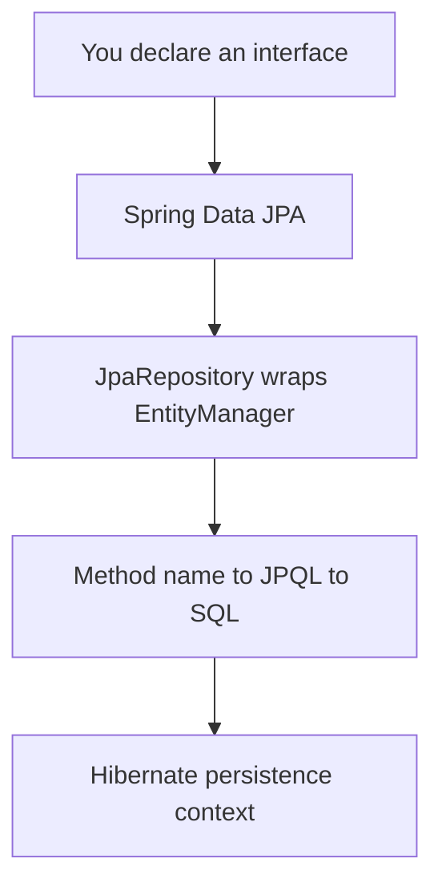

# Hibernate in the Real World & Where to Go Next

Stop for a second and look at how far you've come. You started this guide thinking of an ORM as a black box that turned objects into rows somehow. Now you can name the gears inside it. You understand the **persistence context** - the managed identity map that makes an entity feel like a live object instead of a dead snapshot. You know **dirty checking** is what updates a row when you never called `save`. You can map a `@ManyToOne`, reason about owning versus inverse sides, and - this is the big one - you can *see* the **N+1 problem** coming and reach for a `JOIN FETCH` before it ever hits production.

Most of all, you can read the SQL. With `show_sql` on, Hibernate stopped being magic and started being a tool whose output you can predict and debug. That's the whole game - a data layer is no longer something that happens *to* you; it's something you reason about.

This last phase isn't new mechanics - it's about where all of that lives in real teams, and there's one revelation waiting that ties the whole guide together.

## The magic, revealed

💡 Here's the moment everything clicks. Remember [Spring Boot](/guides/spring-boot-from-zero) and its uncanny trick - you declare an *interface*, never write a line of implementation, and somehow `findByLastName` returns rows from the database? You now know exactly what's happening down there. It's this. It's Hibernate.



Pull it apart and every piece is something you've already met:

- **`JpaRepository`** is a thin wrapper around the `EntityManager` you spent Phase 3 inside. `save`, `findById`, `delete` - those are `persist`, `find`, and `remove` with a friendlier name.
- **Derived query methods** (`findByTitleAndPublishedYear`) are parsed from the method name into **JPQL** - the exact query language you wrote by hand in Phase 7. Spring just generates it for you.
- **`@Transactional`** opens and commits the unit of work from Phase 4. The flush, the dirty checking, the commit-or-rollback - same machinery, declared instead of written.

This matters because **most real Java doesn't use Hibernate directly - it uses Hibernate via Spring Data JPA.** That's the normal, expected path, and it's a good one. The point of this guide was never to make you write `EntityManager` code forever. It was to make sure that when the generated query is slow, or the lazy-loading exception fires, or the SQL looks wrong, you're not staring at a sealed box. You can open it.

## Schema migrations - the one thing you must get right for production

⚠️ Back in Phase 2 you saw `hbm2ddl.auto` quietly create and alter tables to match your entities. It's a wonderful convenience while you're learning. Let me be the friend who says the hard thing once, plainly: **never let `hbm2ddl.auto=update` manage a production schema.** Not ever. It's fine for a throwaway dev database; it is a foot-gun pointed at your real data.

Why? Because `update` mode makes schema changes *implicit*. Hibernate looks at your classes, looks at the tables, and silently does what it thinks is the difference. It won't drop a renamed column (so it leaks). It can't review itself. It can't be rolled back. And two developers' machines can end up with two different schemas and no record of how either got there.

Real teams make schema changes the way they make code changes - **deliberate, versioned, and reviewed.** That's what **Flyway** and **Liquibase** are for:

- You write each change as a small migration file (`V3__add_review_rating.sql`) and check it into git, right next to the code that needs it.
- The tool keeps a table of which migrations have run, applies new ones in order on startup, and never re-runs an old one.
- Changes go through pull-request review like everything else, and they're repeatable: the same sequence builds the same schema on a laptop, in CI, and in production.

📝 The mental shift is small but total: your **entities describe how Java sees the data; your migrations are the source of truth for the schema itself.** Set `hbm2ddl.auto` to `validate` in production - it'll check that your entities and the real schema agree and refuse to start if they've drifted, without ever touching a table. This isn't optional polish. In a real team, it's table stakes.

## When to reach past the ORM

Hibernate is excellent, and it is not the answer to everything. Part of the maturity you've earned is knowing *which tool for which job* - so here's the clear-eyed map:

- **Hibernate for CRUD and domain logic - the 95%.** Loading an order, updating a user, saving a book with its reviews, navigating relationships. This is exactly what an ORM is built for, and it's where most of your code lives.
- **jOOQ or raw SQL for gnarly queries and reporting.** When you need a seven-way join, window functions, a recursive CTE, or a reporting query tuned to the bone, an ORM fights you. Don't fight back. Drop to SQL (or a SQL-first library like jOOQ) and let the database do what it's great at.
- **Bulk operations via JPQL or native queries.** Updating ten thousand rows by loading each entity, mutating it, and flushing is the slow way. A single `UPDATE` statement - JPQL bulk update or native SQL - is the right way.

💡 Notice that you can make every one of these calls now. Knowing *when the ORM is the wrong tool* is itself a skill the ORM can't teach you - you only get it by understanding what Hibernate does and what it costs. You have that.

## What to build, and a last word

Reading got you here. Building is what makes it stick. The model from this guide - **authors, books, reviews** - is a perfect sandbox because it has every relationship shape and the N+1 trap baked in. A few no-nonsense projects:

- **Build the model into a small standalone app.** Wire up the entities, write a query that loads books with their reviews using a `JOIN FETCH` (and watch the query count drop from N+1 to one), and add a **Flyway migration** to create the schema instead of `hbm2ddl`. Now you've practiced the two things that separate a tutorial from production: fetch strategy and real migrations.
- **Or drop it into a Spring Boot app.** Turn the model into a `JpaRepository`, expose a couple of REST endpoints, keep `show_sql` on, and *watch the SQL Spring Data generates.* This is the most satisfying exercise in the whole guide - you'll see, line by line, the thing you just learned to read being written for you.

Whichever you pick, **finish one.** A small, finished app that you debugged teaches more than three half-built ones. And when you want the canonical reference, bookmark the **Hibernate User Guide** and the **Jakarta Persistence (JPA) specification** - between them they answer almost any question you'll have, and you can now actually read them.

You came in seeing an ORM as a magic trick. You're leaving able to map objects to tables, dodge the N+1 trap, write real JPQL, choose when *not* to use the ORM at all, and read the SQL underneath every bit of it. The ORM was never magic - it's the persistence context doing exactly what you now understand. Go build the small thing.

## Recap

1. **Spring Data JPA *is* Hibernate, generated.** `JpaRepository` wraps the `EntityManager`, derived method names become JPQL, and `@Transactional` runs the unit of work - all machinery you've already met. Most real Java uses Hibernate this way.
2. **Never let `hbm2ddl.auto=update` run production.** Schema changes must be deliberate, versioned, and reviewed.
3. **Use Flyway or Liquibase** for migrations: small SQL files checked into git, applied in order, repeatable across every environment. Set `hbm2ddl.auto=validate` in prod.
4. **Reach past the ORM on purpose:** Hibernate for CRUD and domain logic, jOOQ or raw SQL for complex reporting, JPQL or native queries for bulk operations.
5. **Build the authors/books/reviews model** with a `JOIN FETCH` and a Flyway migration, or wire it into Spring Boot and watch the generated SQL. Finish one, and keep the Hibernate User Guide and JPA spec handy.

## Quick check

One last check - on how Hibernate actually shows up in the real world:

```quiz
[
  {
    "q": "In a typical Spring Boot app, what is Spring Data JPA's JpaRepository actually doing?",
    "choices": [
      "Wrapping the EntityManager - derived method names become JPQL and @Transactional runs the unit of work, all the Hibernate machinery you already learned",
      "Replacing Hibernate entirely with its own brand-new ORM engine",
      "Talking to the database with hand-written JDBC and no ORM involved",
      "Caching every table in memory so the database is never queried"
    ],
    "answer": 0,
    "explain": "Spring Data JPA is Hibernate, generated for you: JpaRepository wraps the EntityManager, method names are parsed into JPQL, and @Transactional opens and commits the same unit of work you wrote by hand in earlier phases."
  },
  {
    "q": "Why should you not use hbm2ddl.auto=update to manage a production schema?",
    "choices": [
      "Schema changes become implicit, unreviewable, and non-repeatable - use versioned Flyway or Liquibase migrations instead",
      "It only works on MySQL and fails silently on every other database",
      "It is too slow to run on a database with more than a few rows",
      "It deletes the entire database every time the application restarts"
    ],
    "answer": 0,
    "explain": "update mode silently guesses the difference between your entities and the tables: it won't drop renamed columns, can't be reviewed, and can't be rolled back. Real teams use versioned, reviewed migrations (Flyway/Liquibase) and set hbm2ddl.auto=validate in production."
  },
  {
    "q": "You need a heavy reporting query with several joins and window functions. What's the mature call?",
    "choices": [
      "Drop to raw SQL or a SQL-first tool like jOOQ - the ORM is great for CRUD and domain logic, but complex reporting is a job for SQL",
      "Force it through entity navigation, loading every related object into memory first",
      "Avoid the query entirely because Hibernate cannot coexist with raw SQL",
      "Rewrite all your entities so the query becomes a simple findById call"
    ],
    "answer": 0,
    "explain": "Hibernate handles the ~95% that's CRUD and domain logic. For complex reporting and gnarly joins, reaching for raw SQL or jOOQ is the right instinct - and knowing when the ORM is the wrong tool is itself a sign you understand it."
  }
]
```

---

[← Phase 9: Caching & Performance](09-caching-and-performance.md) · [Guide overview](_guide.md)
