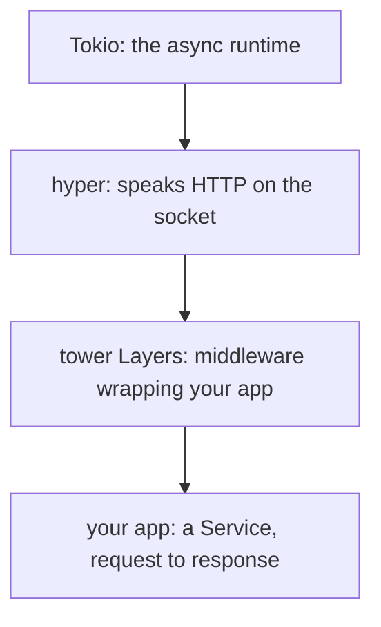

# What hyper & tower Are

When you write an [axum](/guides/axum-from-zero) app, you import a `Router`, hang some handlers off
it, add a `.layer(...)` or two, and call `axum::serve`. It feels like one tidy thing. But underneath it
sit two libraries almost nobody learns directly - **hyper** and **tower** - and nearly the whole Rust
networking world is standing on them too.

This is the deepest **roots** guide in the Rust set. Here's the plain framing up front: you will
rarely write hyper or tower by hand, and this guide is most rewarding *after* you've already built
something with axum, so the pieces have somewhere to land. We're going to assume you've met
[HTTP](/guides/http-explained) (requests, responses, status codes) and the async runtime underneath
it all, [Tokio](/guides/tokio-the-async-runtime). With those in hand, the goal of this phase is small
and sharp: build the mental model, name the two libraries, and see where they sit. The deep code
comes in Phases 2 through 4.

## The mental model: one trait, one wrapper, one driver

Before any names or code, hold this picture. It's the whole guide compressed into one sentence:

> 💡 **A `Service` turns a request into a response. A `Layer` wraps a `Service` (that's middleware).
> hyper drives it over the socket. Tokio runs the whole thing.**

That's it. Everything else is detail hanging off those four clauses. Read them as a stack, bottom to
top - the runtime at the bottom, the network library above it, your wrapped-up app on top:



*What just happened:* we drew the Rust web stack as four layers. **Tokio** at the bottom is the
engine that actually runs async tasks (it's the *only* one of the four that touches threads and the
OS scheduler). **hyper** sits on top of Tokio and knows how to read and write HTTP over a TCP
connection. Above hyper, **tower Layers** wrap your code with reusable middleware. And at the very
top, **your app is a `Service`** - the thing that takes a request and produces a response. Each layer
only talks to its neighbors. Keep this diagram; the rest of the guide is just zooming into each box.

## What hyper is

📝 **hyper** - a fast, correct, **low-level** HTTP library for Rust. It implements HTTP/1 and HTTP/2,
for both clients and servers. When bytes arrive on a socket, hyper is the thing that parses them into
a proper HTTP request, and when you hand it a response, it serializes that back into bytes on the
wire. It speaks the protocol so you don't have to.

Notice the word **low-level**, because it's doing a lot of work in that sentence. hyper gives you HTTP
*on the socket* and almost nothing above that:

- It does **not** give you routing. There's no "when the path is `/users/:id`, call this function."
- It does **not** give you extractors. Nothing pulls a JSON body or a query parameter out for you.
- It does **not** give you middleware in any built-in sense.

Those conveniences - routing, extractors, middleware - are exactly what a *framework* like axum adds
on top. hyper's job is narrower and deeper: be the correct, performant HTTP implementation that
everything else builds on. Think of it as the part of the stack that handles "this is genuinely valid
HTTP/1.1, and here are the parsed pieces," and then steps out of your way.

> 📝 If you've read [/guides/wsgi-and-asgi-explained](/guides/wsgi-and-asgi-explained), hyper plays a
> role a bit like a WSGI/ASGI *server* (gunicorn, uvicorn): it owns the socket and the HTTP plumbing,
> then calls into your code. The big difference is *how* it calls your code - and that's tower's
> story.

## What tower is

📝 **tower** - a library of reusable, composable components for networking, built around one central
idea: the **`Service`** trait. A `Service` is an abstraction for *"an async function from a request to
a response"* (plus a small readiness check we'll meet in Phase 3). That's the entire concept. Given a
request, asynchronously produce a response.

The power is in how *general* that is. Once "request in, response out" is a named, shared shape,
almost anything fits it:

- A single endpoint is a `Service`.
- A whole axum app is a `Service`.
- A database client can be a `Service` (request: a query; response: rows).
- A rate limiter is a `Service`.

And here's the second half of tower, the part that makes it more than just a trait:

📝 **`Layer`** - a thing that wraps one `Service` to produce another `Service`. That's middleware,
made composable. A logging `Layer` wraps your app and returns a new `Service` that logs, then calls
the inner one. A timeout `Layer` wraps that and returns yet another `Service` that enforces a
deadline. Because every layer takes a `Service` and returns a `Service`, you can stack them like
nesting dolls, in any order, and reuse the same `Layer` across completely different apps.

> 💡 This is the quiet superpower. Because a `Layer` is "Service in, Service out," middleware written
> for one project works in any other - and across whole *libraries*. That's why a crate like
> `tower-http` can ship tracing, CORS, compression, and timeouts as `Layer`s that drop into *any*
> tower-based app, axum included. We're not writing one yet (Phase 4 does); just hold "a `Layer`
> wraps a `Service`."

## Where they sit under axum

Now the payoff - let's map those names back onto the axum you've actually used. The same three lines
you write every day are, underneath, exactly the three concepts above:

```rust
let app = Router::new()
    .route("/", get(handler))   // your app is a Service
    .layer(TraceLayer::new_for_http()); // a tower Layer wraps it

axum::serve(listener, app).await?; // hyper drives it over the socket
```

*What just happened:* three lines, three layers of the stack. `Router::new()...` builds an
`axum::Router`, and a `Router` **is a tower `Service`** - request in, response out, with all the
routing logic living inside its `call`. The `.layer(...)` adds a **tower `Layer`** that wraps that
`Service` with middleware (here, request tracing). And `axum::serve` is **hyper**: it takes your
listening socket, accepts connections, parses HTTP off each one, and calls your top-level `Service`
once per request. Tokio (started by axum's `#[tokio::main]`) is the runtime quietly executing all of
it. Every piece of that line traces to a box in the diagram.

So axum isn't a separate magical universe. It's a set of *ergonomics* - routing, extractors, response
helpers - assembled into a tower `Service`, served by hyper, run on Tokio. The framework is the
convenient face; hyper and tower are the foundation it's standing on.

## Why learn this

Let's look straight at the trade-off, because this project doesn't do hand-waving.

⚠️ **You will rarely write raw hyper or tower at a real job, and that's fine.** Frameworks like axum
exist precisely so you don't have to wire up sockets and `Service` impls by hand. Reaching for bare
hyper when axum would do is usually a mistake, not a badge of honor. This guide is *not* arguing you
should hand-roll HTTP servers.

It's arguing something more useful: knowing this layer is what makes the layers above it stop being
magic. Once you can see the `Service` and the `Layer` underneath, a pile of axum mysteries resolve at
once - 

- **Why axum middleware is a `.layer(...)`** - because middleware *is* a tower `Layer`, the same
  abstraction the whole ecosystem shares.
- **What `tower-http` is** - a box of ready-made `Layer`s (tracing, CORS, compression, timeouts) that
  work in any tower app, not just axum.
- **What `axum::serve` actually does** - it's hyper, accepting connections and calling your `Service`.

Set your expectations accordingly: this is a **conceptual roots** guide, not day-to-day code. The
goal isn't a hyper server you'll deploy. It's an X-ray view of the stack you already use, so the next
time you write `.layer(...)` or read a `tower` error message, you know exactly what's underneath. Next
up, Phase 2 zooms into the bottom of the picture: hyper itself, its `Request`/`Response` types, and a
bare hyper server.

## Recap

1. Underneath axum (and much of Rust networking) sit two libraries most people never learn directly:
   **hyper** (HTTP) and **tower** (the `Service`/middleware abstraction).
2. The mental model: **a `Service` turns a request into a response; a `Layer` wraps a `Service`
   (middleware); hyper drives it over the socket; Tokio runs it all.**
3. **hyper** is a fast, correct, *low-level* HTTP library - HTTP/1 and HTTP/2, client and server. It
   speaks HTTP on the socket but gives you no routing, extractors, or middleware.
4. **tower** centers on the **`Service`** trait ("async request → response") and **`Layer`** (wrap a
   `Service` to get a new one). Anything request-to-response can be a `Service`; middleware is a
   `Layer`.
5. Under axum: a `Router` **is a `Service`**, `.layer(...)` adds **tower `Layer`s**, and `axum::serve`
   **is hyper**. axum is ergonomics assembled into a `Service`, served by hyper, run on Tokio.
6. ⚠️ You'll rarely write hyper/tower by hand - but understanding them demystifies `Service`, why axum
   middleware is a `Layer`, what `tower-http` is, and what `axum::serve` does.

## Quick check

Three questions on the ideas that have to stick before Phase 2:

```quiz
[
  {
    "q": "In one line, what is the difference between hyper and tower?",
    "choices": [
      "hyper is a low-level HTTP library that speaks the protocol on the socket; tower is the Service abstraction (async request-to-response) plus composable Layers for middleware",
      "hyper is the routing framework and tower is the database layer",
      "They are two names for the same library; tower is just the newer one",
      "hyper handles middleware and tower handles parsing HTTP off the wire"
    ],
    "answer": 0,
    "explain": "hyper implements HTTP/1 and HTTP/2 on the socket but gives you no routing, extractors, or middleware. tower provides the Service trait (async request to response) and Layers that wrap Services to make composable middleware."
  },
  {
    "q": "What is a tower `Layer`?",
    "choices": [
      "Something that wraps one Service to produce another Service - that's how middleware is made composable",
      "A TCP connection pool that hyper manages internally",
      "A trait you implement to parse JSON request bodies",
      "The runtime that schedules async tasks onto threads"
    ],
    "answer": 0,
    "explain": "A Layer takes a Service and returns a new Service, so middleware (logging, timeouts, CORS) can be stacked and reused across any tower-based app. The task scheduler is Tokio, not a Layer."
  },
  {
    "q": "When you call `axum::serve(listener, app)`, what is each part underneath?",
    "choices": [
      "axum::serve is hyper driving HTTP over the socket; `app` (the Router) is a tower Service; any `.layer(...)` you added are tower Layers wrapping it",
      "axum::serve is tower and the Router is hyper",
      "Both axum::serve and the Router are pure hyper with no tower involved",
      "axum::serve is Tokio and the Router parses raw bytes itself"
    ],
    "answer": 0,
    "explain": "axum::serve is hyper: it accepts connections, parses HTTP, and calls your top-level Service once per request. The Router is that Service, your .layer(...) calls are tower Layers wrapping it, and Tokio runs the whole thing."
  }
]
```

---

[Guide overview](_guide.md) · [Phase 2: hyper: The HTTP Library →](02-hyper-the-http-library.md)
