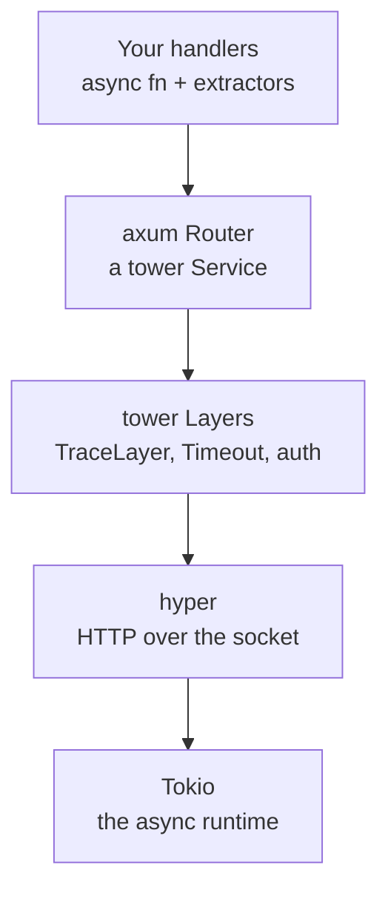

# How axum Uses Them

This is the phase where the magic disappears. You've spent five phases on the bare metal — hyper speaking HTTP on the socket, the `Service` trait, `Layer`s wrapping services, the `tower-http` toolbox. Hold one idea and watch [axum](/guides/axum-from-zero) dissolve into things you already understand.

📝 **An axum app is a `tower::Service` you assemble. Everything else — extractors, `IntoResponse`, the router DSL — is ergonomics layered on top of the raw `Request`/`Response` that hyper deals in.** The friendly façade you learned in the axum guide was never a separate world. It was Service + hyper + Tokio, wearing a nicer coat.

> 💡 If that lands, the rest of this phase is just confirmation. We'll take each axum concept you know and point at the root it's standing on. Router is a Service. Middleware is a Layer. `serve` is hyper. `async` is Tokio. Four mappings, and the framework stops being a black box.

## `axum::Router` IS a `Service`

When you wrote `Router::new().route("/books", get(list_books))` over in [axum from zero](/guides/axum-from-zero), it felt like a special framework object — a routing table with its own rules. Underneath, it's the exact trait from [Phase 3](03-the-service-trait.md):

```rust
// axum's Router implements the tower Service trait:
//   impl Service<Request> for Router {
//       type Response = Response;
//       type Error = Infallible;
//       ...
//   }

let app: Router = Router::new()
    .route("/books", get(list_books))
    .route("/books/{id}", get(get_book));

// Because `app` is a Service, you can call it directly — no HTTP needed:
let response = app.oneshot(request).await.unwrap();
```

*What just happened:* `app` looks like a router, but its type implements `Service<Request, Response = Response>` — the same `poll_ready` + `call` shape every other Service has. Routing, the `get(...)` wrappers, and your handlers are a *convenience layer* that, once compiled, produce a plain Service. axum does the trait gymnastics so your `async fn` handlers slot in, but the result is nothing exotic: a value that turns a `Request` into a `Response`. `oneshot` (from `tower::ServiceExt`) proves it — you can drive the whole app with one request and no socket in sight, which is exactly how axum's own tests work.

## `axum::serve` is hyper

Remember the `TokioIo` + `serve_connection` dance from [Phase 2](02-hyper-the-http-library.md) — accept a TCP connection, wrap the stream, hand it to hyper's HTTP engine along with your service? You don't write that in an axum app. You write one line:

```rust
let listener = tokio::net::TcpListener::bind("0.0.0.0:3000").await.unwrap();
axum::serve(listener, app).await.unwrap();
```

*What just happened:* `axum::serve` is the convenience wrapper over the exact Phase-2 ceremony. It runs Tokio's accept loop on the `listener`, and for each incoming connection it drives your `Router` Service with hyper's HTTP engine — parsing requests off the socket, calling `app`, writing responses back. The two arguments say it plainly: a Tokio listener (connections) and a Service (your app). `serve` is the glue between them, and that glue *is* hyper. Nothing in this line is axum-specific machinery; it's the bare server from Phase 2 with the boilerplate folded away.

## `.layer` is a tower `Layer`

In the axum middleware phase you wrapped your router with `.layer(TraceLayer::new_for_http())` and stacked layers with `ServiceBuilder`. Those are not "axum middleware." They're the [Phase 4](04-layers-and-middleware.md) `Layer` trait and the [Phase 5](05-tower-http.md) `tower-http` crate, unchanged:

```rust
use tower_http::trace::TraceLayer;
use tower_http::timeout::TimeoutLayer;
use std::time::Duration;

let app = Router::new()
    .route("/books", get(list_books))
    .layer(TraceLayer::new_for_http())      // a tower Layer (Phase 5)
    .layer(TimeoutLayer::new(Duration::from_secs(10)));

// And custom middleware via from_fn is just sugar that produces a Layer:
// axum::middleware::from_fn(require_auth)  ->  impl tower::Layer
```

*What just happened:* `.layer(...)` on a Router applies a `tower::Layer` — it wraps your Service in another Service, the onion you built by hand in Phase 4. `TraceLayer` and `TimeoutLayer` are the *same* layers from `tower-http` in Phase 5; they don't know or care that axum exists, because they operate on the `Service` trait, not on axum. Even `axum::middleware::from_fn` is sugar: it takes your `async fn(Request, Next)` and produces a Layer. "axum middleware" is tower middleware with a friendlier on-ramp — which is exactly why the same layers also wrap HTTP clients and gRPC services.

## Extractors and `IntoResponse` are typed sugar over hyper

Here's the one piece that feels most like magic, and it's the smallest trick of all. hyper deals in a raw `Request` (headers and a stream of body bytes) and a raw `Response`. You almost never touch those in axum. Instead:

```rust
use axum::{extract::{Path, Json, State}, response::IntoResponse, http::StatusCode};

async fn get_book(
    State(db): State<Db>,   // pulled from app state
    Path(id): Path<u32>,    // parsed from the URL path
) -> impl IntoResponse {
    match db.find(id) {
        Some(book) => (StatusCode::OK, Json(book)),         // -> Response
        None => (StatusCode::NOT_FOUND, "no such book").into_response(),
    }
}
```

*What just happened:* the arguments are **extractors**. Before your function runs, axum reads the raw hyper `Request` and turns pieces of it into typed values — `Path<u32>` parses `id` out of the URL, `Json<T>` would deserialize the body, `State` hands you shared app state. On the way out, your return type implements **`IntoResponse`**, so axum turns `(StatusCode, Json(book))` back into a real hyper `Response` — status line, `content-type: application/json` header, serialized body. You wrote typed Rust; axum did the byte-level translation in both directions. Extractors are the request side of the convenience, `IntoResponse` is the response side, and together they're why you never hand-parse headers or hand-build a `Response` the way the bare hyper handler in Phase 2 had to.

## The whole stack, top to bottom

Every layer you've met in this guide stacks into one picture. From your code down to the runtime:



*What just happened:* a request enters at the bottom — Tokio accepts the connection, hyper parses the HTTP, the Layers wrap inward, the Router routes to your handler, and the response travels back out the same path. Read top-down, it's also your authoring experience: you write handlers, axum assembles them into a Service, you wrap Layers around it, and `axum::serve` plugs that into hyper on Tokio. Same stack, two directions.

💡 So "learning axum" was really learning a friendly façade over `Service` + hyper + Tokio. Every axum concept you know maps to something in this guide: **Router = Service. Middleware = Layer. `serve` = hyper. `async` = Tokio.** The framework didn't invent a new universe — it gave ergonomic names to the roots you've now seen directly. That's the whole payoff: nothing in axum is magic, and you can read its source the same way you'd read your own.

## Recap

- **`axum::Router` is a `tower::Service`** (`Service<Request, Response = Response>`). The routing DSL, `get(...)` wrappers, and `async fn` handlers compile down to one plain Service — provable with `oneshot`, no socket required.
- **`axum::serve(listener, app)` is hyper** — the convenience wrapper over the Phase-2 `TokioIo` + `serve_connection` dance: Tokio accepts connections, hyper drives your Router Service for each one.
- **`.layer(...)` applies a `tower::Layer`** — the same `Layer` trait from Phase 4 and the same `tower-http` layers from Phase 5. `axum::middleware::from_fn` is sugar that produces a Layer.
- **Extractors and `IntoResponse` are typed sugar over hyper's raw `Request`/`Response`** — axum parses the request into typed arguments and turns your return value into a `Response`, so you never touch the bytes.
- **The full stack:** your handlers → axum Router (a Service) → tower Layers → hyper (HTTP on the socket) → Tokio (the runtime). Router = Service, middleware = Layer, `serve` = hyper, `async` = Tokio.

## Quick check

```quiz
[
  {
    "q": "What is an axum::Router, underneath the routing DSL?",
    "choices": ["A tower::Service that turns a Request into a Response", "A hyper connection handler with its own trait", "A macro that generates route-matching code at compile time", "A Tokio task that loops over incoming requests"],
    "answer": 0,
    "explain": "Router implements Service<Request, Response = Response>. The route(...) and get(...) calls are ergonomics that compile down to a plain Service — you can even drive it with oneshot and no socket."
  },
  {
    "q": "What is `axum::serve(listener, app)` actually doing?",
    "choices": ["Compiling the router into a standalone binary", "Wrapping the Phase-2 hyper dance: Tokio accepts connections and hyper drives the Router Service for each", "Registering routes in a global table that hyper reads later", "Starting a separate process per request"],
    "answer": 1,
    "explain": "axum::serve is the convenience wrapper over the TokioIo + serve_connection ceremony from Phase 2 — Tokio runs the accept loop, and hyper's HTTP engine drives your Router Service connection by connection."
  },
  {
    "q": "When you call `.layer(TraceLayer::new_for_http())` on a Router, what kind of thing is TraceLayer?",
    "choices": ["An axum-specific middleware type that only works with Router", "A Tokio runtime hook", "The same tower Layer from tower-http used everywhere else — it wraps the Service", "A hyper request parser"],
    "answer": 2,
    "explain": "TraceLayer is a plain tower::Layer from tower-http (Phase 5). .layer applies it to wrap your Service, and because it operates on the Service trait — not on axum — the same layer also works with HTTP clients and gRPC."
  }
]
```

---

[← Phase 5: The tower-http Toolbox](05-tower-http.md) · [Guide overview](_guide.md) · [Phase 7: Where to Go Next →](07-where-to-go-next.md)
