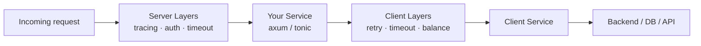

# Where to Go Next

Take a second to notice how far you've come. When you started, the bottom of the Rust web stack was a wall of names you used but couldn't picture: `axum::serve`, "tower middleware," `tower-http`, hyper somewhere underneath. Now you can name every one of them. **hyper** speaks HTTP on the socket. A **`Service`** is the universal shape - request in, response out, plus a readiness check. A **`Layer`** wraps a `Service` to make a new one, and that's all middleware ever was. `tower-http` is a box of ready-made layers. And axum's `Router` is itself a `Service`, with your layers wrapped around it, handed to hyper to drive.

That's not a small thing. This was the deepest **roots** guide in the Rust set, and the wall is gone. What's left in this last phase isn't new mechanism - it's showing you how far that one model reaches. The `Service`/`Layer` abstraction wasn't built for axum, or even for servers. It works across the whole ecosystem, and once you see that, a lot of other libraries stop being separate things to learn.

## The same layers, on gRPC

You don't only build REST APIs in Rust. When you reach for **gRPC**, the library is **tonic** - and tonic is built on the exact same foundation you just learned: **tower + hyper**.

That has a concrete, lovely consequence. The layers you wrote for an axum server - tracing, timeouts, authentication - are tower `Layer`s, and a tonic gRPC server is also a tower `Service`. So the same layers compose onto your gRPC server too. You don't learn a second middleware system for gRPC. You learn the protocol differences (which the [gRPC guide](/guides/grpc-explained) covers), and the middleware story is one you already know.

> 💡 This is the quiet reward of learning roots instead of one framework: tonic looked like a whole new world from the outside. From here, it's "the same `Service` and `Layer`, speaking gRPC instead of REST."

## The same model, pointed outward

Here's the idea that tends to surprise people, and it's where the `poll_ready` backpressure check from [Phase 3](03-the-service-trait.md) finally earns its keep.

So far we've talked about a `Service` as the thing that *receives* a request. But a `Service` is just "async request → response" - and an outbound HTTP or gRPC **client** fits that shape exactly. The request is the one you're *sending*; the response is the one you get back. So a client is a `Service` too.

The moment a client is a `Service`, every tower `Layer` composes onto the requests you send out, the same way they wrap requests coming in. tower ships a toolbox of client-side layers:

- **`tower::retry`** - retry a failed request, with a policy you control.
- **`tower::timeout`** - give up on a slow backend instead of hanging.
- **`tower::limit`** - cap concurrency or rate so you don't overwhelm a downstream service.
- **`tower::load` / `tower::balance`** - spread requests across several backend instances (load balancing).
- **`tower::buffer`** - queue requests and hand the client out to many callers.

This is where `poll_ready` stops being abstract. A load balancer needs to ask each backend "are you ready?" before sending. A concurrency limiter needs to say "not right now" when it's full. That readiness check - the half of the `Service` trait that felt like ceremony in Phase 3 - is exactly the hook that makes retry, rate limiting, and load balancing possible. Backpressure was always the point.

On the HTTP side, **hyper** has a client of its own (in `hyper-util`), and the friendly `reqwest` library sits on top of it - so when you drop a level under `reqwest`, you land back on hyper, in territory you now recognize.

## One model, the whole stack

Step back and look at the shape. The same `Service`-wrapped-by-`Layer`s picture describes both ends of the wire:



Requests arrive, pass through server layers into your `Service`; when that `Service` needs to call out, the request leaves through client layers into a client `Service`. Same trait, same wrapping, both directions.

> 💡 Hold onto this one sentence and it covers an enormous amount of Rust: **a `Service` turns a request into a response, a `Layer` wraps a `Service`, hyper drives it, and Tokio runs it.** Servers, clients, gRPC, proxies - they're all that same model wearing different clothes.

## What to actually do next

You don't lock this in by reading more. You lock it in by going back and *recognizing*.

- **Revisit [axum](/guides/axum-from-zero) with new eyes.** Open a project you've built and find the pieces: the `Router` that's a `Service`, the `.layer(...)` calls that are tower `Layer`s, the `tower-http` middleware, `axum::serve` calling into hyper. Nothing should be opaque now. That feeling - "oh, I know what every line is" - is the whole guide paying off at once.
- **Add one client-side layer.** Take an HTTP call your app makes and wrap it with a `tower::timeout` or a small `tower::retry`. Watch a `Service` you *send* requests through behave like the ones you *receive* them through. It's the fastest way to feel that the model really is symmetric.
- **Read tonic if gRPC is in your future.** When you do, you'll find the layers already familiar - only the protocol is new.

And here's the thing to carry out of all of it. You started this set wanting to understand the runtime ([Tokio](/guides/tokio-the-async-runtime)), then the HTTP and middleware (hyper and tower), then the framework on top. You have all three now. No part of a Rust web stack has to be a black box to you again - and that's a rare, durable kind of confidence. The next time something deep in the stack shows up in a stack trace, you won't flinch. You'll know exactly what it is and where to look.

## Recap

1. **The wall is gone.** hyper speaks HTTP, a `Service` is "async request → response," a `Layer` wraps a `Service` (that's middleware), `tower-http` is a box of ready-made layers, and axum is a `Service` you assembled - driven by hyper, run by Tokio.
2. **tonic = the same model, on gRPC.** tonic is built on tower + hyper, so a gRPC server is a tower `Service` and your existing tracing/timeout/auth `Layer`s compose onto it. No second middleware system to learn.
3. **A client is a `Service` too.** Point the model outward and tower's client-side layers - `retry`, `timeout`, `limit`, `load`/`balance`, `buffer` - wrap the requests you *send*. hyper has its own client (under `reqwest`).
4. **`poll_ready` was the point.** The readiness check from Phase 3 is exactly what makes load balancing, rate limiting, and retries possible. Backpressure isn't ceremony.
5. **One sentence covers the stack.** A `Service` turns a request into a response, a `Layer` wraps a `Service`, hyper drives it, Tokio runs it - servers, clients, gRPC, and proxies alike.

## Quick check

A last look at how far one model stretches:

```quiz
[
  {
    "q": "tonic (gRPC) is built on tower + hyper. What does that mean for your middleware?",
    "choices": [
      "The same tower Layers (tracing, timeout, auth) compose onto a gRPC server, because it's a tower Service",
      "gRPC needs a completely separate middleware system you have to learn from scratch",
      "Middleware doesn't work with gRPC at all",
      "You must rewrite every layer in a gRPC-specific dialect"
    ],
    "answer": 0,
    "explain": "A tonic gRPC server is a tower Service, so the Layers you already wrote for an axum server wrap it the same way. The protocol differs; the middleware story is one you already know."
  },
  {
    "q": "Why can tower layers like retry, timeout, and load-balancing apply to an outbound client?",
    "choices": [
      "Because a client is a Service too - async request out, response back - so Layers wrap the requests you send",
      "Because clients secretly run their own hidden server",
      "Because tower copies the server's layers onto the client automatically at startup",
      "They can't - client-side layers don't exist"
    ],
    "answer": 0,
    "explain": "An outbound HTTP/gRPC client fits the Service shape exactly: the request is the one you're sending. Once it's a Service, every tower Layer composes onto it, including retry, timeout, limit, and load/balance."
  },
  {
    "q": "Which single sentence best captures the whole Rust web stack you've now learned?",
    "choices": [
      "A Service turns a request into a response, a Layer wraps a Service, hyper drives it, and Tokio runs it",
      "axum is the only abstraction that matters and everything else is internal detail",
      "hyper handles middleware while tower opens the network socket",
      "gRPC and HTTP each require their own unrelated runtime and middleware model"
    ],
    "answer": 0,
    "explain": "That one sentence covers servers, clients, gRPC, and proxies: the Service/Layer model is the request-to-response shape, hyper drives it over the socket, and Tokio is the runtime underneath."
  }
]
```

---

[← Phase 6: How axum Uses Them](06-how-axum-uses-them.md) · [Guide overview](_guide.md)
