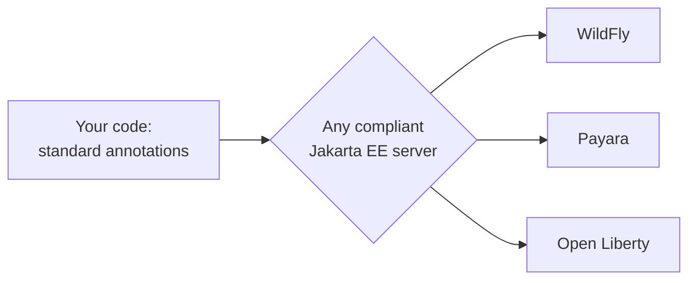

# What Jakarta EE Is

If you've spent any time around enterprise Java, you've seen the name everywhere — on job postings, in old Stack Overflow answers, stamped across the docs for servers with names like WildFly, Payara, and Open Liberty. And if you're honest, "Jakarta EE" has always been a bit of a fog. Is it a framework? A library? A version of Java? A competitor to Spring? People throw the term around as if it's one thing, when it's really a category of things.

Here's the good news: there's one clean idea underneath all of it, and once it clicks, the whole landscape snaps into focus. So before any code, let's build the mental model — because *this* is the part that confuses every beginner, and *this* is the part that makes everything else make sense.

## The core idea: a specification, not an implementation

Most tools you've used are a single piece of software you download and run. Jakarta EE is not that. Jakarta EE is a **specification** — a written agreement about how a set of enterprise features *should behave* — and other people write the actual code that fulfills it.

📝 **Specification (spec)** — a precise, written contract defining a set of APIs: the annotations, interfaces, and behavior that compliant software must provide. The spec says *what* must exist and how it must act. It contains no working engine of its own.

📝 **Implementation** — an actual, runnable piece of software that provides everything the spec demands. A vendor reads the spec and builds the engine. Multiple vendors can implement the same spec, and they all interoperate because they obey the same contract.

So there are two halves, written by two different parties:

- **You** write code against the *standard* — you sprinkle in annotations like `@Inject`, `@Path`, and `@Entity`, defined by the spec.
- A **vendor's server** provides the *engine* that gives those annotations meaning at runtime — it does the injecting, the URL routing, the database mapping.

This is the framework bargain from [/guides/frameworks](_guide.md) taken one step further: not only does the platform call *your* code (inversion of control), but the platform itself is interchangeable. You code to the contract; you pick the engine later.

```java
package com.example.store;

import jakarta.ws.rs.GET;
import jakarta.ws.rs.Path;

@Path("/hello")
public class HelloResource {

    @GET
    public String sayHello() {
        return "Hello from a Jakarta EE server";
    }
}
```

*What just happened:* You wrote almost nothing — a class, a method, two annotations. `@Path("/hello")` and `@GET` are pure *specification*: they're from the Jakarta RESTful Web Services (JAX-RS) spec, and on their own they don't run anything. There's no `main()`, no server-start code, no URL-parsing loop. When you hand this class to *any* compliant Jakarta EE server, that server reads the annotations and wires up an HTTP endpoint at `/hello` that calls `sayHello()` on every GET request. The same file runs unchanged on WildFly, Payara, or Open Liberty — because all three implement the same contract.



💡 **Why this matters.** Because the contract is standardized and the engine is swappable, you're not locked into one vendor. A big enterprise can switch from one application server to another — for cost, support, or performance reasons — without rewriting its application. That portability is the entire reason this model exists, and it's deeply valued in places that plan in decades, not sprints.

## The platform is a bundle of specs

Here's the second thing to internalize: Jakarta EE is not *one* specification. It's an umbrella over *many* specs, each covering one concern of building a server-side enterprise application. When someone says "a Jakarta EE server," they mean software that implements the whole bundle.

📝 **Jakarta EE platform** — a curated collection of individual specifications, versioned and released together, that together cover the common needs of enterprise applications: dependency injection, web APIs, database access, transactions, validation, security, and more.

The specs this guide will walk through, and the one job each one does:

- **CDI** (Contexts and Dependency Injection) — wiring objects together; the `@Inject` mechanism.
- **JAX-RS** (Jakarta RESTful Web Services) — building REST APIs; `@Path`, `@GET`, and friends.
- **Jakarta Persistence (JPA)** — mapping Java objects to database tables; `@Entity`.
- **JTA** (Jakarta Transactions) — making a group of database operations succeed or fail as one unit.
- **Bean Validation** — declaring rules on data (`@NotNull`, `@Email`) and enforcing them.
- **Jakarta Security** — authentication and authorization, the standard way.
- **EJB** (Enterprise Beans) and **Jakarta Messaging** — older heavyweight components and asynchronous message queues.

💡 **The mental model:** Jakarta EE is to enterprise Java what a well-stocked toolbox is to a workshop — not a single tool, but a coordinated set, each designed to fit the others. You don't have to use all of them. A small service might touch only CDI, JAX-RS, and JPA. But they're guaranteed to work together because they were specified and tested as a family.

## A short history you actually need: Java EE → Jakarta EE

You *will* run into this within your first hour of reading older material, so let's get ahead of it. The name changed, and so did something in the code that trips up everyone.

For roughly two decades, this platform was called **Java EE** (Java Platform, Enterprise Edition), stewarded by Sun and then Oracle. In 2017, Oracle handed the project to the **Eclipse Foundation**, a vendor-neutral open-source body. For trademark reasons Eclipse couldn't keep the word "Java" in the name, so the platform was renamed **Jakarta EE**, and its evolution moved to an open community process.

That rename forced a change that matters in your code: **the package namespace switched from `javax.*` to `jakarta.*`.**

```java
// PRE-Jakarta-9 (old Java EE) — you'll see this in old tutorials:
import javax.persistence.Entity;
import javax.ws.rs.GET;

// Jakarta EE 9 and later — the modern namespace:
import jakarta.persistence.Entity;
import jakarta.ws.rs.GET;
```

*What just happened:* The *exact same* annotations — `@Entity`, `@GET` — moved from packages starting with `javax` to packages starting with `jakarta`. The functionality is identical; only the import path changed. This happened in **Jakarta EE 9**, the deliberate "big rename" release. So an `import javax.persistence...` line is a fingerprint: it tells you the code (or the tutorial) predates this transition.

⚠️ **This is the single most common beginner trap in modern Jakarta EE.** You copy a code sample from a 2018 blog post, paste it into a current project, and nothing compiles — because the sample imports `javax.*` while your dependencies provide `jakarta.*`. When that happens, it's almost never a mysterious bug. It's the namespace. Mentally translate `javax.` → `jakarta.` and the imports resolve. (`javax.*` still exists for a few things that belong to core Java SE rather than the enterprise platform, but for the enterprise specs in this guide, modern code is `jakarta.*`.)

## Jakarta EE vs Spring — an honest comparison

This is the question on everyone's mind, so let's answer it straight, without picking a winner.

[Spring](/guides/spring-boot-from-zero) and Jakarta EE solve overlapping problems — dependency injection, REST endpoints, data access, transactions — but they come from different philosophies:

- **Spring** is *one opinionated framework*, built and governed by one organization (originally Pivotal, now Broadcom/VMware). It's a single product line you adopt as a whole. It's enormously popular, especially in startups and modern web shops, and Spring Boot made it famously fast to get going.
- **Jakarta EE** is a *vendor-neutral standard* implemented by many competing servers. You adopt the spec, then choose your engine. It's extremely common in large, long-lived enterprises — banks, insurers, governments, telecoms — where vendor independence and stability are prized.

They also share a surprising amount of DNA. Spring's early dependency-injection ideas directly influenced the design of CDI, the standard DI spec. And both worlds lean on the *same* underlying database library most of the time: **Hibernate** is the dominant implementation of Jakarta Persistence (JPA), and Spring Data sits on top of JPA too. So the moment you learn `@Entity` here, you've learned something Spring developers use daily.

💡 **Neither is "better" — they're different worlds, and both are deeply employable.** Choosing between them is mostly about which ecosystem your team and your industry live in, not about one being technically superior. Knowing both makes you more valuable, not less.

## Why learn it

If you're coming from Spring or from plain Java, it's fair to ask: why spend time here at all?

Two concrete reasons:

1. **A whole category of jobs runs on this.** Application servers and Jakarta EE underpin an enormous amount of the world's enterprise software — the unglamorous, mission-critical systems that move money and run institutions. That work is stable, well-paid, and not going anywhere. Reading and writing Jakarta EE is a marketable skill in its own right.
2. **It makes Spring easier to read, not harder.** Because the two share concepts and even libraries, learning the *standard* version of dependency injection, persistence, and validation gives you the vocabulary to understand what Spring is doing under its own conventions. You start seeing the shared bones beneath both frameworks.

And it sets up the very next thing you need to understand. We've talked a lot about "a server" or "the engine" that brings your annotations to life. In the next phase we look that engine in the eye: what an **application server** actually is, how your code gets *deployed* into it, and why this deploy-into-a-running-server model is so different from the standalone apps you may be used to.

## Recap

1. **Jakarta EE is a specification, not an implementation.** The spec defines standard APIs (annotations and interfaces like `@Inject`, `@Path`, `@Entity`); separate *vendors* write the servers that actually provide the engine.
2. **You code to the standard; the server provides the runtime.** The same application runs unchanged on any compliant server (WildFly, Payara, Open Liberty), which is what gives enterprises vendor portability.
3. **The platform is a bundle of specs**, not one library — CDI (DI), JAX-RS (REST), JPA (persistence), JTA (transactions), Bean Validation, Security, plus EJB and Messaging — coordinated to work together.
4. **It was "Java EE" under Oracle, became "Jakarta EE" at the Eclipse Foundation**, and the package namespace changed `javax.*` → `jakarta.*` in Jakarta EE 9. Old `javax.` imports = pre-Jakarta-9 code, and they're the #1 reason old samples won't compile.
5. **Jakarta EE vs Spring is a tie, not a contest:** Spring is one opinionated framework; Jakarta EE is a vendor-neutral standard. They share DNA (CDI was Spring-influenced; both use JPA/Hibernate). Different worlds, both employable.
6. **Learning the standard pays twice:** it opens a whole category of enterprise jobs, and it makes Spring's concepts easier to read because you understand the shared foundations.

## Quick check

Lock in the one idea that everything else builds on:

```quiz
[
  {
    "q": "What does it mean that Jakarta EE is a 'specification, not an implementation'?",
    "choices": [
      "It defines standard APIs (annotations and interfaces) that separate vendors implement in their servers",
      "It is a single program you download and run directly",
      "It is a specific version of the Java language",
      "It is Oracle's commercial replacement for the JVM"
    ],
    "answer": 0,
    "explain": "Jakarta EE is a written contract of standard APIs. Vendors like Red Hat (WildFly) and Payara build the actual servers that fulfill it, so the same code runs on any compliant implementation."
  },
  {
    "q": "You copy an old tutorial and it imports `javax.persistence.Entity`, but your modern project won't compile. What's the most likely cause?",
    "choices": [
      "The namespace changed from `javax.*` to `jakarta.*` in Jakarta EE 9, so modern code needs `jakarta.persistence.Entity`",
      "The `@Entity` annotation was removed from Jakarta EE entirely",
      "You must downgrade your JVM to run any persistence code",
      "Spring and Jakarta EE cannot share the same database library"
    ],
    "answer": 0,
    "explain": "The Eclipse Foundation rename forced the package namespace from javax.* to jakarta.* in Jakarta EE 9. The annotation is identical; only the import path changed. Old javax.* imports are a fingerprint of pre-Jakarta-9 code."
  },
  {
    "q": "Which statement best captures the honest difference between Jakarta EE and Spring?",
    "choices": [
      "Jakarta EE is a vendor-neutral standard with many implementations; Spring is one opinionated framework — both are widely used and share DNA like JPA/Hibernate",
      "Spring is a specification and Jakarta EE is its only implementation",
      "Jakarta EE is always faster and should always be chosen over Spring",
      "They share no concepts or libraries and cannot be learned together"
    ],
    "answer": 0,
    "explain": "Spring is a single opinionated framework; Jakarta EE is a vendor-neutral standard implemented by competing servers. They overlap heavily (CDI was Spring-influenced; both build on JPA/Hibernate). Neither is universally 'better.'"
  }
]
```

---

[Guide overview](_guide.md) · [Phase 2: The Application Server & Deployment →](02-the-app-server-and-deployment.md)
