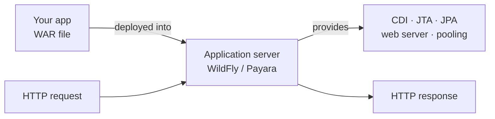

# The Application Server & Deployment

[Phase 1](01-what-jakarta-ee-is.md) called Jakarta EE a set of *specs* that some *server* implements. This phase is about that server — the thing that actually runs your code — and the single biggest mental shift between classic Jakarta EE and the framework world you might already know.

Here's the shift, stated plainly so it sticks. If you've touched Spring Boot, you're used to your application *being* the program: you build one jar, run `java -jar app.jar`, and an embedded web server boots up *inside* your process. Classic Jakarta EE flips that. Your application is **not** a standalone program. It's a *bundle of code* that you hand to a long-running server — and that server provides the engine: the web server, dependency injection, transactions, connection pooling, all of it. You write the parts that are specific to your app; the server brings everything else.

Hold that picture — *app deployed into a running server* — and the rest of this phase falls into place.

## The container model

📝 An **application server** is a long-running program that hosts your Jakarta EE application and provides implementations of the EE specs. You don't start your app; you start the *server*, then deploy your app *into* it. The server is already running, already has a thread pool, a web listener, a transaction manager, a CDI engine — and it lends all of that to whatever apps you drop in.

This is often called the **container** model. The server is a container; your app lives inside it. When a request arrives, the server receives it, finds the right piece of your code, hands it the services it needs (an injected bean, an open transaction), runs it, and sends the response back. Your code never touches the socket, never manages a thread, never opens the transaction by hand. That's the deal: you give up control of the plumbing, and in exchange you never write the plumbing.



*What just happened:* The diagram shows the whole model on one line. Your WAR (we'll define that shortly) gets deployed *into* the running application server. The server supplies the specs — CDI, transactions, persistence, the web server itself — and sits between incoming requests and your code, wiring the two together. Your app is a tenant; the server is the building with the power and water already on.

📝 You'll meet these application servers by name. The common ones today: **WildFly** (Red Hat's, open source), **Payara** (a commercially-supported descendant of GlassFish), **Open Liberty** (IBM's, lightweight and modular), and **GlassFish** (the original reference implementation). They all implement the same specs — that's the whole point of a standard — so the same WAR can run on any of them. (This is the "swap the server, keep your code" promise from Phase 1, made concrete.)

If the idea of "a server you start, then deploy apps into" feels fuzzy, [What a Server Even Is](/guides/what-a-server-is) builds that picture from the ground up — worth a detour if servers are new to you.

## App server vs servlet container

You'll also hear about **Tomcat** and **Jetty**, and people sometimes lump them in with WildFly and Payara. They're not the same kind of thing, and the difference matters.

📝 A **servlet container** runs *web* applications — it speaks HTTP, manages the request/response cycle, and runs servlets (the low-level Java web component). Tomcat and Jetty are servlet containers. They're excellent at one job: serving web requests. But that's *all* they provide out of the box.

📝 A **full application server** is a servlet container *plus* the rest of the Jakarta EE specs: CDI (dependency injection), JTA (transactions), JPA (persistence), messaging, security, and more — all built in and ready to use. WildFly, Payara, Open Liberty, and GlassFish are full application servers.

So when do you need which? A rough rule:

- **Servlet container (Tomcat/Jetty)** — you're building a web app and you'll pull in whatever extra libraries you want yourself (this is, in fact, how Spring Boot works under the hood — it embeds Tomcat and adds its own everything-else). You want a thin, fast HTTP engine and full control over the rest.
- **Full application server (WildFly/Payara)** — you want the whole EE stack provided and managed *for* you: declare a transaction with an annotation and the server's transaction manager handles it; inject a bean and the server's CDI engine wires it. Classic enterprise Jakarta EE assumes this.

💡 The line between them has genuinely blurred (more on that at the end), but the conceptual split is real and worth keeping: *servlet container = HTTP only; application server = HTTP + all the EE specs.*

## Packaging: WAR (and EAR)

So you've written your app. How do you hand it to the server? You bundle it into a standard archive. The one you'll use almost always is a **WAR**.

📝 A **WAR** (Web ARchive) is a single file — a ZIP, really, like a [JAR](/guides/java-from-zero) — that bundles your compiled classes, your web resources (HTML, config), and a `WEB-INF/` folder of metadata. It's the unit you deploy: one `.war` file that the server knows how to unpack and run. A minimal Jakarta EE project headed for a WAR looks like this:

```text
my-shop/
├── pom.xml
└── src/main/
    ├── java/com/example/shop/
    │   └── ProductResource.java     ← your code
    └── webapp/
        └── WEB-INF/
            └── web.xml              ← (often optional now)
```

*What just happened:* This is the standard Maven layout from [Java's tooling phase](/guides/java-from-zero), with one addition: a `webapp/` directory holding web content and a `WEB-INF/` folder for web metadata. When you build, Maven packages all of this — compiled classes, resources, metadata — into one `my-shop.war`. The `WEB-INF/web.xml` deployment descriptor used to be mandatory; modern Jakarta EE leans on annotations instead, so it's frequently absent entirely.

The one line that makes Maven produce a WAR instead of a JAR is the packaging type in `pom.xml`:

```xml
<project>
    <groupId>com.example</groupId>
    <artifactId>my-shop</artifactId>
    <version>1.0.0</version>
    <packaging>war</packaging>   <!-- not "jar" -->
</project>
```

*What just happened:* `<packaging>war</packaging>` tells Maven to assemble a `.war` archive with the right internal structure (the `WEB-INF/classes`, `WEB-INF/lib` layout the server expects) rather than a plain JAR. That one word is the difference between an artifact a server can deploy and one it can't.

There's also a bigger archive, the **EAR**:

📝 An **EAR** (Enterprise ARchive) bundles *multiple* modules — several WARs, shared libraries, enterprise-bean modules — into one deployable unit, for large applications composed of many parts. You'll see EARs in big, older enterprise systems. For most work today a single WAR is all you need, so don't worry about EARs until you meet one.

⚠️ This is the exact opposite of the Spring Boot model, and the contrast is the clearest way to understand both. **Spring Boot** builds a *fat JAR* with an *embedded server inside it* — your artifact contains its own web server and runs standalone (`java -jar app.jar`). **Classic Jakarta EE** builds a *WAR with no server inside* — the server already exists, running, and you deploy *into* it. Boot flipped the industry's default from "deploy your app to a server" to "your app ships its own server." Knowing both models is most of what this phase is for. (If Boot is your background, [Spring Boot From Zero](/guides/spring-boot-from-zero) is the mirror image of this guide.)

## Deploying

Deploying a WAR is refreshingly anticlimactic. In the classic model there are two common ways:

1. **Drop it in the deploy folder.** Every server watches a directory (WildFly's is `standalone/deployments/`). Copy your WAR there and the running server notices the new file and deploys it — no restart.
2. **Use the admin console or CLI.** Servers ship a web admin UI and a command-line tool (WildFly has `jboss-cli`) for deploying, undeploying, and managing apps — handy for scripts and remote servers.

The folder-drop is the simplest to picture:

```bash
# WildFly is already running. Just copy the WAR into its watched folder:
cp target/my-shop.war $WILDFLY_HOME/standalone/deployments/
```

*What just happened:* You copied your built WAR into the server's deployment directory. You didn't start your application — the server was already up. It detected the new file, unpacked it, scanned it for annotations (`@Path`, `@Inject`, `@Entity`), wired up the specs your code uses, and started serving it. The server log confirms it:

```console
INFO  [org.jboss.as.server.deployment] Starting deployment of "my-shop.war"
INFO  [org.jboss.weld] Processing CDI deployment: my-shop.war
INFO  [org.jboss.resteasy] Deploying JAX-RS application, path: /api
INFO  [org.jboss.as.server] Deployed "my-shop.war" (runtime-name: "my-shop.war")
```

*What just happened:* Reading top to bottom, the server announces it found your WAR, set up CDI for it (Weld is WildFly's CDI engine), registered your REST endpoints under `/api` (RESTEasy is its JAX-RS engine), and finished. Each log line is the server providing one spec to your code — exactly the container model in action. Your app is now live, and you wrote none of that wiring.

## The modern shift

Everything above is the *classic* model, and it's still very much alive in enterprises. But it's no longer the only way — the line has blurred, and you should know both pictures.

💡 The modern direction is the **self-contained, single-artifact** approach — the same idea Spring Boot popularized, now native to the Jakarta EE world:

- **Payara Micro** and **Open Liberty** let you run your app as a single executable bundle, server included — closer to `java -jar` than "deploy to a big server."
- **Quarkus** and **Helidon** (which we'll meet in [Phase 10](10-microprofile-and-where-next.md)) take this further: build one self-contained artifact, even a native binary, that boots in milliseconds — Jakarta EE specs without a separate server to manage.
- **Embedded servers** generally have become common, so "start a heavyweight server and deploy a WAR into it" is now one option among several.

So the honest summary: *deploy a WAR into a long-running application server* is the **classic** model, and *run a single self-contained artifact* is the **modern** one. Both are real, both are in production today, and you'll meet both — which is exactly why we covered the container model first. Once you understand that a server *provides* services to your code, the modern variants are just "the same services, packaged differently." (For the deeper "what is a server, and what does 'embedded' even mean" picture, [What a Server Even Is](/guides/what-a-server-is) is the companion read.)

Whichever model you're in, the single most important service that server provides — the one the rest of the guide builds on — is **dependency injection**. That's CDI, and it's next.

## Recap

1. **The container model:** classic Jakarta EE deploys your app *into* a long-running **application server**; the server provides the engine (web server, CDI, transactions, pooling) and your app is a tenant inside it. You start the *server*, not your app.
2. **Application servers** to know: WildFly, Payara, Open Liberty, GlassFish. All implement the same specs, so one WAR runs on any of them.
3. **Servlet container vs application server:** Tomcat/Jetty run web apps (HTTP only); full app servers add the rest of the EE specs (CDI, JTA, JPA, messaging…). Choose by whether you want the EE stack provided for you.
4. **Packaging:** a **WAR** (Web ARchive) bundles your classes + web resources + `WEB-INF/` metadata into one deployable file (`<packaging>war</packaging>` in Maven). An **EAR** bundles multiple modules for large apps.
5. **The Spring Boot contrast:** Boot ships a *fat JAR with an embedded server* (runs standalone); classic Jakarta EE ships a *WAR with no server* (deploys into one). Boot flipped the default.
6. **Deploying:** drop the WAR in the server's deploy folder (or use the admin console/CLI); the running server detects, scans, wires, and serves it.
7. **The modern shift:** Payara Micro, Open Liberty, Quarkus, and Helidon let you run Jakarta EE as a single self-contained artifact (Boot-style). Classic = deploy a WAR; modern = run one artifact. You'll meet both.

## Quick check

One quick pass over the container model before we dive into CDI:

```quiz
[
  {
    "q": "In the classic Jakarta EE model, what is the relationship between your application and the application server?",
    "choices": [
      "Your app is deployed INTO a long-running server that provides the specs (web server, CDI, transactions); you start the server, not your app",
      "Your app embeds the server inside itself and runs standalone with java -jar",
      "Your app and the server are the same artifact, compiled together into one binary",
      "The server is a library your app imports and calls directly"
    ],
    "answer": 0,
    "explain": "Classic Jakarta EE inverts the Spring Boot model: the application server runs continuously and provides the engine (web server, CDI, JTA, pooling). You deploy your app — a WAR — into that already-running server, which supplies all the plumbing."
  },
  {
    "q": "What is the difference between a servlet container (like Tomcat) and a full application server (like WildFly)?",
    "choices": [
      "A servlet container handles HTTP/web requests only; a full application server adds the rest of the EE specs — CDI, JTA, JPA, messaging — built in",
      "A servlet container is faster because it's written in C, while application servers are Java",
      "A servlet container is for production and an application server is only for development",
      "There is no difference; the two terms are interchangeable"
    ],
    "answer": 0,
    "explain": "Tomcat and Jetty are servlet containers: they serve web requests and run servlets, and nothing more out of the box. Full application servers (WildFly, Payara, Open Liberty, GlassFish) are servlet containers plus implementations of the rest of the Jakarta EE specs."
  },
  {
    "q": "How does classic Jakarta EE packaging differ from Spring Boot's?",
    "choices": [
      "Jakarta EE builds a WAR with no server inside (deployed into an existing server); Spring Boot builds a fat JAR with an embedded server (runs standalone)",
      "Jakarta EE builds a fat JAR; Spring Boot builds a WAR",
      "Both build identical WAR files; only the run command differs",
      "Jakarta EE produces a native binary while Spring Boot produces bytecode"
    ],
    "answer": 0,
    "explain": "Classic Jakarta EE produces a WAR containing only your code — the server already exists and you deploy into it. Spring Boot produces a fat JAR that bundles an embedded web server inside, so it runs on its own with java -jar. Boot flipped the industry default."
  }
]
```

---

[← Phase 1: What Jakarta EE Is](01-what-jakarta-ee-is.md) · [Guide overview](_guide.md) · [Phase 3: CDI: Contexts & Dependency Injection →](03-cdi-dependency-injection.md)