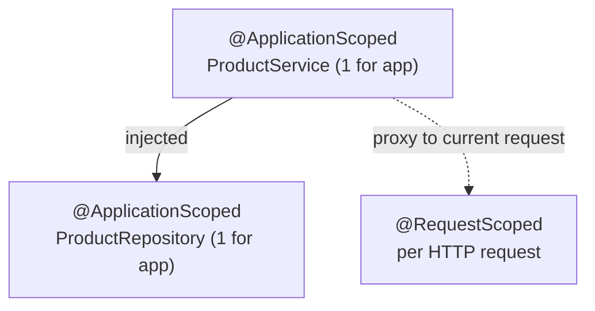

# CDI: Contexts & Dependency Injection

In Phase 2 you packaged a `Product` app, dropped it on an application server, and watched the server
take over the running of your code. This phase is about the mechanism the server uses to *build and wire*
your objects once it's running - the engine sitting underneath nearly every Jakarta feature you'll meet
from here on. It's called **CDI**, and once it clicks, the rest of Jakarta EE stops feeling like a pile of
unrelated annotations and starts feeling like one connected system.

Here's the mental model to carry the whole way through: in a normal program, your objects build the
other objects they need with `new`. In a CDI program, **a container builds your objects for you and hands
them the things they depend on.** You stop writing `new`, and you start *describing* what you need. That
single inversion - control over object creation moving out of your code and into the container - is the
whole game.

📝 If you've read [Spring's dependency injection](/guides/spring-boot-from-zero), you already know this
idea cold. Spring has its own container; CDI is the **standard spec** for the exact same thing - same
inversion of control, same "container owns your objects," but defined by Jakarta EE rather than one
framework. The vocabulary maps almost one-to-one, and we'll point out each parallel as we go. If you
haven't met Spring, no problem - we build it up from scratch here.

## What CDI actually is

📝 **CDI - Contexts and Dependency Injection** - the standard dependency-injection container built into
Jakarta EE. Every compliant application server (Phase 2's WildFly, Payara, Open Liberty, and friends)
ships a CDI implementation. You don't add it as a library or pick a vendor; it's part of the platform.

The "**DI**" half is dependency injection: the container creates your objects and supplies the things
they depend on. The "**C**" half - Contexts - is CDI's answer to a question Spring also answers with
scopes: *how long does each object live, and who shares it?* We'll get to that.

📝 **Bean** - an object the CDI container creates, wires up, and manages. That's the entire definition.
A bean isn't a special base class or some exotic type; it's just one of *your* ordinary classes that CDI
has taken ownership of. (Spring devs: identical meaning. Same word, same concept.) When someone says
"make this a bean," they mean "let the container manage it."

So the shift, just like in Spring, is: stop writing `new ProductRepository()`, and instead tell the
container "this is yours to manage" and "this service needs one of those." CDI does the connecting. Let's
see how you say it.

## `@Inject` and beans

Say we're building a small `Product` service. We have a `ProductRepository` that stores products, and a
`ProductService` that uses it. The naive version has the service build its own repository:

```java
public class ProductService {
    private final ProductRepository repository = new ProductRepository(); // builds its own dependency

    public Product findById(long id) {
        return repository.findById(id);
    }
}
```
*What just happened:* `ProductService` reached out and constructed its own `ProductRepository`. It works,
but it welds the two together - there's no seam to swap the repository for a fake in a test, and the
service is now responsible for *choosing* its dependency, not just using it. CDI's whole pitch is to take
that first job away.

The CDI version *declares* the dependency and lets the container fill it in. The annotation is `@Inject`,
and the preferred place to put it is the **constructor**:

```java
import jakarta.inject.Inject;
import jakarta.enterprise.context.ApplicationScoped;

@ApplicationScoped
public class ProductService {
    private final ProductRepository repository;

    @Inject
    public ProductService(ProductRepository repository) { // CDI passes one in
        this.repository = repository;
    }

    public Product findById(long id) {
        return repository.findById(id);
    }
}
```
*What just happened:* `ProductService` no longer knows or cares *which* `ProductRepository` it gets - it
asks for one in its constructor and marks that constructor with `@Inject`. When the container builds a
`ProductService`, it sees the parameter, finds a matching `ProductRepository` bean, and passes it in. The
`repository` field is `final`: once CDI sets it, it can't change. (Spring devs: this is `@Autowired` on a
constructor, standardized as `@Inject` from the `jakarta.inject` package.)

💡 CDI also supports **field injection** (`@Inject` straight on the field), and you'll see it constantly
in older Jakarta/Java EE code. Prefer the constructor anyway, for the same reasons as Spring: the
constructor is a clear, visible list of what the class needs, the field can be `final`, and you can test
with a plain `new ProductService(fakeRepo)` - no container required. The constructor *is* the testing seam.

### `beans.xml` and "CDI is on by default"

In older Java EE, CDI only scanned an archive if it contained a marker file called `beans.xml`. You'll
still find it in projects, sometimes empty, sometimes setting a discovery mode:

```xml
<?xml version="1.0" encoding="UTF-8"?>
<beans xmlns="https://jakarta.ee/xml/ns/jakartaee"
       version="4.0" bean-discovery-mode="annotated">
</beans>
```
*What just happened:* this `beans.xml` (under `WEB-INF/` for a war, or `META-INF/` for a jar) tells CDI to
discover beans in this archive. `bean-discovery-mode="annotated"` means "manage any class that carries a
bean-defining annotation like `@ApplicationScoped`" - which is the modern default.

💡 In modern Jakarta EE you usually **don't need `beans.xml` at all**. CDI is on by default, and any class
with a scope annotation is automatically a managed bean. The file survives mostly for explicit
configuration (interceptor ordering, alternatives) or pure historical habit. If you have no special
configuration, leave it out.

## Scopes: the "Contexts" in CDI

Now the part Spring devs will recognize as `@Scope`, and the part that gives CDI its first letter. 📝 A
**scope** answers two questions: *how long does a bean live*, and *who shares the same instance*. CDI
manages a separate **context** for each scope - a place where it keeps the live instances for that
lifetime. The main ones:

| Scope | Annotation | One instance per… | Use it for |
|-------|------------|-------------------|------------|
| Application | `@ApplicationScoped` | whole application | shared, stateless services & repositories |
| Request | `@RequestScoped` | single HTTP request | per-request data, request context |
| Session | `@SessionScoped` | user HTTP session | per-user state (a cart, login info) |
| Dependent | `@Dependent` (default) | each injection point | small helpers with no shared state |

```java
import jakarta.enterprise.context.ApplicationScoped;

@ApplicationScoped
public class ProductRepository {
    private final Map<Long, Product> store = new ConcurrentHashMap<>();

    public Product findById(long id) { return store.get(id); }
    public void save(Product p)      { store.put(p.id(), p); }
}
```
*What just happened:* `@ApplicationScoped` tells CDI "create **one** `ProductRepository` for the entire
application and share it everywhere it's injected." That's exactly what you want for a stateless store:
one instance, lazily created on first use, living as long as the app. Note the `ConcurrentHashMap` - an
application-scoped bean is shared across all concurrent requests, so its state must be thread-safe.

⚠️ **Scope mismatches are a classic CDI bug.** Injecting a shorter-lived bean into a longer-lived one is
the trap: put a `@RequestScoped` bean inside an `@ApplicationScoped` one and the singleton would naively
capture a *single* request's instance and reuse it forever - for every request, every user. CDI actually
saves you here: when you inject a narrower scope, it hands over a **proxy** (a stand-in object) that, on
each call, routes to the *correct* instance for the current context. So it works - but only because of the
proxy. Trouble shows up when a bean has no usable scope at all, or when you store a reference and bypass
the proxy. Rule of thumb: let the container inject, never cache the injected reference yourself, and make
sure every bean has an explicit scope.

Here's the shape of it - the container keeps a context per scope and serves instances from the right one:



## Qualifiers: picking which implementation

Here's a problem injection alone can't solve. Suppose `ProductRepository` is an *interface* with two
implementations - an in-memory one for dev and a database-backed one for production. When `ProductService`
asks for a `ProductRepository`, CDI finds **two** candidates and fails with an *ambiguous dependency*
error: it doesn't know which you mean.

📝 A **qualifier** is a custom annotation that disambiguates - it tags a bean and, at the injection point,
says "give me the one tagged like this." (Spring solves the same problem with `@Qualifier("name")`; CDI
makes it a real, type-safe annotation instead of a string.)

```java
import jakarta.inject.Qualifier;
import java.lang.annotation.*;

@Qualifier
@Retention(RetentionPolicy.RUNTIME)
@Target({ ElementType.TYPE, ElementType.PARAMETER, ElementType.FIELD })
public @interface InMemory {}
```
```java
@ApplicationScoped
@InMemory                                  // tag this implementation
public class InMemoryProductRepository implements ProductRepository { /* ... */ }

// ...and at the injection point, ask for that specific one:
@Inject
public ProductService(@InMemory ProductRepository repository) {
    this.repository = repository;
}
```
*What just happened:* `@InMemory` is a custom qualifier - note the `@Qualifier` meta-annotation that makes
it one. We tag `InMemoryProductRepository` with it, and we put it on the constructor parameter. Now CDI
has an unambiguous match: of the two `ProductRepository` beans, inject the one qualified `@InMemory`. Swap
to production by changing the qualifier at the one injection point - the service code is otherwise
untouched. Type-safe, refactor-friendly, no magic strings.

## Producers and interceptors (brief)

Two more pieces round out CDI. You'll reach for them less often, but knowing they exist saves you from
fighting the container.

**Producers** handle the case where the thing you want to inject *isn't your class* to annotate - a
configured object, a value from a config file, something built by a factory. A `@Produces` method turns
any object into something injectable:

```java
@ApplicationScoped
public class ConfigProducer {
    @Produces
    public ProductPricing defaultPricing() {
        return new ProductPricing(0.20); // a configured, non-bean object, now injectable
    }
}
```
*What just happened:* `ProductPricing` is a plain object CDI doesn't know how to build on its own. The
`@Produces` method is a recipe: "whenever someone injects a `ProductPricing`, call this and use what it
returns." Now `@Inject ProductPricing pricing` works anywhere. (Spring devs: this is a `@Bean` factory
method on a `@Configuration` class.)

**Interceptors** handle cross-cutting concerns - logging, timing, transactions - that you'd otherwise
copy-paste into every method. You define an interceptor bound to an annotation, then tag the methods you
want wrapped. The classic example is `@Transactional` (from Jakarta Transactions): putting it on a method
makes CDI wrap the call in a database transaction, with no transaction code in your business logic. The
machinery is the same kind you'd use to write your own `@Logged` or `@Timed` binding.

💡 The big-picture payoff: **CDI is the backbone every other Jakarta spec plugs into.** The JAX-RS REST
resources you'll build next phase are CDI beans. EJBs are CDI beans. Your persistence layer gets injected
via CDI. Learn this one container and you've learned the wiring model for the entire platform - which is
exactly why the spec authors made it standard. (Spring devs: think `@Component` + `@Autowired` + `@Scope`
+ `@Qualifier` + `@Bean`, all standardized under one umbrella you get for free with the server.)

## Recap

1. **What CDI is:** Jakarta EE's standard dependency-injection container, built into every compliant
   application server. Same inversion-of-control idea as Spring's container - the container builds your
   objects and supplies their dependencies - but defined by the spec, not one framework. A **bean** is
   just an ordinary class the container manages.
2. **`@Inject`:** declare a dependency as a constructor parameter marked `@Inject`, and CDI supplies the
   matching bean. Prefer constructor injection over field injection - explicit, `final`, testable with a
   plain `new`. Modern CDI is on by default; `beans.xml` is usually optional.
3. **Scopes (the Contexts):** `@ApplicationScoped` (one per app), `@RequestScoped` (one per HTTP request),
   `@SessionScoped` (one per user session), `@Dependent` (default, one per injection point). ⚠️ Mind scope
   mismatches; let the container inject and never cache the injected reference.
4. **Qualifiers:** when two beans satisfy the same type, a custom `@Qualifier` annotation picks which to
   inject - the type-safe standard answer to "which implementation?"
5. **Producers & interceptors:** `@Produces` methods make non-bean objects injectable; interceptor
   bindings (like `@Transactional`) wrap methods with cross-cutting behavior. CDI is the backbone every
   other Jakarta spec - JAX-RS, EJB, persistence - plugs into.

With CDI under your belt you have the wiring model for the whole platform. Next we put a REST layer on
front of these beans and start serving real HTTP with JAX-RS.

## Quick check

Test yourself on the ideas that have to stick from this phase:

```quiz
[
  {
    "q": "What is a 'bean' in CDI?",
    "choices": [
      "An ordinary class that the CDI container creates, wires up, and manages",
      "A special CDI-only base class your classes must extend",
      "An XML file that lists your dependencies",
      "Any class located inside a beans.xml archive and nothing else"
    ],
    "answer": 0,
    "explain": "A bean is just one of your normal classes that the container has taken ownership of - it creates the instance, injects its dependencies, and manages its lifecycle. There's no special base class or type involved."
  },
  {
    "q": "You annotate ProductRepository with @ApplicationScoped. How many instances does CDI create, and what's the consequence?",
    "choices": [
      "One per application, shared everywhere - so its mutable state must be thread-safe",
      "One per HTTP request, so it resets every request",
      "One per injection point, so each injector gets its own copy",
      "One per user session, isolated to each logged-in user"
    ],
    "answer": 0,
    "explain": "@ApplicationScoped means a single instance for the whole application, shared across all concurrent requests. Because it's shared, any mutable state inside it (like the product store) must be thread-safe."
  },
  {
    "q": "ProductRepository is an interface with two implementations. Injecting it fails with an 'ambiguous dependency' error. What's the standard CDI fix?",
    "choices": [
      "Define a custom @Qualifier annotation, tag the chosen implementation with it, and add it at the injection point",
      "Delete one of the implementations so only one remains",
      "Switch from constructor injection to field injection",
      "Add a beans.xml file, which automatically resolves the ambiguity"
    ],
    "answer": 0,
    "explain": "When multiple beans satisfy the same type, CDI can't choose. A custom @Qualifier annotation tags a specific implementation and is named at the injection point, giving the container an unambiguous, type-safe match."
  }
]
```

---

[← Phase 2: The Application Server & Deployment](02-the-app-server-and-deployment.md) · [Guide overview](_guide.md) · [Phase 4: JAX-RS: Building REST APIs →](04-jax-rs-rest-apis.md)
