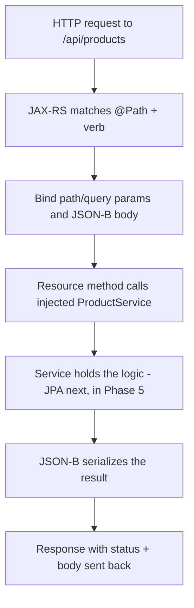

# JAX-RS: Building REST APIs

In [Phase 3](03-cdi-dependency-injection.md) you got the container to build and wire your objects: a
`ProductService` that holds the actual logic, handed to whatever needs it via `@Inject` — but so far
only reachable from other Java code. This phase opens a door to it from the outside world: an HTTP
request from a browser, a mobile app, or another service can now reach in and ask for a product.

The mental model to hold onto: **a JAX-RS resource is the translator between HTTP and your method calls.**
A request arrives as raw bytes — a URL, a method like `GET`, maybe a JSON body. Something has to read
that, figure out what's being asked, call the right Java method, and turn the answer back into an HTTP
response. That "something" is a *resource class*. You don't write the part that parses HTTP or formats the
reply — the application server does that. You write small methods and *label* them so the server knows
"when `GET /api/products` comes in, call this one." Same inversion of control you saw with CDI: you don't
call the framework, the framework calls you.

📝 **JAX-RS (Jakarta RESTful Web Services) is the standard REST spec** — the official, vendor-neutral way
to build HTTP APIs in Jakarta EE. If you've seen Spring's `@RestController`
([Spring Boot From Zero](/guides/spring-boot-from-zero)), JAX-RS is the standards-body equivalent: same
job, different annotations, and your app server (WildFly, Payara, Open Liberty) ships the engine instead
of one vendor's framework. If words like *HTTP method*, *status code*, or *resource* feel fuzzy, the
[REST APIs Explained](/guides/rest-apis-explained) and
[HTTP & JSON API Basics](/guides/http-and-json-api-basics) guides cover the protocol side; here we focus
on the Jakarta side.

The running example is the `Product` from Phase 3 — four fields, a plain Java object:

```java
public class Product {
    private Long id;
    private String name;
    private BigDecimal price;
    private String sku;
    // constructor, getters, and setters omitted for brevity
}
```

*What just happened:* That's the thing we'll move across the wire — an `id`, a `name`, a `price`, and a
`sku` (the stock-keeping unit, a product's unique catalog code). Nothing Jakarta-specific about it yet;
it's an ordinary object, the same one `ProductService` already manages.

## The `Application` class and your first resource

Two pieces bootstrap a JAX-RS API. First, an **`Application` class** turns the feature on and picks the
base path. You write it once, and it's usually empty:

```java
import jakarta.ws.rs.ApplicationPath;
import jakarta.ws.rs.core.Application;

@ApplicationPath("/api")
public class RestConfig extends Application {
    // empty on purpose — its presence is the configuration
}
```

*What just happened:* `@ApplicationPath("/api")` told the server "activate JAX-RS, and every endpoint
lives under `/api`." Extending `Application` with no body is the standard "scan for my resources
automatically" signal — the server finds your resource classes for you. You don't register anything by
hand; the annotation plus the empty subclass is the whole setup.

📝 Second, a **resource class** is where endpoints actually live. You mark it with `@Path` to give it a
URL, and its methods become the handlers. Crucially, **a JAX-RS resource is also a CDI bean** — so the
`@Inject` you learned in Phase 3 works right here. That's how the resource gets hold of `ProductService`.

```java
import jakarta.inject.Inject;
import jakarta.ws.rs.Path;

@Path("/products")
public class ProductResource {

    @Inject
    private ProductService service;   // the CDI bean from Phase 3, injected for us
}
```

*What just happened:* `@Path("/products")` mapped this class to the URL `/api/products` — the
`/api` from the `Application` class, then `/products` from here. `@Inject ProductService service` is pure
CDI: the container hands this resource a fully-wired `ProductService`, the same way it would any other
bean. This is the Jakarta parallel to Spring's `@RestController` with a constructor-injected service —
the resource speaks HTTP, the service holds the logic.

## HTTP method annotations

The class has a URL; now its methods need to say *which HTTP verb* they answer and *what format* they
speak. Each handler gets a method annotation (`@GET`, `@POST`, `@PUT`, `@DELETE`) plus content-type
annotations.

📝 `@GET`/`@POST`/`@PUT`/`@DELETE` map a method to that HTTP method. `@Produces` declares the format the
method *sends back*; `@Consumes` declares the format it *accepts*. For a JSON API both are
`MediaType.APPLICATION_JSON`. Here's a `@GET` that returns the whole list of products:

```java
import jakarta.ws.rs.GET;
import jakarta.ws.rs.Path;
import jakarta.ws.rs.Produces;
import jakarta.ws.rs.core.MediaType;
import java.util.List;

@Path("/products")
public class ProductResource {

    @Inject
    private ProductService service;

    @GET
    @Produces(MediaType.APPLICATION_JSON)
    public List<Product> listProducts() {
        return service.findAll();   // delegate to the CDI service; it owns the logic
    }
}
```

*What just happened:* `@GET` said "handle `GET` requests to this resource's path." `@Produces(APPLICATION_JSON)`
said "my response is JSON." The method returns a `List<Product>` — and because the response type is JSON,
the server hands that list to **JSON-B** (more on it shortly), which turns each `Product` into a JSON
object automatically. You wrote no serialization code; you delegated the *work* to `service.findAll()`
and the *formatting* to JSON-B.

A request and the response it produces:

```http
GET /api/products HTTP/1.1
Host: localhost:8080
```

```json
[
  { "id": 1, "name": "Mechanical Keyboard", "price": 129.99, "sku": "KB-MECH-01" },
  { "id": 2, "name": "USB-C Hub", "price": 49.50, "sku": "HUB-USBC-07" }
]
```

*What just happened:* The `List<Product>` came back as a JSON array, one object per product, each field
mapped by name. That field-by-field translation is JSON-B doing its job — your method just returned plain
Java objects and let the spec handle the wire format.

💡 The HTTP verb carries the meaning, so you don't put it in the URL. `GET /api/products` *reads*;
`POST /api/products` *creates*; `DELETE /api/products/2` *removes*. Same noun (`products`), different
verbs — that's the REST convention from [REST APIs Explained](/guides/rest-apis-explained), and JAX-RS
leans on it directly.

## Path and query params

A real API needs to address *one specific product* and to *filter* a list. Those are two different jobs,
and JAX-RS has a different tool for each.

📝 A **path param** is part of the URL path itself — `/api/products/2` means "the product whose id is 2."
You write a placeholder in `@Path` with braces (`@Path("/{id}")`) and bind it with `@PathParam`. A
**query param** is a value after the `?` — `/api/products?maxPrice=50` — and you bind it with
`@QueryParam`. The rule of thumb: a path param *identifies a resource*; a query param *filters or
modifies* a request.

```java
import jakarta.ws.rs.*;
import jakarta.ws.rs.core.MediaType;
import java.math.BigDecimal;
import java.util.List;

@Path("/products")
public class ProductResource {

    @Inject
    private ProductService service;

    @GET
    @Path("/{id}")
    @Produces(MediaType.APPLICATION_JSON)
    public Product getProduct(@PathParam("id") Long id) {
        return service.findById(id);
    }

    @GET
    @Produces(MediaType.APPLICATION_JSON)
    public List<Product> listProducts(@QueryParam("maxPrice") BigDecimal maxPrice) {
        if (maxPrice == null) {
            return service.findAll();
        }
        return service.findCheaperThan(maxPrice);   // filter when ?maxPrice=... is present
    }
}
```

*What just happened:* In `getProduct`, the `{id}` in `@Path("/{id}")` lines up with `@PathParam("id") Long id` —
the server pulls `2` out of `/api/products/2`, converts the text to a `Long` for you, and passes it in.
In `listProducts`, `@QueryParam("maxPrice")` reads the `?maxPrice=...` query string; when the client
omits it the param is `null`, so we return everything. One noun, two behaviors, driven by the URL.

Try both with curl:

```bash
curl http://localhost:8080/api/products/2
curl "http://localhost:8080/api/products?maxPrice=60"
```

```console
{"id":2,"name":"USB-C Hub","price":49.50,"sku":"HUB-USBC-07"}

[{"id":2,"name":"USB-C Hub","price":49.50,"sku":"HUB-USBC-07"}]
```

*What just happened:* The first call hit the path-param route and returned a single product. The second
hit the same `/api/products` endpoint but, because `?maxPrice=` was present, returned a filtered array
(only the hub came in under 60). The quotes around the second URL keep the shell from choking on the `?`.

## Request bodies and the `Response` object

Reading is half an API. To *create* a product the client sends data in the request body, and to answer
honestly you sometimes need to control the status code yourself.

📝 **JSON-B (Jakarta JSON Binding) is the standard object↔JSON mapper** — the spec's built-in translator,
the role Jackson plays in Spring. It serializes your return values to JSON (the `@GET`s above) and
deserializes incoming JSON into Java objects. So a `@POST` method that takes a `Product` parameter gets a
fully-populated object: JSON-B read the body and filled the fields before your code ran.

That covers the body. For the *status code*, returning a bare object always yields **200 OK**, which
isn't always the truth. Creating a resource should report **201 Created**; a missing product should
report **404 Not Found**. To say exactly which status (and which headers), you return a **`Response`**
instead of the plain object.

```java
import jakarta.ws.rs.*;
import jakarta.ws.rs.core.MediaType;
import jakarta.ws.rs.core.Response;
import jakarta.ws.rs.core.UriInfo;
import jakarta.ws.rs.core.Context;
import java.net.URI;

@Path("/products")
public class ProductResource {

    @Inject
    private ProductService service;

    @POST
    @Consumes(MediaType.APPLICATION_JSON)
    @Produces(MediaType.APPLICATION_JSON)
    public Response createProduct(Product product, @Context UriInfo uriInfo) {
        Product saved = service.create(product);
        URI location = uriInfo.getAbsolutePathBuilder()
                              .path(String.valueOf(saved.getId()))
                              .build();                       // /api/products/3
        return Response.created(location).entity(saved).build();   // 201 + Location header
    }

    @GET
    @Path("/{id}")
    @Produces(MediaType.APPLICATION_JSON)
    public Response getProduct(@PathParam("id") Long id) {
        Product found = service.findById(id);
        if (found == null) {
            return Response.status(Response.Status.NOT_FOUND).build();   // 404, no body
        }
        return Response.ok(found).build();                              // 200, body is the product
    }
}
```

*What just happened:* `createProduct` takes a `Product` parameter with no annotation — JAX-RS treats the
*unannotated* parameter as the request body, and `@Consumes(APPLICATION_JSON)` tells JSON-B to
deserialize the incoming JSON into it. We hand it to `service.create(...)`, then build a `Response`:
`Response.created(location)` sets status **201** *and* a `Location` header pointing at the new product's
URL, and `.entity(saved)` attaches the body. In `getProduct`, a missing product returns a clean **404**
with no body, while a hit returns **200** with the product. Contrast that with the earlier methods that
returned a bare object and always got 200 — `Response` is the switch you flip when the default status
isn't the honest answer.

The request the client sends:

```json
{
  "name": "Laptop Stand",
  "price": 39.95,
  "sku": "STD-LAP-04"
}
```

*What just happened:* The client posts a product with no `id` — the server assigns that on create. JSON-B
binds `name`, `price`, and `sku` onto a `Product` before `createProduct` runs, so by the time your code
executes you're holding a real, populated Java object, not raw text.

## How it all fits

It's worth stepping back to see the layers, because it's the same shape you'll repeat for every resource.



💡 Notice how *thin* the resource is. The best JAX-RS methods do three things: read the request, hand off
to the injected `ProductService` for the real work, and shape the response. The service is where logic
lives — and in [Phase 5](05-jakarta-persistence.md) that service will swap its in-memory placeholder for
Jakarta Persistence (JPA), reading and writing real database rows. The resource won't change at all;
that's the payoff of keeping the layers separate.

⚠️ **Keep persistence and business logic out of the resource.** It's tempting to drop a database query or
a pricing rule straight into a handler because it "works." It does — until that logic needs testing
(you'd have to fake an HTTP request to exercise it), reusing (a scheduled job can't send itself a
request), or changing (and now every change touches the doorway). A resource that does two jobs becomes
the place every bug hides. HTTP in, HTTP out; delegate the rest to the CDI bean.

📝 One more thing worth knowing: JAX-RS isn't only for *serving* requests. It also has a **Client API**
(`ClientBuilder.newClient()`) for *calling* other services' REST endpoints from your own code — handy
when one service needs to talk to another. We won't use it here, but it's the same spec, the other
direction.

## Recap

1. **JAX-RS is the standard REST spec.** An `@ApplicationPath` `Application` subclass switches it on and
   sets the base path; `@Path` resource classes hold your endpoints — the standards-body counterpart to
   Spring's `@RestController`.
2. **Resources are CDI beans.** `@Inject` works inside a resource, so it gets a fully-wired
   `ProductService` for free — the resource stays a thin translator while the service owns the logic.
3. **Method annotations route by verb and format.** `@GET`/`@POST`/`@PUT`/`@DELETE` pick the HTTP method;
   `@Produces` and `@Consumes` declare JSON in and out.
4. **Path params identify, query params filter.** `@PathParam` binds `{id}` from the path (one specific
   product); `@QueryParam` binds `?maxPrice=...` (filter or modify), and is `null` when omitted.
5. **JSON-B maps objects to and from JSON.** It serializes return values and deserializes the unannotated
   body parameter on a `@POST` — the standard's answer to Jackson.
6. **`Response` controls status and headers.** Return a bare object for the default 200, or a `Response`
   for 201 Created (with a `Location` header), 404 Not Found, and anything else where the status is part
   of the answer. ⚠️ Real persistence lives in the service, arriving next in
   [Phase 5](05-jakarta-persistence.md).

## Quick check

Make sure the core JAX-RS ideas stuck:

```quiz
[
  {
    "q": "What does the @ApplicationPath(\"/api\") class do in a JAX-RS app?",
    "choices": [
      "Bootstraps JAX-RS and sets the base path that all resources live under, so /products becomes /api/products",
      "Connects the application to the database automatically",
      "Defines a single endpoint at /api that returns all resources",
      "Replaces the need for @Path on resource classes"
    ],
    "answer": 0,
    "explain": "An Application subclass annotated with @ApplicationPath activates JAX-RS and declares the base path. Each resource's @Path is then appended to it — @Path(\"/products\") under @ApplicationPath(\"/api\") serves /api/products. It does nothing with the database, and resources still need their own @Path."
  },
  {
    "q": "You want to fetch one specific product by its id from /api/products/2. Which annotation binds that 2 to your method parameter?",
    "choices": [
      "@PathParam, because the id is part of the URL path and identifies a specific resource",
      "@QueryParam, because all URL values use the same annotation",
      "An unannotated parameter, because the id travels in the request body",
      "@GET, because that annotation reads the value for you"
    ],
    "answer": 0,
    "explain": "A value embedded in the path (matched by @Path(\"/{id}\")) is bound with @PathParam — it identifies a resource. @QueryParam is for values after the ? (like ?maxPrice=...), which filter or modify. The unannotated parameter is the JSON body, handled by JSON-B."
  },
  {
    "q": "Your create endpoint returns a plain Product object, and clients always get HTTP 200 even though a resource was created. How do you report 201 Created instead?",
    "choices": [
      "Return a Response, e.g. Response.created(location).entity(saved).build(), which carries the status and a Location header alongside the body",
      "Add @POST(status = 201) to the method",
      "Throw an exception after saving so the server picks a different code",
      "Nothing can change it — JAX-RS methods can only return 200"
    ],
    "answer": 0,
    "explain": "Returning a bare object gives the default 200. To control the status (and headers), return a Response — Response.created(location) reports 201 Created and sets the Location header to the new resource's URL. The same object gives you 404 via Response.status(Response.Status.NOT_FOUND).build()."
  }
]
```

---

[← Phase 3: CDI: Contexts & Dependency Injection](03-cdi-dependency-injection.md) · [Guide overview](_guide.md) · [Phase 5: Jakarta Persistence (JPA) →](05-jakarta-persistence.md)
