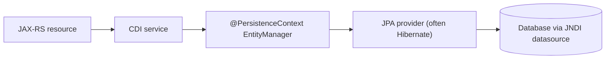

# Jakarta Persistence (JPA)

In Phase 4 your `ProductResource` happily served JSON, but every product was hand-built or kept in a
list. Now we make them real — rows in a database, fetched and saved through JPA. If you've done any
Hibernate, almost all of this will feel familiar, and that's the point: **Jakarta Persistence *is* the
JPA you already know.** What changes inside a Jakarta EE app server is *who holds the wiring* — this
phase is about that difference, and almost nothing else.

## The mental model: same JPA, the container holds the plumbing

Here's the one idea to anchor everything. In a standalone Hibernate program (the
[Hibernate & JPA guide](/guides/hibernate-and-jpa-from-zero)), *you* build the machine: you create an
`EntityManagerFactory`, open an `EntityManager`, begin and commit transactions, close everything in a
`finally`. You are the plumber.

Inside a Jakarta EE container, the plumbing already exists. The app server (WildFly, Payara, Open
Liberty) reads a small config file, builds the factory, manages a connection pool, and hands you a
ready-to-use `EntityManager` through an annotation. Your job shrinks to: *describe* the persistence
setup once, then *ask* for an `EntityManager` and use it.

> 💡 **Key point.** The JPA *API* — `@Entity`, `persist`, `find`, JPQL, the persistence context, lazy
> loading — is identical. The only EE-specific parts are three things: the **persistence unit**
> (config), the **container-managed `EntityManager`** (injection), and **container-managed
> transactions** (Phase 6). Everything else you already know carries over unchanged.

## JPA is a Jakarta EE spec

📝 **Jakarta Persistence** is one of the specifications bundled into Jakarta EE — the same "spec, not
implementation" idea from [Phase 1](01-what-jakarta-ee-is.md). The spec defines the annotations and the
`EntityManager` API; a **provider** supplies the actual engine. **Hibernate is the most common
provider** (EclipseLink is the other big one), and most app servers ship one by default. So "JPA" and
"the Hibernate you may know" are not competitors — JPA is the standard, Hibernate is the thing under it.

The entity mapping itself is plain JPA. Here's our `Product`, mapped the same way you'd map anything in
the standalone guide:

```java
import jakarta.persistence.*;
import java.math.BigDecimal;

@Entity
@Table(name = "products")
public class Product {

    @Id
    @GeneratedValue(strategy = GenerationType.IDENTITY)
    private Long id;

    private String name;
    private BigDecimal price;

    @Column(unique = true)
    private String sku;

    protected Product() {}   // JPA needs a no-arg constructor

    public Product(String name, BigDecimal price, String sku) {
        this.name = name;
        this.price = price;
        this.sku = sku;
    }

    // getters and setters omitted
}
```
*What just happened:* This is ordinary JPA mapping — `@Entity` marks the class as a table-backed type,
`@Id` + `@GeneratedValue` make the database assign the primary key, and `@Column(unique = true)` mirrors
a `UNIQUE` constraint on `sku`. Nothing here is Jakarta-EE-specific. For the full story on mapping
(relationships, embeddables, inheritance), lean on the
[Hibernate & JPA guide](/guides/hibernate-and-jpa-from-zero) — we won't re-teach it. What's new starts
with *where this entity gets registered*.

## The persistence unit & `persistence.xml`

📝 A **persistence unit** is a named bundle that answers three questions: *which provider* runs the
show, *which datasource* (database connection) to use, and *which entities* belong to it. You declare it
in a file called `persistence.xml`, which lives at `src/main/resources/META-INF/persistence.xml` in your
WAR.

```xml
<?xml version="1.0" encoding="UTF-8"?>
<persistence xmlns="https://jakarta.ee/xml/ns/persistence"
             version="3.0">

    <persistence-unit name="storePU" transaction-type="JTA">
        <jta-data-source>java:/jdbc/StoreDS</jta-data-source>
        <properties>
            <property name="jakarta.persistence.schema-generation.database.action"
                      value="update"/>
        </properties>
    </persistence-unit>

</persistence>
```
*What just happened:* We named one persistence unit `storePU`. The big EE difference is
`<jta-data-source>java:/jdbc/StoreDS</jta-data-source>`: instead of putting a JDBC URL, username, and
connection-pool settings here, we point at a **JNDI name** — a datasource the *app server* already
defined and manages. You configure `StoreDS` once in the server (its URL, credentials, pool size), and
every app just references it by name. `transaction-type="JTA"` says "let the container run the
transactions" (Phase 6). We didn't even name a provider — the server's default (often Hibernate) is
assumed.

> 📝 **Where did the connection pool go?** In standalone Hibernate you'd configure the JDBC URL and a
> pool (HikariCP, c3p0) yourself. In EE that's the *server's* job. The datasource is infrastructure the
> container owns; your app borrows it by JNDI name. One less thing you wire, one less thing that differs
> between dev and prod.

## Container-managed `EntityManager`

This is the heart of the phase. In the standalone guide you wrote `emf.createEntityManager()` and were
responsible for closing it. In EE, you write one annotation and the container does the rest:

```java
import jakarta.ejb.Stateless;
import jakarta.persistence.EntityManager;
import jakarta.persistence.PersistenceContext;
import java.math.BigDecimal;
import java.util.List;

@Stateless
public class ProductService {

    @PersistenceContext(unitName = "storePU")
    private EntityManager em;

    public Product create(String name, BigDecimal price, String sku) {
        Product product = new Product(name, price, sku);
        em.persist(product);          // schedules the INSERT
        return product;               // managed; id is populated after flush
    }

    public Product find(Long id) {
        return em.find(Product.class, id);   // SELECT by primary key
    }

    public List<Product> all() {
        return em.createQuery("SELECT p FROM Product p", Product.class)
                 .getResultList();           // JPQL — same as ever
    }
}
```
*What just happened:* `@PersistenceContext(unitName = "storePU")` tells the container: "inject an
`EntityManager` bound to the `storePU` unit." The container creates it, wires it to the datasource, and
manages its whole lifecycle — **you never call `createEntityManager` and you never call `em.close()`.**
From there, `em.persist`, `em.find`, and `createQuery` behave *exactly* as they do in the
[EntityManager phase](/guides/hibernate-and-jpa-from-zero) of the Hibernate guide: `persist` makes a
transient `Product` managed and schedules an `INSERT`, `find` hits the first-level cache then the
database, and the persistence context is still the same per-transaction identity map you already
understand.

> ⚠️ Don't reach for `EntityManagerFactory.createEntityManager()` inside a managed bean. That's the
> standalone pattern — in a container it gives you an *unmanaged* `EntityManager` you'd have to close
> yourself, and it won't join the container's transaction. In EE, `@PersistenceContext` is the way.

A `ProductResource` from [Phase 4](04-jax-rs-rest-apis.md) just injects this service and calls it — the
resource stays thin, the service owns persistence:

```java
@Path("/products")
public class ProductResource {

    @Inject
    private ProductService products;     // CDI injection, from Phase 3

    @POST
    @Consumes(MediaType.APPLICATION_JSON)
    public Product create(Product input) {
        return products.create(input.getName(), input.getPrice(), input.getSku());
    }

    @GET
    @Path("/{id}")
    public Product get(@PathParam("id") Long id) {
        return products.find(id);
    }
}
```
*What just happened:* The JAX-RS resource handles HTTP and JSON (Phase 4); the `ProductService` handles
persistence. `@Inject` (CDI, [Phase 3](03-cdi-dependency-injection.md)) hands the resource a live
`ProductService` whose `em` is already wired. This is the standard EE layering: **resource → service →
`@PersistenceContext em` → provider → database.**

## Transactions are container-managed (a preview)

Notice what's *missing* from `ProductService.create`: there's no `em.getTransaction().begin()` and no
`commit()`. In the standalone Hibernate guide those calls were mandatory — forget the commit and nothing
saved. Here they're gone on purpose.

📝 Because we marked the bean `@Stateless` and the unit `transaction-type="JTA"`, the **container wraps
each public method in a transaction automatically.** When `create` is called, the container starts a
transaction; when the method returns normally, the container commits (and the scheduled `INSERT`
flushes); if the method throws, the container rolls back. Your `em.persist` call *joins* whatever
transaction the container has running.

That's why the `id` is populated and the row is saved even though you never wrote a single transaction
line. The full mechanics — `@Transactional`, rollback rules, what JTA coordinates across multiple
resources — are [Phase 6](06-transactions-with-jta.md). For now, the takeaway is just: **in EE you
describe boundaries with annotations, you don't hand-code begin/commit.**

## Hibernate underneath — reuse everything you know

💡 Step back and see how little is actually new. The request path through your app is:



Of that whole chain, the *only* EE-specific links are the persistence unit, the injected
`EntityManager`, and the container transaction. Everything to the right of the `EntityManager` is plain
JPA running on plain Hibernate — which means **everything from the
[Hibernate & JPA guide](/guides/hibernate-and-jpa-from-zero) still applies, byte for byte:**
relationships and `@OneToMany`, JPQL and the Criteria API, lazy vs eager fetching, the persistence
context as identity map and first-level cache, dirty checking, and the N+1 problem.

⚠️ Which also means the *traps* come along unchanged. The container injecting your `EntityManager`
doesn't make N+1 disappear — loop over 100 products touching a lazy relationship and you'll fire 100
extra `SELECT`s, same as anywhere. Lazy-loading still needs an open persistence context, so reaching for
an un-fetched relationship after the transaction ends still throws `LazyInitializationException`. The
fix is the same one the Hibernate guide teaches: watch the SQL your provider emits (turn on SQL logging
in dev), fetch what you need with a `JOIN FETCH`, and don't trust that "it's a managed `EntityManager`
now" changes any of the performance rules. The container manages the *lifecycle*, not the *queries* —
those are still yours to get right.

## Recap

1. **Jakarta Persistence is a spec**; **Hibernate is the usual provider** under it. The JPA API
   (`@Entity`, `persist`, `find`, JPQL) is the same one you learn in the
   [Hibernate & JPA guide](/guides/hibernate-and-jpa-from-zero).
2. A **persistence unit**, declared in `persistence.xml`, names the provider, the **datasource (by JNDI
   name)**, and the entities. The app server owns the connection pool — you reference it, you don't wire
   it.
3. **`@PersistenceContext EntityManager em`** gives you a **container-managed** `EntityManager`: the
   container creates it, wires it, and closes it. You never call `createEntityManager` or `em.close()`.
4. Transactions are **container-managed** — no `begin`/`commit` by hand. `em` operations join the
   container's transaction automatically; rollback on a thrown exception. Full detail in
   [Phase 6](06-transactions-with-jta.md).
5. ⚠️ The container manages the EntityManager's *lifecycle*, not your *queries*. **N+1, lazy-loading
   pitfalls, and `LazyInitializationException` all still apply** — watch the SQL.

## Quick check

The three things that are actually different about JPA in a container:

```quiz
[
  {
    "q": "What does `@PersistenceContext EntityManager em;` give you inside a Jakarta EE managed bean?",
    "choices": [
      "A container-managed EntityManager — the container creates, wires, and closes it; you never call createEntityManager or em.close()",
      "A new EntityManagerFactory you must call createEntityManager() on",
      "A second-level cache instance shared across all requests",
      "A raw JDBC connection you manage by hand"
    ],
    "answer": 0,
    "explain": "In EE the container injects and manages the EntityManager's whole lifecycle. That's the main difference from standalone Hibernate, where you'd build the factory, open the EntityManager, and close it yourself."
  },
  {
    "q": "In an EE persistence.xml, why do you point at a JNDI name like `java:/jdbc/StoreDS` instead of a JDBC URL and pool settings?",
    "choices": [
      "Because the app server owns the datasource and connection pool; the persistence unit just references it by JNDI name",
      "Because JPA cannot read JDBC URLs at all",
      "Because the JNDI name is the database password in disguise",
      "Because each entity needs its own separate connection"
    ],
    "answer": 0,
    "explain": "The container manages the datasource (URL, credentials, pool). You configure it once in the server and every app references it by JNDI name — one less thing your app wires, and it stays consistent across environments."
  },
  {
    "q": "You inject a container-managed EntityManager and loop over products touching a lazy relationship. What happens to the N+1 problem?",
    "choices": [
      "It still happens — container management handles lifecycle, not query efficiency; you still need JOIN FETCH and to watch the SQL",
      "It disappears, because container-managed EntityManagers auto-batch all queries",
      "It throws a compile error before the loop runs",
      "It's impossible, because JTA prevents extra SELECTs"
    ],
    "answer": 0,
    "explain": "Everything to the right of the EntityManager is plain JPA on plain Hibernate, so N+1, lazy-loading, and LazyInitializationException all apply unchanged. The container manages the EntityManager's lifecycle, not your queries."
  }
]
```

---

[← Phase 4: JAX-RS: Building REST APIs](04-jax-rs-rest-apis.md) · [Guide overview](_guide.md) · [Phase 6: Transactions with JTA →](06-transactions-with-jta.md)
