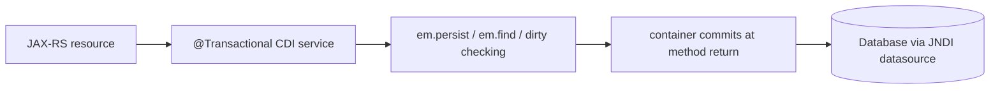

# Transactions with JTA

In [Phase 5](05-jakarta-persistence.md) you noticed something quietly missing from `ProductService.create`: there was no `em.getTransaction().begin()` and no `commit()`. The `INSERT` still happened, the `id` still came back, the row was still there. This phase is the explanation of that disappearing act — and it's the single biggest day-to-day difference between writing JPA standalone and writing it inside a Jakarta EE container.

Here's the whole phase in one sentence, worth pinning to your monitor:

> **In standalone JPA *you* bracket the work with begin/commit; in Jakarta EE you put one annotation on a method and the container opens the transaction before it runs and commits after — rolling back if you throw.**

That shift — from imperative (you call begin/commit) to **declarative** (you describe boundaries with an annotation) — is what we unpack below. Everything about *what a transaction is* you already know from [Transactions & ACID](/guides/transactions-and-acid) and the [Hibernate guide's transactions phase](/guides/hibernate-and-jpa-from-zero). What's new is *who pulls the levers*.

## The EE difference: declarative transactions

📝 In standalone JPA you write the three calls by hand — `tx.begin()`, your work, `tx.commit()`, with a `rollback()` in the `catch`. You saw exactly that shape in the [Hibernate guide's Phase 4](/guides/hibernate-and-jpa-from-zero): open the bracket, do the work, close it, undo on failure. It works, but every service method repeats the same boilerplate, and forgetting the commit means your changes silently vanish.

In Jakarta EE, the **container** owns that bracket. You annotate a CDI bean method with `@Transactional` and the container does the begin/commit/rollback *around* your method — like an invisible `try`/`commit`/`catch`/`rollback` wrapped over the whole call. Your code inside only describes the work.

```java
import jakarta.enterprise.context.ApplicationScoped;
import jakarta.transaction.Transactional;
import jakarta.persistence.EntityManager;
import jakarta.persistence.PersistenceContext;
import java.math.BigDecimal;

@ApplicationScoped
public class ProductService {

    @PersistenceContext(unitName = "storePU")
    private EntityManager em;

    @Transactional
    public Product create(String name, BigDecimal price, String sku) {
        Product product = new Product(name, price, sku);
        em.persist(product);     // joins the container's transaction
        return product;          // returns normally -> container commits
    }
}
```
*What just happened:* `@Transactional` (from `jakarta.transaction`) tells the container: "start a transaction before `create` runs, commit it when `create` returns normally, roll it back if `create` throws." The `em.persist` call doesn't start anything — it *joins* the transaction the container already opened. When the method returns, the container commits, the persistence context flushes, and the `INSERT` hits the database. There is no begin, no commit, no `finally` in your code because the container wrote all of it for you. This is the same atomicity guarantee from [Transactions & ACID](/guides/transactions-and-acid) — all-or-nothing — just declared instead of hand-coded.

💡 If you've used Spring, `@Transactional` will feel instantly familiar — same idea, same name, near-identical behavior. (Different package: Jakarta's is `jakarta.transaction.Transactional`; Spring's is `org.springframework.transaction.annotation.Transactional`.) Both lean on the container/framework to write begin/commit for you.

## What JTA actually is

You've now seen *who* runs the transaction (the container) but not *with what*. The answer is JTA.

📝 **Jakarta Transactions (JTA)** is the standard transaction API and transaction *manager* that the Jakarta EE container uses under the hood. When `@Transactional` says "start a transaction," it's the JTA transaction manager that actually starts, tracks, and commits it. You rarely call JTA directly — `@Transactional` is the friendly face over it — but it's the machinery doing the work.

Here's JTA's superpower, the thing a plain single-connection transaction *cannot* do:

💡 A local transaction lives inside **one** database connection — begin, work, commit, all on that single connection. JTA can span **multiple resources** in one atomic transaction: two different databases, or a database *plus* a message queue. Write a `Product` row to the orders DB and publish an "order placed" message to a queue, and JTA can make both commit together or both roll back together — even though they're entirely separate systems. That coordination across resources is exactly what a local transaction can't give you, and it's why EE containers ship a JTA transaction manager.

```java
@Transactional
public void placeOrder(Product product, BigDecimal price, String sku) {
    em.persist(product);                 // resource 1: the database
    orderEvents.send(sku, price);        // resource 2: a message queue (JMS)
    // both commit together, or if either throws, BOTH roll back
}
```
*What just happened:* Inside one `@Transactional` method we touched two different resources — the database via `em` and a message queue via `orderEvents`. Because JTA is coordinating, they're enrolled in the *same* transaction. If the queue send fails after the `persist`, JTA rolls back the database insert too, so you never end up with a saved product and a lost "order placed" event (or vice versa). Spanning resources like this is the headline reason JTA exists — and, as we'll see at the end, it's not free.

## Transaction attributes: what happens when methods call methods

A `@Transactional` method often calls *another* `@Transactional` method. Does the inner one join the outer transaction, start its own, or refuse to run without one? That's what **transaction attributes** decide. You set them with `@Transactional(value = ...)`.

📝 The ones you'll actually use:

- **`REQUIRED`** *(the default)* — join the caller's transaction if one exists; start a new one if not. The sensible default: nested calls all share one transaction.
- **`REQUIRES_NEW`** — always start a *fresh*, independent transaction. If the caller already had one, it gets **suspended** until this new one finishes, then resumes. The inner transaction commits or rolls back on its own, independent of the outer.
- **`MANDATORY`** — there *must* already be a transaction; if the method is called without one, it throws. ("I refuse to run unbracketed.")
- **`SUPPORTS`** — run inside a transaction if one exists, otherwise run without one. ("I don't care either way.")
- **`NEVER`** — there must be *no* transaction; throws if one is active. ("I refuse to run inside a transaction.")

The interesting pair is `REQUIRED` vs `REQUIRES_NEW`, because they behave differently when one service calls another:

```java
import jakarta.transaction.Transactional;
import static jakarta.transaction.Transactional.TxType.REQUIRES_NEW;

@ApplicationScoped
public class ProductService {

    @Inject AuditService audit;

    @Transactional                       // REQUIRED (default): the main transaction
    public Product create(String name, BigDecimal price, String sku) {
        Product product = new Product(name, price, sku);
        em.persist(product);
        audit.record("created " + sku);  // runs in its OWN transaction
        return product;
    }
}

@ApplicationScoped
public class AuditService {

    @Transactional(REQUIRES_NEW)         // suspend the caller, start a fresh one
    public void record(String message) {
        em.persist(new AuditEntry(message));
    }
}
```
*What just happened:* `create` runs under the default `REQUIRED`, so it opened (or joined) the main transaction. When it calls `audit.record`, that method is `REQUIRES_NEW` — so the container **suspends** `create`'s transaction, runs `record` in a brand-new independent one, commits *that*, and then resumes `create`'s transaction. The practical consequence: the audit entry commits separately. If `create` later throws and rolls back, the product insert is undone but the audit entry *stays* — because it committed in its own transaction. That's usually exactly what you want for audit logs (you want the record even when the operation fails), and it's exactly the wrong choice for work that must succeed or fail *with* the caller. Picking the attribute is picking who shares fate with whom.

## Rollback rules: the checked-exception trap

Now the gotcha that bites everyone once. You'd assume "throw an exception, the transaction rolls back." That's true — but only for *some* exceptions.

⚠️ By default, `@Transactional` rolls back on **unchecked** exceptions (`RuntimeException` and its subclasses, plus `Error`) but **commits** on **checked** exceptions. So if your method throws a checked exception you wrote — say `InsufficientStockException extends Exception` — the container assumes it's a recoverable business condition you handled deliberately and **commits the transaction anyway.** Your half-finished work becomes permanent, which is almost never what you meant.

```java
// THE TRAP — checked exception does NOT roll back by default
@Transactional
public void buy(String sku) throws InsufficientStockException {
    Product p = em.find(Product.class, lookupId(sku));
    em.persist(new Reservation(sku));          // change 1
    if (p.getStock() <= 0) {
        throw new InsufficientStockException(); // checked -> COMMITS anyway!
    }
    p.decrementStock();                         // never reached
}
```
*What just happened:* We threw a checked exception to signal "out of stock," expecting the `Reservation` insert to be undone. But because `InsufficientStockException` is checked, the container's default rule **commits** — leaving a phantom reservation for a product you couldn't sell. The fix is to tell `@Transactional` explicitly which exceptions should roll back (or shouldn't), with `rollbackOn` / `dontRollbackOn`:

```java
@Transactional(rollbackOn = InsufficientStockException.class)
public void buy(String sku) throws InsufficientStockException {
    // ...same body... now the checked exception triggers a rollback
}
```
*What just happened:* `rollbackOn = InsufficientStockException.class` overrides the default and says "this checked exception *should* roll back too." Now throwing it undoes the `Reservation`. The mirror-image knob is `dontRollbackOn` — "even though this is a runtime exception, commit anyway." 💡 Spring's `@Transactional` has the *exact same* default and the *exact same* trap (it uses `rollbackFor` / `noRollbackFor` for the same job). So this isn't a Jakarta quirk — it's a cross-ecosystem footgun worth memorizing: **checked exceptions don't roll back unless you say so.**

## The unit-of-work tie-in: one transaction, one persistence context

Step back and connect this to the [Hibernate guide's unit of work](/guides/hibernate-and-jpa-from-zero). 💡 The container's transaction doesn't just bracket your `em` calls — it *scopes the persistence context*. The whole flush-at-commit, dirty-checking machinery you learned standalone runs at the **container's** commit point now. Change a managed entity's field with no `save` call, and the `UPDATE` fires when the container commits at the end of your `@Transactional` method. Same magic, different trigger.

So the full request flow ties together every phase of this guide:



A JAX-RS resource (Phase 4) calls a `@Transactional` service method (this phase); inside, your `em` operations (Phase 5) all enroll in the one container transaction; when the method returns, the container commits and the persistence context flushes — everything stuck or everything rolled back, as one unit of work. The resource stays thin, the service owns the transaction boundary, and dirty checking just works because the entity stays managed for the whole method.

⚠️ A closing caution on JTA's superpower. Spanning multiple resources atomically uses **two-phase commit (XA)**: the transaction manager asks every resource "ready to commit?" (phase 1), and only if *all* say yes does it tell them "commit now" (phase 2). It's genuinely powerful, but it's *costly* — extra round-trips, held locks, and more failure modes than a single-resource commit. Don't span resources out of habit. Reach for distributed/XA transactions only when you truly need atomicity *across* systems (the DB-plus-queue case). When one database is all you're touching, a single-resource transaction is faster, simpler, and far less to go wrong.

## Recap

1. **Declarative, not imperative** — standalone JPA makes you write begin/commit; Jakarta EE wraps a CDI bean method in a transaction when you annotate it `@Transactional`. The container opens it before the method, commits on normal return, rolls back on throw.
2. **JTA is the engine** — Jakarta Transactions is the standard transaction manager the container drives. Its superpower over a local (single-connection) transaction is coordinating **multiple resources** (two DBs, or a DB + a queue) atomically.
3. **Transaction attributes decide nesting** — `REQUIRED` (default: join or start) and `REQUIRES_NEW` (suspend caller, start an independent one) are the common pair; `MANDATORY`, `SUPPORTS`, and `NEVER` round it out. They control who shares fate when methods call methods.
4. **The rollback trap** — by default it rolls back on **unchecked** exceptions but **commits** on **checked** ones. Use `rollbackOn` / `dontRollbackOn` to override. Spring has the identical gotcha (`rollbackFor` / `noRollbackFor`).
5. **One transaction = one unit of work** — the container transaction scopes the persistence context, so dirty checking and flush happen at the container's commit. Reserve distributed/XA (two-phase commit) for when you genuinely need atomicity across resources — it's powerful but costly.

## Quick check

The one idea that must stick: the container runs the transaction, and the rollback rule has a sharp edge.

```quiz
[
  {
    "q": "You put @Transactional on a CDI bean method, call em.persist inside it, and the method returns normally — never calling begin or commit. What happens?",
    "choices": [
      "The container opened a transaction before the method and commits it on normal return, so the INSERT is saved",
      "Nothing is saved — without an explicit commit() the persist is discarded",
      "It throws, because em.persist requires a manual transaction in EE",
      "The row is written immediately when persist runs, before the method returns"
    ],
    "answer": 0,
    "explain": "@Transactional makes the container bracket the method: begin before, commit on normal return, rollback on throw. Your em.persist just joins that transaction, so the INSERT flushes and commits when the method returns — no hand-written begin/commit needed."
  },
  {
    "q": "Your @Transactional method throws a CHECKED exception (one extending Exception) after an em.persist. With default settings, what happens to the persisted row?",
    "choices": [
      "It commits — by default @Transactional only rolls back on unchecked exceptions; use rollbackOn to roll back on a checked one",
      "It always rolls back — any thrown exception undoes the transaction",
      "It throws a second exception because checked exceptions are illegal in transactions",
      "It commits the row but logs a warning, then rolls back on the next call"
    ],
    "answer": 0,
    "explain": "The default rule rolls back on unchecked (RuntimeException/Error) but COMMITS on checked exceptions. That's the classic trap — your half-finished work becomes permanent. Add rollbackOn = YourException.class to force a rollback. Spring's @Transactional behaves the same way."
  },
  {
    "q": "Method A is @Transactional (default REQUIRED) and calls method B, which is @Transactional(REQUIRES_NEW). A later throws and rolls back. What happens to B's work?",
    "choices": [
      "B's work stays committed — REQUIRES_NEW suspended A's transaction and ran B in an independent one that already committed",
      "B's work rolls back too, since it was called from within A",
      "B never ran, because REQUIRES_NEW blocks calls from an active transaction",
      "Both A and B stay committed, because REQUIRES_NEW disables rollback"
    ],
    "answer": 0,
    "explain": "REQUIRES_NEW suspends the caller's transaction and runs B in a fresh, independent one that commits on its own. So when A later rolls back, B's committed work survives — which is why REQUIRES_NEW suits audit logging but is wrong for work that must fail together with the caller."
  }
]
```

---

[← Phase 5: Jakarta Persistence (JPA)](05-jakarta-persistence.md) · [Guide overview](_guide.md) · [Phase 7: Validation & JSON Binding →](07-validation-and-json-binding.md)
