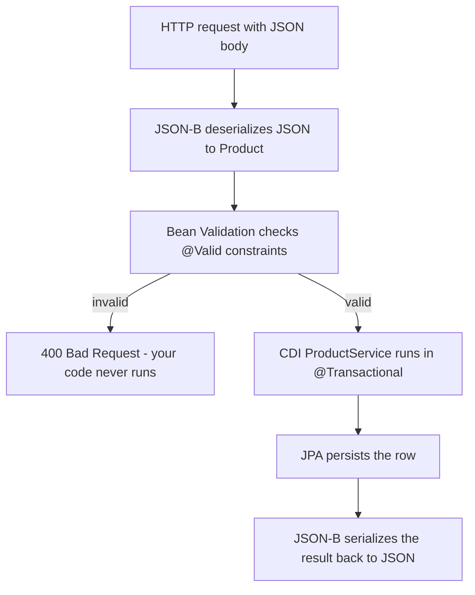

# Validation & JSON Binding

In [Phase 4](04-jax-rs-rest-apis.md) you built a JAX-RS resource that takes an incoming `Product` from a
request body and hands it to your service. There's a quiet assumption buried in that code: that the
`Product` arriving over the wire is *sane*. A real client will eventually send a product with a blank
name, a negative price, or a `sku` that's a single character — by accident or on purpose. Where do you
catch that?

The mental model to hold onto for this whole phase: **two standards bracket your method, one on each side
of the wire.** On the way *in*, raw JSON bytes arrive and something has to turn them into a `Product`
object — that's **JSON-B**, the binding spec. Then, before your code runs, something checks that the
object actually makes sense — that's **Bean Validation**, the constraint spec. On the way *out*, JSON-B
runs again, turning your `Product` back into JSON. You don't call either one by hand inside a JAX-RS
resource; you *declare* what you want with annotations and let the container do the work. Same inversion of
control you've seen all guide: you label, the framework acts.

📝 If you've used Spring's `@Valid` and `@NotBlank`
([The Service Layer, DTOs & Validation](/guides/spring-boot-from-zero)),
you already know this — because it's the *same spec*. Bean Validation is a Jakarta standard; Spring
implements it too. The annotations (`@NotBlank`, `@Size`, `@Positive`) are identical down to the package
name. What changes here is the *wiring*: instead of a Spring `@RestController`, the rules plug into a
JAX-RS resource, and instead of Jackson, the JSON mapper is JSON-B.

## Jakarta Bean Validation — rules that live on the data

📝 **Jakarta Bean Validation is the standard way to declare constraints with annotations directly on your
fields.** Instead of a pile of `if` statements scattered across your methods, you write the rule *once*,
right next to the field it describes, and the constraint travels with the data wherever it goes. The
common constraints:

- `@NotNull` — the value must not be null.
- `@NotBlank` — a string must be non-null and contain at least one non-whitespace character.
- `@Size(min=, max=)` — a string (or collection) length must fall in range.
- `@Min` / `@Max` — a number must be at least / at most a value.
- `@Positive` / `@PositiveOrZero` — a number must be greater than (or equal to) zero.
- `@Email` — a string must look like an email address.

Here's the `Product` from Phase 4, now wearing its rules:

```java
import jakarta.validation.constraints.NotBlank;
import jakarta.validation.constraints.Positive;
import jakarta.validation.constraints.Size;
import jakarta.validation.constraints.NotNull;
import java.math.BigDecimal;

public class Product {

    private Long id;

    @NotBlank(message = "name is required")
    @Size(max = 100, message = "name must be at most 100 characters")
    private String name;

    @NotNull(message = "price is required")
    @Positive(message = "price must be greater than zero")
    private BigDecimal price;

    @Size(min = 3, max = 32, message = "sku must be 3–32 characters")
    private String sku;

    // constructor, getters, and setters omitted for brevity
}
```

*What just happened:* Each constraint is a declaration of intent sitting on the field it guards. `name`
must be present and non-blank and not absurdly long; `price` must exist and be positive (you don't sell
things for negative money); `sku` must be a reasonable length. Notice the `id` has *no* constraints — it's
assigned by the server on create, not sent by the client, so there's nothing to validate. None of these
annotations *does* anything on its own yet; they're metadata describing what a valid `Product` looks like.
The next section is the switch that makes the container actually enforce them.

## Validating in JAX-RS — `@Valid` at the boundary

📝 **`@Valid` on a resource method's body parameter tells the container to validate the incoming object
before your method body runs.** The flow: JSON-B deserializes the request body into a `Product`, then —
because of `@Valid` — Bean Validation checks every constraint on it. If anything fails, your code *never
executes*; the container short-circuits and returns a **400 Bad Request** describing the violations. If
everything passes, your method runs with an object you can trust.

```java
import jakarta.validation.Valid;
import jakarta.ws.rs.*;
import jakarta.ws.rs.core.MediaType;
import jakarta.ws.rs.core.Response;

@Path("/products")
public class ProductResource {

    @Inject
    private ProductService service;

    @POST
    @Consumes(MediaType.APPLICATION_JSON)
    @Produces(MediaType.APPLICATION_JSON)
    public Response createProduct(@Valid Product product) {
        Product saved = service.create(product);   // only runs if validation passed
        return Response.status(Response.Status.CREATED).entity(saved).build();
    }
}
```

*What just happened:* The only new token versus Phase 4 is `@Valid` in front of the `Product` parameter.
That single annotation is the switch — it tells JAX-RS "after JSON-B builds this object, run its
constraints, and if any fail, don't call me." The body of `createProduct` is now allowed to assume a clean
product, because it can't be reached any other way. Without `@Valid`, the annotations on `Product` are
inert metadata and a blank-name product would sail straight into `service.create(...)`.

Send a bad request — a blank name and a negative price:

```json
{
  "name": "",
  "price": -5.00,
  "sku": "KB-MECH-01"
}
```

The container rejects it before your code runs, with a 400 and the violations:

```json
{
  "status": 400,
  "violations": [
    { "field": "createProduct.product.name",  "message": "name is required" },
    { "field": "createProduct.product.price", "message": "price must be greater than zero" }
  ]
}
```

*What just happened:* You wrote zero `if` statements, yet the request was rejected with a clear 400 listing
exactly which fields failed and the `message` strings you authored on the constraints. The exact JSON shape
of this error body varies by application server (WildFly, Payara, and Open Liberty differ in the wrapper
and the `field` naming), but the principle is universal: violations come back as a 400 before your handler
is entered. In practice you'd map these to a tidy, consistent shape with an `ExceptionMapper` — the JAX-RS
hook for turning exceptions into responses — but the default already protects you.

💡 This is the Jakarta mirror of Spring's `@Valid @RequestBody` — same annotation, same 400-on-failure
behavior, different doorway. The skill transfers directly.

## Validating elsewhere — not just at the HTTP edge

The HTTP boundary is the *most common* place to validate, but it isn't the only one. `@Valid` and the
constraint annotations work anywhere the container manages the call.

📝 You can put `@Valid` (and even bare constraints) on **CDI or EJB method parameters**, and the container
will validate them on every call — this is *method-level validation*. A `ProductService.create` can demand
a valid argument no matter who calls it, not just HTTP traffic:

```java
import jakarta.validation.Valid;

@ApplicationScoped
public class ProductService {

    public Product create(@Valid Product product) {   // validated on every call, HTTP or not
        // ... persist it
        return product;
    }
}
```

*What just happened:* The `@Valid` here means a scheduled job, a message listener, or another service that
calls `create` gets the *same* guarantee the HTTP layer does — the container validates the argument before
the method body runs. The rule no longer depends on someone remembering to validate at the edge.

You can also validate **programmatically** when you need full control — inject a `Validator` and ask it
directly:

```java
import jakarta.validation.Validator;
import jakarta.validation.ConstraintViolation;
import jakarta.inject.Inject;
import java.util.Set;

@Inject
private Validator validator;

public void check(Product product) {
    Set<ConstraintViolation<Product>> violations = validator.validate(product);
    if (!violations.isEmpty()) {
        // inspect each violation, decide what to do
    }
}
```

*What just happened:* `validator.validate(product)` runs the constraints and hands back a `Set` of whatever
failed (empty means valid). This is the manual escape hatch for when annotations on a parameter aren't
enough — say you need to validate conditionally, or collect violations to report in a custom way. Most of
the time `@Valid` is all you need; reach for the `Validator` only when you genuinely need to drive
validation yourself.

## JSON-B — mapping objects to and from JSON

You've leaned on JSON-B since Phase 4 without configuring it. Time to take the wheel.

📝 **JSON-B (Jakarta JSON Binding) is the standard object↔JSON mapper** — the spec's built-in translator,
the role Jackson plays in the Spring world. JAX-RS uses it automatically: it serializes your return values
to JSON and deserializes incoming JSON into Java objects. Out of the box it maps field names straight
across. When the JSON shape needs to differ from your Java shape, a few annotations adjust it:

- `@JsonbProperty("name")` — use a different JSON key for this field.
- `@JsonbTransient` — exclude this field from JSON entirely.
- `@JsonbDateFormat` / `@JsonbNumberFormat` — control how dates and numbers are rendered.

```java
import jakarta.json.bind.annotation.JsonbProperty;
import jakarta.json.bind.annotation.JsonbTransient;
import java.math.BigDecimal;

public class Product {

    private Long id;
    private String name;
    private BigDecimal price;

    @JsonbProperty("stockKeepingUnit")   // rename the JSON key
    private String sku;

    @JsonbTransient                       // never serialize this to clients
    private String internalCostCode;

    // getters and setters omitted
}
```

*What just happened:* `@JsonbProperty("stockKeepingUnit")` decouples the wire name from the Java field —
the JSON key becomes `stockKeepingUnit` while your code still calls it `sku`. `@JsonbTransient` on
`internalCostCode` keeps that field out of the JSON completely, so an internal value can never leak to a
client. Everything else maps by field name as before.

That `Product` serializes to:

```json
{
  "id": 1,
  "name": "Mechanical Keyboard",
  "price": 129.99,
  "stockKeepingUnit": "KB-MECH-01"
}
```

*What just happened:* `sku` came out as `stockKeepingUnit` exactly as the annotation directed, and
`internalCostCode` is nowhere in the output — `@JsonbTransient` did its job. The other fields mapped
straight across. You changed the public contract without touching a single line of serialization code.

📝 One layer below JSON-B sits **JSON-P (Jakarta JSON Processing)** — a low-level API for reading and
writing JSON as a stream or tree (`JsonObject`, `JsonParser`) without binding to Java classes. You reach
for it when you're handling JSON whose shape you don't know ahead of time, or when you want streaming
control. For mapping known objects — which is almost always — JSON-B is the right tool, and it's built on
JSON-P under the hood.

## Custom constraints, and how the pieces snap together

The built-in constraints cover most needs, but sometimes a rule is specific to *your* domain. Say a valid
`sku` must match a particular pattern your catalog uses. You can build your own constraint.

📝 **A custom constraint is an annotation paired with a `ConstraintValidator`.** You define the annotation,
point it at a validator class, and from then on it behaves exactly like `@NotBlank` — usable on any field,
enforced by `@Valid`.

```java
import jakarta.validation.Constraint;
import jakarta.validation.Payload;
import java.lang.annotation.*;

@Constraint(validatedBy = ValidSkuValidator.class)
@Target(ElementType.FIELD)
@Retention(RetentionPolicy.RUNTIME)
public @interface ValidSku {
    String message() default "sku format is invalid";
    Class<?>[] groups() default {};
    Class<? extends Payload>[] payload() default {};
}
```

```java
import jakarta.validation.ConstraintValidator;
import jakarta.validation.ConstraintValidatorContext;

public class ValidSkuValidator implements ConstraintValidator<ValidSku, String> {

    @Override
    public boolean isValid(String value, ConstraintValidatorContext context) {
        if (value == null) return true;   // let @NotNull own the "required" rule
        return value.matches("[A-Z]{2,4}-[A-Z]+-\\d{2}");   // e.g. KB-MECH-01
    }
}
```

*What just happened:* The `@ValidSku` annotation is wired to `ValidSkuValidator` via
`@Constraint(validatedBy = ...)`. The validator's `isValid` returns `true` for a good value and `false` to
trigger a violation — here it checks the SKU pattern. Returning `true` for `null` is the convention: each
constraint should do *one* job, so "is it present?" stays the responsibility of `@NotNull`. Drop `@ValidSku`
on the `sku` field and it now participates in `@Valid` like any built-in rule.

💡 Step back and watch the full request flow, because every standard in this guide has a place in it:



JSON-B turns bytes into an object, Bean Validation guards the gate, your CDI service (from
[Phase 3](03-cdi-dependency-injection.md)) does the work inside a `@Transactional` (from
[Phase 6](06-transactions-with-jta.md)), JPA (from [Phase 5](05-jakarta-persistence.md)) writes the row,
and JSON-B serializes the answer. Each spec owns one slice; together they're the spine of a Jakarta API.

⚠️ **Validate at the boundary — don't trust client input.** It is tempting to assume "my front-end already
checks the form, so the server can relax." It can't. Anyone can send a raw HTTP request that skips your
front-end entirely: a curl command, a buggy mobile client, a malicious script. The server is the *only*
place you actually control, so the constraints on your `Product` plus a `@Valid` at the edge are not
belt-and-suspenders — they're the belt. Bad data that slips past validation becomes corrupt rows, and
corrupt rows outlive the bug that created them.

## Recap

1. **Bean Validation puts rules on the data.** Annotate fields with `@NotBlank`, `@NotNull`, `@Size`,
   `@Positive`, `@Min`/`@Max`, `@Email` — the rule lives next to the field and travels with the object.
   It's the same spec Spring uses, down to the package names.
2. **`@Valid` enforces them in JAX-RS.** Put `@Valid` on the body parameter; the container validates the
   deserialized object before your method runs and returns a 400 with the violations if it fails — your
   code never sees bad input.
3. **Validation isn't only for HTTP.** `@Valid` works on CDI/EJB method parameters too (method-level
   validation), and you can inject a `Validator` to validate programmatically when you need full control.
4. **JSON-B is the standard object↔JSON mapper.** JAX-RS uses it automatically; `@JsonbProperty` renames a
   key, `@JsonbTransient` hides a field, and date/number format annotations shape the output. JSON-P sits
   below it for low-level streaming when you don't have a class to bind to.
5. **Custom constraints are annotation + `ConstraintValidator`.** Define your own rule (like a SKU format
   check) and it plugs into `@Valid` exactly like a built-in. ⚠️ Always validate at the boundary — the
   client can't be trusted, and the server is the only gate you control.

## Quick check

Make sure the validation and binding ideas stuck:

```quiz
[
  {
    "q": "You annotated Product.name with @NotBlank, but blank names still reach your service and crash it. What did you most likely forget?",
    "choices": [
      "Adding @Valid to the Product parameter on the resource method, which is the switch that tells the container to actually enforce the constraints",
      "Importing the jakarta.validation package into the Product class",
      "Annotating the service with @Transactional so validation can roll back",
      "Setting @Produces(APPLICATION_JSON) on the method"
    ],
    "answer": 0,
    "explain": "Constraint annotations on a field are just metadata until something triggers them. In JAX-RS, @Valid on the body parameter is that trigger — it tells the container to validate the deserialized object before your method runs. Without @Valid, the rules are inert and bad input passes straight through."
  },
  {
    "q": "What is the role of JSON-B (Jakarta JSON Binding) in a JAX-RS request?",
    "choices": [
      "It serializes your return values to JSON and deserializes incoming JSON into Java objects — the standard object-to-JSON mapper, the role Jackson plays in Spring",
      "It validates incoming objects against their constraint annotations",
      "It manages the database transaction around the request",
      "It routes the request to the correct resource method based on the URL"
    ],
    "answer": 0,
    "explain": "JSON-B is the binding spec: object↔JSON. JAX-RS uses it automatically to turn the request body into a Java object and your return value back into JSON. Validation is Bean Validation's job (a separate spec), transactions are JTA's, and routing is JAX-RS's @Path matching."
  },
  {
    "q": "You need a reusable custom rule that checks a SKU matches your catalog's pattern, usable on any field via @Valid. What do you build?",
    "choices": [
      "A custom annotation paired with a class implementing ConstraintValidator, wired together with @Constraint(validatedBy = ...)",
      "A subclass of Product that overrides a validate() method",
      "An ExceptionMapper that inspects the SKU and throws on a bad value",
      "A @JsonbProperty annotation with a regex argument"
    ],
    "answer": 0,
    "explain": "A custom constraint is an annotation (marked @Constraint and pointed at a validator) plus a ConstraintValidator implementation whose isValid does the check. Once defined, it plugs into @Valid like any built-in constraint. JSON-B annotations control JSON shape, not validation, and ExceptionMapper handles errors, not the rule itself."
  }
]
```

---

[← Phase 6: Transactions with JTA](06-transactions-with-jta.md) · [Guide overview](_guide.md) · [Phase 8: Enterprise Beans & Messaging →](08-enterprise-beans-and-messaging.md)