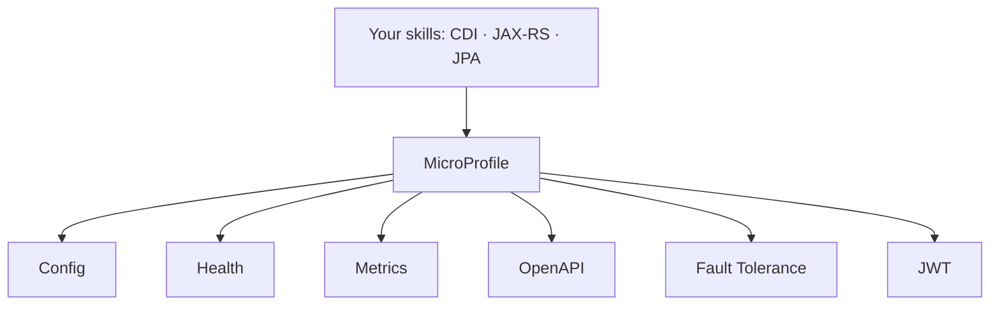

# MicroProfile & Where to Go Next

Stop for a second and look at what you can do now. You can stand up a real Jakarta EE service from nothing: wire your objects together with **CDI**, expose them over HTTP with **JAX-RS**, persist data through **Jakarta Persistence**, keep writes correct with **JTA transactions**, guard your inputs with **Validation**, and lock the doors with **Jakarta Security**. More than the annotations, you understand the *model underneath* - specifications you write against, application servers that implement them, and the freedom to swap the engine without rewriting your code.

That's not a small thing. A lot of people who use enterprise Java never quite see that shape. You do. This last phase isn't more specs to memorize - it's the map of where you go from here and the clear-eyed version of what your new skill is worth.

## MicroProfile - the cloud-native companion

📝 Here's the gap. Classic Jakarta EE was designed in an era of big application servers running in a data center, and it didn't have first-class answers for the things modern cloud deployments need: pulling configuration from the environment, telling Kubernetes whether you're alive, exposing metrics, surviving a flaky downstream service. **MicroProfile** is the open-standard project that fills exactly that gap, built by the same community and designed to sit right alongside the Jakarta EE specs you already know.

It's a set of small, focused specifications:

- **Config** - read settings (database URLs, feature flags, secrets) from the environment instead of hard-coding them, so the same build runs in dev, staging, and prod.
- **Health** - expose readiness and liveness endpoints so Kubernetes knows when to send you traffic and when to restart you.
- **Metrics** - publish counters and timers a monitoring system can scrape.
- **OpenAPI** - generate live, accurate API documentation straight from your JAX-RS resources.
- **Fault Tolerance** - add retries, timeouts, and circuit breakers with annotations, so one slow dependency doesn't take you down.
- **JWT** - authenticate callers with signed tokens, the standard currency of microservices.

💡 Put it together and the picture is clean: **Jakarta EE gives you the application; MicroProfile gives you the cloud-native operability - and both are open standards, not one vendor's framework.** That combination is a genuinely modern microservices stack.



## The runtimes - Jakarta EE's modern face

For years the knock on enterprise Java was startup time and memory: heavyweight servers that took a minute to boot and a gigabyte to idle. That era is over. 📝 A new generation of runtimes implements Jakarta EE *and* MicroProfile while running as fast, small, self-contained applications:

- **Quarkus** - built for the cloud and for fast startup, with a focus on containers and even native compilation.
- **Helidon** - Oracle's lightweight take, designed for microservices from the ground up.
- **Open Liberty** - IBM's modular server, light and composable.
- **Payara Micro** and **WildFly** - the established servers you met earlier, also runnable in slim, modern modes.

These are the standards-based answer to Spring Boot: write against the same Jakarta EE and MicroProfile annotations, then run a single, quick-starting executable that's at home in a container. **Quarkus** in particular has become a strong cloud-native choice (and has its own guide coming). The headline: the code you already know how to write now runs in exactly the lightweight, microservice-shaped way the rest of the industry expects.

## Where this fits in a career

Let's look plainly at value. Jakarta EE skills are not niche - they run a huge share of enterprise backends at banks, insurers, governments, and large companies, the kind of systems that stay in production for a decade. And because you learned the *standard*, those skills travel: the same CDI and JAX-RS knowledge works across WildFly, Payara, Open Liberty, Quarkus, and Helidon. You're not locked to one vendor.

There's a bigger payoff, too. Spring borrowed many of these ideas - dependency injection, JPA, declarative transactions - so reading Spring code now feels familiar instead of foreign. 💡 By learning the standard, you made *every* Java backend framework legible. Pair Jakarta EE with some Spring fluency and you can work almost anywhere in Java backend development. That's a strong, durable place to stand.

## What to build, and a last word

Reading got you here. Building is what makes it yours, and you already have the perfect starting point: the small `Product` service you grew across this guide. Pick one of these and take it further:

- **Make it cloud-ready.** Add MicroProfile **Health**, **Config**, and **OpenAPI**. Suddenly your service has probes Kubernetes understands, configuration that comes from the environment, and documentation that writes itself.
- **Feel the fast-startup model.** Rebuild the same service on **Quarkus**. Watching it boot in a fraction of a second is the moment the "modern Jakarta EE" idea stops being abstract.
- **Add token security.** Wire in MicroProfile **JWT** so callers authenticate with signed tokens - the way real microservices talk to each other.

When you want to go deeper, the official **Jakarta EE** and **MicroProfile** sites publish the specs and tutorials, and they're maintained by the people who build them - thorough and trustworthy.

Here's the thing to carry with you. Enterprise Java used to look like magic from the outside: annotations that somehow inject dependencies, manage transactions, and secure endpoints, with no visible wiring. You know now that it isn't magic. It's a careful set of open specifications, and you understand how each one works and where it fits. That understanding is the real skill - far more lasting than any single framework. Go build the small thing, ship it, and trust that you've earned the foundation. You're ready.

## Recap

1. **You can build a complete standard service** - CDI, JAX-RS, JPA, transactions, validation, and security - and you understand the spec-and-server model underneath it.
2. **MicroProfile adds the cloud-native pieces** classic Jakarta EE lacked: Config, Health, Metrics, OpenAPI, Fault Tolerance, and JWT - Jakarta EE plus MicroProfile is a full modern microservices stack on open standards.
3. **Modern runtimes** - Quarkus, Helidon, Open Liberty, Payara Micro, WildFly - implement these specs as fast, small, self-contained apps; they're the standards-based answer to Spring Boot, with Quarkus a strong cloud-native pick.
4. **The skills travel and transfer** - they work across every server, they're heavily used in enterprise, and because Spring shares the same DNA, knowing the standard makes every Java framework easier to read.
5. **Build next:** add MicroProfile Health/Config/OpenAPI to your `Product` service, rebuild it on Quarkus, or add JWT auth - then ship it.

## Quick check

One last check on the big picture you just built:

```quiz
[
  {
    "q": "What does MicroProfile add on top of Jakarta EE?",
    "choices": [
      "Cloud-native pieces like Config, Health, Metrics, OpenAPI, Fault Tolerance, and JWT",
      "A replacement for CDI and JAX-RS that you use instead of Jakarta EE",
      "A single proprietary application server you're required to buy",
      "A different programming language for writing enterprise services"
    ],
    "answer": 0,
    "explain": "MicroProfile is a companion set of open specs that fills the cloud-native gaps classic Jakarta EE lacked - externalized config, health probes, metrics, API docs, fault tolerance, and token security - sitting alongside the specs you already know."
  },
  {
    "q": "What do runtimes like Quarkus, Helidon, and Open Liberty have in common?",
    "choices": [
      "They implement Jakarta EE and MicroProfile as fast, small, self-contained apps",
      "They each invent their own non-standard annotations you must relearn",
      "They only run on a single cloud provider's hardware",
      "They abandon Jakarta EE entirely in favor of Spring"
    ],
    "answer": 0,
    "explain": "These runtimes implement the same Jakarta EE and MicroProfile standards but run as lightweight, quick-starting, container-friendly applications - the standards-based answer to Spring Boot."
  },
  {
    "q": "Why are your Jakarta EE skills valuable across the broader Java world?",
    "choices": [
      "You learned the standard, so it transfers across every server and makes Spring legible too",
      "Because Jakarta EE code only ever runs on one specific application server",
      "Because no other Java framework reuses any of its ideas",
      "Because it replaces the need to ever understand Java itself"
    ],
    "answer": 0,
    "explain": "Learning the standard means your CDI and JAX-RS knowledge works across WildFly, Payara, Quarkus, Helidon, and more - and since Spring borrowed many of the same ideas, the standard makes every Java backend framework easier to read."
  }
]
```

---

[← Phase 9: Jakarta Security](09-jakarta-security.md) · [Guide overview](_guide.md)
