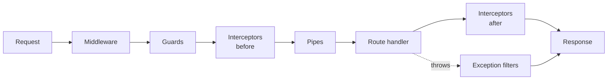

# Guards, Interceptors & Middleware

By [Phase 6](06-building-a-rest-api.md) the tasks API does real work: a controller, a service, DTOs that validate themselves. But every endpoint is still wide open — anyone who knows the URL can list, create, and delete tasks. And nothing is logged, so when something misbehaves in production you're flying blind.

The reflex from an Express background is to reach for middleware and stuff everything into it: auth checks, logging, response shaping, all in one `(req, res, next)` blob. That works, and it also turns into the same "middleware soup" that pushed you toward Nest in the first place.

Here's the mental model that replaces the soup, and it's the whole point of this phase: **Nest's request pipeline is a sequence of named building blocks, and each one has exactly one job.** A request doesn't just hit your handler — it flows through a fixed order of slots on the way in, and back out the way it came:



> 📝 The order is fixed: **middleware → guards → interceptors (pre) → pipes → handler → interceptors (post) → exception filters** (on error). You don't wire the order yourself — Nest enforces it. Your job is knowing *which slot* a given concern belongs in. That choice is the actual skill, and the rest of this phase is teaching your instinct for it.

You already know one of these slots: **pipes** (Phase 5) live just before the handler and validate/transform input. Now let's meet the others by securing and instrumenting the tasks API.

## Guards — deciding who gets in

A **guard** answers one yes/no question: *may this request proceed?* That's it. Authentication ("are you who you say you are?") and authorization ("are you allowed to do this?") are guard work. A guard implements `CanActivate` and returns `true` (let it through) or `false` (block it with a `403 Forbidden`) — or throws an exception for a more specific response.

Let's lock the tasks routes behind a simple API key:

```typescript
import { CanActivate, ExecutionContext, Injectable } from '@nestjs/common';

@Injectable()
export class ApiKeyGuard implements CanActivate {
  canActivate(context: ExecutionContext): boolean {
    const req = context.switchToHttp().getRequest();
    return req.headers['x-api-key'] === process.env.API_KEY;
  }
}
```

*What just happened:* `canActivate` runs *before* the handler. The `ExecutionContext` is Nest's portable handle on the current request — `switchToHttp().getRequest()` pulls out the underlying HTTP request so we can read its headers. We compare the `x-api-key` header to the expected key. Return `true` and the request continues down the pipeline; return `false` and Nest stops everything and sends a `403` — your controller never runs. Because it's `@Injectable()`, a guard can have services injected into it, exactly like any provider (a real `AuthGuard` would inject a token-verification service here).

Now attach it. `@UseGuards()` works on a single route or the whole controller:

```typescript
import { Controller, Get, Post, UseGuards } from '@nestjs/common';
import { ApiKeyGuard } from './api-key.guard';

@UseGuards(ApiKeyGuard)
@Controller('tasks')
export class TasksController {
  @Get()
  findAll() {
    return this.tasksService.findAll();
  }

  @Post()
  create() {
    /* ... */
  }
}
```

*What just happened:* Putting `@UseGuards(ApiKeyGuard)` on the controller class applies it to **every** route inside — both `findAll` and `create` now require a valid `x-api-key` header. Put it on a single method instead and only that route is guarded. (To protect the entire app, register it once with `app.useGlobalGuards(new ApiKeyGuard())` in `main.ts`.) Notice the controller code itself didn't change — no `if (!authorized)` check anywhere. The guard owns that concern, and the handler stays pure business logic.

> ⚠️ A guard runs **after** middleware but **before** pipes. That ordering matters: there's no point validating a request body for someone who isn't allowed in. Auth first, then parse. Nest gets this right for you by putting guards earlier in the pipeline.

## Interceptors — wrapping the handler

A guard is a gate: in or out. An **interceptor** is a wrapper: it runs code *before* the handler **and** *after* it, with the handler sandwiched in the middle. That before-and-after shape is what makes interceptors perfect for logging, timing, caching, and reshaping the response.

The "after" part works through an RxJS stream — the handler's return value flows back as an observable you can tap into or transform. Here's a logging interceptor that times every request to the tasks API:

```typescript
import {
  CallHandler,
  ExecutionContext,
  Injectable,
  NestInterceptor,
} from '@nestjs/common';
import { Observable } from 'rxjs';
import { tap } from 'rxjs/operators';

@Injectable()
export class LoggingInterceptor implements NestInterceptor {
  intercept(context: ExecutionContext, next: CallHandler): Observable<unknown> {
    const req = context.switchToHttp().getRequest();
    const start = Date.now();

    // ── before the handler runs ──
    return next.handle().pipe(
      // ── after the handler returns ──
      tap(() => {
        const ms = Date.now() - start;
        console.log(`${req.method} ${req.url} — ${ms}ms`);
      }),
    );
  }
}
```

*What just happened:* Everything above `return next.handle()` runs **before** the handler — here we stamp the start time. `next.handle()` actually *invokes* the handler and returns its result as an observable. The `.pipe(tap(...))` hooks into that stream **after** the handler finishes, so we can measure elapsed time and log it. `tap` is the read-only RxJS operator — it observes without changing the value, so the response passes through untouched. (Swap `tap` for `map` and you could *transform* the response — e.g. wrap every payload in `{ data: ... }`.) Apply it just like a guard: `@UseInterceptors(LoggingInterceptor)` on a route, controller, or `app.useGlobalInterceptors(...)` for the whole app.

> 💡 The "two halves around one call" shape is the tell. Whenever you catch yourself wanting to do something *before and after* the handler — log it, time it, cache it, reshape its output — that's an interceptor, not middleware and not a guard.

## The rest of the pipeline: filters, pipes, middleware

Three slots remain. You've met one; here are quick mental models for all three so the picture is complete.

**Exception filters** decide how a thrown exception becomes an HTTP response. Nest's built-in filter already maps `HttpException`s sensibly (a `NotFoundException` → `404` with a tidy JSON body), so you only write your own when you want a custom error *shape* or centralized error logging:

```typescript
import {
  ArgumentsHost,
  Catch,
  ExceptionFilter,
  HttpException,
} from '@nestjs/common';

@Catch(HttpException)
export class HttpErrorFilter implements ExceptionFilter {
  catch(exception: HttpException, host: ArgumentsHost) {
    const res = host.switchToHttp().getResponse();
    const status = exception.getStatus();
    res.status(status).json({
      ok: false,
      status,
      message: exception.message,
      timestamp: new Date().toISOString(),
    });
  }
}
```

*What just happened:* The `@Catch(HttpException)` decorator says "this filter handles `HttpException`s." When one is thrown anywhere downstream, Nest routes it here instead of using the default, and we send our own JSON envelope (`{ ok: false, ... }`) with the right status code. `ArgumentsHost` is the same portable context idea as `ExecutionContext`, giving us `getResponse()` to write the reply. Register it with `@UseFilters(HttpErrorFilter)` or globally — and every error in the app now speaks one consistent format.

**Pipes** you already own from Phase 5: they validate and transform *input* right before the handler (`ValidationPipe` on a `@Body()` DTO, `ParseIntPipe` on an `:id` param). Same slot in the diagram, the "shape the input" job.

**Middleware** is the Express-native escape hatch — the classic `(req, res, next)` function. Unlike the others, you don't attach it with a decorator; you configure it in a module:

```typescript
import { Module, NestModule, MiddlewareConsumer } from '@nestjs/common';
import { TasksController } from './tasks.controller';

function requestId(req: any, res: any, next: () => void) {
  req.id = crypto.randomUUID();
  next();
}

@Module({ controllers: [TasksController] })
export class TasksModule implements NestModule {
  configure(consumer: MiddlewareConsumer) {
    consumer.apply(requestId).forRoutes(TasksController);
  }
}
```

*What just happened:* By implementing `NestModule`, the module gets a `configure(consumer)` hook. `consumer.apply(requestId).forRoutes(TasksController)` says "run this middleware before any route on `TasksController`." Middleware sits at the very front of the pipeline (before guards), so it's the right home for raw `req`/`res` work and for plugging in the Express ecosystem — `helmet`, `cors`, request-id stamping, body loggers. 📝 Reach for middleware for *low-level / Express-world* concerns; prefer guards, interceptors, and pipes for anything Nest-native, because they get the framework's DI, typing, and testability.

## 💡 The decision guide (the takeaway)

When a cross-cutting concern shows up, don't agonize — match it to its slot:

| You want to… | Reach for | Implements |
|---|---|---|
| Allow or deny a request (auth) | **Guard** | `CanActivate` |
| Do something before **and** after the handler (log, time, cache, reshape response) | **Interceptor** | `NestInterceptor` |
| Validate or coerce the incoming input | **Pipe** | `PipeTransform` |
| Turn a thrown error into a custom response | **Exception filter** | `@Catch()` |
| Raw `req`/`res` work or plug in Express middleware | **Middleware** | `(req, res, next)` |

> 💡 Memorize it as one sentence: **auth → guard; around the handler → interceptor; input → pipe; errors → filter; raw Express → middleware.** Once that mapping is automatic, Nest's pipeline stops feeling like a pile of decorators and starts feeling like a well-labelled toolbox.

That's the cross-cutting layer done. The tasks API now checks its callers (guard), times every request (interceptor), validates its input (pipes), and can speak a consistent error format (filter). In [Phase 8](08-testing-and-production.md) we make sure all of it actually works — and survives production.

## Recap

- Nest's request pipeline is a **fixed order of named slots**: middleware → guards → interceptors (pre) → pipes → handler → interceptors (post) → exception filters (on error). Each slot has **one job**.
- **Guards** (`CanActivate`) decide whether a request may proceed — auth/authz. Return `true`/`false` (or throw); a `false` becomes a `403`. Attach with `@UseGuards()`.
- **Interceptors** (`NestInterceptor`) wrap the handler, running code before and after via `next.handle().pipe(...)` — ideal for logging, timing, caching, and reshaping the response.
- **Exception filters** (`@Catch()`) customize how exceptions become responses; the default already handles `HttpException`s, so add one only for custom shapes or central logging.
- **Pipes** (Phase 5) validate/transform input; **middleware** (`configure` + `MiddlewareConsumer`) is the Express-style escape hatch for low-level `req`/`res` work.
- The skill is **picking the right slot**: auth → guard, around-the-handler → interceptor, input → pipe, errors → filter, raw Express → middleware.

## Quick check

```quiz
[
  {
    "q": "Which building block should you use to reject a request from an unauthenticated client?",
    "choices": ["An interceptor", "A guard", "A pipe", "An exception filter"],
    "answer": 1,
    "explain": "Guards (CanActivate) decide whether a request may proceed — authentication and authorization. Returning false yields a 403; the handler never runs."
  },
  {
    "q": "You want to log how long every request takes — measuring before the handler and after it returns. Which slot fits?",
    "choices": ["A pipe, because it runs before the handler", "Middleware, because it sees raw req/res", "An interceptor, because it wraps the handler before and after", "A guard, because it runs first"],
    "answer": 2,
    "explain": "Interceptors run code both before and after the handler via next.handle().pipe(...), which is exactly the shape needed for timing and logging."
  },
  {
    "q": "What is the correct order of the Nest request pipeline?",
    "choices": ["pipes → guards → middleware → handler", "guards → middleware → interceptors → handler", "middleware → guards → interceptors → pipes → handler", "middleware → pipes → guards → handler"],
    "answer": 2,
    "explain": "Nest runs middleware → guards → interceptors (pre) → pipes → handler → interceptors (post) → exception filters on error. Auth (guards) happens before input validation (pipes)."
  }
]
```

[← Phase 6: Building a REST API](06-building-a-rest-api.md) · [Guide overview](_guide.md) · [Phase 8: Testing & Production →](08-testing-and-production.md)