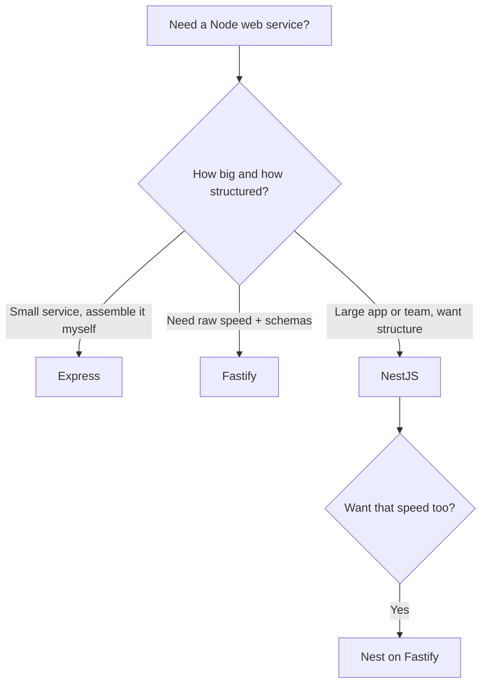

# Where to Go Next

Stop for a second and look at what you can actually do now. You can scaffold a Nest app with the CLI, write controllers that map HTTP to methods with route decorators, build `@Injectable()` providers that hold your logic and let the container hand them to you instead of `new`-ing them yourself, group everything into modules that import and export cleanly, validate request bodies with DTOs and the ValidationPipe, assemble a full CRUD resource as controller + service + DTOs, guard routes and shape the pipeline with interceptors and middleware, and test it all with Nest's DI-aware test module before shipping it to production. That's a structured, real REST API.

And here's the quieter win. Nest's decorators looked like magic in Phase 1, and now they don't. You can see the architecture underneath: **controllers handle HTTP, providers hold logic, dependency injection wires them, and modules group them.** Once that picture is in your head, a 200-file Nest codebase reads the same way a 5-file one does - same four roles, repeated. That's the whole point of an opinionated framework, and you now think in it.

This last phase isn't another resource - it's the map: where Nest sits among the other Node frameworks, the official ecosystem you'll add next, and one concrete thing to go build.

## NestJS vs the field

You learned [Express](/guides/express-from-zero) - or could've - and you've heard of [Fastify](/guides/fastify-from-zero). These tools aren't really fighting over the same spot. They're aimed at different sizes of problem and different tastes, and choosing on purpose beats choosing by reputation.



A line on each:

- **Express** - minimal and everywhere. A thin layer over `node:http` that gives you routing and the middleware chain, then leaves the rest to you. The biggest ecosystem and the most likely thing you'll meet in a Node job. See [Express From Zero](/guides/express-from-zero).
- **Fastify** - built for speed and built around *schemas*. You declare a JSON schema for a route, and Fastify uses it for both validation and fast serialization. See [Fastify From Zero](/guides/fastify-from-zero).
- **NestJS** - opinionated and TypeScript-first. Dependency injection, modules, controllers, decorators - the architecture you spent this guide learning. More to set up, more guardrails once you're moving. (You're here.)

> 💡 How to pick plainly: Nest shines for **large, team-built apps** where the structure earns its keep - when ten people touch the same codebase, having one obvious place for everything is worth a lot. For a tiny single-purpose service, that same structure can feel like overhead, and bare Express or Fastify will get you there with less ceremony. The senior instinct isn't crowning a winner - it's asking "best for *this* job?" and answering truthfully. You can do that now.

> 📝 You don't always have to choose between Nest's structure and Fastify's speed. **Nest runs on Express by default**, but swap in `@nestjs/platform-fastify` and the very same controllers, providers, and modules run on top of Fastify instead - you keep Nest's architecture and pick up Fastify's throughput. The framework and the underlying HTTP engine are two separate decisions.

## The ecosystem you'll reach for

Nest ships the architecture, and a constellation of official `@nestjs/*` packages slot into it cleanly. You won't need all of these on day one, but you'll recognize the shape of each.

- **A real database, via an ORM.** Every API in this guide stored tasks in memory - gone the moment you restart. The first thing most Nest apps grow is persistence, and the official integrations are **TypeORM** (`@nestjs/typeorm`), **Prisma**, and **Mongoose** (`@nestjs/mongoose`) for MongoDB. They all do the same core job: turn rows (or documents) into objects and back. Understand the concept before you pick one - [How an ORM Works](/guides/how-an-orm-works).
- **API docs, free from your decorators.** **`@nestjs/swagger`** reads the DTOs and decorators you already wrote and generates an OpenAPI spec - interactive docs that stay in sync with your code instead of drifting from it.
- **Config.** **`@nestjs/config`** loads environment variables into a typed, injectable config service, so secrets and settings stop being scattered `process.env` reads.
- **Auth.** Wire login through **Passport** (`@nestjs/passport`) and, for token APIs, JWT - each strategy plugs into the exact **guards** you met in Phase 7. The guard checks the request and either lets it through or rejects it.
- **GraphQL.** Prefer a graph to REST? **`@nestjs/graphql`** offers a **code-first** approach: you write resolver classes and decorated types, and Nest generates the schema. The concept first: [GraphQL Explained](/guides/graphql-explained).
- **Beyond HTTP.** Nest has built-in transports for **microservices** (services talking over TCP, Redis, NATS, message queues) and **WebSockets** (real-time, push-style connections) - the same controllers-and-providers model, different doorway in.

## What to build

Reading more won't make this stick. Building one real thing will. So here's the assignment, and it's deliberately concrete.

Take the **tasks API** you grew across this guide and carry it all the way home:

- **Swap the in-memory store for a real database** through TypeORM or Prisma so tasks survive a restart. Because your logic already lives in a service the controller injects, this mostly changes the bottom layer - the provider - not the controller on top. ([How an ORM Works](/guides/how-an-orm-works) explains the concept first.)
- **Add JWT auth** with `@nestjs/passport` and a guard from Phase 7, so each request proves who it is and tasks belong to a user.
- **Generate docs** with `@nestjs/swagger` from the DTOs you already wrote, and open the interactive page to see your own API described back to you.
- **Deploy it** somewhere you can hit from your phone, the way Phase 8 showed.

And if a future service is genuinely small - one endpoint, no team, no growth in sight - practice the clear-eyed call from earlier in this phase: weigh whether Nest's structure earns its overhead, or whether [Express](/guides/express-from-zero) or [Fastify](/guides/fastify-from-zero) is the lighter, better fit. Knowing when *not* to reach for Nest is as senior as knowing how to use it.

If the tasks API feels too familiar, build something small and new end to end - a **notes API** or a **URL shortener**. Same muscles: modules, a controller, a service, DTOs and validation, a guard, tests, deploy.

The clear-eyed close is the same idea you've held since Phase 0. Controllers handle HTTP, providers hold logic, dependency injection wires them, and modules group them - that's the architecture that scales past where bare Express sprawls, and it's the architecture you now build with by reflex. Go give the tasks API a database, lock it behind auth, document it, deploy it, and show someone. You're ready.

## Recap

1. **You can ship a structured Nest API** - controllers, DI'd providers, modules, DTO validation, full CRUD, guards and interceptors, tested and deployed - and you understand *why* each piece exists.
2. **The four roles are the whole model** - controllers handle HTTP, providers hold logic, DI wires them, modules group them. A huge Nest codebase is that pattern repeated.
3. **Choose a framework on purpose** - Nest for structure on a large app or team, Express for minimal and ubiquitous, Fastify for speed plus schema-driven validation. None is "best" in the abstract.
4. **Nest and its HTTP engine are separate choices** - run Nest on Express by default, or on Fastify via `@nestjs/platform-fastify` to keep the structure and gain the speed.
5. **The official ecosystem fills the gaps** - TypeORM/Prisma/Mongoose for persistence, `@nestjs/swagger` for docs, `@nestjs/config`, Passport + JWT for auth, `@nestjs/graphql` for GraphQL, and built-in microservice and WebSocket transports.
6. **Build and finish one thing** - carry the tasks API to a database, JWT auth, Swagger docs, and a deploy; or weigh Nest against a lighter framework when the service is small.

## Quick check

Three decisions to take with you as you leave this guide:

```quiz
[
  {
    "q": "You're building a large API with a team of ten, and you also want Fastify's throughput. What's the move?",
    "choices": [
      "Abandon Nest and rewrite everything in raw Fastify",
      "Use NestJS for structure and swap in @nestjs/platform-fastify so the same controllers and providers run on Fastify",
      "Use Express, since it's the most popular",
      "You can't have both structure and speed"
    ],
    "answer": 1,
    "explain": "The framework and the HTTP engine are separate choices. Nest runs on Express by default, but @nestjs/platform-fastify lets the very same controllers, providers, and modules run on Fastify - you keep Nest's architecture and gain Fastify's speed."
  },
  {
    "q": "You're adding a real database to the tasks API. Because your logic lives in a service the controller injects, what mostly changes?",
    "choices": [
      "Every controller must be rewritten from scratch",
      "Mainly the provider (service) swaps its in-memory store for an ORM like TypeORM or Prisma; the controller on top stays roughly the same",
      "You must switch from Nest to Express",
      "Nothing - Nest persists data automatically"
    ],
    "answer": 1,
    "explain": "Dependency injection kept the HTTP layer separate from where data lives. The controller still routes, validates, calls the service, and responds; you change the service's bottom layer from an in-memory object to an ORM plus a database."
  },
  {
    "q": "Which official package generates interactive API documentation from the DTOs and decorators you already wrote?",
    "choices": [
      "@nestjs/config",
      "@nestjs/passport",
      "@nestjs/swagger",
      "@nestjs/graphql"
    ],
    "answer": 2,
    "explain": "@nestjs/swagger reads your existing decorators and DTOs to produce an OpenAPI spec and interactive docs that stay in sync with the code. @nestjs/config handles env vars, @nestjs/passport handles auth, and @nestjs/graphql adds a GraphQL layer."
  }
]
```

---

[← Phase 8: Testing & Production](08-testing-and-production.md) · [Guide overview](_guide.md)
