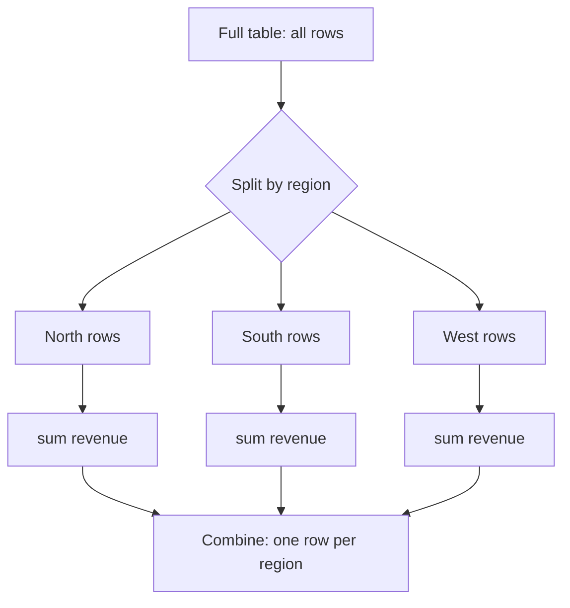

# GroupBy & Aggregation

If you take one idea from this whole guide, make it this one. Every phase so far has been about
*shaping* a table - selecting it, filtering it, deriving new columns. This phase is about
*summarizing* it: turning ten thousand rows of raw sales into "revenue per region," "average order
size per product," "how many orders each region placed." That move - collapse many rows into one number
per group - is the engine room of data analysis, and pandas has one beautiful pattern for it.

The pattern has a name worth memorizing because it explains *everything* that follows.

## Split-apply-combine: the mental model

📝 **Split-apply-combine** is the shape of nearly every summary you'll ever write. Three steps:

1. **Split** - break the rows into groups by some key (e.g. all the `North` rows together, all the
   `South` rows together).
2. **Apply** - run a function on each group independently (e.g. `sum` the revenue inside each group).
3. **Combine** - stitch the per-group results back into one new table, one row per group.



💡 If you've written SQL, you already know this in your bones: `SELECT region, SUM(revenue) FROM sales
GROUP BY region` is *exactly* split-apply-combine. `GROUP BY region` is the split, `SUM(revenue)` is
the apply, and the result set is the combine. (Same idea drives why GROUP BY can be slow on big tables
in SQL - see [Why Is My Query Slow?](/guides/why-is-my-query-slow).) pandas `groupby` is the same
pattern in Python, and once you see it that way it stops being three separate methods and becomes one
thought: *group, then aggregate.*

We'll keep working the running sales dataset, now with a few more rows so the groups have something to
chew on:

```python
import pandas as pd

sales = pd.DataFrame({
    "date":    ["2024-01-05", "2024-01-05", "2024-01-06", "2024-01-06", "2024-01-07", "2024-01-07"],
    "product": ["Widget", "Gadget", "Widget", "Gadget", "Widget", "Gadget"],
    "region":  ["North", "South", "North", "West", "South", "North"],
    "units":   [10, 4, 7, 12, 5, 8],
    "price":   [9.99, 19.99, 9.99, 19.99, 9.99, 19.99],
})
sales["revenue"] = sales["units"] * sales["price"]
```

## Basic groupby

The simplest summary: total revenue per region. You name the grouping key, pick the column you care
about, and call an aggregation:

```python
print(sales.groupby("region")["revenue"].sum())
```
```console
region
North    259.65
South    119.91
West     239.88
Name: revenue, dtype: float64
```

*What just happened:* `groupby("region")` did the **split** - it bucketed the rows by their `region`
value. `["revenue"]` picked the column to work on. `.sum()` was the **apply** (sum within each bucket),
and the returned Series is the **combine** - one row per region, the region values now sitting in the
index. Three steps, one line.

The aggregation on the end is interchangeable. Swap `.sum()` for whatever question you're asking:

```python
print(sales.groupby("region")["units"].mean())
print(sales.groupby("region")["revenue"].count())
print(sales.groupby("region").size())
```
```console
region
North    8.333333
South    4.500000
West    12.000000
Name: units, dtype: float64
region
North    3
South    2
West     1
Name: revenue, dtype: int64
region
North    3
South    2
West     1
dtype: int64
```

*What just happened:* `.mean()` averaged `units` inside each region, `.count()` tallied how many
non-null `revenue` rows each region had, and `.size()` counted rows per group regardless of any column.
(Subtle but real: `.count()` skips nulls in the chosen column; `.size()` counts every row in the group,
nulls included. When you just want "how many rows landed here," `.size()` is the accurate one.)

⚠️ One thing to internalize early: `sales.groupby("region")` *by itself* doesn't compute anything. It's
**lazy** - it hands you a `DataFrameGroupBy` object that's holding the split, waiting. Nothing runs until
you attach an aggregation. Print it and you'll see `<pandas...DataFrameGroupBy object at 0x...>`, not
data. The work happens at `.sum()`, `.mean()`, `.agg(...)` - the apply step.

## Grouping by multiple keys

Real questions are rarely one-dimensional. "Total units per region" is fine, but "total units per
region *and* product" is where analysis gets interesting. Pass a **list** of keys:

```python
print(sales.groupby(["region", "product"])["units"].sum())
```
```console
region  product
North   Gadget      8
        Widget     17
South   Gadget      4
        Widget      5
West    Gadget     12
Name: units, dtype: int64
```

*What just happened:* grouping by two keys split the rows into every observed `(region, product)`
combination, then summed `units` in each. The result has a **MultiIndex** (a hierarchical index): the
outer level is `region`, the inner is `product`. Notice North only shows the combos that actually
*exist* in the data - there's no `(West, Widget)` row because no such rows were in the table.

That MultiIndex is powerful but awkward to work with downstream - it's not plain columns. When you want
a normal flat table (every key back as its own column), call `.reset_index()`:

```python
result = sales.groupby(["region", "product"])["units"].sum().reset_index()
print(result)
```
```console
  region product  units
0  North  Gadget      8
1  North  Widget     17
2  South  Gadget      4
3  South  Widget      5
4   West  Gadget     12
```

*What just happened:* `.reset_index()` lifted `region` and `product` out of the index and back into
ordinary columns, giving you a tidy DataFrame with a clean 0-based index - the shape you want for
saving to CSV, merging, or plotting. Memorize the chain `groupby(...).agg(...).reset_index()`; you'll
type it constantly.

## Multiple and named aggregations with `agg`

So far each summary computed one statistic. But you usually want several at once - total revenue,
*and* average units, *and* order count, per region, in a single pass. That's the job of `.agg()`, and
the modern way to call it is **named aggregation**:

```python
summary = sales.groupby("region").agg(
    total_rev=("revenue", "sum"),
    avg_units=("units", "mean"),
    orders=("revenue", "count"),
)
print(summary)
```
```console
        total_rev  avg_units  orders
region
North      259.65   8.333333       3
South      119.91   4.500000       2
West       239.88  12.000000       1
```

*What just happened:* each keyword argument defines one output column: the name on the left
(`total_rev`), and a `(column, function)` tuple on the right saying *which column to aggregate* and
*how*. One `groupby`, three statistics, and - the real win - **clean, self-documenting column names**
you chose yourself. No cryptic `("revenue", "sum")` headers to rename afterward.

💡 Named aggregation (`agg(new_name=("col", "func"))`) is the clean, current way to do multi-stat
summaries. You'll see older code using `agg({"revenue": "sum", "units": "mean"})` (a dict) or
`agg(["sum", "mean"])` (a list, which produces a messy MultiIndex on the columns). Both still work, but
the named form reads better and gives you the column names up front - prefer it.

## Transform vs aggregate (and the pitfalls)

Here's a distinction that trips up almost everyone, and getting it straight is what separates fumbling
with groupby from wielding it.

📝 **`agg` collapses** each group to a single row - five North rows become one North number. The result
is *smaller* than the input. But sometimes you don't want to collapse; you want to *tag every original
row with a fact about its group* - for example, "what's this row's revenue compared to its region's
average?" For that you need a value **per original row**, not per group. That's **`transform`**.

```python
sales["region_avg_rev"] = sales.groupby("region")["revenue"].transform("mean")
sales["vs_region_avg"] = sales["revenue"] - sales["region_avg_rev"]
print(sales[["region", "revenue", "region_avg_rev", "vs_region_avg"]])
```
```console
  region  revenue  region_avg_rev  vs_region_avg
0  North    99.90          86.550         13.350
1  South    79.96          59.955         20.005
2  North    69.93          86.550        -16.620
3   West   239.88         239.880          0.000
4  South    49.95          59.955        -10.005
5  North   159.84          86.550         73.290
```

*What just happened:* `transform("mean")` computed each region's average revenue (the same numbers `agg`
would give), but then **broadcast that group value back onto every row in the group** - so all three
North rows got `86.55`. Because the result lines up row-for-row with the original DataFrame, you can
assign it straight back as a new column and do arithmetic against it (here, each order's distance from
its region's average). `agg` answers "what's the summary?"; `transform` answers "how does each row
compare to its group?"

Two pitfalls that bite people in production:

⚠️ **NaN keys vanish.** By default, rows whose *grouping key* is `NaN` are silently dropped from the
output - they're in no group. If a region is missing and you `groupby("region").sum()`, those rows just
disappear from the totals, no error, no warning. If you need them counted, pass `dropna=False`:
`sales.groupby("region", dropna=False)`. Always sanity-check your row counts after a groupby.

⚠️ **Index vs columns.** `groupby` puts the keys in the *index* by default, which is why you keep
reaching for `.reset_index()`. If you'd rather get plain columns straight from the call, pass
`as_index=False`: `sales.groupby("region", as_index=False)["revenue"].sum()` gives you `region` and
`revenue` as ordinary columns, no MultiIndex gymnastics needed. Pick whichever keeps your downstream
code simple.

💡 Step back and notice how much ground one method covers. "Summarize the data," "break it down by
category," "compare each row to its group," "get totals per X and Y" - those are most of the questions
anyone ever asks of a dataset, and they're all `groupby` + an aggregation. This isn't a corner of
pandas; it's the center of it. Master split-apply-combine and you've mastered the part of pandas that
does the actual analysis.

## Recap

1. **Split-apply-combine** is the pattern behind almost every summary: split rows into groups by a key,
   apply a function to each group, combine the results into a new table. It's exactly SQL's `GROUP BY`.
2. **Basic groupby:** `df.groupby("key")["col"].sum()` (also `.mean()`, `.count()`, `.size()`). The
   keys land in the index. `.count()` skips nulls; `.size()` counts every row.
3. **`groupby` alone is lazy** - it just holds the split. Nothing computes until you attach an
   aggregation.
4. **Multiple keys** (`groupby(["region", "product"])`) produce a hierarchical MultiIndex result;
   `.reset_index()` flattens it back to plain columns. Memorize `groupby(...).agg(...).reset_index()`.
5. **Named aggregation** - `agg(total_rev=("revenue", "sum"), avg_units=("units", "mean"))` - computes
   several stats in one pass with clean, self-chosen column names. It's the modern, preferred form.
6. **`agg` collapses to one row per group; `transform` returns a value per original row** (broadcast
   the group stat back onto each row, e.g. for comparisons). ⚠️ NaN grouping keys are dropped by default
   (`dropna=False` keeps them); use `as_index=False` to get columns instead of an index.

## Quick check

Make sure the one big idea stuck - and the agg-vs-transform line that everyone fumbles:

```quiz
[
  {
    "q": "What are the three steps of the split-apply-combine pattern, in order?",
    "choices": [
      "Sort the rows, filter them, then merge",
      "Split rows into groups by a key, apply a function to each group, combine the per-group results into one table",
      "Combine all rows, apply a filter, then split into a sample",
      "Select columns, rename them, then export"
    ],
    "answer": 1,
    "explain": "Split (group rows by a key) → apply (run a function on each group) → combine (stitch the per-group results into a new table). It's the same idea as SQL's GROUP BY."
  },
  {
    "q": "You write `sales.groupby(\"region\")` and print it. Why don't you see any totals?",
    "choices": [
      "groupby is lazy - it only holds the split; nothing computes until you attach an aggregation like .sum()",
      "You must call .show() to display a groupby",
      "The region column has nulls, so output is suppressed",
      "groupby only works inside a for-loop"
    ],
    "answer": 0,
    "explain": "groupby returns a DataFrameGroupBy object holding the split. The apply step (and any output) happens only when you call an aggregation such as .sum(), .mean(), or .agg(...)."
  },
  {
    "q": "You want to add a column showing each order's revenue minus its region's average revenue, keeping all original rows. Which tool?",
    "choices": [
      "groupby(\"region\")[\"revenue\"].agg(\"mean\") - agg gives a value per row",
      "groupby(\"region\")[\"revenue\"].transform(\"mean\") - transform broadcasts the group stat back to every original row",
      "groupby(\"region\")[\"revenue\"].sum().reset_index()",
      "sales[\"revenue\"].mean() applied to the whole table"
    ],
    "answer": 1,
    "explain": "transform returns a result aligned row-for-row with the original DataFrame (the group's mean broadcast onto every row in it), so you can assign it back and subtract. agg collapses each group to a single row, which won't line up with the original rows."
  }
]
```

---

[← Phase 5: Transforming Data](05-transforming-data.md) · [Guide overview](_guide.md) · [Phase 7: Joining & Combining →](07-joining-and-combining.md)