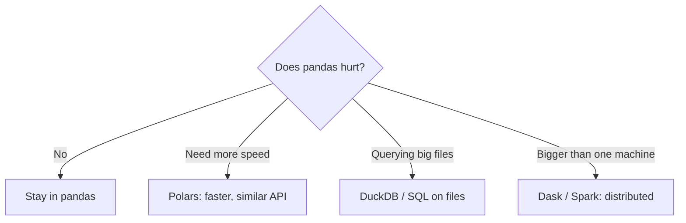

# Plotting & Where to Go Next

Stop for a second and look at what you can actually do now. You can take a raw, messy CSV of sales records and **load** it, **inspect** it to see what you've got, **select and filter** down to the rows that matter, **clean** the missing values and wrong types, **transform** it with new columns, **group and aggregate** it with the split-apply-combine pattern, **join** it against another dataset, parse and resample it over **time**, and **reshape** it between wide and long. That's not a warm-up. That is the core loop of practical data analysis — the same moves a working analyst makes every day, whatever the dataset.

And the whole thing rests on two ideas you've been carrying since Phase 1: a **DataFrame is a table you compute on**, and **almost everything is a column operation**. Hold those two and pandas stops being a grab-bag of methods.

So this last phase isn't a pile of new methods. It's turning your analysis into a picture, getting your results back out of pandas, an honest word about where pandas stops being the right tool, and a real project to point all of this at.

## Quick charts, right off the DataFrame

📝 Here's a thing people don't realize for too long: pandas can plot for you directly. It sits on top of **matplotlib**, and every DataFrame and Series has a `.plot()` method. You don't have to leave your analysis to see it.

The fastest path is one line. Say you've grouped monthly revenue into a Series indexed by month — a line chart is right there:

```python
import pandas as pd

# monthly_revenue is a Series: month -> total revenue
monthly_revenue.plot(kind="line", title="Revenue by month")
```

Want bars instead? Change one word, or use the shortcut form:

```python
# revenue per region, as a bar chart
revenue_by_region.plot.bar(title="Revenue by region")
```

And when you're plotting straight from a DataFrame with several columns, tell it which column is the x-axis and which is the y:

```python
# DataFrame with 'month' and 'revenue' columns
sales.plot(x="month", y="revenue", kind="line")
```

💡 These are **exploratory** charts — the kind you throw up to see the shape of your data while you're still working, not the kind you put in a board deck. That's exactly what they're for. The point is speed: a question, a `.plot()`, an answer, and you move on.

When you do need something prettier or interactive — for a report or a dashboard — reach for a dedicated plotting library. **seaborn** makes statistical charts that look polished with almost no fuss, and **plotly** gives you interactive charts you can hover and zoom. If you're heading toward dashboards specifically, [BI Dashboards That Work](/guides/bi-dashboards-that-work) is the guide that picks up where these quick charts leave off.

## Getting data back out

A chart is one kind of output. Often you want the *data* itself — cleaned, joined, summarized — handed off somewhere else. pandas reads from a lot of formats, and it writes to all the same ones. Every `read_*` has a matching `to_*`:

```python
df.to_csv("summary.csv", index=False)       # plain text, universal
df.to_excel("summary.xlsx", index=False)     # for the spreadsheet folks
df.to_parquet("summary.parquet")             # compact, typed, fast to reload
df.to_sql("sales_summary", engine)           # straight into a database table
```

This is one of the quietly useful things about pandas: it's the **bridge between systems**. Pull from a database, clean it up, write it to Excel for a colleague — or read three messy CSVs, stitch them together, and load the result into SQL. (`index=False` on the text formats keeps pandas from writing the row index as an extra column, which is usually what you want.)

## Performance, and when to leave pandas

💡 Remember the habit from Phase 5: **think in whole columns, not loops.** pandas operations are vectorized — they run over an entire column at once in fast, compiled code. A `for` loop over rows does the same work one Python step at a time, which can be hundreds of times slower. Ninety percent of "pandas is slow" turns out to be a loop that should have been a column operation. Reach for vectorized methods first, `apply` second, and a raw row loop almost never.

But honesty matters here, so: ⚠️ **pandas has real limits.** It's single-machine and it holds everything in **memory**. That's fine for the millions-of-rows datasets most people actually have. It stops being fine when your data is bigger than your RAM, or when even vectorized pandas isn't fast enough. At that point you don't write cleverer pandas — you pick a different tool:



*What this shows:* don't switch on a hunch. **Polars** is the easy next step — it's much faster and the API feels familiar. **DuckDB** lets you run SQL directly against CSV or Parquet files without loading them whole. **Dask** and **Spark** spread the work across many machines when one machine genuinely isn't enough.

The trap is reaching for the big-data hammer too early. Distributed tools add real complexity, and most problems never need them. ⚠️ Don't leave pandas until pandas actually hurts — and when it does, you'll know, because it'll either run out of memory or run out of patience.

## Where to go next — and what to build

You've got a foundation now, and it opens onto a few clear paths:

- **Data visualization.** Learn **seaborn** properly. Once charts come easily, you communicate findings, not just compute them.
- **Machine learning.** This is the big one, and it's closer than you think. The load → clean → transform pipeline you've been practicing *is* the data-prep stage of nearly every ML project — scikit-learn and PyTorch both take their input as the kind of clean, numeric table you now know how to build. [ML Basics for Data People](/guides/ml-basics-for-data-people) is the natural next guide.
- **Data engineering.** If moving and reshaping data at scale appeals to you, that path is wide open.

But reading isn't the thing that makes it stick. **Building is.** So here's the assignment: find a CSV you actually care about — your bank statement, your music listening history, a public dataset on something you're curious about — and run the **whole pipeline** end to end. Load it. Clean the mess. Group it to answer one specific question. Chart the answer. Then write up, in a couple of sentences, **one thing you learned** that you didn't know before. That single project exercises almost everything in this guide, and "I found this in my own data" is a very different feeling from finishing a tutorial.

When you want the canonical reference, the **official pandas documentation** is genuinely good — start with their "**10 minutes to pandas**" page, then keep the API docs open in a tab while you work. Nobody memorizes pandas; everybody looks things up.

And remember the through-line: none of this was magic. The DataFrame was a **table** all along — rows, columns, filters, group-bys, joins, the same shapes you already knew from spreadsheets and SQL. The difference now is that you can **compute on it fluently**, in code, on real data. Go find a CSV that matters to you, run it all the way through, and show someone what you found. You're ready.

## Recap

1. **You can run the full analysis loop** — load, inspect, filter, clean, transform, group, join, time-analyze, and reshape real data — and it all rests on "a DataFrame is a table you compute on, mostly with column operations."
2. **pandas plots for you** — `.plot(kind="line"/"bar")`, `series.plot.bar()`, and `df.plot(x=..., y=...)` give fast exploratory charts straight off the data; reach for seaborn or plotly when you need polished or interactive ones.
3. **Every `read_*` has a `to_*`** — `to_csv`, `to_excel`, `to_parquet`, `to_sql` — which makes pandas the bridge between files, spreadsheets, and databases.
4. **Vectorize, and know the ceiling** — think in whole columns instead of loops; but pandas is single-machine and memory-bound, so for data bigger than RAM or needing more speed, look to Polars, DuckDB, or Dask/Spark — and not before pandas actually hurts.
5. **Build one real thing** — take a CSV you care about through load → clean → group → chart and write up one finding; lean on the official docs and "10 minutes to pandas" as you go.

## Quick check

Test yourself on the decisions that matter most as you leave this guide:

```quiz
[
  {
    "q": "You're mid-analysis and want a fast look at monthly revenue as a line chart. What's the quickest path?",
    "choices": [
      "Export to Excel and chart it there",
      "Call .plot(kind=\"line\") directly on the Series or DataFrame",
      "Install plotly and build an interactive dashboard first",
      "Write a for loop to print each value"
    ],
    "answer": 1,
    "explain": "pandas sits on matplotlib, so every Series and DataFrame has .plot(). It's built for exactly this — fast exploratory charts without leaving your analysis. seaborn/plotly come in later for polished or interactive output."
  },
  {
    "q": "Your dataset is comfortably bigger than your machine's RAM and pandas keeps running out of memory. What's the honest move?",
    "choices": [
      "Rewrite your pandas code to be more clever",
      "Add more for loops to process it row by row",
      "Reach for a tool built for it — Polars for speed, DuckDB to query files, or Dask/Spark to distribute the work",
      "Drop most of the data so it fits"
    ],
    "answer": 2,
    "explain": "pandas is single-machine and memory-bound. When data is bigger than RAM, no amount of cleverer pandas fixes that — you switch tools. But don't reach for big-data tooling until pandas genuinely hurts."
  },
  {
    "q": "Why prefer a vectorized column operation over a Python for loop over rows?",
    "choices": [
      "Loops are not allowed in pandas",
      "Vectorized operations run over the whole column in fast compiled code, while a row loop does it one slow Python step at a time",
      "Loops always give wrong answers",
      "There is no real difference; it's just style"
    ],
    "answer": 1,
    "explain": "Vectorized operations work on entire columns at once in compiled code — often hundreds of times faster and clearer than a row-by-row Python loop. Most 'pandas is slow' complaints are really a loop that should have been a column operation."
  }
]
```

---

[← Phase 9: Reshaping & Pivoting](09-reshaping-and-pivoting.md) · [Guide overview](_guide.md)
