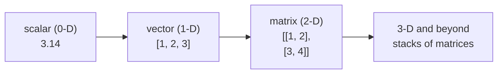

# What PyTorch Is & Tensors

If you've ever wondered what the big AI models are actually *built in* - the chatbots, the image
generators, the recommendation engines - the straight answer, most of the time, is PyTorch. It's the tool
researchers reach for the moment "teach a computer from data" enters the conversation. Before you train a
single model, there's one idea that makes the whole library fall into place. Get it, and PyTorch stops
being a wall of unfamiliar functions and starts feeling like something you already half-know.

That idea is the **tensor**. If you've touched NumPy or pandas, you already understand 90% of it - a tensor
is a grid of numbers you do math on. PyTorch adds two superpowers to that grid, and those two powers are
the entire reason deep learning uses tensors instead of plain Python lists. We'll build up to them slowly.

> 💡 PyTorch isn't available in this guide's in-browser runtime, so the code blocks here aren't runnable. To
> follow along for real, type these into a Jupyter notebook or a Python REPL where PyTorch is installed
> (`pip install torch`). Each example shows its output so you can check yourself either way.

## What PyTorch actually is

📝 **PyTorch** - an open-source deep-learning framework. It gives you three things: **tensors** (fast
multi-dimensional arrays), **automatic differentiation** (it can compute the math derivatives a model needs
to learn - more in Phase 3), and **neural-network building blocks** (ready-made layers and training tools).
And it runs all of that fast on **GPUs**.

If those words are fuzzy, that's fine - this is the toolkit machine learning is *done* in. When a team
trains a model to recognize images or generate text ([What AI & ML Are](/guides/what-ai-and-ml-are)),
PyTorch is very often what's underneath. It won the research world by being deeply **Pythonic**: tensors
behave like the arrays you already know, and code runs line by line so you can poke at it the way you'd poke
at any Python.

By near-universal convention, you import it as `torch`:

```python
import torch
```

*What just happened:* You pulled in the library under its real package name, `torch`. (The project is called
PyTorch, but the thing you `import` is `torch` - a quirk worth knowing so the import line doesn't confuse
you.) Every PyTorch tutorial and codebase writes `torch.something`; follow the convention.

⚠️ **One plain aside about TensorFlow.** PyTorch isn't the only major deep-learning framework - Google's
**TensorFlow** is the other big one, and you'll see it in plenty of production systems. Both can train the
same kinds of models. PyTorch dominates research and is widely considered the more Pythonic, friendlier
place to learn. You don't need both; learn one well, and the concepts carry over.

## The tensor - a grid of numbers

Everything in PyTorch is made of tensors. So let's pin down exactly what one is.

📝 **Tensor** - a multi-dimensional array of numbers, and PyTorch's fundamental data type. The number of
dimensions is its **rank**: a single number is a **scalar** (0-D), a list of numbers is a **vector** (1-D),
a grid is a **matrix** (2-D), and you can keep stacking into 3-D, 4-D, and beyond.

That's the same shape-family you've met before. A tensor is essentially NumPy's `ndarray`
([pandas From Zero](/guides/pandas-from-zero) is built on NumPy, so a pandas column is a close cousin too) - 
a typed, rectangular block of numbers. What makes it a *tensor* rather than just an array is the two
superpowers we keep teasing:

1. **It can live on a GPU.** Move it to graphics hardware and the same math runs hundreds of times faster
   (Phase 2).
2. **It can track gradients.** A tensor can record every operation done to it, so PyTorch can later work
   backward and figure out how to nudge a model's numbers to make it better - the engine of learning
   (Phase 3, **autograd**).

Hold those two in mind. For now, just think: *tensor = array of numbers, with a turbo button.*



## Creating tensors

There are a handful of ways to make a tensor, and you'll use all of them constantly. Start with the most
direct one - handing PyTorch a Python list:

```python
import torch

scalar = torch.tensor(3.14)
vector = torch.tensor([1, 2, 3])
matrix = torch.tensor([[1, 2], [3, 4]])

print(scalar)
print(vector)
print(matrix)
```
```console
tensor(3.1400)
tensor([1, 2, 3])
tensor([[1, 2],
        [3, 4]])
```

*What just happened:* `torch.tensor(...)` took ordinary Python numbers and lists and turned each into a
tensor. Notice the **rank** showing through in the brackets: `scalar` has none (it's a lone number),
`vector` has one level, and `matrix` has two - a list of lists becomes a 2-D grid. The repr always wraps the
values in `tensor(...)` so you can tell at a glance you're holding a PyTorch object, not a plain list.

Typing out values by hand only goes so far. Most real tensors start filled with a pattern - all zeros, all
ones, or random numbers - and you say *what shape* you want with a tuple of dimensions:

```python
import torch

zeros = torch.zeros(2, 3)        # a 2-row, 3-column grid of 0.0
ones  = torch.ones(2, 3)         # same shape, all 1.0
rand  = torch.randn(2, 3)        # same shape, random numbers
steps = torch.arange(0, 10, 2)   # like Python's range: start, stop, step

print(zeros)
print(rand)
print(steps)
```
```console
tensor([[0., 0., 0.],
        [0., 0., 0.]])
tensor([[ 0.4967, -0.1383,  0.6477],
        [ 1.5230, -0.2342, -0.2341]])
tensor([0, 2, 4, 6, 8])
```

*What just happened:* `torch.zeros(2, 3)` and `torch.ones(2, 3)` built 2×3 grids pre-filled with a constant
 - the workhorses for setting up a tensor of a known size before you fill it. `torch.randn(2, 3)` filled the
same shape with random values drawn from a normal distribution (your numbers will differ - that's the point
of random). `torch.arange(0, 10, 2)` mirrors Python's `range`, producing a 1-D tensor of evenly spaced
values. Random init like `randn` is how neural-network weights start life before training shapes them.

You can also convert straight from a NumPy array, which matters because so much of the data world speaks
NumPy:

```python
import torch
import numpy as np

arr = np.array([1.0, 2.0, 3.0])
t = torch.from_numpy(arr)
print(t)
```
```console
tensor([1., 2., 3.], dtype=torch.float64)
```

*What just happened:* `torch.from_numpy(arr)` wrapped an existing NumPy array as a tensor - no manual
copying of values. This is the bridge between the NumPy/pandas data-prep world and the PyTorch
model-training world: load and clean data with the tools you know, then hand it to PyTorch as tensors. (Note
the `dtype=torch.float64` it picked up from NumPy - more on dtype right now.)

## Tensor attributes - shape, dtype, device

Every tensor carries three pieces of metadata you'll check over and over. They're how you reason about what
you're holding, and - fair warning - how you'll diagnose most of your bugs.

```python
import torch

t = torch.randn(2, 3)
print(t.shape)    # how many in each dimension
print(t.dtype)    # what kind of number
print(t.device)   # where it lives (CPU or GPU)
```
```console
torch.Size([2, 3])
torch.float32
cpu
```

*What just happened:* `.shape` reported `[2, 3]` - two rows, three columns - the size along each dimension.
`.dtype` reported `torch.float32`, the kind of number stored (here, 32-bit floats). `.device` reported
`cpu`, meaning this tensor lives in regular memory, not on a GPU (Phase 2 covers moving it). Three
attributes, and together they tell you everything about *how* a tensor is laid out.

A word on each, because they pay rent:

- **`.shape`** - the single most important attribute. Deep-learning math is mostly about matching shapes:
  to multiply or add tensors, their dimensions have to line up. ⚠️ **The vast majority of bugs you'll hit in
  PyTorch are shape mismatches** - a tensor that's `[32, 10]` where the next step expected `[10, 32]`, or a
  stray extra dimension. When something breaks, your first move is almost always to print `.shape` and see
  what you've actually got. We'll lean on this hard in Phase 2.
- **`.dtype`** - the number type. `float32` is the default for anything a model learns, because gradient math
  needs decimals (you can't nudge a weight by 0.0001 if it's stored as an integer). Integer dtypes show up
  for things like labels and indices. Mixing dtypes that don't match is another classic source of errors.
- **`.device`** - `cpu` or something like `cuda:0` (a GPU). A tensor can only do math with other tensors on
  the *same* device, which is the whole subject of the next phase.

## Why tensors, not plain Python lists

You might reasonably ask: a list of lists already holds a grid of numbers - why invent a whole new type?
Here's the payoff, and it's the same trio of reasons every time.

💡 **Key point.** Tensors beat lists for deep learning on three counts, and you need all three:

1. **Vectorized math.** A tensor does arithmetic on the *whole grid at once*, in fast compiled code - 
   `a + b` adds every element in one sweep, no Python loop. This is the exact same "don't write a `for` loop
   over the rows" habit you'd use in NumPy or [pandas](/guides/pandas-from-zero); PyTorch rewards it just as
   much. Looping element-by-element in Python is slow and un-PyTorch-ish.
2. **GPU parallelism.** A GPU has thousands of tiny cores that do the same operation on different numbers
   simultaneously. Tensors can run on it; plain lists can't. For the huge matrix multiplies that models are
   made of, this is the difference between minutes and days.
3. **Gradients.** A tensor can remember the operations performed on it and let PyTorch compute derivatives
   automatically (autograd). That's literally how a model learns from its mistakes - and a Python list has no
   idea what was ever done to it.

That trio - vectorized, GPU-able, gradient-tracking - is the entire reason deep learning is built on
tensors. Vectorized math and the GPU are where we go next, in **Phase 2: Tensor Operations & the GPU**.
Gradients get their own spotlight in Phase 3.

## Recap

1. **PyTorch** (imported as `torch`) is an open-source deep-learning framework: tensors + automatic
   differentiation + neural-network building blocks, run fast on GPUs. It's what much of modern AI is built
   in, and it's the dominant, very Pythonic choice in research. **TensorFlow** is the other major framework.
2. A **tensor** is a multi-dimensional array of numbers - scalar (0-D), vector (1-D), matrix (2-D), and up.
   It's NumPy's array with two superpowers: it can live on a **GPU** and it can **track gradients**.
3. Create tensors with `torch.tensor([...])` from a list, `torch.zeros` / `torch.ones` / `torch.randn` from
   a shape, `torch.arange` like `range`, or `torch.from_numpy` from a NumPy array.
4. Every tensor has a **`.shape`** (size per dimension), a **`.dtype`** (number type - `float32` by default
   for learning), and a **`.device`** (CPU or GPU). ⚠️ Most PyTorch bugs are shape mismatches - print
   `.shape` first when things break.
5. Tensors beat plain Python lists for three reasons that all matter: **vectorized math** (whole-grid at
   once, no loops), **GPU parallelism**, and **gradient tracking** for learning.
6. The "think in whole arrays, not loops" habit from NumPy and pandas carries straight over - it's the core
   PyTorch instinct too.

## Quick check

Test yourself on the one idea this whole guide builds on - what a tensor is and why it's special:

```quiz
[
  {
    "q": "What is the best mental model for a PyTorch tensor?",
    "choices": [
      "A NumPy-style multi-dimensional array of numbers that can also run on a GPU and track gradients",
      "A special kind of Python for-loop optimized for numbers",
      "A file format PyTorch uses to save trained models to disk",
      "A function that automatically downloads pre-trained AI models"
    ],
    "answer": 0,
    "explain": "A tensor is a multi-dimensional array of numbers - like a NumPy array - with two extra superpowers: it can live on a GPU for fast parallel math, and it can track gradients so models can learn."
  },
  {
    "q": "You print `t.shape` and see `torch.Size([2, 3])`. What does that tell you?",
    "choices": [
      "The tensor has 2 rows and 3 columns - 2 along the first dimension, 3 along the second",
      "The tensor contains exactly the numbers 2 and 3",
      "The tensor uses 2.3 bytes of memory per value",
      "The tensor is stored on GPU number 23"
    ],
    "answer": 0,
    "explain": "`.shape` reports the size along each dimension. `[2, 3]` means a 2-D grid with 2 along the first axis (rows) and 3 along the second (columns). Matching shapes is most of what PyTorch math is about - which is why shape mismatches cause most bugs."
  },
  {
    "q": "Why does deep learning use tensors instead of plain Python lists?",
    "choices": [
      "Tensors do vectorized whole-array math, can run on GPUs, and can track gradients for learning - lists can do none of these",
      "Tensors take up less disk space than lists",
      "Python lists cannot store decimal numbers, only tensors can",
      "Tensors are the only way to print numbers to the console in Python"
    ],
    "answer": 0,
    "explain": "That trio is the whole reason: vectorized math (the whole grid at once, no loops), GPU parallelism for massive speed, and automatic gradient tracking so models can learn. A plain list offers none of these."
  }
]
```

---

[Guide overview](_guide.md) · [Phase 2: Tensor Operations & the GPU →](02-tensor-operations-and-gpu.md)
