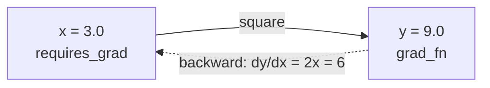

# Autograd: Automatic Differentiation

This is the phase where PyTorch stops looking like a fancy NumPy and starts looking like a machine that
*learns*. Everything in [Phase 2](02-tensor-operations-and-gpu.md) - elementwise math, matmul,
broadcasting - was you doing arithmetic. Autograd is PyTorch quietly watching that arithmetic and, on
request, working out the calculus of it for you. If you've ever wondered what "training" actually *does*
under the hood, this is the engine room.

## 1. Why gradients matter at all

📝 First, a quick refresher from [How a Model Learns](/guides/how-a-model-learns). A model is a big bundle
of adjustable numbers (its **parameters**, or weights). Training is a loop: the model makes a guess, you
measure how wrong it was (the **loss**), and then you nudge every parameter a tiny bit in the direction
that makes the loss smaller. Repeat millions of times and the guesses get good. That nudging process is
called **gradient descent**.

The word doing all the work there is *direction*. For each parameter, which way should it move - up or
down - to reduce the loss, and by how much? That answer is the **gradient**: the derivative of the loss
with respect to that parameter. A positive gradient means "increasing this parameter increases the loss,
so go the other way"; a large gradient means "this parameter has a big effect, take a bigger step."

Here's the problem. A real model has *millions* of parameters, all tangled together through layers of
matrix multiplies and non-linear functions. Computing the derivative of the loss with respect to every
single one of them, by hand, with the chain rule, is not hard - it's *impossible* at that scale. Nobody
does it. Instead:

💡 **Autograd does the calculus for you.** You write the forward math (the guess and the loss). PyTorch
figures out all the derivatives. That's the whole deal, and it's why PyTorch exists.

## 2. `requires_grad` - telling PyTorch to pay attention

📝 By default, a tensor is just data - PyTorch does the arithmetic and forgets how it got there. But set
`requires_grad=True` on a tensor and PyTorch flips into record mode: from then on, **every operation you
do with that tensor gets logged**, building up a behind-the-scenes map of the computation. That map is
what makes the calculus possible later.

```python
import torch

x = torch.tensor(3.0, requires_grad=True)
print(x)

y = x ** 2 + 1      # do some math with x
print(y)
```

```console
tensor(3., requires_grad=True)
tensor(10., grad_fn=<AddBackward0>)
```

*What just happened:* We created `x` with `requires_grad=True`, marking it as something we'll want
gradients for. When we computed `y = x ** 2 + 1`, PyTorch didn't just store the answer (`10.`) - look at
`y`'s printout: `grad_fn=<AddBackward0>`. That `grad_fn` is PyTorch's note-to-self: "this tensor was
produced by an addition, and here's how to differentiate back through it." Every operation downstream of a
`requires_grad` tensor carries one of these. That trail of `grad_fn`s *is* the recording.

⚠️ Only **floating-point** tensors can require gradients. Calculus needs continuous numbers - you can't
take the derivative with respect to an integer. `torch.tensor(3, requires_grad=True)` (note: no decimal
point) will raise an error. Use `3.0`.

## 3. `.backward()` and `.grad` - collecting the answers

So PyTorch has recorded the forward computation. Now you ask for the gradients.

📝 You call `.backward()` on the final scalar result (usually the loss). PyTorch walks the recorded graph
**backwards** - from the result, back through every operation, applying the chain rule at each step - and
deposits the gradient for each input tensor into its `.grad` attribute. One call, all the derivatives.

Let's verify it on something we can check by hand. We know from basic calculus that if `y = x²`, then
`dy/dx = 2x`. So at `x = 3`, the gradient should be `2 × 3 = 6`.

```python
x = torch.tensor(3.0, requires_grad=True)
y = x ** 2

y.backward()        # walk the graph backwards, compute dy/dx

print(x.grad)       # should be 2 * x = 6
```

```console
tensor(6.)
```

*What just happened:* `y.backward()` triggered the reverse pass. PyTorch knew (from the recorded `grad_fn`)
that `y` came from squaring `x`, applied the rule `d(x²)/dx = 2x`, plugged in `x = 3`, and stored the
result - `6.` - into `x.grad`. We never wrote the derivative ourselves; we only wrote the forward math
`x ** 2`. That number in `x.grad` is exactly what gradient descent needs to know which way to nudge `x`.

Here's the same computation as a picture. The forward pass (left to right) builds the graph; `.backward()`
runs the reverse pass (right to left), accumulating the gradient back to `x`:



💡 `.backward()` expects a **scalar** (a single number) by default - which is exactly what a loss is. If you
try to call it on a multi-element tensor, PyTorch won't know how to collapse those into one number to
differentiate and will ask you for guidance. In practice you almost always call it on a loss, so this
rarely bites you. If it does, the fix is usually `.mean()` or `.sum()` to reduce to a scalar first (you
saw reductions in [Phase 2](02-tensor-operations-and-gpu.md)).

## 4. The computation graph (and why it's *dynamic*)

That map PyTorch records has a name: the **computation graph**. The crucial thing about PyTorch's version - 
and the reason it feels so natural to write - is that it's built **dynamically, as your code runs.** This is
called **define-by-run**.

📝 There's no separate "define the model, then compile it" step. The graph is constructed on the fly, one
operation at a time, exactly as Python executes your lines. The graph for a given forward pass only exists
because you *ran* that forward pass.

This has a wonderful consequence: **ordinary Python control flow just works inside a model.** An `if` that
takes different branches depending on the data, a `for` loop whose length varies, a `while` - all fine.
Whatever path the code actually took, that's the graph that got recorded, so that's the graph `.backward()`
walks back through.

```python
def wobble(x):
    y = x * 2
    if y.sum() > 0:        # a real Python branch, decided at runtime
        y = y * 3
    else:
        y = y - 100
    return y.sum()

x = torch.tensor([1.0, 2.0], requires_grad=True)
loss = wobble(x)
loss.backward()
print(x.grad)
```

```console
tensor([6., 6.])
```

*What just happened:* The function ran like normal Python. `y.sum()` was positive, so the `if` branch
fired and `y` got multiplied by 3. The graph PyTorch recorded reflects the path actually taken:
`x → ×2 → ×3 → sum`. Differentiating that chain gives `2 × 3 = 6` for each element, which is what landed in
`x.grad`. With a different input that took the `else` branch, a *different* graph would have been built and
a different gradient computed. You didn't have to declare those branches to any framework in advance - you
just wrote Python.

💡 One more detail with big practical impact: **the graph is freed after `.backward()`.** Once the reverse
pass finishes, PyTorch throws the graph away to save memory (it assumes you're done with it). Call
`.backward()` a second time on the same graph and you'll get a "backward through the graph a second time"
error. That's by design - each training step builds a fresh graph from a fresh forward pass.

## 5. Turning autograd off, and the one gotcha that gets everyone

Recording every operation costs time and memory. When you're **not** training - say you're just running the
finished model to make predictions (**inference**) - you don't need gradients, and you should switch the
machinery off.

The tool is `torch.no_grad()`, a context manager that says "don't record anything inside this block":

```python
x = torch.tensor(3.0, requires_grad=True)

with torch.no_grad():
    y = x ** 2          # computed, but NOT recorded
print(y.requires_grad)  # the result is a plain tensor

with torch.no_grad():
    pass
print(x.requires_grad)  # x itself is unchanged
```

```console
False
True
```

*What just happened:* Inside the `torch.no_grad()` block, PyTorch did the math but skipped the bookkeeping - 
notice `y.requires_grad` is `False`, so `y` has no `grad_fn` and can't be backpropagated through. That's
faster and lighter, which is exactly what you want for inference. Outside the block, `x` is untouched and
still tracks gradients. You'll wrap your evaluation and prediction code in `with torch.no_grad():` as a
matter of habit.

There's also `.detach()`, which gives you a copy of a tensor that's cut loose from the graph - same numbers,
no history. Reach for it when you want to pull a value *out* of a computation to log it, store it, or feed
it somewhere that shouldn't backpropagate.

```python
x = torch.tensor(3.0, requires_grad=True)
y = x ** 2

clean = y.detach()      # same value, no graph attached
print(y.requires_grad, clean.requires_grad)
```

```console
True False
```

*What just happened:* `y` is still part of the graph (`requires_grad=True`), but `clean` is `y`'s value
snapped off from its history - a plain `tensor(9.)` you can use freely without dragging the whole graph
along. This is the safe way to say "I just want the number, not the calculus."

Now the big one. ⚠️ **Gradients accumulate.** When you call `.backward()`, PyTorch *adds* the new gradients
into `.grad` - it does not overwrite them. So if you compute backward twice without clearing in between, the
gradients pile up and your update is wrong.

```python
x = torch.tensor(3.0, requires_grad=True)

y = x ** 2
y.backward()
print(x.grad)           # 6, as expected

z = x ** 2
z.backward()
print(x.grad)           # NOT 6 -- it's 12, the two added together!
```

```console
tensor(6.)
tensor(12.)
```

*What just happened:* The first `backward()` put `6.` in `x.grad`. The second one computed another `6.` and
**added** it to what was already there, giving `12.`. PyTorch did exactly what it always does - accumulate - 
but if you expected each step to start clean, this is a silent, brutal bug: your model trains on garbage
gradients and you stare at a loss that won't go down.

💡 This is the **single most common training bug** in PyTorch, and the fix is one line you'll run at the top
of every training step: zero out the gradients before each backward pass. In a real loop that's
`optimizer.zero_grad()` (manually, it's `x.grad.zero_()`). We'll wire this into the full training loop in
[Phase 6](06-the-training-loop.md) - for now, just burn into memory: **gradients accumulate; you
must clear them every step.**

Step back and admire the deal you're getting: you write the forward math - the guess and the loss, in plain
Python - and autograd derives the entire backward pass for free. That division of labor is what the rest of
this guide is built on. Layers (Phase 4), optimizers (Phase 5), and the training loop (Phase 6) are all
just convenient ways to organize the forward math and let autograd handle the rest.

## Recap

- A model learns by **gradient descent**: nudge each parameter toward lower loss. The **gradient** is the
  derivative of the loss w.r.t. a parameter - it tells you which way and how far to nudge. At scale, no one
  computes these by hand; autograd does it.
- Set **`requires_grad=True`** (on float tensors) and PyTorch records every operation, attaching a
  `grad_fn` to each result - that trail is the **computation graph**.
- Call **`.backward()`** on the final scalar (the loss); PyTorch walks the graph in reverse with the chain
  rule and fills each input's **`.grad`**. Verified: `y = x²` gives `x.grad == 2x`.
- The graph is **define-by-run** - built dynamically as your code executes, so normal Python `if`/`for`
  control flow works inside models. It's freed after `.backward()`.
- Turn autograd off for inference with **`torch.no_grad()`**; use **`.detach()`** to pull a value out of the
  graph. ⚠️ Gradients **accumulate** in `.grad`, so you must **zero them every training step** - the #1
  PyTorch training bug.

## Quick check

```quiz
[
  {
    "q": "You create x = torch.tensor(2.0, requires_grad=True), compute y = x ** 3, then call y.backward(). What ends up in x.grad?",
    "choices": ["8.0, the value of y", "12.0, the derivative 3x² evaluated at x=2", "Nothing -- you must compute the gradient by hand", "2.0, the value of x"],
    "answer": 1,
    "explain": "backward() applies the chain rule: d(x³)/dx = 3x², and at x=2 that's 3·4 = 12. Autograd derives and stores the gradient in x.grad; you only wrote the forward math."
  },
  {
    "q": "Why does PyTorch's define-by-run computation graph let you use ordinary Python if/for control flow inside a model?",
    "choices": ["Because PyTorch compiles your whole model ahead of time and analyzes every branch", "Because the graph is built dynamically as the code runs, so it records exactly the path actually taken", "Because control flow is automatically converted to matrix operations", "It doesn't -- branches and loops are forbidden inside models"],
    "answer": 1,
    "explain": "The graph is constructed on the fly as Python executes. Whatever branch or loop iterations actually ran are what gets recorded, so backward() walks back through that exact path."
  },
  {
    "q": "You call loss.backward() twice in a row without clearing anything in between. What goes wrong?",
    "choices": ["Nothing -- the second call overwrites the first", "The gradients accumulate (add together), so .grad is now wrong -- you must zero gradients each step", "PyTorch automatically averages the two gradients for you", "The model trains twice as fast"],
    "answer": 1,
    "explain": "backward() ADDS into .grad rather than overwriting. Without zeroing gradients between steps they pile up and corrupt the update -- the most common PyTorch training bug. Fix: optimizer.zero_grad() (or x.grad.zero_()) each step."
  }
]
```

---

[← Phase 2: Tensor Operations & the GPU](02-tensor-operations-and-gpu.md) · [Guide overview](_guide.md) · [Phase 4: Building Models with nn.Module →](04-building-models-with-nn-module.md)