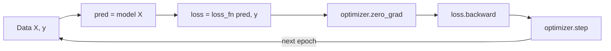

# The Training Loop

You've now met all the pieces. In [Phase 4](04-building-models-with-nn-module.md) you built a model
that turns inputs into predictions. In [Phase 5](05-loss-and-optimizers.md) you got a **loss function**
that measures how wrong those predictions are, and an **optimizer** that knows how to adjust the model's
weights. This phase is where those pieces start moving - the ritual that actually trains a model, and it
never really changes, from a three-line toy to a giant language model.

So let's get the mental model dead clear before a single line of code, because this is THE thing to
internalize about PyTorch.

## 1. The mental model: a loop you write yourself

📝 Training is one short cycle, repeated thousands of times:

1. **Show the model some data** → it makes predictions (the *forward pass*).
2. **Measure how wrong it was** → the loss, one number.
3. **Compute which way to nudge each weight** to make the loss smaller → the *backward pass*.
4. **Take a small step** in that direction → the optimizer updates the weights.

Then do it again. And again. Each pass, the model is a little less wrong than the last. That slow,
patient nudging *is* learning - it's the gradient descent from
[How a Model Learns](/guides/how-a-model-learns), now made concrete in code.

Here's the part that surprises people coming from other libraries: **PyTorch has no `model.fit()`.**
There's no magic "train this for me" button. *You* write the loop. That sounds like more work, and the
first time it's a little intimidating - but it's a gift. Nothing is hidden. You can see and change every
step, which is exactly why researchers reach for PyTorch. And the loop is short and always the same shape,
so once you've written it once, you've written it forever.



That diagram is the whole phase. Everything below is just making each box concrete.

## 2. The canonical loop

Here it is - the most important code in this entire guide. Read it slowly. We'll dissect every line
afterward, but first take in the *shape* of it: setup, then a loop that repeats five steps.

```python
import torch
import torch.nn as nn

# Some toy data: learn y = 2x. X is (4, 1), y is (4, 1).
X = torch.tensor([[1.0], [2.0], [3.0], [4.0]])
y = torch.tensor([[2.0], [4.0], [6.0], [8.0]])

model = nn.Linear(1, 1)                              # one input, one output
loss_fn = nn.MSELoss()                               # mean squared error
optimizer = torch.optim.SGD(model.parameters(), lr=0.01)

for epoch in range(100):                             # repeat the ritual 100 times
    pred = model(X)                                  # 1. forward: predictions
    loss = loss_fn(pred, y)                          # 2. measure wrongness

    optimizer.zero_grad()                            # 3. clear old gradients
    loss.backward()                                  # 4. backward: compute gradients
    optimizer.step()                                 # 5. nudge the weights

    if epoch % 20 == 0:
        print(f"epoch {epoch:3d} | loss {loss.item():.4f}")
```

```console
epoch   0 | loss 28.4631
epoch  20 | loss 0.6118
epoch  40 | loss 0.1370
epoch  60 | loss 0.0312
epoch  80 | loss 0.0072
```

*What just happened:* The setup ran once - a model, a loss function, an optimizer wired to the model's
parameters. Then the loop ran 100 times, and each pass did the same five steps: predict, measure loss,
clear gradients, compute new gradients, step. The thing to *feel* is the loss column: it starts at 28.46
(the untrained model is very wrong) and falls toward zero. That falling number is the model learning
`y = 2x`. Nothing here is special to this toy - swap in a deep network and a real dataset and the loop
body is identical.

💡 Notice `loss.item()` in the print. `loss` is a tensor (a zero-dim one, from
[Phase 2](02-tensor-operations-and-gpu.md)); `.item()` pulls out the plain Python number for printing.
Get in the habit - logging the raw tensor every step also quietly holds onto its computation graph and
wastes memory.

## 3. Epochs and batches

Two words you'll see everywhere, and they're simpler than they sound.

📝 An **epoch** is one full pass over your entire dataset. The loop above ran 100 epochs - it showed the
model all four examples, 100 times over. More epochs means more chances to learn (up to a point - past
that, the model starts memorizing instead of learning, which is [overfitting](/guides/how-a-model-learns)).

📝 A **batch** is a chunk of the data processed together in one forward/backward pass. In the toy loop
we fed all four examples at once, so the whole dataset *was* one batch. Real datasets are far too big for
that, so each epoch is split into many batches, and you loop over them *inside* the epoch:

```python
for epoch in range(num_epochs):
    for X_batch, y_batch in data_loader:            # inner loop: one batch at a time
        pred = model(X_batch)
        loss = loss_fn(pred, y_batch)

        optimizer.zero_grad()
        loss.backward()
        optimizer.step()
```

*What just happened:* The five steps didn't change at all - they just moved one level deeper, inside an
inner loop over batches. Each `X_batch` is a slice of the data; one trip through the inner loop is one
weight update. One trip through the *outer* loop is one epoch (every batch seen once). That `data_loader`
is the piece we haven't built yet - it's the [Dataset & DataLoader](07-datasets-and-dataloaders.md) of
Phase 7, which hands you batches automatically.

Why bother with batches instead of the whole dataset at once? Two reasons. **Memory:** a million images
won't fit on your GPU all at once, but a batch of 64 will. **Better learning:** updating the weights
after every small batch - rather than once per full pass - gives many more, slightly-noisy steps, and that
noise actually helps the model find better solutions. So batching isn't a compromise; it's how modern
training is *supposed* to work.

## 4. Order matters - the #1 beginner bug

Look back at the three middle lines:

```python
optimizer.zero_grad()    # 3. clear old gradients
loss.backward()          # 4. compute new gradients
optimizer.step()         # 5. apply them
```

⚠️ **That order is not optional.** `zero_grad` → `backward` → `step`, every single time. Getting it wrong
is the most common way a beginner's training silently breaks. Let's spell out exactly what each line does
and what happens without it.

- **`loss.backward()`** runs the backward pass from [Phase 3](03-autograd.md). It walks the computation
  graph and computes, for every weight, the gradient - the direction that would make the loss bigger.
  After this line, each parameter has its `.grad` filled in. **Without it,** there are no gradients at
  all, so the next line has nothing to act on and the model never changes.

- **`optimizer.step()`** uses those `.grad` values to nudge each weight a small amount in the
  loss-reducing direction. This is the actual learning. **Without it,** you compute perfect gradients and
  then ignore them - the model stays frozen.

- **`optimizer.zero_grad()`** is the one beginners forget, and it's the subtle one. Here's the trap: in
  PyTorch, `backward()` *adds* the new gradients to whatever is already in `.grad` - it **accumulates**,
  it doesn't overwrite (this is the gradient-accumulation behavior from [Phase 3](03-autograd.md)). So if
  you don't reset to zero before each `backward()`, this step's gradients pile on top of last step's, and
  last step's, and so on. Your weight updates get computed from a stale, ever-growing sum of gradients,
  the steps go haywire, and training quietly falls apart - no error, just a loss that refuses to fall or
  explodes. **Without `zero_grad()`,** the loop runs fine and the result is garbage, which is the worst
  kind of bug.

Here's what forgetting it looks like:

```python
# BROKEN: no optimizer.zero_grad()
for epoch in range(100):
    pred = model(X)
    loss = loss_fn(pred, y)
    loss.backward()          # gradients ACCUMULATE across every epoch
    optimizer.step()
```

```console
epoch   0 | loss 28.4631
epoch  20 | loss 1453.8079
epoch  40 | loss 98211.4453
epoch  60 | loss nan
epoch  80 | loss nan
```

*What just happened:* With no `zero_grad()`, each `backward()` added its gradients to the leftover pile
from all previous epochs. The "step" the optimizer took kept growing, overshooting wildly, until the
numbers blew up to `nan` (not-a-number). Same model, same data, same learning rate as the working loop in
section 2 - the *only* difference is the missing reset line. That's how much one line matters. When your
loss explodes to `nan`, "did I forget `zero_grad()`?" should be your first thought.

💡 The order is a tiny story: **clear the slate (`zero_grad`), figure out which way to go
(`backward`), take the step (`step`).** Say it that way once and you'll never reorder it.

## 5. Tracking progress, and train vs. eval

The loss printout isn't decoration - it's your only window into whether training is working. **A healthy
run shows the loss falling** and roughly leveling off. If it *doesn't* fall, something is wrong, and it's
almost always one of three things: the learning rate is off (too high → it explodes; too low → it barely
moves - see [Phase 5](05-loss-and-optimizers.md)), there's a bug in the loop (often the `zero_grad` one),
or the data is bad. Print the loss every epoch from day one; it's the cheapest diagnostic you have.

There's also a part of training the toy loop skipped: checking how the model does on data it *didn't*
train on. A model that aces its training data but flops on new data hasn't learned - it's memorized
([overfitting](/guides/how-a-model-learns) again). So you hold out some data and evaluate on it. Two
PyTorch habits make that correct:

📝 **`model.train()` and `model.eval()`** flip the model between two modes. Some layers behave
differently while training versus while being evaluated (dropout, batch-norm - you'll meet them later),
so you tell the model which phase it's in. Call `model.train()` before the training loop and
`model.eval()` before you evaluate.

📝 **`torch.no_grad()`** wraps your evaluation code so PyTorch *doesn't* build the computation graph or
track gradients. You're only measuring here, not learning - there's nothing to update - so skipping the
gradient bookkeeping makes evaluation faster and lighter.

```python
model.train()                              # training mode
for epoch in range(num_epochs):
    for X_batch, y_batch in train_loader:
        pred = model(X_batch)
        loss = loss_fn(pred, y_batch)
        optimizer.zero_grad()
        loss.backward()
        optimizer.step()

model.eval()                               # evaluation mode
with torch.no_grad():                      # no gradients needed -- just measuring
    for X_batch, y_batch in test_loader:
        pred = model(X_batch)
        # ... compute accuracy or test loss on held-out data ...
```

*What just happened:* The training loop is exactly the five-step ritual you already know, bracketed by
`model.train()`. Then `model.eval()` switches modes, and `torch.no_grad()` turns off gradient tracking
for the measurement pass over held-out test data - no `backward()`, no `step()`, because we're judging
the model, not training it. This train-then-evaluate shape is the skeleton of the real classifier you'll
build in [Phase 8](08-training-a-classifier.md).

💡 Here's the payoff to sit with: **every model is trained by a scaled-up version of this exact loop.**
The image recognizers, the recommendation engines, the giant LLMs behind the chatbots you use - under the
hood, they all run forward → loss → `zero_grad` → backward → step, over and over, across mountains of
data and hardware. The scale is staggering; the ritual is the one you just learned. Master these five
lines and you understand how all of deep learning actually trains.

## Recap

- **Training is a loop you write yourself** - PyTorch has no `model.fit()`. The body is always the same
  five steps: forward → loss → `zero_grad` → `backward` → `step`, repeated many times.
- **An epoch** is one full pass over the data; **a batch** is a chunk processed in one step. Real
  training loops over batches inside each epoch - for memory and for better, noisier learning.
- **Order is non-negotiable:** `optimizer.zero_grad()` → `loss.backward()` → `optimizer.step()`.
  Forgetting `zero_grad()` lets gradients accumulate across steps and silently wrecks training (loss
  explodes to `nan`).
- **Watch the loss fall** - it's your main diagnostic. If it doesn't drop, suspect the learning rate, a
  loop bug, or the data.
- **`model.train()` vs. `model.eval()`** sets the model's mode; evaluate held-out data under
  `torch.no_grad()` since you're measuring, not learning.
- **Every model - up to giant LLMs - trains with a scaled-up version of this exact loop.**

## Quick check

```quiz
[
  {
    "q": "What is the correct order of the three middle steps in a PyTorch training loop?",
    "choices": ["loss.backward() → optimizer.zero_grad() → optimizer.step()", "optimizer.zero_grad() → loss.backward() → optimizer.step()", "optimizer.step() → loss.backward() → optimizer.zero_grad()"],
    "answer": 1,
    "explain": "Clear the slate (zero_grad), compute which way to go (backward), then take the step (step). Any other order breaks training."
  },
  {
    "q": "You remove optimizer.zero_grad() from your loop. What's the most likely result?",
    "choices": ["A clear RuntimeError that stops the program immediately", "Nothing changes - zero_grad() is optional cleanup", "The loss climbs or explodes to nan, because gradients accumulate across steps"],
    "answer": 2,
    "explain": "backward() ADDS to .grad rather than overwriting it. Without zero_grad(), gradients pile up every step, the updates overshoot, and the loss blows up - usually with no error at all."
  },
  {
    "q": "Why wrap evaluation code in `with torch.no_grad()`?",
    "choices": ["You're only measuring, not learning, so there's no need to track gradients - it saves memory and time", "It makes the model more accurate on the test set", "It is required or backward() will throw an error"],
    "answer": 0,
    "explain": "During evaluation there's nothing to update, so building the computation graph is wasted work. no_grad() skips gradient tracking, making the pass faster and lighter."
  }
]
```

---

[← Phase 5: Loss Functions & Optimizers](05-loss-and-optimizers.md) · [Guide overview](_guide.md) · [Phase 7: Data: Dataset & DataLoader →](07-datasets-and-dataloaders.md)
