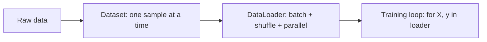

# Data: Dataset & DataLoader

In [Phase 6](06-the-training-loop.md) you wrote the loop that trains every model — and right in the
middle of it there was a line we waved at and moved past:

```python
for X_batch, y_batch in data_loader:
    ...
```

That `data_loader` is the missing piece. The loop *consumes* batches; something has to *produce* them.
This phase is that something. Before any code, let's get the mental model clear, because it's two ideas
and a clean division of labor.

## 1. The mental model: two jobs, two objects

📝 Feeding a model isn't "pass in the data." Real training needs the data delivered in **batches** (a
handful of samples at a time, for the memory and learning reasons from
[Phase 6](06-the-training-loop.md)), **shuffled** fresh each epoch (so the model doesn't learn the order
instead of the pattern), and delivered **fast** (so your expensive GPU isn't sitting idle waiting for the
next batch).

You could hand-roll all of that — slice arrays, track indices, reshuffle every epoch, maybe spin up
threads to load ahead. It's fiddly, repetitive, and exactly the kind of code that hides off-by-one bugs.
So PyTorch splits the work into two objects, each with one job:

- **`Dataset`** — knows how to get *one* sample. "Give me item 37" → returns the features and label for
  example 37. That's its entire responsibility.
- **`DataLoader`** — wraps a `Dataset` and handles everything *around* the samples: grouping them into
  batches, shuffling the order, loading in parallel, handing you batch after batch in a `for` loop.

💡 The one-line version to keep in your head: **Dataset = "how to get one item." DataLoader = "batch them,
shuffle them, feed them fast."** Get that split and the rest of this phase is just syntax.



## 2. The Dataset — how to get one sample

📝 A `Dataset` is a class with exactly two methods you must implement:

- **`__len__(self)`** — returns how many samples there are.
- **`__getitem__(self, i)`** — returns sample `i`, as tensors (typically a `(features, label)` pair).

That's the whole contract. If your class can answer "how many?" and "give me number `i`," PyTorch knows
how to use it. Here's a small custom Dataset wrapping two arrays — features and labels:

```python
import torch
from torch.utils.data import Dataset

class PointsDataset(Dataset):
    def __init__(self, features, labels):
        # store the raw data as tensors
        self.features = torch.tensor(features, dtype=torch.float32)
        self.labels = torch.tensor(labels, dtype=torch.float32)

    def __len__(self):
        return len(self.features)            # how many samples

    def __getitem__(self, i):
        return self.features[i], self.labels[i]   # one (X, y) pair

ds = PointsDataset([[1.0], [2.0], [3.0], [4.0]], [2.0, 4.0, 6.0, 8.0])
print(len(ds))        # uses __len__
print(ds[0])          # uses __getitem__
```

```console
4
(tensor([1.]), tensor(2.))
```

*What just happened:* You defined a class that subclasses `Dataset` and filled in the two required
methods. `len(ds)` quietly called your `__len__` and got back 4; `ds[0]` quietly called your
`__getitem__(0)` and got back the first feature/label pair as tensors. Notice you *never call these
methods by name* — Python's `len()` and `[]` syntax route to them, and (next section) the DataLoader will
call `__getitem__` for you, over and over, to assemble batches. This tiny class is the standard way to
wrap *any* data source: arrays in memory, rows in a CSV, image files on disk. The body of `__getitem__`
changes; the shape of the class doesn't.

💡 For the common case of "I already have my data as tensors," you don't even need a custom class.
`TensorDataset` does the wrapping for you:

```python
from torch.utils.data import TensorDataset

X = torch.tensor([[1.0], [2.0], [3.0], [4.0]])
y = torch.tensor([[2.0], [4.0], [6.0], [8.0]])

ds = TensorDataset(X, y)
print(len(ds))
print(ds[0])
```

```console
4
(tensor([1.]), tensor([2.]))
```

*What just happened:* `TensorDataset(X, y)` built a ready-made Dataset out of two tensors — same `__len__`
and `__getitem__` behavior as the class above, zero boilerplate. Reach for `TensorDataset` when your data
already fits in memory as tensors; write a custom `Dataset` when fetching a sample takes real work (read a
file, decode an image, look up a row).

## 3. The DataLoader — batch, shuffle, feed

📝 A `DataLoader` takes a `Dataset` and turns it into something you iterate over to get **batches**. The
two arguments you'll set constantly:

- **`batch_size`** — how many samples per batch.
- **`shuffle`** — whether to reorder the samples each epoch.

You hand it a Dataset, then loop:

```python
from torch.utils.data import DataLoader

loader = DataLoader(ds, batch_size=2, shuffle=True)

for X_batch, y_batch in loader:
    print(X_batch.shape, y_batch.shape)
    print(X_batch)
```

```console
torch.Size([2, 1]) torch.Size([2, 1])
tensor([[3.],
        [1.]])
torch.Size([2, 1]) torch.Size([2, 1])
tensor([[4.],
        [2.]])
```

*What just happened:* The DataLoader called the Dataset's `__getitem__` behind the scenes, **stacked** the
individual samples into batches of 2, and handed them to you one batch at a time. Look at the shapes: each
sample was `(1,)`, and the loader added a **batch dimension** in front, giving `(2, 1)` — two samples,
one feature each. Four samples at `batch_size=2` means two batches, which is exactly what the loop
printed. And because `shuffle=True`, the rows came out reordered (`3, 1` then `4, 2`, not `1, 2, 3, 4`) —
a *different* order next epoch. That batch dimension is why your model from
[Phase 4](04-building-models-with-nn-module.md) always expects a leading batch axis: the DataLoader is
where it comes from.

💡 **`shuffle=True` for training, `shuffle=False` for evaluation.** Shuffling during training breaks any
order bias in your data (imagine a file sorted by label — without shuffling, the model would see all the
0s, then all the 1s, and learn the order rather than the content). During evaluation there's nothing to
learn, so shuffling buys you nothing — leave it off so results are reproducible.

## 4. The real training loop

Now put it together. Here is the Phase 6 ritual — unchanged in its five steps — but fed by a DataLoader
instead of a single hand-built batch. *This* is what real training actually looks like:

```python
import torch.nn as nn

train_loader = DataLoader(ds, batch_size=2, shuffle=True)

model = nn.Linear(1, 1)
loss_fn = nn.MSELoss()
optimizer = torch.optim.SGD(model.parameters(), lr=0.01)

model.train()
for epoch in range(100):                         # outer loop: epochs
    for X_batch, y_batch in train_loader:        # inner loop: batches
        pred = model(X_batch)                     # 1. forward
        loss = loss_fn(pred, y_batch)             # 2. measure
        optimizer.zero_grad()                     # 3. clear gradients
        loss.backward()                           # 4. backward
        optimizer.step()                          # 5. step

    if epoch % 20 == 0:
        print(f"epoch {epoch:3d} | loss {loss.item():.4f}")
```

```console
epoch   0 | loss 11.9032
epoch  20 | loss 0.2451
epoch  40 | loss 0.0517
epoch  60 | loss 0.0109
epoch  80 | loss 0.0023
```

*What just happened:* The five-step body is *byte-for-byte the same* as Phase 6 — forward, loss,
`zero_grad`, `backward`, `step`. The only structural change is the **inner loop**: instead of feeding the
whole dataset once per epoch, you now loop over `train_loader` and take one optimizer step *per batch*. So
one epoch is now several weight updates (one per batch), not one — which is precisely the "many small,
slightly-noisy steps" that Phase 6 said helps the model learn. The loss still falls toward zero; the model
still learns `y = 2x`. You've just swapped the hand-fed batch for the real machinery. This exact
two-level loop — epochs outside, batches inside — is the skeleton of the classifier in
[Phase 8](08-training-a-classifier.md).

## 5. Transforms and performance

Two more pieces you'll meet constantly in real code.

📝 **Transforms** preprocess each sample as it's fetched — normalize numbers into a sensible range, or for
images, resize, crop, convert to a tensor, and (during training) randomly flip or rotate to make the data
more varied. Transforms are usually handed to the Dataset, which applies them inside `__getitem__` so
every sample comes out ready to use:

```python
from torchvision import datasets, transforms

transform = transforms.Compose([
    transforms.ToTensor(),                          # image -> tensor, scaled to [0, 1]
    transforms.Normalize((0.5,), (0.5,)),           # shift to roughly [-1, 1]
])

train_ds = datasets.MNIST(root="data", train=True, download=True, transform=transform)
train_loader = DataLoader(train_ds, batch_size=64, shuffle=True)
```

*What just happened:* `transforms.Compose` chained two preprocessing steps into one pipeline, and you
passed it to the Dataset via `transform=`. Now every time the DataLoader pulls a sample, the Dataset
applies that pipeline first — the raw image becomes a normalized tensor automatically, before it ever
reaches your model. (This is `torchvision`, PyTorch's companion library for image data; `datasets.MNIST`
is a ready-made Dataset of handwritten digits — the exact one you'll train on in Phase 8.) You write the
preprocessing once, declaratively, and it runs on every sample for free.

📝 Two DataLoader arguments tune *speed*:

- **`num_workers`** — how many background processes load and preprocess data in parallel. With
  `num_workers=0` (the default), loading happens in your main process, blocking everything else. Bumping
  it to, say, 4 lets the loader prepare upcoming batches while the GPU is busy with the current one.
- **`pin_memory=True`** — speeds up the copy of each batch from CPU to GPU. Worth turning on when you
  train on a GPU.

```python
train_loader = DataLoader(
    train_ds, batch_size=64, shuffle=True,
    num_workers=4, pin_memory=True,
)
```

*What just happened:* Same loader, now with parallel loading and faster GPU transfers. Functionally
identical — same batches, same order behavior — but the data pipeline can keep ahead of the model instead
of making it wait.

⚠️ **A slow data pipeline starves the GPU.** This is one of the most common real-world performance traps:
your GPU can crunch a batch in milliseconds, but if loading and preprocessing the *next* batch is slow
(reading thousands of files, heavy transforms, `num_workers=0`), the GPU finishes and then sits idle,
waiting. You bought a fast engine and feed it through a straw. When training feels mysteriously slow even
though the model is small, the culprit is usually the data pipeline, not the math — check `num_workers`
first.

💡 Step back and see the shape of it: **Dataset** says how to get one item, **transforms** make that item
model-ready, and **DataLoader** batches, shuffles, and feeds it fast enough to keep the GPU busy. That's
the entire input side of training — and it's the last piece you needed. In [Phase 8](08-training-a-classifier.md)
you'll wire all of it — real data, real transforms, a real loop — into a working image classifier.

## Recap

- **Two objects, two jobs.** `Dataset` knows how to fetch *one* sample; `DataLoader` batches, shuffles,
  and parallel-loads them. The training loop just consumes the batches the DataLoader produces.
- **A `Dataset`** implements `__len__` (how many) and `__getitem__(i)` (return sample `i` as tensors).
  For data that's already tensors, `TensorDataset(X, y)` skips the boilerplate.
- **A `DataLoader`** wraps a Dataset: `DataLoader(ds, batch_size=32, shuffle=True)`. Iterate it to get
  batches; it adds the leading **batch dimension** your model expects. Use `shuffle=True` for training,
  `False` for evaluation.
- **The real loop** is the Phase 6 five-step ritual with an inner loop over the DataLoader — one optimizer
  step per batch, epochs on the outside.
- **Transforms** preprocess each sample (normalize, augment) and are passed to the Dataset.
  `num_workers` and `pin_memory` make loading fast.
- ⚠️ **A slow data pipeline starves the GPU** — it finishes a batch and idles waiting for the next. When
  training is mysteriously slow, suspect the data side first.

## Quick check

Make sure the division of labor and the loop shape stuck:

```quiz
[
  {
    "q": "What is each object's job?",
    "choices": ["Dataset batches and shuffles; DataLoader fetches one sample", "Dataset knows how to get one sample; DataLoader batches, shuffles, and parallel-loads them", "Both do the same thing; DataLoader is just a faster Dataset"],
    "answer": 1,
    "explain": "Dataset = 'how to get one item' (__len__ + __getitem__). DataLoader wraps it and handles everything around the samples: batching, shuffling, and parallel loading."
  },
  {
    "q": "Which two methods must a custom Dataset implement?",
    "choices": ["__init__ and forward", "__batch__ and __shuffle__", "__len__ and __getitem__"],
    "answer": 2,
    "explain": "__len__ returns how many samples there are; __getitem__(i) returns sample i as tensors. PyTorch calls __getitem__ repeatedly to assemble batches."
  },
  {
    "q": "Your tiny model trains far slower than expected and the GPU usage is mostly idle. What's the most likely cause?",
    "choices": ["The data pipeline is starving the GPU — slow loading/preprocessing, often num_workers=0", "The learning rate is too low", "The model needs more layers"],
    "answer": 0,
    "explain": "A slow data pipeline (heavy transforms, many file reads, no parallel workers) means the GPU finishes a batch and waits for the next. Bumping num_workers and enabling pin_memory usually fixes it."
  }
]
```

---

[← Phase 6: The Training Loop](06-the-training-loop.md) · [Guide overview](_guide.md) · [Phase 8: Training a Real Classifier →](08-training-a-classifier.md)
