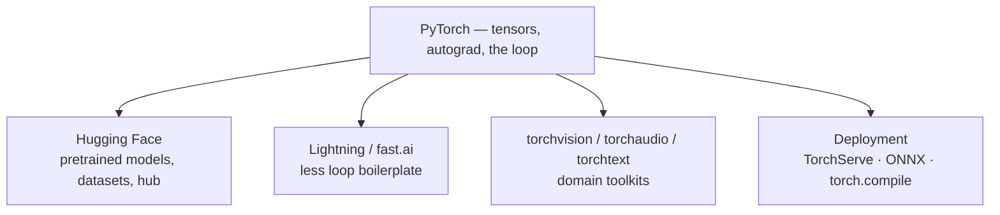

# Where to Go Next

Stop and look at what you can actually do now. You understand a **tensor** — the GPU-ready, autograd-aware array that everything runs on. You understand **autograd** — how PyTorch tracks operations and computes the gradients that make learning possible. You can build a model as a `nn.Module`, define a `forward()`, pick a loss and an optimizer, and write the **training loop** that ties them together: forward, loss, backward, step. You can feed it data through a `Dataset` and `DataLoader`, move work onto a GPU, and you've trained, evaluated, **saved**, and run inference with a real classifier.

That is not a warm-up. That is the foundation *every* piece of modern deep learning is built on — from a three-line toy model to a model with hundreds of billions of parameters. The rest is the same three ideas at scale, plus tooling. This last phase isn't another layer type — it's the honest map of where to point what you know.

## Don't train from scratch — transfer learning

💡 Here's the single most practical next step, and the one that surprises people: most of the time, you **don't train a model from scratch.** You start from one someone else already trained on a giant dataset, and you fine-tune it on yours. It's called **transfer learning**, and it's how real projects get good results without a data center or a million labeled images.

The intuition is clean. A vision model trained on millions of images has already learned the universal stuff in its early layers — edges, textures, shapes, the general grammar of "what images look like." That knowledge transfers. What's specific to *your* problem (cats vs. dogs, healthy vs. diseased leaves) lives mostly in the final layers. So you **freeze the early layers**, keep their learned weights, and retrain only a fresh **head** on your data. Far less data, far less compute, far better results.

```python
import torch
import torchvision

# Load a pretrained network (weights trained on ImageNet)
model = torchvision.models.resnet18(weights="IMAGENET1K_V1")

# Freeze everything — these gradients won't update
for param in model.parameters():
    param.requires_grad = False

# Swap the final layer for one that fits YOUR classes (say, 3)
model.fc = torch.nn.Linear(model.fc.in_features, 3)

# Now only model.fc has requires_grad=True — train just the head
# with the exact same loop you already know.
```

📝 Notice what *isn't* new here: `requires_grad` is the autograd flag from Phase 3, the new `fc` layer is the `nn.Module` idea from Phase 4, and you'd train it with the same loop from Phase 6. Transfer learning isn't a new skill — it's your existing skills aimed at a pretrained starting point.

## The ecosystem

PyTorch sits at the center of a big, friendly ecosystem. You don't need all of it, but it helps to know which branch solves which problem.



*What this shows:* one core, four directions you'll actually reach for.

- **Hugging Face** is the center of modern practice. Its `transformers`, `datasets`, and `hub` libraries give you thousands of pretrained models for text, vision, and audio that you can download and fine-tune in a few lines. When people say "I used a pretrained model," they usually mean from the Hugging Face Hub.
- **PyTorch Lightning** and **fast.ai** remove the training-loop boilerplate. You learned to write the loop by hand on purpose — now that you understand it, these let you stop rewriting it for every project while keeping the same mental model underneath.
- **torchvision / torchaudio / torchtext** are domain toolkits: pretrained models, datasets, and the standard transforms for images, sound, and text.
- **Deployment** is how a trained model leaves your notebook. **TorchServe** serves it behind an endpoint, **ONNX** exports it to a portable format other runtimes can run, and `torch.compile` speeds it up with a single line.

## The LLM connection

💡 Now the big one. The large language models you've heard of — the ones that write code and hold conversations — **are PyTorch.** They're a specific architecture (the *transformer*) trained with the exact loop you learned in Phase 6: forward, loss, backward, step. The difference is scale — staggering amounts of data, compute, and parameters — not a different kind of magic. Knowing PyTorch is what turns an LLM from a mysterious oracle into "oh, it's a very large model trained the way I now understand."

And here's the freeing part: **you almost never need to train one to use one.** Training a frontier LLM costs millions; *using* one is an API call. When you want to put an LLM to work, [Using an LLM API](/guides/using-an-llm-api) shows you how. And when you're deciding whether you even need to customize a model's behavior, [Fine-Tuning vs Prompting](/guides/fine-tuning-vs-prompting) lays out the honest tradeoff — most of the time a good prompt beats fine-tuning, and fine-tuning (the transfer-learning idea from earlier, applied to language) is the heavier tool you reach for only when prompting genuinely isn't enough.

So PyTorch demystifies the whole stack. You learned the small loop; the giant models are that loop at scale; and you can use them without ever running it yourself.

## What to build — and the last word

The way this knowledge sticks is by building one real thing. Pick whichever pulls at you:

- **Fine-tune a pretrained image model on your own photos.** Grab `resnet18`, freeze it, retrain the head on a few hundred of your own pictures sorted into folders. This is transfer learning end to end, and it's genuinely useful.
- **Train a text classifier with Hugging Face.** Pull a pretrained model from the Hub, fine-tune it on a labeled dataset (sentiment, spam, topic), and watch how few lines it takes.
- **Push the MNIST classifier past 99%.** Take the one you built in Phase 8 and make it better — add convolutional layers, tune the optimizer, add augmentation. The loop stays the same; you're just refining the model.

When you want the canonical reference, the **official PyTorch tutorials** are excellent, and the **"Deep Learning with PyTorch: A 60 Minute Blitz"** is the best fast tour of everything you've learned, in one sitting. Bookmark both.

And remember the through-line of this whole guide. None of it was sorcery. A tensor is an array you do fast math on. Autograd is bookkeeping that hands you gradients. The training loop is four steps in a row, repeated. **Tensors, autograd, the loop** — you have the three ideas that sit under all of modern AI. Go fine-tune something, break it, fix it, and show someone. You're ready.

## Recap

1. **You own the foundation.** Tensors, autograd, models, the loop, data pipelines, saving and inference — that's what *all* deep learning is built on, from tiny models to giant LLMs.
2. **Don't train from scratch — fine-tune.** Transfer learning starts from a pretrained model (`torchvision.models`), freezes the early layers, and retrains only the head. Far less data and compute, far better results.
3. **Know the ecosystem.** Hugging Face for pretrained models, Lightning/fast.ai to shed loop boilerplate, the torch domain toolkits, and TorchServe/ONNX/`torch.compile` for deployment.
4. **LLMs are PyTorch.** They're transformers trained with the loop you learned, at massive scale — and you can *use* one via an API without training it. Prompt first; fine-tune only when you must.
5. **Build one real thing.** Fine-tune an image model on your photos, train a text classifier with Hugging Face, or push your MNIST model past 99% — then read the official tutorials and the 60-Minute Blitz.

## Quick check

Three questions on the decisions that matter most as you leave this guide:

```quiz
[
  {
    "q": "Why is transfer learning usually better than training a vision model from scratch?",
    "choices": [
      "It starts from a model that already learned general features (edges, textures), so you need far less data and compute",
      "It is the only way to use a GPU",
      "Training from scratch is impossible in PyTorch",
      "It skips the training loop entirely"
    ],
    "answer": 0,
    "explain": "A pretrained model's early layers already capture universal visual features. You freeze those, keep their weights, and retrain only the head on your data — so you get good results with a fraction of the data and compute."
  },
  {
    "q": "What is the relationship between large language models and PyTorch?",
    "choices": [
      "LLMs are a separate technology unrelated to PyTorch",
      "LLMs are transformer models trained with the same forward/loss/backward/step loop you learned, just at enormous scale",
      "PyTorch can only train image models, not language models",
      "You must train an LLM yourself before you can use one"
    ],
    "answer": 1,
    "explain": "LLMs are the transformer architecture trained with the exact loop from Phase 6, scaled up massively. And you can use one through an API without ever training it yourself."
  },
  {
    "q": "You want pretrained models for NLP and vision plus the datasets and hub to fine-tune them. Where do you look?",
    "choices": [
      "TorchServe",
      "ONNX",
      "Hugging Face (transformers, datasets, hub)",
      "torch.compile"
    ],
    "answer": 2,
    "explain": "Hugging Face is the center of modern practice — its transformers, datasets, and hub libraries give you thousands of pretrained models to download and fine-tune. TorchServe, ONNX, and torch.compile are deployment/optimization tools, not model hubs."
  }
]
```

---

[← Phase 10: GPUs, Performance & Common Pitfalls](10-gpus-performance-pitfalls.md) · [Guide overview](_guide.md)