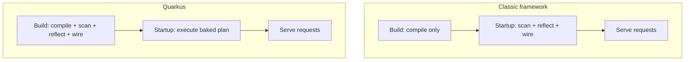

# What Quarkus Is & Why It's Fast

If you've written Java for the web, you know the rhythm: hit run, then go make coffee while the framework wakes up. Classic Java frameworks can take many seconds to start and hold hundreds of megabytes of memory before they've served a single request. For two decades that was fine — you started the server once and it ran for months. Quarkus exists because that assumption stopped being true, and this phase is about understanding *why* Quarkus is fast before you write a line of it. The speed isn't a trick or a tuning flag. It comes from one deliberate design decision, and once you can see that decision, everything else about Quarkus — the instant startup, the tiny memory, the native executables — falls out of it naturally.

This guide assumes you're comfortable with Java classes, methods, and annotations. If you've spent time with Spring Boot or Jakarta EE, even better — Quarkus implements the same specs, and we'll lean on that. If you haven't, the comparisons are still readable; you'll just learn the standards here for the first time.

## The problem Quarkus solves

To understand the fix, you have to understand the world the old frameworks were built for.

Classic Java frameworks were designed for a **long-running application server**: one big machine (or a handful), started once, kept alive for weeks or months. In that world, a slow startup is a one-time tax you pay at 3 a.m. during a maintenance window, and a generous memory footprint is no problem because you sized the machine for it. Spending ten seconds and 500 MB at boot to scan, reflect, and wire everything together was a perfectly reasonable trade — you did it once and forgot about it.

Then deployment moved into **containers, Kubernetes, and serverless**, and the economics flipped.

⚠️ **Gotcha — in the cloud, startup and memory are recurring costs, not one-time ones.** When your app runs in containers that **autoscale**, the platform is constantly starting *new* instances to handle traffic spikes — every one pays the startup tax again. In **serverless** (functions that spin up on demand), a slow boot becomes a user-facing **cold start**: the first request waits for the whole framework to wake up. And memory is billed directly — a runtime that idles at 500 MB costs real money on every replica, multiplied across every pod. The old "start once, run forever" assumption is gone, and the old frameworks' trade-offs went sour with it.

📝 **Quarkus** — a cloud-native Java framework optimized for **fast startup** and **low memory use**, built specifically for the container, Kubernetes, and serverless world where those two things directly drive cost and responsiveness.

That's the *what*. The interesting part is *how* — and it's a single idea.

## The core idea: build-time over runtime

Here is the one mental model that explains all of Quarkus. Plant it firmly, because the rest of the guide is this sentence in detail.

📝 **Build-time over runtime** — classic frameworks do their setup work (scanning your classes, reading annotations, using reflection, wiring objects together, reading config) when the app **starts**. Quarkus does as much of that work as possible at **build/compile time**, so the work is already finished before the app ever runs. The running application skips it entirely and goes straight to serving requests.

Think about what a classic framework does in those first few seconds of startup. It scans the classpath looking for your annotated classes. It uses **reflection** to inspect them. It builds a model of how everything connects, then constructs and wires the objects. All of that is *discovery and bookkeeping* — none of it serves a single request. And critically, the answers don't change between runs: the same classes, the same annotations, the same wiring, every single time you start.

💡 **Insight.** Quarkus's bet is that work whose answer is the same every startup shouldn't be done at startup at all — it should be done **once, at build time**, and baked into the application. A Quarkus build runs the scanning, reflection, and wiring during compilation and records the results. When the built app starts, it doesn't discover anything; it just executes a plan that's already been computed.

Here's the contrast in one picture:



*What just happened:* notice the heavy box moved. In the classic flow, the expensive scan-reflect-wire step sits at **startup**, on the path your users wait behind. In Quarkus, that same work moved left, into the **build** — it happens once on your machine or in CI, not every time a container boots. The startup step shrinks to "execute the plan we already made," which is why a Quarkus app can be answering requests in tens of milliseconds.

💡 **Insight — this one choice explains everything else.** Faster startup is the obvious payoff. But moving the wiring to build time also makes the *next* idea possible: if the framework has already figured out exactly which classes and methods the app uses — at build time — then a compiler can throw away everything else and produce a tiny, self-contained executable. That's native compilation, and it only works *because* Quarkus resolved the wiring early.

## Native images with GraalVM

This is where the build-time bet pays off most dramatically.

📝 **Native image** — a standalone executable of machine code for one specific operating system and CPU, produced ahead of time by **GraalVM** (a tool that compiles Java straight to native code). Instead of shipping `.class` files that a JVM interprets and warms up at runtime, you ship a single binary that *is* your application. It boots in **milliseconds**, uses a fraction of the memory, and needs no JVM warmup — the code is already native machine code from the first instruction.

The reason Quarkus can do this cleanly comes straight from the previous section. Native compilation requires a **closed-world** assumption: the compiler must know, at build time, every class and method the program will ever touch, so it can compile those and discard the rest. A traditional framework can't promise that — it discovers and wires things dynamically at startup, so the compiler can't be sure what's actually needed. Quarkus *already* resolved all that wiring at build time, so it can hand GraalVM a precise list of what the app uses. Build-time wiring and native compilation are two sides of the same coin.

⚠️ **Gotcha — native images aren't free, and we'll cover the trade-offs in full in Phase 9.** Two to know now: the native build itself is **slow and memory-hungry** (it's doing a lot of analysis — minutes, not seconds), so you don't do it on every code change. And the closed-world assumption means **reflection that the framework can't see at build time will fail at runtime** unless you register it explicitly — Quarkus and its extensions handle the common cases, but third-party libraries sometimes need a nudge. Native is a deployment-time choice, not your day-to-day loop.

💡 **Insight — JVM mode is still excellent.** You don't have to go native to benefit. Run a Quarkus app on a normal JVM and it *still* starts far faster and uses less memory than a classic framework, because the build-time wiring helps either way. Many teams develop and even deploy in JVM mode and reach for native only where cold-start latency or memory cost truly matters. Native is the top of the ladder, not the price of entry.

## It runs the standards you may already know

Here's the part that makes Quarkus much less intimidating than it sounds: it is not a brand-new world of unfamiliar APIs.

📝 Quarkus **implements the same standard specifications** that Jakarta EE and MicroProfile define. The annotations you write are the standard ones:

- **CDI** for dependency injection (`@Inject`, `@ApplicationScoped`) — covered in Phase 4.
- **JAX-RS** for REST endpoints (`@Path`, `@GET`) — covered in Phase 3.
- **Hibernate ORM / Panache** for database access (`@Entity`) — covered in Phase 5.
- **MicroProfile** for config, health checks, and metrics — the cloud-native conveniences.

💡 **Insight — Quarkus is "the standards, re-engineered," not a fresh API to memorize.** If you've seen `@Path` and `@Inject` in [/guides/jakarta-ee-from-zero](/guides/jakarta-ee-from-zero), you already know how to write a Quarkus endpoint. What Quarkus changed is the *engine underneath* — it implements those specs with the build-time approach instead of the classic startup-time approach. Same contract you write against; a faster machine fulfilling it.

So how does Quarkus compare to the two frameworks you've most likely heard of? Honestly: all three are solid, production-grade, and widely employed.

- [Spring Boot](/guides/spring-boot-from-zero) is the dominant, hugely popular framework with an enormous ecosystem and gentle on-ramp.
- [Jakarta EE](/guides/jakarta-ee-from-zero) is the vendor-neutral standard implemented by many application servers, prized in long-lived enterprises.
- **Quarkus** implements the same kinds of standards but wins specifically on **startup time, memory footprint, and native compilation** — the metrics that matter most when you're paying per container in the cloud.

⚠️ **Gotcha — "faster" is about a specific axis, not a verdict.** Quarkus's edge is startup and memory in cloud deployments. That's a real, measurable win there. It is *not* a claim that Quarkus is universally better — Spring's ecosystem breadth or an existing Jakarta EE investment can easily outweigh boot speed for a given team. Choose on what your project actually optimizes for.

## Create a project

Theory's in place — let's stand one up. The fastest way is the **Quarkus CLI** (you can also use [code.quarkus.io](https://code.quarkus.io), the web project generator, if you'd rather not install anything). We'll keep this light; the developer experience gets its whole own treatment in Phase 2.

```bash
quarkus create app org.acme:hello-quarkus
cd hello-quarkus
```

*What just happened:* the CLI generated a complete, ready-to-run Quarkus project in a `hello-quarkus` folder — a build file with the right dependencies, the standard source layout, and a sample REST resource already in place. The `org.acme:hello-quarkus` part is just the group and project name (the Maven coordinates), the same naming you'd give any Java project.

Inside, the heart of a Quarkus web app is an ordinary class with standard JAX-RS annotations:

```java
package org.acme;

import jakarta.ws.rs.GET;
import jakarta.ws.rs.Path;

@Path("/hello")
public class GreetingResource {

    @GET
    public String hello() {
        return "Hello from Quarkus";
    }
}
```

*What just happened:* these are the **exact same** `jakarta.ws.rs` annotations from the Jakarta EE standard — `@Path("/hello")` says "endpoints in this class live under `/hello`," and `@GET` maps HTTP `GET` requests to `hello()`. There's no `main()`, no server-start code, no socket handling. You described *which URL runs which method* and Quarkus owns everything around it. If this looks like the Jakarta EE example you've seen, that's the whole point — Quarkus runs the standard.

Now start it in **dev mode**:

```bash
quarkus dev
```

You'll see Quarkus come up almost instantly:

```console
__  ____  __  _____   ___  __ ____  ______
 --/ __ \/ / / / _ | / _ \/ //_/ / / / __/
 -/ /_/ / /_/ / __ |/ , _/ ,< / /_/ /\ \
--\___\_\____/_/ |_/_/|_/_/|_|\____/___/

INFO  hello-quarkus 1.0.0-SNAPSHOT on JVM started in 0.842s.
INFO  Profile dev activated. Live Coding activated.
INFO  Installed features: [cdi, rest, smallrye-context-propagation, vertx]
```

*What just happened:* read that as a receipt. The app started **in well under a second** — that's the build-time wiring paying off even in plain JVM mode. The `Installed features` line lists the standard pieces Quarkus wired up (`cdi`, `rest`, and friends). Now open `http://localhost:8080/hello` in a browser and you'll see `Hello from Quarkus`. A real HTTP server, serving your code, started faster than you could read this sentence.

That `Live Coding activated` note is a hint at something special about `quarkus dev` — but that's Phase 2's story.

## Recap

- **The problem:** classic Java frameworks were built for long-running servers, where slow startup and high memory were one-time costs. In containers, Kubernetes, and serverless, those become *recurring* costs — autoscaling cold starts and per-replica memory bills.
- **The core idea — build-time over runtime:** classic frameworks scan, reflect, and wire at **startup**; Quarkus moves that work to **build time** so the running app skips it and starts in milliseconds. This single choice explains everything else.
- **Native images (GraalVM):** because the wiring is resolved at build time (closed-world), Quarkus can compile to a standalone native executable that boots in milliseconds with tiny memory and no JVM warmup. Trade-offs (slow build, reflection limits) come in Phase 9.
- **JVM mode is still fast:** you get much of the benefit without going native — Quarkus on a normal JVM still beats classic frameworks on startup and memory.
- **It runs the standards:** Quarkus implements CDI, JAX-RS, Hibernate/Panache, and MicroProfile — the same annotations as Jakarta EE, re-engineered around build-time. It's a faster engine for a contract you may already know, not a new API.
- **Honest comparison:** Spring Boot, Jakarta EE, and Quarkus are all solid; Quarkus's specific edge is startup time, memory, and native compilation in the cloud.

## Quick check

Lock in the one idea everything else builds on:

```quiz
[
  {
    "q": "What is the core design choice that makes Quarkus fast?",
    "choices": [
      "It rewrites your Java into a faster language at runtime",
      "It moves framework work like scanning, reflection, and wiring from startup time to build/compile time",
      "It skips dependency injection entirely to save time",
      "It caches HTTP responses so requests never hit your code"
    ],
    "answer": 1,
    "explain": "Quarkus does the scan/reflect/wire work at build time so the running app skips it and starts in milliseconds. This single choice also enables native compilation."
  },
  {
    "q": "Why can Quarkus compile to a GraalVM native image when classic frameworks struggle to?",
    "choices": [
      "Because Quarkus apps are smaller and have fewer classes",
      "Because GraalVM only works with the jakarta.* namespace",
      "Because Quarkus resolves wiring at build time, giving the compiler the closed-world knowledge of exactly which classes and methods are used",
      "Because native images don't need any of the framework's features"
    ],
    "answer": 2,
    "explain": "Native compilation needs a closed-world assumption — knowing at build time every class and method used. Quarkus already resolves its wiring at build time, so it can hand GraalVM that precise list."
  },
  {
    "q": "How does Quarkus relate to Jakarta EE and MicroProfile?",
    "choices": [
      "It replaces them with a brand-new set of proprietary annotations",
      "It implements the same standard specs (CDI, JAX-RS, Hibernate, MicroProfile) with a re-engineered, build-time engine underneath",
      "It only works inside a Jakarta EE application server",
      "It has nothing to do with them and uses no standards"
    ],
    "answer": 1,
    "explain": "Quarkus writes against the same standard annotations (e.g. @Path, @Inject) but implements them with a build-time engine. You keep the familiar contract; the machine fulfilling it is faster."
  }
]
```

---

[Guide overview](_guide.md) · [Phase 2: Dev Mode & the Developer Experience →](02-dev-mode-and-dx.md)
