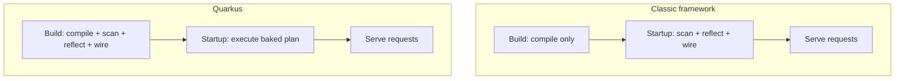

# What Quarkus Is & Why It's Fast

If you've written Java for the web, you know the rhythm: hit run, go make coffee while the framework wakes up. Classic Java frameworks can take seconds to start and hold hundreds of megabytes before serving a single request. For two decades that was fine - you started the server once and it ran for months. Quarkus exists because that assumption stopped being true, and the speed isn't a trick or a tuning flag - it comes from one deliberate design decision that everything else falls out of.

This guide assumes you're comfortable with Java. If you've used Spring Boot or Jakarta EE, even better - Quarkus implements the same specs.

## The problem Quarkus solves

Classic Java frameworks were designed for a **long-running application server**: started once, kept alive for months. Spending ten seconds and 500 MB at boot to scan, reflect, and wire everything was a reasonable one-time tax.

Then deployment moved into **containers, Kubernetes, and serverless**, and the economics flipped.

⚠️ In the cloud, startup and memory are recurring costs, not one-time ones. Apps that **autoscale** start new instances constantly - every one pays the startup tax again. In **serverless**, a slow boot becomes a user-facing **cold start**. Memory is billed per replica, multiplied across every pod. The old "start once, run forever" assumption is gone.

📝 **Quarkus** - a cloud-native Java framework optimized for **fast startup** and **low memory use**, built for the world where those two things directly drive cost and responsiveness.

## The core idea: build-time over runtime

📝 **Build-time over runtime** - classic frameworks do their setup work (scanning classes, reading annotations, reflection, wiring objects, reading config) when the app **starts**. Quarkus does as much of that as possible at **build/compile time**, so the running app skips it entirely and goes straight to serving requests.

A classic framework's first seconds of startup are pure *discovery and bookkeeping* - scanning the classpath, reflecting on classes, building and wiring a model of how everything connects. None of it serves a request, and the answers don't change between runs.

💡 Quarkus's bet: work whose answer is the same every startup shouldn't be done at startup at all. A Quarkus build runs the scanning, reflection, and wiring during compilation and bakes the results in. Startup just executes a plan already computed.



*What just happened:* the heavy box moved. In the classic flow, scan-reflect-wire sits at **startup**, on the path users wait behind. In Quarkus it moved left into the **build**, happening once in CI, not every container boot - which is why a Quarkus app can answer requests in tens of milliseconds.

💡 This one choice also enables the next idea: if the framework already knows exactly which classes and methods the app uses, a compiler can throw away everything else and produce a tiny, self-contained executable. That's native compilation, and it only works *because* Quarkus resolved the wiring early.

## Native images with GraalVM

📝 **Native image** - a standalone machine-code executable for one OS/CPU, produced ahead of time by **GraalVM**. Instead of shipping `.class` files a JVM interprets and warms up, you ship a single binary that *is* your application. It boots in **milliseconds**, uses a fraction of the memory, and needs no JVM warmup.

Native compilation requires a **closed-world** assumption: the compiler must know, at build time, every class and method the program will ever touch, so it can compile those and discard the rest. A traditional framework discovers and wires things dynamically at startup, so the compiler can't be sure what's needed. Quarkus already resolved that wiring at build time, so it hands GraalVM a precise list. Build-time wiring and native compilation are two sides of the same coin.

⚠️ Native images aren't free (full trade-offs in Phase 9). Two to know now: the native build itself is **slow and memory-hungry** - minutes, not seconds - so you don't do it on every code change. And reflection the framework can't see at build time will fail at runtime unless registered explicitly.

💡 JVM mode is still excellent - you don't have to go native to benefit. A Quarkus app on a normal JVM still starts far faster and uses less memory than a classic framework. Many teams deploy in JVM mode and reach for native only where cold-start latency or memory cost truly matters.

## It runs the standards you may already know

📝 Quarkus **implements the same standard specifications** Jakarta EE and MicroProfile define:

- **CDI** for dependency injection (`@Inject`, `@ApplicationScoped`) - Phase 4.
- **JAX-RS** for REST endpoints (`@Path`, `@GET`) - Phase 3.
- **Hibernate ORM / Panache** for database access (`@Entity`) - Phase 5.
- **MicroProfile** for config, health checks, and metrics.

💡 Quarkus is "the standards, re-engineered," not a fresh API. What changed is the engine underneath - build-time instead of startup-time. Same contract you write against; a faster machine fulfilling it.

How does it compare? [Spring Boot](/guides/spring-boot-from-zero) is the dominant, hugely popular framework with an enormous ecosystem. [Jakarta EE](/guides/jakarta-ee-from-zero) is the vendor-neutral standard prized in long-lived enterprises. **Quarkus** implements the same kinds of standards but wins specifically on **startup time, memory footprint, and native compilation**.

⚠️ "Faster" is about a specific axis, not a verdict. Spring's ecosystem breadth or an existing Jakarta EE investment can easily outweigh boot speed for a given team. Choose on what your project actually optimizes for.

## Create a project

The fastest way is the **Quarkus CLI** (or [code.quarkus.io](https://code.quarkus.io) if you'd rather not install anything):

```bash
quarkus create app org.acme:hello-quarkus
cd hello-quarkus
```

*What just happened:* the CLI generated a complete, ready-to-run Quarkus project - a build file with the right dependencies, standard source layout, and a sample REST resource already in place.

Inside, the heart of a Quarkus web app is an ordinary class with standard JAX-RS annotations:

```java
package org.acme;

import jakarta.ws.rs.GET;
import jakarta.ws.rs.Path;

@Path("/hello")
public class GreetingResource {

    @GET
    public String hello() {
        return "Hello from Quarkus";
    }
}
```

*What just happened:* these are the **exact same** `jakarta.ws.rs` annotations from the Jakarta EE standard - `@Path("/hello")` maps this class's endpoints under `/hello`, `@GET` maps HTTP `GET` to `hello()`. No `main()`, no server-start code. You described *which URL runs which method*; Quarkus owns everything around it.

Now start it in **dev mode**:

```bash
quarkus dev
```

```console
__  ____  __  _____   ___  __ ____  ______
 --/ __ \/ / / / _ | / _ \/ //_/ / / / __/
 -/ /_/ / /_/ / __ |/ , _/ ,< / /_/ /\ \
--\___\_\____/_/ |_/_/|_/_/|_|\____/___/

INFO  hello-quarkus 1.0.0-SNAPSHOT on JVM started in 0.842s.
INFO  Profile dev activated. Live Coding activated.
INFO  Installed features: [cdi, rest, smallrye-context-propagation, vertx]
```

*What just happened:* the app started in well under a second - build-time wiring paying off even in plain JVM mode. `Installed features` lists the standard pieces Quarkus wired up. Open `http://localhost:8080/hello` and you'll see `Hello from Quarkus`.

That `Live Coding activated` note is a hint at something special about `quarkus dev` - Phase 2's story.

## Recap

- **The problem:** classic Java frameworks were built for long-running servers, where slow startup and high memory were one-time costs. In containers, Kubernetes, and serverless, those become *recurring* costs — autoscaling cold starts and per-replica memory bills.
- **The core idea — build-time over runtime:** classic frameworks scan, reflect, and wire at **startup**; Quarkus moves that work to **build time** so the running app skips it and starts in milliseconds. This single choice explains everything else.
- **Native images (GraalVM):** because the wiring is resolved at build time (closed-world), Quarkus can compile to a standalone native executable that boots in milliseconds with tiny memory and no JVM warmup. Trade-offs (slow build, reflection limits) come in Phase 9.
- **JVM mode is still fast:** you get much of the benefit without going native — Quarkus on a normal JVM still beats classic frameworks on startup and memory.
- **It runs the standards:** Quarkus implements CDI, JAX-RS, Hibernate/Panache, and MicroProfile — the same annotations as Jakarta EE, re-engineered around build-time. It's a faster engine for a contract you may already know, not a new API.
- **Honest comparison:** Spring Boot, Jakarta EE, and Quarkus are all solid; Quarkus's specific edge is startup time, memory, and native compilation in the cloud.

## Quick check

Lock in the one idea everything else builds on:

```quiz
[
  {
    "q": "What is the core design choice that makes Quarkus fast?",
    "choices": [
      "It rewrites your Java into a faster language at runtime",
      "It moves framework work like scanning, reflection, and wiring from startup time to build/compile time",
      "It skips dependency injection entirely to save time",
      "It caches HTTP responses so requests never hit your code"
    ],
    "answer": 1,
    "explain": "Quarkus does the scan/reflect/wire work at build time so the running app skips it and starts in milliseconds. This single choice also enables native compilation."
  },
  {
    "q": "Why can Quarkus compile to a GraalVM native image when classic frameworks struggle to?",
    "choices": [
      "Because Quarkus apps are smaller and have fewer classes",
      "Because GraalVM only works with the jakarta.* namespace",
      "Because Quarkus resolves wiring at build time, giving the compiler the closed-world knowledge of exactly which classes and methods are used",
      "Because native images don't need any of the framework's features"
    ],
    "answer": 2,
    "explain": "Native compilation needs a closed-world assumption — knowing at build time every class and method used. Quarkus already resolves its wiring at build time, so it can hand GraalVM that precise list."
  },
  {
    "q": "How does Quarkus relate to Jakarta EE and MicroProfile?",
    "choices": [
      "It replaces them with a brand-new set of proprietary annotations",
      "It implements the same standard specs (CDI, JAX-RS, Hibernate, MicroProfile) with a re-engineered, build-time engine underneath",
      "It only works inside a Jakarta EE application server",
      "It has nothing to do with them and uses no standards"
    ],
    "answer": 1,
    "explain": "Quarkus writes against the same standard annotations (e.g. @Path, @Inject) but implements them with a build-time engine. You keep the familiar contract; the machine fulfilling it is faster."
  }
]
```

---

[Guide overview](_guide.md) · [Phase 2: Dev Mode & the Developer Experience →](02-dev-mode-and-dx.md)
