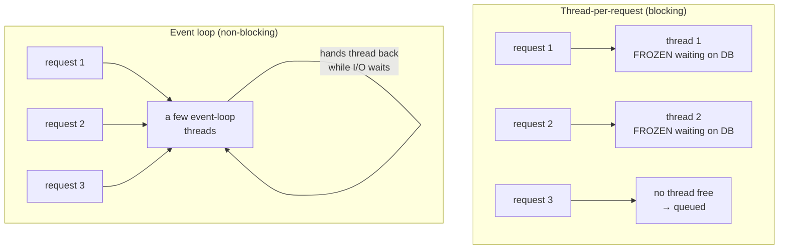

# Reactive Quarkus with Mutiny

Reactive programming has a reputation for being scary, and I want to take that away from you right now,
because the core idea is something you already understand from waiting tables, standing in lines, and —
if you've done any JavaScript — from the event loop. We'll build the mental model first, meet Quarkus's
reactive library (Mutiny), write a reactive endpoint end-to-end, and then I'll give you the honest part
that most tutorials skip: **when you should not bother.**

You've been carrying a `Product` (an `id`, a `name`, a `price`) since [Phase 3](03-rest-apis.md), where
I promised that a handler could return a `Uni<Product>` instead of a plain `Product`. This is where that
promise gets paid off.

## Why reactive exists

📝 Start with the model everybody learns first: **one thread per request.** A request comes in, the server
grabs a thread from a pool and assigns it to that request. The thread runs your handler top to bottom. When
your handler asks the database for a product, it **blocks** — the thread sits there, frozen, doing nothing
but waiting for the database to reply. When the reply lands, the thread wakes up, finishes the handler, and
goes back to the pool for the next request.

Here's the problem hiding in that picture. Most of a typical request's life is *waiting* — waiting on the
database, on another service, on the network. During all that waiting, the thread is pinned to one request
and **idle**. Each thread also costs real memory (its own stack, typically around a megabyte). So if you
have 200 threads in your pool and 200 slow requests arrive, request 201 has to *queue* — not because the
CPU is busy, but because every thread is sitting around waiting on I/O. You ran out of threads while your
machine was mostly idle. That's the wall the blocking model hits under high concurrency.

💡 **The reactive idea is one sentence:** when a request has to wait on I/O, don't pin a thread to it —
hand the thread back so it can advance *other* requests, and resume this one later when the data is ready.
A handful of threads can then keep thousands of waiting requests in flight, because waiting no longer
occupies a thread.



*What just happened:* On the left, each request owns a thread for its entire life, so three slow requests
need three threads (and the third waits if the pool is full). On the right, a small number of **event-loop**
threads service all three: when one request's database call is in flight, its thread isn't stuck — it moves
on to another request and comes back when the reply arrives.

If that "hand the thread back while you wait, resume later" rhythm sounds familiar, it should. It is
*exactly* the JavaScript event loop. We have a whole guide on it —
[Async/Await & the Event Loop](/guides/async-await-and-the-event-loop) — and the mental model transfers
directly: one (or a few) workers stay busy by never blocking on a wait, interleaving many tasks instead of
freezing on one. Reactive Quarkus is that same machine, brought to Java. The scary word "reactive" is just
"don't block the thread; describe what to do when the value arrives."

## Mutiny: `Uni` and `Multi`

So if your handler can't *block* waiting for the product, how do you write "go get the product, and when
it arrives, turn it into a response"? You need a value that represents *a result that isn't here yet*.
That's what Mutiny gives you. **Mutiny** is the reactive library Quarkus uses, and it has just two core
types:

- 📝 **`Uni<T>`** — a promise of **one** value that will arrive later (or a failure). If you've used a
  JavaScript `Promise` or a Java `CompletableFuture`, this is the same idea: a placeholder for a single
  future result.
- 📝 **`Multi<T>`** — a **stream** of many values arriving over time (zero, one, or millions): rows from a
  query, lines from a file, server-sent events. Think of it as a `Uni` that can fire repeatedly.

A `Uni<Product>` does not *contain* a product. It contains the *recipe* for getting one and what to do
once you have it:

```java
import io.smallrye.mutiny.Uni;

Uni<Product> productLater = productService.findById(1L);
// productLater is a promise. No product has been fetched yet.
// Nothing has actually run.
```

*What just happened:* `findById` returned a `Uni<Product>` **immediately**, without blocking and without
touching the database yet. The variable holds a description of work to do, not a result. This is the first
mental shift: in reactive code, a method returning `Uni<Product>` is handing you a *plan*, not an *answer*.
The plan only executes when something **subscribes** to it (more on that in a moment).

## Transforming reactively

You rarely want the raw value — you want to *do something* with it once it arrives. In imperative code you'd
write `Product p = findById(id); return p.getName();`. You can't do that here, because there's no product to
call `.getName()` on yet. Instead you **attach** the transformation to the `Uni`, describing what should
happen *when* the value shows up:

```java
import io.smallrye.mutiny.Uni;

Uni<String> nameLater = productService.findById(1L)
    .onItem().transform(product -> product.getName().toUpperCase())
    .onItem().transform(name -> "Product: " + name)
    .onFailure().recoverWithItem("Product: UNKNOWN");
```

*What just happened:* Read it as a pipeline of "when this happens, do that." `.onItem().transform(...)`
says "**when** the product arrives, map it to its uppercased name." The second `transform` runs on *that*
result. `.onFailure().recoverWithItem(...)` says "if the lookup fails instead, substitute this fallback
rather than blowing up." Crucially, **none of these lambdas has run yet** — you've only described the steps.
The whole chain reads top-to-bottom like a list of instructions, which is the part that makes Mutiny
pleasant: it *looks* sequential even though it executes asynchronously, later, when subscribed.

💡 This is the deepest difference from imperative code, so let me say it plainly. Imperative code *does
things*. Reactive code *describes things to do*. A Mutiny chain is a value you build up and then hand off;
the framework subscribes to it and drives it. You compose the "what happens when," and you never block
waiting for "when."

## Reactive endpoints & data access

Now the end-to-end version. A JAX-RS handler returns `Uni<Product>` instead of `Product`, and Quarkus REST
knows what to do: it subscribes to the `Uni`, and when the value arrives, it serializes it and writes the
response — all without a thread blocking in the meantime. Pair that with **reactive Panache**, where
`findById` itself returns a `Uni`, and the whole path from HTTP to database is non-blocking:

```java
import io.smallrye.mutiny.Uni;
import jakarta.ws.rs.*;
import jakarta.ws.rs.core.MediaType;
import org.jboss.resteasy.reactive.RestResponse;

@Path("/products")
public class ProductResource {

    @GET
    @Path("/{id}")
    @Produces(MediaType.APPLICATION_JSON)
    public Uni<RestResponse<Product>> getOne(@PathParam("id") Long id) {
        return Product.<Product>findById(id)                       // returns Uni<Product>
            .onItem().ifNotNull().transform(RestResponse::ok)       // found → 200 + body
            .onItem().ifNull().continueWith(RestResponse.notFound()); // missing → 404
    }
}
```

*What just happened:* `Product.findById(id)` on a **reactive Panache** entity returns a `Uni<Product>`
rather than the product directly — it describes the query without blocking on it. We then describe two
branches: `ifNotNull().transform(...)` wraps a found product in a `200 OK`, and `ifNull().continueWith(...)`
produces a `404` when nothing matched. The handler returns the assembled `Uni<RestResponse<Product>>` and
returns *instantly*; Quarkus subscribes, the database does its work off-thread, and the response is written
when the value lands. Compare this to the imperative `getOne` from [Phase 3](03-rest-apis.md) — same shape,
same intent, but the return type is now a promise and the thread is never pinned waiting on the DB.

⚠️ Reactive Panache is a *separate* extension from the classic blocking one (`quarkus-hibernate-reactive-panache`
versus the `quarkus-hibernate-orm-panache` you met in [Phase 5](05-persistence-with-panache.md)), and it
talks to the database over a reactive driver. Don't mix a blocking call into a reactive chain — calling a
blocking JDBC method inside an event-loop thread is exactly the "don't block the loop" sin from the event-loop
guide, and it stalls every other request that thread was juggling.

## When to use it (the honest part)

Here's the section the breathless tutorials leave out, and it's the most important one.

⚠️ **Reactive is not free.** A Mutiny chain is genuinely harder to read, harder to debug, and harder to
reason about than straight-line code. Stack traces get worse — when something throws three `.onItem()`
steps deep, the trace points at Mutiny's machinery, not the tidy line number you'd get from imperative
code. Mistakes are easy to make and quiet when you make them (block the event loop once and throughput
quietly collapses). You are paying a real, ongoing tax in complexity.

💡 So pay it only when it buys you something. Reactive shines under **high concurrency with lots of I/O
waiting** — thousands of simultaneous connections that spend most of their time idle, waiting on databases
or downstream services. That is precisely the case where the thread-per-request model hits its wall, and
where handing threads back instead of pinning them is a large, measurable win.

💡 For ordinary CRUD — the bread and butter of most services — **imperative Quarkus is perfectly fast.**
This is the part people get wrong: they assume imperative means slow. It doesn't. Quarkus runs your
imperative handlers on a **worker thread**, off the event loop, so a blocking database call there is
completely fine — it blocks a worker, not the precious event-loop threads, and Quarkus manages that pool
efficiently. You get straight-line code that's easy to read and debug, with throughput that's more than
enough for the vast majority of applications.

📝 The rule I'd give a friend: **don't go reactive by default — go reactive when the load profile demands
it.** Write imperative first. It's simpler, it's fast, and it's what you'll be glad to maintain at 2 a.m.
Reach for `Uni` and `Multi` when you have a concrete, measured problem — extreme concurrency, heavy I/O
fan-out — that the imperative model genuinely can't handle. Reactive is a sharp tool for a specific job,
not the new default way to write Java.

## Recap

1. **Blocking pins a thread per request.** One thread per request spends most of its life *idle*, frozen
   on I/O — which caps concurrency and wastes memory when many requests wait at once.
2. **Reactive hands the thread back during waits.** A few non-blocking event-loop threads keep thousands
   of waiting requests in flight — the same idea as JavaScript's event loop, brought to Java.
3. **Mutiny gives you `Uni` and `Multi`.** `Uni<T>` is a promise of one future value; `Multi<T>` is a
   stream of many over time. Both describe work to run later, when subscribed — they don't hold a value.
4. **You compose, not block.** `.onItem().transform(...)` and `.onFailure().recoverWith...()` describe
   "what to do when the value (or error) arrives." The chain reads sequentially but runs asynchronously.
5. **End-to-end non-blocking.** A handler returning `Uni<Product>` plus reactive Panache (`findById`
   returning a `Uni`) keeps the whole path off the blocking model — but never sneak a blocking call into a
   reactive chain.
6. **Use it only when the load demands it.** Reactive wins under high concurrency with heavy I/O waiting;
   for ordinary CRUD, imperative Quarkus runs on a worker thread, is plenty fast, and is far simpler. Don't
   default to reactive.

## Quick check

Make sure the reactive model — and the honest caveat — landed:

```quiz
[
  {
    "q": "In the thread-per-request (blocking) model, why does high concurrency run out of threads even when the CPU is mostly idle?",
    "choices": [
      "Each request pins a thread for its whole life, and that thread sits frozen and idle while waiting on I/O — so threads run out while the machine is mostly waiting, not computing",
      "Threads are deleted after every request, so the pool empties",
      "The CPU can only run one thread at a time, so extra threads are useless",
      "Blocking code uses more CPU per request than reactive code"
    ],
    "answer": 0,
    "explain": "A blocked thread is pinned to one request and idle while it waits on the database or network. With most of each request spent waiting, the pool drains and new requests queue — even though the CPU has little to do. Reactive avoids this by handing the thread back during waits."
  },
  {
    "q": "What does a method returning Uni<Product> actually give you the instant it returns?",
    "choices": [
      "A promise describing how to get a product and what to do when it arrives — no product has been fetched and nothing runs until something subscribes",
      "The fully loaded Product object, fetched synchronously",
      "Null, until the database call finishes in the background",
      "A blocking call that freezes the thread until the product is ready"
    ],
    "answer": 0,
    "explain": "A Uni<Product> is a plan, not an answer. It returns immediately without blocking or even touching the database; the work runs only when subscribed (Quarkus subscribes for you when you return it from a handler)."
  },
  {
    "q": "You're building an ordinary CRUD service with moderate traffic. What's the honest recommendation?",
    "choices": [
      "Use imperative Quarkus — it runs handlers on a worker thread, is plenty fast for CRUD, and is far simpler to read and debug; go reactive only when high concurrency with heavy I/O demands it",
      "Always use reactive — imperative Quarkus is slow and outdated",
      "Mix blocking JDBC calls into reactive chains to get the best of both",
      "Reactive is required for any database access in Quarkus"
    ],
    "answer": 0,
    "explain": "Imperative isn't slow: Quarkus runs imperative handlers on worker threads, so blocking there is fine and throughput is ample for typical CRUD. Reactive adds real complexity and worse stack traces, so reserve it for the high-concurrency, I/O-heavy load profile where it genuinely pays off."
  }
]
```

---

[← Phase 6: Configuration](06-configuration.md) · [Guide overview](_guide.md) · [Phase 8: Testing Quarkus Apps →](08-testing.md)
