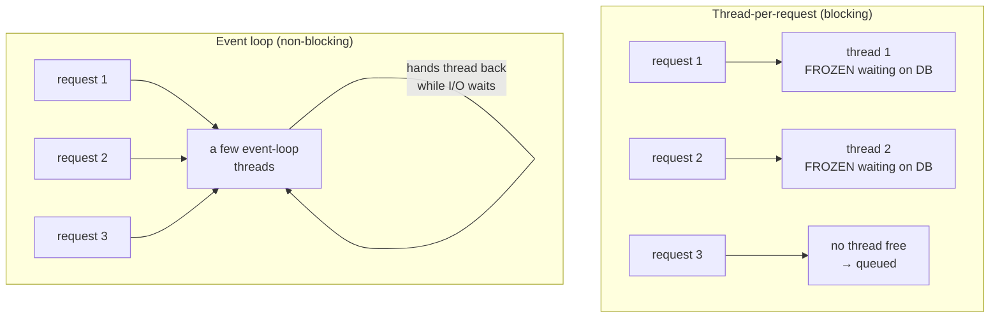

# Reactive Quarkus with Mutiny

Reactive programming has a scary reputation, but the core idea is something you already understand from waiting tables, standing in lines, or (if you've done JavaScript) the event loop. We'll build the mental model, meet Quarkus's reactive library (Mutiny), write a reactive endpoint end-to-end, and then cover the plain-spoken part most tutorials skip: **when you should not bother.**

You've carried a `Product` since [Phase 3](03-rest-apis.md), where a handler could return `Uni<Product>` instead of a plain `Product`. This is where that promise gets paid off.

## Why reactive exists

📝 Start with **one thread per request**: a request comes in, the server assigns a thread from a pool. When your handler asks the database for a product, it **blocks** - the thread sits frozen waiting. When the reply lands, the thread finishes and returns to the pool.

Most of a request's life is *waiting* - on the database, another service, the network. During that waiting, the thread is pinned and **idle**, and each thread costs real memory. If you have 200 threads and 200 slow requests, request 201 *queues* - not because the CPU is busy, but because every thread is waiting on I/O.

💡 **The reactive idea in one sentence:** when a request has to wait on I/O, hand the thread back so it can advance *other* requests, and resume this one later when data is ready. A handful of threads can then keep thousands of waiting requests in flight.



*What just happened:* on the left, each request owns a thread for its entire life. On the right, a small number of **event-loop** threads service all three - a thread isn't stuck on one request's database call, it moves on and comes back when the reply arrives.

This "hand the thread back while you wait" rhythm is *exactly* the JavaScript event loop - see [Async/Await & the Event Loop](/guides/async-await-and-the-event-loop). Reactive Quarkus is that same machine, brought to Java. "Reactive" just means "don't block the thread; describe what to do when the value arrives."

## Mutiny: `Uni` and `Multi`

If your handler can't *block* waiting for the product, you need a value representing *a result that isn't here yet*. **Mutiny** is the reactive library Quarkus uses, with two core types:

- 📝 **`Uni<T>`** - a promise of **one** value that arrives later (or a failure). Same idea as a JavaScript `Promise` or `CompletableFuture`.
- 📝 **`Multi<T>`** - a **stream** of many values over time: query rows, file lines, server-sent events.

```java
import io.smallrye.mutiny.Uni;

Uni<Product> productLater = productService.findById(1L);
// productLater is a promise. No product has been fetched yet.
// Nothing has actually run.
```

*What just happened:* `findById` returned a `Uni<Product>` **immediately**, without touching the database. The variable holds a description of work, not a result - a method returning `Uni<Product>` hands you a *plan*, not an *answer*. It executes only when something **subscribes**.

## Transforming reactively

You can't write `Product p = findById(id); return p.getName();` - there's no product yet. Instead you **attach** the transformation, describing what happens *when* the value shows up:

```java
import io.smallrye.mutiny.Uni;

Uni<String> nameLater = productService.findById(1L)
    .onItem().transform(product -> product.getName().toUpperCase())
    .onItem().transform(name -> "Product: " + name)
    .onFailure().recoverWithItem("Product: UNKNOWN");
```

*What just happened:* `.onItem().transform(...)` says "when the product arrives, map it." `.onFailure().recoverWithItem(...)` substitutes a fallback on failure. None of these lambdas has run yet - the chain reads sequentially but executes asynchronously, later, when subscribed.

💡 Imperative code *does things*. Reactive code *describes things to do*. You compose the "what happens when," and never block waiting for "when."

## Reactive endpoints & data access

A JAX-RS handler returning `Uni<Product>` gets subscribed to by Quarkus REST, which serializes the response when the value arrives - no thread blocks meanwhile. Pair with **reactive Panache**, where `findById` itself returns a `Uni`, and the whole path from HTTP to database is non-blocking:

```java
import io.smallrye.mutiny.Uni;
import jakarta.ws.rs.*;
import jakarta.ws.rs.core.MediaType;
import org.jboss.resteasy.reactive.RestResponse;

@Path("/products")
public class ProductResource {

    @GET
    @Path("/{id}")
    @Produces(MediaType.APPLICATION_JSON)
    public Uni<RestResponse<Product>> getOne(@PathParam("id") Long id) {
        return Product.<Product>findById(id)                       // returns Uni<Product>
            .onItem().ifNotNull().transform(RestResponse::ok)       // found → 200 + body
            .onItem().ifNull().continueWith(RestResponse.notFound()); // missing → 404
    }
}
```

*What just happened:* `Product.findById(id)` on a **reactive Panache** entity returns a `Uni<Product>` describing the query without blocking. `ifNotNull().transform(...)` wraps a found product in `200 OK`; `ifNull().continueWith(...)` produces `404`. The handler returns instantly; Quarkus subscribes, the database works off-thread, and the response writes when the value lands.

⚠️ Reactive Panache is a *separate* extension from the classic blocking one (`quarkus-hibernate-reactive-panache` vs `quarkus-hibernate-orm-panache` from [Phase 5](05-persistence-with-panache.md)), talking over a reactive driver. Don't mix a blocking call into a reactive chain - it stalls every other request that thread was juggling.

## When to use it (the plain-spoken part)

⚠️ **Reactive is not free.** A Mutiny chain is harder to read, debug, and reason about than straight-line code. Stack traces get worse - a throw three `.onItem()` steps deep points at Mutiny's machinery, not your line number. Mistakes are quiet: block the event loop once and throughput quietly collapses.

💡 Pay this tax only when it buys you something. Reactive shines under **high concurrency with lots of I/O waiting** - thousands of connections mostly idle, waiting on databases or downstream services. That's precisely where thread-per-request hits its wall.

💡 For ordinary CRUD, **imperative Quarkus is perfectly fast.** Quarkus runs imperative handlers on a **worker thread**, off the event loop, so a blocking database call there is completely fine - it blocks a worker, not the event-loop threads. You get straight-line code with throughput that's more than enough for most applications.

📝 **Don't go reactive by default - go reactive when the load profile demands it.** Write imperative first; it's simpler and what you'll be glad to maintain at 2 a.m. Reach for `Uni`/`Multi` when you have a concrete, measured problem - extreme concurrency, heavy I/O fan-out.

## Recap

1. **Blocking pins a thread per request.** One thread per request spends most of its life *idle*, frozen
   on I/O - which caps concurrency and wastes memory when many requests wait at once.
2. **Reactive hands the thread back during waits.** A few non-blocking event-loop threads keep thousands
   of waiting requests in flight - the same idea as JavaScript's event loop, brought to Java.
3. **Mutiny gives you `Uni` and `Multi`.** `Uni<T>` is a promise of one future value; `Multi<T>` is a
   stream of many over time. Both describe work to run later, when subscribed - they don't hold a value.
4. **You compose, not block.** `.onItem().transform(...)` and `.onFailure().recoverWith...()` describe
   "what to do when the value (or error) arrives." The chain reads sequentially but runs asynchronously.
5. **End-to-end non-blocking.** A handler returning `Uni<Product>` plus reactive Panache (`findById`
   returning a `Uni`) keeps the whole path off the blocking model - but never sneak a blocking call into a
   reactive chain.
6. **Use it only when the load demands it.** Reactive wins under high concurrency with heavy I/O waiting;
   for ordinary CRUD, imperative Quarkus runs on a worker thread, is plenty fast, and is far simpler. Don't
   default to reactive.

## Quick check

Make sure the reactive model - and the clear caveat - landed:

```quiz
[
  {
    "q": "In the thread-per-request (blocking) model, why does high concurrency run out of threads even when the CPU is mostly idle?",
    "choices": [
      "Each request pins a thread for its whole life, and that thread sits frozen and idle while waiting on I/O - so threads run out while the machine is mostly waiting, not computing",
      "Threads are deleted after every request, so the pool empties",
      "The CPU can only run one thread at a time, so extra threads are useless",
      "Blocking code uses more CPU per request than reactive code"
    ],
    "answer": 0,
    "explain": "A blocked thread is pinned to one request and idle while it waits on the database or network. With most of each request spent waiting, the pool drains and new requests queue - even though the CPU has little to do. Reactive avoids this by handing the thread back during waits."
  },
  {
    "q": "What does a method returning Uni<Product> actually give you the instant it returns?",
    "choices": [
      "A promise describing how to get a product and what to do when it arrives - no product has been fetched and nothing runs until something subscribes",
      "The fully loaded Product object, fetched synchronously",
      "Null, until the database call finishes in the background",
      "A blocking call that freezes the thread until the product is ready"
    ],
    "answer": 0,
    "explain": "A Uni<Product> is a plan, not an answer. It returns immediately without blocking or even touching the database; the work runs only when subscribed (Quarkus subscribes for you when you return it from a handler)."
  },
  {
    "q": "You're building an ordinary CRUD service with moderate traffic. What's the straight recommendation?",
    "choices": [
      "Use imperative Quarkus - it runs handlers on a worker thread, is plenty fast for CRUD, and is far simpler to read and debug; go reactive only when high concurrency with heavy I/O demands it",
      "Always use reactive - imperative Quarkus is slow and outdated",
      "Mix blocking JDBC calls into reactive chains to get the best of both",
      "Reactive is required for any database access in Quarkus"
    ],
    "answer": 0,
    "explain": "Imperative isn't slow: Quarkus runs imperative handlers on worker threads, so blocking there is fine and throughput is ample for typical CRUD. Reactive adds real complexity and worse stack traces, so reserve it for the high-concurrency, I/O-heavy load profile where it genuinely pays off."
  }
]
```

---

[← Phase 6: Configuration](06-configuration.md) · [Guide overview](_guide.md) · [Phase 8: Testing Quarkus Apps →](08-testing.md)
