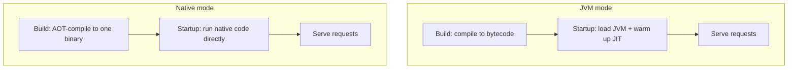

# Native Compilation & Containers

This is the phase the whole guide has been building toward. Back in [Phase 1](01-what-quarkus-is.md) we planted one idea — Quarkus moves framework work from startup to build time — and promised that the same idea unlocks something dramatic at the end. This is the end. You're going to take your `Product` service, the same code you've tested in [Phase 8](08-testing.md), and compile it into a single executable file that boots in tens of milliseconds and sips memory. No JVM. No warmup. Just a binary that *is* your application.

The payoff is real, but native compilation has a reputation for being scary and finicky. It isn't, once you understand *why* it works and *where* it bites. So we'll build the mental model first, the way we always do, and only then run the build.

## JVM mode vs native mode

You already know how Java normally runs, from [/guides/java-from-zero](/guides/java-from-zero). Let's recap it because native mode is defined by contrast.

📝 **JVM mode (the normal way)** — `javac` turns your source into portable **bytecode** (`.class` files). At runtime, the **JVM** loads that bytecode, interprets it at first, and uses the **JIT compiler** to recompile your hot methods into native machine code *while the program runs*. That's why a JVM app has a **warmup** period — it gets faster the longer it runs — and why it carries the JVM itself plus a heap in memory.

That model is excellent for long-running services (it's why steady-state Java can match C). But it has two costs that hurt in the cloud: the JVM has to be present and started, and the warmup tax is paid on every fresh boot.

📝 **Native mode** — instead of shipping bytecode for a JVM to run, you use **GraalVM** to **ahead-of-time (AOT) compile** your entire application — your code, the framework, and the parts of the JDK you actually use — into a single standalone OS executable. There is no separate JVM and no bytecode at runtime. The code is already native machine code from the first instruction.

The difference, side by side:



*What just happened:* notice where the work lives. In JVM mode, "load the JVM and warm up" sits at **startup**, on every boot. In native mode, all the compilation happened once at **build time**, so startup collapses to "start running." The trade is that the native build itself does a lot more work — we'll feel that shortly. The runtime result is a process that starts in **tens of milliseconds** and uses a **fraction of the memory** of the same app on a JVM, because there's no JVM and no JIT machinery to carry.

💡 **Insight.** Native mode doesn't make your *steady-state* request handling dramatically faster — a warmed-up JVM is already very fast. What it eliminates is the *cost of starting and the cost of existing*: boot time and idle memory. That's exactly the bill you pay over and over in containers and serverless, which is why this matters.

## How it's possible: the closed-world assumption

Here's the natural question: if AOT-compiling Java were easy, every framework would do it. Why is it hard, and why can Quarkus do it cleanly?

📝 **The closed-world assumption** — to compile your app to a fixed native binary, GraalVM must know, *at build time*, every class and method the program could ever execute. It performs a reachability analysis from your entry points, compiles everything it can reach, and discards the rest. There's no "load a class we discover later" at runtime, because the binary is sealed — whatever was not included at build time is not there at all.

This is precisely where a traditional Java framework struggles. Classic frameworks *discover* their wiring at startup: they scan the classpath, read annotations via reflection, and construct objects dynamically. From GraalVM's point of view that's a moving target — it can't be sure which classes will actually be loaded, so it can't safely throw anything away.

💡 **Insight — this is why "build-time over runtime" was the foundational idea.** Look back at [Phase 1](01-what-quarkus-is.md) and [Phase 4](04-cdi-with-arc.md): Quarkus *already* resolved all that scanning, reflection, and dependency-injection wiring at build time. So by the time GraalVM shows up, Quarkus can hand it a precise, finished list of exactly what your `Product` service uses. The closed-world assumption isn't a constraint Quarkus fights — it's the thing Quarkus was designed around from the start. Build-time wiring and native compilation are two sides of the same coin.

## Building native

Enough theory — let's compile the `Product` service. The native build is driven by one command:

```bash
quarkus build --native
```

*What just happened:* this tells Quarkus to run a full build and then invoke GraalVM's native-image tool on the result, producing a standalone executable in `target/` (something like `product-service-1.0.0-SNAPSHOT-runner`, with no `.jar` and no JVM needed to launch it). This step requires GraalVM to be installed locally.

Most people don't want to install and manage GraalVM, so Quarkus offers a container-based build instead:

```bash
quarkus build --native -Dquarkus.native.container-build=true
```

*What just happened:* `quarkus.native.container-build=true` tells Quarkus to perform the native compilation *inside a container image* that already has GraalVM set up. You get a native binary built for Linux (perfect for shipping in a container) without installing GraalVM on your own machine — you only need a working container runtime like Docker or Podman.

When you run the resulting binary, the startup line tells the story:

```console
__  ____  __  _____   ___  __ ____  ______
 --/ __ \/ / / / _ | / _ \/ //_/ / / / __/
 -/ /_/ / /_/ / __ |/ , _/ ,< / /_/ /\ \
--\___\_\____/_/ |_/_/|_/_/|_|\____/___/
INFO  product-service 1.0.0-SNAPSHOT native (powered by Quarkus) started in 0.018s.
INFO  Profile prod activated.
INFO  Installed features: [cdi, hibernate-orm-panache, rest, jdbc-postgresql]
```

*What just happened:* read the startup time — `0.018s`, eighteen *milliseconds*. Compare that to the sub-second JVM start from [Phase 1](01-what-quarkus-is.md); native shaves another order of magnitude off. And critically, notice it says **native**, not "on JVM" — there is no JVM in that process at all. The binary is the application.

⚠️ **Gotcha — native builds are slow and memory-hungry, on purpose.** That reachability analysis and AOT compilation is a *lot* of computation — expect **minutes**, not seconds, and a build that can demand several gigabytes of RAM. This is why you do **not** native-build in your day-to-day loop. Your inner loop stays in JVM mode (`quarkus dev` with live reload, from [Phase 2](02-dev-mode-and-dx.md)) and your tests run on the JVM too. Native compilation belongs in **CI and release pipelines**, where a slow build once per release is a fine trade for a tiny, fast artifact.

## The reflection gotcha

Now the single most important pitfall to understand, because it's the one that surprises people: **native works on the JVM but fails as native**.

⚠️ **Gotcha — code GraalVM can't *see* at build time gets dropped.** Remember the closed-world assumption: only reachable code makes it into the binary. The classic way to defeat GraalVM's static analysis is **runtime reflection** or **dynamic class loading** — code that decides *at runtime* to instantiate a class by name, or read its fields reflectively. The analysis can't follow a class name that's computed at runtime, so it concludes that class is unreachable and discards it. Your app then runs perfectly in JVM mode (where everything is loaded on demand) and throws a `ClassNotFoundException` or a missing-method error as a native binary.

The good news: for your `Product` service you'll rarely hit this yourself, because **Quarkus extensions already register their reflection needs at build time**. Hibernate, JAX-RS, JSON serialization — the framework code knows what it reflects on and tells GraalVM. The cases that bite are *your own* code or *third-party libraries* that reflect on classes the framework can't know about.

When that happens, you tell GraalVM explicitly. The simplest tool is an annotation:

```java
import io.quarkus.runtime.annotations.RegisterForReflection;

@RegisterForReflection
public class ProductImportRow {
    public String sku;
    public String name;
    public double price;
}
```

*What just happened:* `@RegisterForReflection` is a build-time instruction to GraalVM: "keep this class and its members, and keep them reflectively accessible, even if the static analysis thinks nothing reaches them." You'd reach for this when, say, a CSV or JSON library populates `ProductImportRow` instances by reflection and the analyzer can't see that path. (There's also a config-file form for classes you can't annotate, like ones inside a third-party JAR.)

💡 **Insight — this is why you native-test in CI.** Because the reflection gotcha is invisible in JVM mode, you cannot catch it by running your normal JVM tests. Quarkus lets you run your integration tests *against the native binary* (the `@QuarkusIntegrationTest` style from [Phase 8](08-testing.md)). Wire that into CI and a dropped class becomes a failed test in the pipeline, not a 2 a.m. production page. The rule: if you ship native, you test native.

## When native is worth it

Native is the top of the ladder, not the price of admission. Choose it deliberately.

💡 **Insight — match the mode to the deployment profile.** Native shines in two situations. First, **serverless and scale-to-zero** workloads, where a function spins up on demand and a slow boot becomes a user-facing **cold start** — eighteen milliseconds vs. several seconds is the difference between snappy and sluggish. Second, **high-density** deployments: many small instances where the per-replica memory bill dominates, and native's tiny footprint lets you pack far more onto the same hardware (cheaper, and faster to autoscale).

For an **always-on** service that boots once and runs for weeks, the calculus flips. A JVM-mode Quarkus app *already* starts fast and uses modest memory (the build-time wiring helps either way), and JVM mode keeps your build fast and skips the reflection gotcha entirely. Plenty of teams develop and even deploy their `Product` service in JVM mode and reach for native only where cold-start latency or memory density truly pays for itself. Neither choice is "the advanced one" — they're different tools for different bills.

## Container-first & Kubernetes

Quarkus was built for containers, so packaging is a first-class concern, not an afterthought.

📝 When you generate a Quarkus project it already includes Dockerfiles under `src/main/docker` — separate ones for JVM mode and for native mode. The native Dockerfile produces a tiny image: just a minimal base plus your single executable, no JDK layer to drag along.

A minimal native Dockerfile looks like this:

```dockerfile
FROM quay.io/quarkus/quarkus-micro-image:2.0
WORKDIR /work/
COPY target/*-runner /work/application
EXPOSE 8080
CMD ["./application", "-Dquarkus.http.host=0.0.0.0"]
```

*What just happened:* the base image is a stripped-down runtime (no JVM — the native binary doesn't need one). We copy in the single `*-runner` executable produced by the native build, expose the HTTP port, and run the binary directly. The result is an image measured in **tens of megabytes** instead of the hundreds a JVM-based image carries. If the container model itself is new to you, [/guides/docker-without-the-magic](/guides/docker-without-the-magic) walks through `FROM`, layers, and `CMD` from the ground up.

Build it:

```bash
quarkus build --native -Dquarkus.native.container-build=true
docker build -f src/main/docker/Dockerfile.native -t product-service:native .
```

*What just happened:* the first command produces the Linux-native binary (in a container, so no local GraalVM needed); the second packages that binary into the small image described above. You now have a deployable artifact — a container that starts in milliseconds.

For the orchestration layer, Quarkus generates Kubernetes manifests for you. Add the `quarkus-kubernetes` extension and the next build emits a ready-to-apply `kubernetes.yml`:

```bash
quarkus extension add kubernetes
quarkus build --native -Dquarkus.native.container-build=true
```

*What just happened:* with the extension present, the build drops Kubernetes resource definitions (a `Deployment`, a `Service`) into `target/kubernetes/` — derived from your app's config, so you don't hand-write boilerplate YAML. You can `kubectl apply` them directly or feed them into your pipeline. If Kubernetes concepts like Deployments and Services are unfamiliar, [/guides/kubernetes-without-the-hype](/guides/kubernetes-without-the-hype) covers what each one does.

💡 **Insight — this is the whole point of Quarkus.** Walk the chain back: build-time wiring → closed-world → native binary → a tiny image → a pod that starts in milliseconds and uses little memory. Small, fast containers are cheaper to run and faster to scale — exactly the costs that hurt in the cloud world [Phase 1](01-what-quarkus-is.md) opened with. Native compilation isn't a party trick bolted on at the end; it's the destination the entire design was pointed at.

## Recap

- **JVM mode vs native mode:** JVM mode ships bytecode that a JVM loads, warms up (JIT), and runs — fast at steady state but with boot + warmup + JVM-memory costs. Native mode uses **GraalVM** to **AOT-compile** the whole app into one standalone executable: ~tens-of-ms startup, a fraction of the memory, no JVM, no warmup.
- **Why it's possible — the closed-world assumption:** GraalVM must know every reachable class/method at build time. Classic frameworks discover wiring at startup and can't promise that; Quarkus already resolved its wiring at **build time** ([Phase 1](01-what-quarkus-is.md), [Phase 4](04-cdi-with-arc.md)), so it hands GraalVM a precise list. Build-time wiring and native are two sides of one coin.
- **Building native:** `quarkus build --native` (needs GraalVM) or add `-Dquarkus.native.container-build=true` to build inside a container with no local GraalVM. ⚠️ Native builds take **minutes** and lots of RAM — do them in **CI/release**, keep dev and test in JVM mode.
- **The reflection gotcha:** the #1 pitfall — runtime reflection / dynamic class loading the analysis can't see gets dropped, so code works on the JVM but fails as native. Extensions handle their own; for your/3rd-party reflective code use `@RegisterForReflection` (or config). This is why you **native-test in CI**.
- **When native is worth it:** great for serverless cold-starts and high-density/low-memory deployments; for always-on services, fast JVM-mode Quarkus is often simpler. Choose by deployment profile.
- **Container-first & Kubernetes:** Quarkus ships Dockerfiles (`src/main/docker`) and produces tiny native images; the `quarkus-kubernetes` extension generates manifests. Small, fast containers = cheaper, faster-scaling deployments — the whole point of Quarkus.

## Quick check

Lock in the trade-offs that decide whether and how you go native:

```quiz
[
  {
    "q": "Why can Quarkus AOT-compile to a GraalVM native image when classic frameworks struggle to?",
    "choices": [
      "Because native images don't use any of the framework's features at runtime",
      "Because Quarkus resolves its wiring at build time, so it can give GraalVM the closed-world list of exactly which classes and methods are reachable",
      "Because GraalVM disables reflection entirely, which classic frameworks rely on",
      "Because Quarkus apps have fewer classes than other frameworks"
    ],
    "answer": 1,
    "explain": "Native compilation needs the closed-world assumption — knowing every reachable class/method at build time. Classic frameworks discover their wiring at startup; Quarkus already resolved it at build time, so it can hand GraalVM a precise, finished list."
  },
  {
    "q": "Your Product service passes all its tests on the JVM, but as a native binary it throws a missing-class error when importing a CSV. What's the most likely cause and fix?",
    "choices": [
      "The native build ran out of memory; rerun it with more RAM",
      "A class is loaded via runtime reflection GraalVM couldn't see at build time, so it was dropped — register it with @RegisterForReflection (or config)",
      "Native mode doesn't support CSV files; switch to JSON",
      "The JVM tests were wrong; native is always correct"
    ],
    "answer": 1,
    "explain": "Under the closed-world assumption, only reachable code is kept. Reflective/dynamic class loading the analyzer can't follow gets discarded, so it works on the JVM but fails native. @RegisterForReflection tells GraalVM to keep the class — and native integration tests in CI catch it."
  },
  {
    "q": "For which deployment profile is native compilation most clearly worth its slow build and reflection caveats?",
    "choices": [
      "A single always-on service that boots once and runs for weeks",
      "Local development where you want the fastest possible inner loop",
      "Serverless or high-density deployments where cold-start latency and per-replica memory directly drive cost",
      "Any app, since native is strictly better than JVM mode in every situation"
    ],
    "answer": 2,
    "explain": "Native eliminates boot time and idle memory — exactly the recurring costs in serverless (cold starts) and high-density deployments. For an always-on service, fast JVM-mode Quarkus is often simpler, and dev should stay in JVM mode for the quick loop."
  }
]
```

---

[← Phase 8: Testing Quarkus Apps](08-testing.md) · [Guide overview](_guide.md) · [Phase 10: Production & Where to Go Next →](10-where-to-go-next.md)
