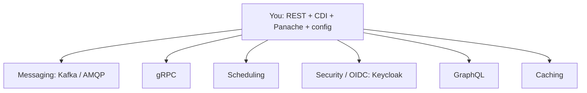

# Production & Where to Go Next

Stop and look at what you can do now. You can stand up a Quarkus service with JAX-RS endpoints and JSON, wire its pieces together with build-time CDI instead of `new` everywhere, persist data through Hibernate with Panache, read configuration from `application.properties` with profiles, and — when you want it — write reactive pipelines with Mutiny and compile the whole thing down to a native executable that boots in tens of milliseconds. That is not a toy. That is the shape of a real cloud-native Java service.

And here's the part that matters most: you understand *why* it's fast. It wasn't a trick. Quarkus moves scanning, reflection, and wiring from runtime to **build time**, so startup is nearly free — and that same build-time work is what lets it compile to native machine code at all. You can now read what's underneath the speed instead of trusting it.

So this last phase isn't more annotations. It's the production essentials you'll want before you ship, the map of where Quarkus goes from here, an honest word on how it sits next to Spring Boot and Jakarta EE, and the one thing that turns all of this from *read* into *yours*: building something and finishing it.

## Production essentials

A service that runs on your laptop isn't quite a service that runs in production. Two small additions cover most of the gap, and in Quarkus both are extensions — you add a capability by adding a dependency.

📝 **Health checks.** Add the SmallRye Health extension and Quarkus exposes `/q/health` for free, built on the MicroProfile Health standard. It splits into `/q/health/live` (**liveness** — "is the process alive, or should it be restarted?") and `/q/health/ready` (**readiness** — "is it ready to take traffic yet?"). These map exactly onto Kubernetes liveness and readiness **probes**, which is the whole point — k8s polls those endpoints to decide when to restart a pod or route requests to it.

**Metrics.** Add the Micrometer extension and you get `/q/metrics` in Prometheus format — request counts, latencies, JVM stats — ready for Prometheus to scrape and Grafana to chart. For **tracing**, the OpenTelemetry extension instruments your service so a request can be followed across service boundaries.

💡 Health, metrics, and traces are the three pillars of knowing what your service is doing in production. The framework specifics are the easy part; the mental model is the valuable part. The [Observability: Logs, Metrics & Traces](/guides/observability-logs-metrics-traces) guide is where that model lives — read it once and these extensions click into place.

**Kubernetes-native deploy.** Quarkus was built for containers, and it shows. The `quarkus-kubernetes` extension generates Kubernetes manifests from your config, and the container-image extensions can build and push an image as part of your normal build. Combined with the native executable from Phase 9, you get a tiny image that starts almost instantly — which is exactly what autoscaling and serverless reward.

## The extension ecosystem — where to go from here

Almost everything beyond the core is an **extension**. Need messaging? Add an extension. Need scheduled jobs, gRPC, or login with Keycloak? Add an extension. Each one brings build-time integration, sensible defaults, and Dev UI support along for the ride.



*What this shows:* six common directions out from where you stand. **Reactive Messaging** (Kafka or AMQP) is how you build event-driven systems where a service drops an event and moves on. **gRPC** gives you fast, typed service-to-service calls. **Scheduling** runs cron-style jobs. **OIDC** wires up authentication against an identity provider like Keycloak. **GraphQL** offers a different API shape, and **caching** is a single annotation away.

💡 The honest move here is not to memorize the catalog — it's to know the catalog exists. When you hit a need, browse the extensions, add the one that fits, and let Quarkus do the build-time wiring. That's the whole workflow.

## Quarkus vs the field, honestly

Quarkus is not the only good answer, and pretending otherwise would do you a disservice. **Quarkus**, **Spring Boot**, and the **Jakarta EE / MicroProfile** servers (Helidon, Open Liberty) all overlap heavily — they all do REST, dependency injection, and persistence, and they all run real production workloads at serious companies.

What's Quarkus's actual edge? Startup time, memory footprint, native compilation, and developer experience — that loved dev mode from Phase 2. Where it's *not* clearly ahead: ecosystem breadth and sheer gravity, where Spring Boot still leads.

Here's the reassuring part. Because Quarkus runs the **shared standards** — CDI, JAX-RS, JPA, MicroProfile — the knowledge moves with you. The CDI you learned here is the CDI in [Jakarta EE](/guides/jakarta-ee-from-zero); the layered, injected, tested service is the same shape you'd build in [Spring Boot](/guides/spring-boot-from-zero). All three are employable. Knowing the standards means you can step between frameworks without starting over — which is exactly why this guide assumed them.

## What to actually build

Reading got you here. *Building* is what makes it stick — and the trick is something small enough to finish but real enough to teach you the messy parts. A concrete path that uses what you've got:

- **Take the `Product` service and make it production-shaped.** Add the health and metrics extensions, confirm `/q/health` and `/q/metrics` respond, then compile it native and run it inside a container. You've now felt the full Quarkus loop — code, observe, build native, ship — on something you already understand.
- **Add a Kafka consumer.** Wire in reactive messaging so the service reacts to events instead of only answering HTTP. That's your first taste of event-driven design without a big new framework to learn.
- **Or build a serverless function and feel the cold-start win.** Deploy a native Quarkus function where startup time is billed and visible. This is where "supersonic subatomic" stops being a slogan and becomes a number you can see.

Whatever you pick, the real instruction is one word: **finish**. One rough project carried all the way to "it runs and I can show it" teaches you more than three polished half-builds abandoned at 80%. Choose the one that excites you and take it end to end.

## A last word, and what to read

One bookmark is worth more than the rest: **quarkus.io/guides**. They're short, task-shaped walkthroughs maintained by the people who build Quarkus — "I want to do X" maps directly to a guide. Pair that with the **extension catalog** on the same site, which is how you'll answer "is there an extension for this?" (there usually is).

And remember the through-line of this whole guide. The speed was never magic. It was build-time work — scanning, reflecting, and wiring done at *compile* time instead of *startup* time — work you now understand well enough to reason about when something behaves strangely. You came in wary of "supersonic subatomic Java"; you're leaving able to explain it, build on it, and ship it. Go build the small thing, finish it, and watch it boot.

## Recap

1. **You can build and reason about a fast Quarkus service** — REST, build-time CDI, Panache, config, optional reactive and native — and you know the speed comes from moving work to build time.
2. **Production essentials are extensions:** SmallRye Health (`/q/health` liveness/readiness for k8s probes), Micrometer (`/q/metrics` for Prometheus), OpenTelemetry for tracing, plus `quarkus-kubernetes` and container-image extensions for deploy.
3. **You add a capability by adding an extension** — messaging (Kafka/AMQP), gRPC, scheduling, OIDC/Keycloak, GraphQL, caching. Know the catalog exists and browse it for your need.
4. **Quarkus, Spring Boot, and Jakarta EE overlap heavily** — Quarkus's edge is startup, memory, native, and DX. All are employable, and the shared standards (CDI/JAX-RS/JPA) let you move between them.
5. **Build one real thing and finish it** — make the `Product` service production-shaped with health and metrics, run it native in a container, add a Kafka consumer or a serverless function. Finishing beats polishing.
6. **Next reading:** quarkus.io/guides and the extension catalog. The speed was never magic — it's the build-time work you now understand.

## Quick check

Test yourself on the decisions that matter most as you leave this guide:

```quiz
[
  {
    "q": "In Quarkus, how do you add a production capability like health checks or Kafka messaging?",
    "choices": [
      "Add the matching extension (a dependency), and Quarkus wires it in at build time",
      "Rewrite the service against a separate, heavier framework",
      "Hand-configure it at runtime with reflection-based scanning",
      "It's only possible in the native build, not on the JVM"
    ],
    "answer": 0,
    "explain": "The Quarkus workflow is: hit a need, add the extension for it, and let Quarkus do the build-time integration. Health, metrics, messaging, gRPC, OIDC, and more are all extensions."
  },
  {
    "q": "Why do Quarkus's /q/health/live and /q/health/ready endpoints matter for deployment?",
    "choices": [
      "They map directly onto Kubernetes liveness and readiness probes, telling k8s when to restart a pod and when to send it traffic",
      "They are required for the native executable to compile",
      "They replace the need for metrics and tracing entirely",
      "They make the JVM start faster"
    ],
    "answer": 0,
    "explain": "Liveness answers 'is the process alive, or should it be restarted?' and readiness answers 'is it ready for traffic yet?' — which is exactly what Kubernetes probes poll to manage your pods."
  },
  {
    "q": "What's the honest relationship between Quarkus, Spring Boot, and Jakarta EE?",
    "choices": [
      "They overlap heavily on the shared standards; Quarkus's edge is startup, memory, native, and DX, and knowing the standards lets you move between them",
      "Quarkus replaced both, which are now obsolete",
      "They share no concepts, so learning one teaches you nothing about the others",
      "Only Quarkus is employable in modern jobs"
    ],
    "answer": 0,
    "explain": "All three run CDI, JAX-RS, and JPA and power real production workloads. Quarkus's edge is startup/memory/native/DX, and because the standards are shared, your knowledge moves with you between frameworks."
  }
]
```

---

[← Phase 9: Native Compilation & Containers](09-native-compilation.md) · [Guide overview](_guide.md)
