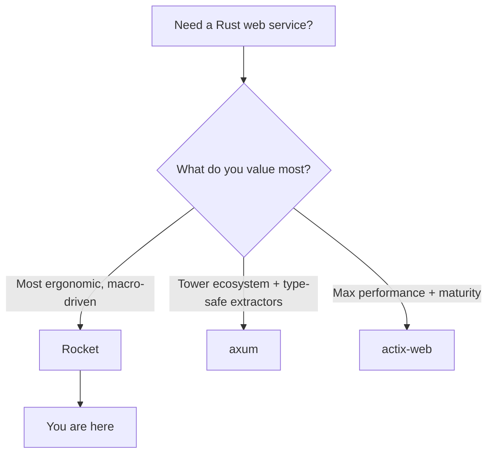

# Where to Go Next

Look at what you can actually do now. Write `#[get("/books/<id>")]` above a function and have a server route to it, pull pieces out of a request through dynamic path segments and query params, gate a handler behind a **request guard** that must succeed before the function runs, accept and return `Json<T>`, build custom **responders**, share a store across handlers with **managed state** and `.manage(...)`, wrap the whole thing in a **fairing**, serve full CRUD with `#[catch(404)]` **error catchers**, and test it with the local client before shipping it with a `Rocket.toml` and config profiles. That is a real REST API, not a toy.

Rocket's "magic" is no longer magic to you. You know the throughline cold: an **attribute is the route**, the **function signature is the request** (path, query, body, and guards), the **return type is the response**, and macros wire it together. The day something misbehaves, you'll know which of those three pieces to look at.

This last phase isn't more handlers. It's the map: where Rocket sits among the other Rust web frameworks, the layer you'll almost certainly add next, the roots worth learning, and one concrete thing to go build.

## Rocket vs the field

You now know enough to choose a framework *on purpose* rather than by reputation. The good news in Rust: the big three are all production-grade and all fast. The differences are about *feel* and *what you build on*, not whole different universes.



A line on each:

- **Rocket** — the most **ergonomic** of the three, leaning hard on macros to make handler code wonderfully concise: request guards, error catchers, fairings, and managed state come batteries-included, and routes read almost like Flask. If you want the least ceremony and the most readable code, this is your style. (You are here.)
- **axum** — the modern, tower-native default from the Tokio team, driven by the type system: plain `async fn` handlers, extractors as arguments, `IntoResponse` returns. Its quiet superpower is the **tower** ecosystem — reusable middleware and a clean path to gRPC. See [axum From Zero](/guides/axum-from-zero).
- **actix-web** — the mature, batteries-included heavyweight, consistently at or near the **top of the performance benchmarks**. If raw throughput and a long track record matter most, this is your pick. See [actix-web From Zero](/guides/actix-web-from-zero).

> 💡 How to pick: reach for **Rocket** when you want the most concise, approachable Rust web code. Reach for **axum** when you want the tower ecosystem and type-safe extractors. Reach for **actix-web** when you want raw performance and maturity.

📝 An honest note worth carrying: Rocket's release cadence has been slower than axum's, and axum has more community momentum right now. None of that makes Rocket a wrong choice — Rocket 0.5 is stable, fully async, and a genuine joy for app code. The senior instinct isn't memorizing a winner; it's asking "best for *this* job?" and answering honestly. You have the pieces for that now.

## The layer you'll add next: a real database

Every API in this guide kept its books in memory. That's perfect for learning and useless in production — restart the server and the data is gone. The very next thing almost every real Rocket service grows is a **database**.

Rocket has a tidy answer here: **`rocket_db_pools`**. It integrates a connection pool (backed by `sqlx`, SeaORM, or Deadpool) with Rocket's own machinery — the pool lives as **managed state** and is configured straight from your `Rocket.toml`, the same config system you met in Phase 7. You add a small derive, name your database in config, and then a pool connection becomes something a handler can ask for, right alongside the guards and state you already use.

If you'd rather keep it lean, you can also drop a plain **`sqlx::Pool`** into managed `State` yourself and pull it out with `State<T>` — the exact pattern from Phase 5, with a connection pool in the slot where your in-memory store used to sit.

A word on the data layer itself, because Rust has **no single default ORM**:

- **`sqlx`** — not an ORM at all, but the most popular companion. You write **raw SQL**, and a macro checks your queries **against a real database at compile time** — a typo'd column is a build error, not a 500 in production. Fully async, fits Rocket cleanly.
- **SeaORM** — a proper **async ORM** built on top of sqlx, for when you want entities, relations, and a query builder instead of hand-written SQL.
- **Diesel** — the **mature, established** ORM with a rich type-safe query DSL, more sync-flavored in its roots.

The reassuring bit: your handlers barely change. That Phase 5 investment in managed state pays off — you're swapping the bottom layer, not rewriting the top.

## The roots: Tokio

Rocket is async all the way down, and the thing actually driving every `.await` in your handlers is **Tokio** — the runtime that schedules tasks and handles the I/O. You've been standing on it the whole time, often without naming it. You don't need to know Tokio to ship, but the day you want to understand *why* an async handler behaves the way it does, that's where the floor drops away. See [Tokio: The Async Runtime](/guides/tokio-the-async-runtime).

## What to build

Reading more won't make this stick. Building one real thing will. Take the **books API** you grew across this guide and carry it all the way home:

- **Swap the in-memory store for `rocket_db_pools` + sqlx** so the books survive a restart. Name the database in `Rocket.toml`, write a few compile-checked queries, and watch your handlers stay almost exactly as they were.
- **Add real auth via a `FromRequest` guard** — a JWT or session check that runs before the handler, so each request proves who it is and books belong to a user. This is the request-guard pattern from Phase 3, aimed at a real job.
- **Add a fairing** for CORS or request logging, the middleware pattern from Phase 5 doing actual production work.
- **Generate API docs** with OpenAPI via **okapi** (or utoipa), so other people — and future you — can read the contract.
- **Tidy up config** with profiles, so secrets, the database URL, and the port come from the environment, not hardcoded values.
- **Deploy it** somewhere you can hit from your phone.

If the books API feels too familiar, build something small and new end to end instead — a **URL shortener** or a **notes API**. Same muscles: routes, guards, state, fairings, catchers, tests, config, deploy. Finishing one project completely teaches more than three more tutorials would.

## The honest close

Rocket was never magic. Strip it back and it's a handful of ideas you now understand completely: the **attribute is the route**, the **signature is the request**, the **return type is the response** — plus **guards** that gate the handler, **managed state** it can reach for, **fairings** that wrap it, and **catchers** that handle what goes wrong. Macros wire those together, and underneath it's plain async Rust on Tokio, checked by the compiler.

That's why you can read the machine now. Go finish the books API, give it a real database through `rocket_db_pools`, lock it behind a `FromRequest` guard, wrap it in a fairing, deploy it, and show someone. You're ready.

## Recap

1. **You can ship a real Rocket API** — attribute routes, dynamic paths, guards and data, responders, managed state and fairings, CRUD with catchers, tested and configured — and you understand the throughline: attribute = route, signature = request, return type = response.
2. **Choose a framework on purpose** — Rocket for the most concise, ergonomic, macro-driven code; axum for the tower ecosystem and type-safe extractors; actix-web for raw performance and maturity. Rocket's cadence is slower and axum has more momentum, but Rocket 0.5 is stable and a joy for app code.
3. **A database is the next layer** — `rocket_db_pools` wires a pool into managed state and `Rocket.toml` config, or drop a `sqlx::Pool` into `State` yourself. Rust has no single default ORM: sqlx (compile-checked raw SQL), SeaORM (async ORM), or Diesel (mature ORM).
4. **Tokio is the root** — the async runtime driving every `.await` in your handlers; learn it to remove the last of the magic.
5. **Build and finish one thing** — carry the books API to `rocket_db_pools` + sqlx, a JWT/session `FromRequest` auth guard, a logging/CORS fairing, OpenAPI docs, config profiles, and a deploy. Or build a small URL shortener / notes API end to end.

## Quick check

Three decisions to take with you as you leave this guide:

```quiz
[
  {
    "q": "You want the most concise, approachable Rust web code, with batteries-included guards, catchers, and fairings. Which framework fits on purpose?",
    "choices": [
      "actix-web, because it's the fastest",
      "axum, because it's tower-native",
      "Rocket, the most ergonomic and macro-driven of the three",
      "None of them support middleware"
    ],
    "answer": 2,
    "explain": "Rocket leans on macros for the most concise, readable handler code, with request guards, error catchers, and fairings built in. Pick axum for the tower ecosystem and type-safe extractors, actix-web for raw performance and maturity."
  },
  {
    "q": "What does rocket_db_pools give you when you add a database to a Rocket app?",
    "choices": [
      "It replaces your handlers with auto-generated CRUD",
      "It integrates a connection pool (sqlx/SeaORM/Deadpool) as managed state, configured from Rocket.toml",
      "It only works with Diesel and forces synchronous queries",
      "It removes the need for any SQL at all"
    ],
    "answer": 1,
    "explain": "rocket_db_pools wires a connection pool into Rocket's managed state and reads its config from Rocket.toml — the same state and config systems from Phases 5 and 7. You still write queries; the pool just drops into the slot your in-memory store used to fill."
  },
  {
    "q": "What is the honest situation with ORMs in Rust for a Rocket API?",
    "choices": [
      "Rocket ships its own official ORM you must use",
      "There's no single default — sqlx (compile-checked raw SQL), SeaORM (async ORM on top of sqlx), and Diesel (mature ORM) are the common choices",
      "Only Diesel works with async Rust",
      "Rust web apps can't use a database"
    ],
    "answer": 1,
    "explain": "Rust has no single default ORM. sqlx checks raw SQL at compile time, SeaORM is an async ORM built on it, and Diesel is the mature, more sync-flavored option. You choose based on the job."
  }
]
```

---

[← Phase 7: Testing & Configuration](07-testing-and-config.md) · [Guide overview](_guide.md)
