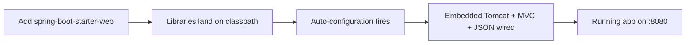

# What Spring Boot Is & Your First App

If you've heard Spring described as "the heavyweight enterprise Java thing with a thousand XML files," that reputation was earned — about fifteen years ago. Spring Boot is the answer the Spring team built to that exact pain. The single biggest thing that confuses newcomers isn't the syntax — it's not understanding what the framework is doing on your behalf. Once you can see the machinery, Boot stops feeling like magic and starts feeling like a very well-organized assistant.

We'll untangle Spring from Spring Boot, demystify "auto-configuration," meet starters, and stand up a real web app you can hit in a browser.

This guide assumes you're comfortable with Java classes, methods, and annotations — if `public class`, `@Override`, and `new` aren't second nature yet, spend a little time in [/guides/java-from-zero](/guides/java-from-zero) first. It also builds on the framework mental model from [/guides/what-a-framework-even-is](/guides/what-a-framework-even-is) — we'll lean on *inversion of control* more than once.

## The mental model: Spring is the toolbox, Boot is the toolbox pre-assembled

📝 **Spring (the Framework)** is a huge collection of tools for building Java applications: an **IoC container** that constructs and connects your objects, **Spring MVC** for handling web requests, **Spring Data** for talking to databases, **Spring Security** for auth, and a lot more. It's powerful and flexible — and historically, that flexibility meant *you* had to configure every piece by hand, often in long XML files, before anything would run.

📝 **Spring Boot** is Spring with three things added on top: **auto-configuration** (Boot wires up sane defaults for you), **sensible defaults** (it picks reasonable settings so you don't have to specify everything), and an **embedded server** (a web server lives *inside* your app, so there's nothing separate to install and deploy to). The one-line version:

> 💡 **Key point.** Boot doesn't replace Spring — it *is* Spring, with the boilerplate already filled in. Think of Spring as a kitchen full of professional equipment, and Spring Boot as that same kitchen with the oven preheated, the knives sharpened, and a recipe on the counter. Same tools. You just start cooking instead of assembling.

So whenever someone says "I'm using Spring Boot," they're using Spring. Boot is the on-ramp.

## Auto-configuration, demystified

Auto-configuration is the part that feels like sorcery — the single most important idea in this guide.

📝 **Auto-configuration** is Boot looking at what's on your project's **classpath** — the set of libraries your app has available — and configuring those libraries with reasonable defaults, *automatically*, at startup. Add the library that does web stuff, and Boot notices and sets up a web server and JSON handling. Add a database driver, and Boot notices and sets up a connection to the database.

The crucial thing to internalize:

> 💡 **Key point.** Auto-configuration is *conditional* configuration, not guesswork. Under the hood it's a pile of rules shaped like "**if** the H2 database library is present **and** the developer hasn't already defined a database connection, **then** configure an in-memory H2 database." Boot ships hundreds of these `@Conditional` rules. Each one only fires when its conditions are met. Nothing happens by spooky action — every default is a rule you could read.

That conditional design is also why auto-configuration never traps you. Every rule includes a condition like "...and the developer hasn't configured this themselves." The moment *you* define a piece of configuration, Boot's rule for that piece backs off and lets yours win.

⚠️ **Gotcha — "magic" you can't see is still magic *to you*.** The convenience is real, but a default you didn't choose is a default you might not know about. When something behaves unexpectedly (a port, a JSON format, a database that "appeared"), the cause is almost always an auto-configuration default. Learning to *ask* "what did Boot auto-configure here?" is a core Spring Boot skill — and Boot can print exactly what it decided. We'll come back to that.

The trigger for all this convenience is wonderfully simple: you add a *starter*.

## Starters: curated bundles for one job

You don't hand-pick fifteen libraries and pray their versions are compatible. You add one starter.

📝 A **starter** is a curated bundle of dependencies for a single job, published by the Spring team with versions that are known to work together. `spring-boot-starter-web` is the bundle for building web apps — pull it in and you get Spring MVC, an embedded **Tomcat** server, JSON support (via Jackson), and validation, all in one line. There are starters for data access, security, testing, messaging, and dozens more.

Here's what adding the web starter looks like in a Maven `pom.xml`:

```xml
<dependency>
    <groupId>org.springframework.boot</groupId>
    <artifactId>spring-boot-starter-web</artifactId>
</dependency>
```

*What just happened:* you declared a single dependency, and behind it sits an entire stack — the web framework, the server, the JSON serializer, the validator — with mutually compatible versions chosen for you. You did **not** list Tomcat, Jackson, or Spring MVC individually, and you did **not** pin any version numbers (Boot's parent project manages those). One line in, and there's enough on the classpath for auto-configuration to stand up a working web server.

💡 **Insight.** This is the loop that *is* Spring Boot: **you add a starter → that starter puts libraries on the classpath → auto-configuration sees them and wires sane defaults.** Almost everything you'll do in Boot is some version of "add the right starter, let Boot configure it, override the bits you care about."

## Your first app

The fastest way to start a Boot project is **Spring Initializr**.

📝 **Spring Initializr** (at [start.spring.io](https://start.spring.io)) is a web page that generates a ready-to-run Boot project for you. You pick your build tool (Maven or Gradle), your Java version, and which starters you want, then download a zip with the folder structure, build file, and a main class already in place. It's the official "new project" button for Spring Boot.

Go to start.spring.io, choose **Maven**, add the **Spring Web** dependency (that's `spring-boot-starter-web`), and generate. Unzip it, and the heart of what you get is one small class:

```java
package com.example.demo;

import org.springframework.boot.SpringApplication;
import org.springframework.boot.autoconfigure.SpringBootApplication;

@SpringBootApplication
public class DemoApplication {

    public static void main(String[] args) {
        SpringApplication.run(DemoApplication.class, args);
    }
}
```

*What just happened:* this is the entry point of your whole application. Your normal Java `main` method is still here — Boot didn't invent a new way to start a program — but instead of your code doing the work, it calls `SpringApplication.run(...)` and hands control to Spring. That one call boots the framework: it creates the IoC container, runs auto-configuration, finds your code, and starts the embedded server. This is *inversion of control* in the flesh — `main` is the last moment your code is in charge. After `run(...)`, the framework drives and calls back into your code when it needs you.

The one annotation doing the heavy lifting is `@SpringBootApplication`. It looks innocent, but it's three annotations bundled into one:

📝 **`@SpringBootApplication`** combines:
- **`@SpringBootConfiguration`** — marks this class as a source of bean/config definitions.
- **`@EnableAutoConfiguration`** — turns on the auto-configuration machinery we just discussed.
- **`@ComponentScan`** — tells Spring to scan *this package and everything below it* for your components (controllers, services, and so on) and register them automatically.

⚠️ **Gotcha — package placement matters.** Because `@ComponentScan` searches downward from the package of your main class, anything you write needs to live in that package or a sub-package. A controller dropped into a sibling or parent package won't be found, and you'll get a confusing 404 with no obvious cause. Keep your code under the main class's package and this never bites you.

Now let's add something to actually respond to a request. Create a class next to `DemoApplication`:

```java
package com.example.demo;

import org.springframework.web.bind.annotation.GetMapping;
import org.springframework.web.bind.annotation.RestController;

@RestController
public class HelloController {

    @GetMapping("/")
    public String hello() {
        return "Hello from Spring Boot!";
    }
}
```

*What just happened:* `@RestController` tells Spring "this class holds web request handlers, and whatever they return is the HTTP response body." `@GetMapping("/")` maps HTTP `GET` requests for the root URL to the `hello()` method. You didn't write any code to open a socket, parse the incoming request, match the URL, or format the response — you described *which URL runs which method*, and the framework owns everything around it.

Run it from the project folder. Boot projects ship with a wrapper script so you don't even need Maven installed globally:

```bash
./mvnw spring-boot:run
```

You'll see Boot start up and announce the embedded server:

```console
  .   ____          _            __ _ _
 /\\ / ___'_ __ _ _(_)_ __  __ _ \ \ \ \
( ( )\___ | '_ | '_| | '_ \/ _` | \ \ \ \
 \\/  ___)| |_)| | | | | || (_| |  ) ) ) )
  '  |____| .__|_| |_|_| |_\__, | / / / /
 =========|_|==============|___/=/_/_/_/
 :: Spring Boot ::                (v3.x.x)

INFO  Starting DemoApplication using Java 21
INFO  Tomcat initialized with port 8080 (http)
INFO  Tomcat started on port 8080 (http) with context path '/'
INFO  Started DemoApplication in 1.42 seconds
```

*What just happened:* that output is a receipt of everything Boot did. It started **Tomcat** — a full web server — *inside* your process, on port 8080, without you installing or configuring a server anywhere. Open a browser to `http://localhost:8080` and you'll see `Hello from Spring Boot!` — a real HTTP server, serving your code, from a project you generated minutes ago.

## What you didn't have to do

Count what you *didn't* write, because the gap is the entire value proposition:

- **No server install or setup.** Tomcat came embedded via the web starter and started itself. There's no separate server to download, configure, or deploy a `.war` file into.
- **No JSON wiring.** Return an object from a controller and Boot serializes it to JSON automatically (Jackson, auto-configured). You'll lean on this constantly.
- **No manual object wiring — yet.** The IoC container built and connected the objects in your app. We've only scratched this; it's the whole of [Phase 2: Dependency Injection & Beans](02-dependency-injection-and-beans.md).
- **No version juggling.** The starter and Boot's parent picked compatible library versions, sidestepping the "dependency hell" that plagued old-school Spring.
- **No boilerplate config files.** No XML, no manual server descriptors. Sensible defaults covered it.

Here's the whole loop as one picture:



That convenience is the payoff — and the thing to stay aware of. Every box in that diagram is a place Boot made a decision *for* you. Most of the time those decisions are exactly right, which is why Boot is a joy to start with. But engineers who are great with Spring Boot can name what's in each box when they need to: which server, which defaults, which auto-configuration rules fired.

💡 **Insight — make the magic visible.** Boot can tell you exactly what it auto-configured. Set the property `debug=true` (in `application.properties`) and on startup it prints an **auto-configuration report** listing every rule that matched and every rule that didn't, with the reason. When something behaves in a way you didn't ask for, that report is where "magic" turns into "oh, *that's* why."

## Recap

- **Spring is the toolbox; Spring Boot is that toolbox pre-assembled** — Boot is Spring plus auto-configuration, sensible defaults, and an embedded server. It doesn't replace Spring; it removes the boilerplate.
- **Auto-configuration is conditional configuration, not magic.** Boot reads your classpath and applies hundreds of "if this library is present and you haven't configured it yourself, then set up this default" rules. The moment you configure something, Boot's default steps aside.
- **Starters are curated dependency bundles for one job.** `spring-boot-starter-web` brings Spring MVC, embedded Tomcat, and JSON support in a single line with versions chosen for you.
- **The core loop:** add a starter → libraries hit the classpath → auto-configuration wires sane defaults you can override.
- **`@SpringBootApplication` = config + `@EnableAutoConfiguration` + `@ComponentScan`,** and `SpringApplication.run(...)` is where your code hands control to the framework — inversion of control, live.
- **Stay aware of the defaults.** The convenience is real, but `debug=true` prints the auto-configuration report so the "magic" is always something you can read.

## Quick check

Test the mental model before moving on:

```quiz
[
  {
    "q": "What is the key difference between Spring and Spring Boot?",
    "choices": [
      "Spring Boot is a different framework that replaces Spring entirely",
      "Spring Boot is Spring with auto-configuration, sensible defaults, and an embedded server added on top",
      "Spring is for web apps and Spring Boot is for desktop apps",
      "Spring Boot removes the IoC container that Spring uses"
    ],
    "answer": 1,
    "explain": "Spring Boot doesn't replace Spring — it IS Spring, with the boilerplate pre-filled via auto-configuration, sensible defaults, and an embedded server."
  },
  {
    "q": "How does auto-configuration decide what to set up?",
    "choices": [
      "It asks you a series of questions when the app starts",
      "It configures every possible feature whether you use it or not",
      "It looks at what libraries are on the classpath and applies conditional rules, backing off when you've configured something yourself",
      "It reads a mandatory XML file you must write by hand"
    ],
    "answer": 2,
    "explain": "Auto-configuration is conditional: 'if this library is present and you haven't configured it yourself, then apply this default.' Your own config always wins."
  },
  {
    "q": "What three annotations does @SpringBootApplication bundle together?",
    "choices": [
      "@RestController, @GetMapping, and @Service",
      "@Configuration, @EnableAutoConfiguration, and @ComponentScan",
      "@Autowired, @Bean, and @Component",
      "@SpringBootTest, @Profile, and @Value"
    ],
    "answer": 1,
    "explain": "@SpringBootApplication combines @SpringBootConfiguration (a form of @Configuration), @EnableAutoConfiguration (turns on auto-config), and @ComponentScan (finds your components)."
  }
]
```

---

[Guide overview](_guide.md) · [Phase 2: Dependency Injection & Beans →](02-dependency-injection-and-beans.md)
