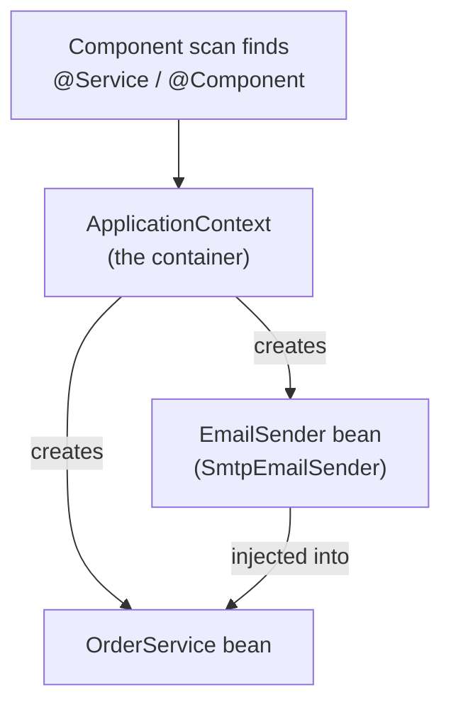

# Dependency Injection & Beans

In Phase 1 you got a Spring Boot app running and saw that the "magic" was really auto-configured Spring
quietly wiring things up for you. This phase is about the single mechanism doing most of that wiring —
the one idea that, once it clicks, makes the rest of Spring stop feeling like sorcery: **dependency
injection**, sitting at the dead center of everything Spring does.

The mental model to carry through: in a normal program, your objects build the other objects they need.
In a Spring program, **a container builds your objects for you and hands them the things they depend
on.** You stop writing `new`, and you start *describing* what you need. Get that single inversion, and
`@Service`, `@Autowired`, repositories, controllers — all of it — turn from incantations into plain
machinery.

## The problem: objects building their own dependencies

Say you're writing an `OrderService` that needs to send a confirmation email. The straightforward way:
have the service create the emailer it needs.

```java
public class OrderService {
    private final EmailSender emailSender;

    public OrderService() {
        this.emailSender = new SmtpEmailSender("smtp.acme.com", 587);  // builds its own dependency
    }

    public void placeOrder(Order order) {
        // ... save the order ...
        emailSender.send(order.customerEmail(), "Your order is confirmed!");
    }
}
```
*What just happened:* `OrderService` reached out and built its own `SmtpEmailSender`, hard-coding the
server and port right into its constructor. It works — until it doesn't. Look at what you've trapped
yourself into:

- **Tight coupling.** `OrderService` is now welded to `SmtpEmailSender` specifically. Want to swap in a
  different sender — say one that uses a third-party API? You have to crack open `OrderService` and edit
  it.
- **Untestable.** To test `placeOrder`, you'd fire a *real email* at a *real SMTP server* every test
  run. There's no seam to slip a fake emailer in.
- **Hidden setup.** That SMTP host and port are buried inside the class. Configuration is tangled up with
  business logic.

The root cause: `OrderService` is doing two jobs — deciding *what* its dependency is, and using it.
Dependency injection's whole pitch is to take the first job away.

## Inversion of Control: let the container build your objects

📝 **Inversion of Control (IoC)** — instead of *your code* creating the objects it needs, a **container**
creates them and supplies them to your code. Control over object creation is *inverted*: it moves out of
your classes and into the framework. (This is the framework principle from
[What a Framework Even Is](/guides/what-a-framework-even-is) — "don't call us, we'll call you" — made
concrete: the framework even *builds* your code's objects.)

Spring's container is the engine that does this. You hand it the recipe for your objects; it
constructs them, figures out what each one depends on, and wires the whole graph together at startup.

📝 **Bean** — an object that the Spring container creates, wires up, and manages. That's the entire
definition. A "bean" isn't a special kind of class or some exotic type; it's just one of *your* ordinary
objects that you've handed to Spring to own. When people say "register a bean," they mean "tell the
container to manage this object for you."

So the shift is: you stop writing `new SmtpEmailSender(...)`, and instead you tell Spring "this is a
thing you should manage" and "this service needs one of those." Spring does the connecting. Let's see how
you say that.

## Declaring beans: `@Component` and its flavors

You tell the container "manage this class" by annotating it. The base annotation is `@Component`. When
your app starts, Spring does **component scanning** — it walks the packages under your main application
class, finds every class marked as a component, and creates one instance of each as a bean.

```java
import org.springframework.stereotype.Component;

@Component
public class SmtpEmailSender implements EmailSender {
    @Override
    public void send(String to, String message) {
        System.out.println("Sending email to " + to + ": " + message);
    }
}
```
*What just happened:* `@Component` is a flag that says "Spring, this is yours — make a bean out of it."
On startup, component scanning spots it, calls `new SmtpEmailSender()` *for* you, and stashes the
resulting object in the container, ready to hand to anything that needs an `EmailSender`.

💡 Spring gives you **semantic flavors** of `@Component` that mean the exact same thing to the container
but document a class's *role* — and let Spring add layer-specific behavior later:

- `@Service` — business logic (your `OrderService`).
- `@Repository` — data access; also translates database exceptions into Spring's consistent ones.
- `@Controller` / `@RestController` — handles web requests (Phase 3's whole topic).
- `@Component` — the generic fallback when none of the above fit.

They're all components under the hood. Use the specific one that names what the class *does*; it makes
the architecture readable at a glance. So our service becomes:

```java
import org.springframework.stereotype.Service;

@Service
public class OrderService {
    // ... we'll fill in the dependency next ...
}
```
*What just happened:* `@Service` registers `OrderService` as a bean *and* signals "this is a business-logic
class." Functionally identical to `@Component`; clearer to every human who reads it.

## Injecting dependencies: constructor injection

Now the payoff. `OrderService` needs an `EmailSender`. Instead of building one, it **declares** that it
needs one — by taking it as a constructor parameter. Spring sees the parameter and supplies the matching
bean automatically.

```java
import org.springframework.stereotype.Service;

@Service
public class OrderService {
    private final EmailSender emailSender;   // a dependency, not built here

    public OrderService(EmailSender emailSender) {   // Spring passes one in
        this.emailSender = emailSender;
    }

    public void placeOrder(Order order) {
        // ... save the order ...
        emailSender.send(order.customerEmail(), "Your order is confirmed!");
        System.out.println("Order placed for " + order.customerEmail());
    }
}
```
*What just happened:* `OrderService` no longer knows or cares *which* `EmailSender` it gets — it just asks
for one in its constructor. At startup Spring sees this class needs an `EmailSender`, finds the
`SmtpEmailSender` bean it already created, and passes it in. This is **constructor injection**:
dependencies arrive through the constructor, and the container fills them in. Notice `emailSender` is
`final` — once Spring sets it, it can never change.

This is the recommended way to inject in Spring, and it's worth knowing *why*:

- **Explicit dependencies.** The constructor signature is an honest list of everything this class needs.
  Read the constructor, know the dependencies. Nothing hidden.
- **Immutable & safe.** `final` fields can't be reassigned, and the object is fully built the moment it
  exists — there's no half-constructed window where a dependency is still `null`.
- **Trivially testable.** In a test you just call `new OrderService(fakeEmailSender)` — no Spring required.
  That seam we were missing earlier? The constructor *is* the seam.

💡 When a class has exactly **one constructor**, you don't even need an annotation on it — Spring uses it
for injection automatically. (Older code you'll meet puts `@Autowired` on the constructor; with a single
constructor it's optional and usually omitted now.)

### The discouraged way: field `@Autowired`

You'll see a lot of older tutorials inject straight into a field instead:

```java
@Service
public class OrderService {
    @Autowired                       // ⚠️ field injection — avoid this
    private EmailSender emailSender;

    public void placeOrder(Order order) {
        emailSender.send(order.customerEmail(), "Your order is confirmed!");
    }
}
```
*What just happened:* `@Autowired` on the field tells Spring to reach in and set `emailSender` directly,
no constructor needed. It looks shorter — that's the trap.

⚠️ **Prefer constructor injection over field `@Autowired`.** Field injection hides dependencies (the
constructor no longer lists them, so the only way to know what a class needs is to scan for annotations),
can't use `final` (the field is mutable and `null` until Spring fills it), and is painful to test — you
can't just `new` the object with fakes; you need reflection or a full Spring context. Use the constructor.
Newer code rarely uses field injection at all.

## The ApplicationContext: where swapping implementations pays off

📝 **ApplicationContext** — Spring's container itself; the registry that holds every bean and knows how
they connect. At startup Spring builds the context, fills it with your scanned beans, and wires each one's
dependencies. When your app needs an object, it comes from the context, fully assembled.

Here's the part that makes the whole exercise worth it. `OrderService` depends on the **interface**
`EmailSender`, not on the concrete `SmtpEmailSender`. So the container can inject *any* class that
implements `EmailSender` — and `OrderService` never notices the difference. In production it gets the
real SMTP sender; in a test you swap in a fake:

```java
public class OrderServiceTest {
    @Test
    void placingAnOrderSendsConfirmation() {
        var fakeSender = new RecordingEmailSender();      // a test double, no real email
        var service = new OrderService(fakeSender);       // inject it by hand — that's the seam

        service.placeOrder(new Order("ada@example.com"));

        assertEquals("ada@example.com", fakeSender.lastRecipient());
    }
}
```
```console
$ ./mvnw test
[INFO] Tests run: 1, Failures: 0, Errors: 0, Skipped: 0
[INFO] BUILD SUCCESS
```
*What just happened:* because `OrderService` only ever asked for an `EmailSender` interface, the test
handed it a `RecordingEmailSender` instead of the real one — no SMTP server, no network, instant test.
Depend on interfaces, inject through the constructor, and swapping real for fake is one line.

Here's the container's job in one picture — it scans your classes, creates a bean for each, and wires
the dependencies between them:



💡 **You describe what you need; the container assembles it.** That's the whole philosophy. You write
classes that *ask* for their dependencies as interfaces, you flag them so Spring manages them, and the
ApplicationContext figures out the full object graph and builds it at startup. Once this is second
nature, every Spring feature you meet from here on is just more beans being wired into that same graph.

## Recap

1. **The problem DI solves:** when a class builds its own dependencies with `new`, it becomes tightly
   coupled, hard to test, and tangled with configuration. DI removes the job of *choosing* dependencies
   from your classes.
2. **Inversion of Control:** the Spring **container** creates your objects and supplies their
   dependencies, instead of you `new`-ing them — the framework principle made concrete. A **bean** is
   an object the container creates, wires, and manages.
3. **Declaring beans:** annotate a class with `@Component` (or the role-specific `@Service`,
   `@Repository`, `@Controller`) and component scanning registers it as a bean at startup.
4. **Constructor injection** is the recommended way: dependencies arrive as constructor parameters, so
   they're explicit, can be `final` (immutable), and trivially testable. ⚠️ Field `@Autowired` is
   discouraged — it hides dependencies and resists testing.
5. **The ApplicationContext** holds every bean. Because you depend on **interfaces**, the container can
   inject any implementation — the real one in production, a fake in tests. You describe what you need;
   the container assembles it.

With dependency injection in hand, you have the spine of every Spring app. Next we put a web layer on
front of these beans and start serving real HTTP requests.

## Quick check

Test yourself on the ideas that have to stick from this phase:

```quiz
[
  {
    "q": "What is a 'bean' in Spring?",
    "choices": [
      "An object that the Spring container creates, wires up, and manages",
      "A special Spring-only base class your classes must extend",
      "A configuration file that lists your dependencies",
      "Any class annotated with @Bean and nothing else"
    ],
    "answer": 0,
    "explain": "A bean is just one of your ordinary objects that you've handed to the container to own. The container creates it, injects its dependencies, and manages its lifecycle. There's no special base class or type involved."
  },
  {
    "q": "Why is constructor injection preferred over field @Autowired?",
    "choices": [
      "Dependencies are explicit in the constructor, fields can be final/immutable, and the class is trivially testable by passing fakes to the constructor",
      "It's faster at runtime because Spring skips reflection",
      "Field injection doesn't work in Spring Boot at all",
      "Constructor injection is the only way to inject interfaces"
    ],
    "answer": 0,
    "explain": "Constructor injection makes dependencies an honest, visible list, allows final fields (immutable, never null), and lets you test with `new MyService(fake)` without any Spring context. Field @Autowired hides dependencies and resists plain testing."
  },
  {
    "q": "OrderService takes an `EmailSender` interface in its constructor. How can a test run it without sending real email?",
    "choices": [
      "Construct OrderService directly and pass a fake EmailSender implementation — the container isn't needed",
      "You can't; you must start the full ApplicationContext and a real SMTP server",
      "Annotate the test with @NoEmail to disable sending",
      "Edit OrderService to remove the EmailSender before testing"
    ],
    "answer": 0,
    "explain": "Because OrderService depends on the EmailSender interface and receives it through the constructor, a test just calls `new OrderService(fakeSender)` with a test double. Depending on interfaces plus constructor injection is exactly what makes implementations swappable."
  }
]
```

---

[← Phase 1: What Spring Boot Is & Your First App](01-what-spring-boot-is.md) · [Guide overview](_guide.md) · [Phase 3: Building a REST API: Controllers →](03-rest-controllers.md)