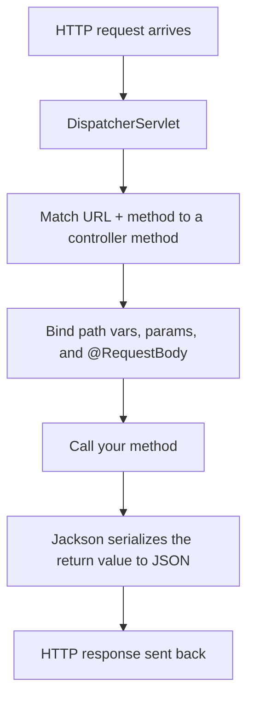

# Building a REST API: Controllers

In [Phase 2](02-dependency-injection-and-beans.md) you learned how Spring builds and wires your objects - 
the container, beans, dependency injection. Those objects have just sat there, fully wired but waiting.
This phase is where they finally do something visible: respond to an HTTP request.

**A controller is the doorway between the outside world and your code.** HTTP requests arrive from
browsers, mobile apps, and other services, and something has to catch each one, figure out what it's
asking for, run the right code, and send a reply - that "something" is a controller. You don't write the
part that listens on a socket, parses HTTP, or formats response bytes - Spring does that. You write small
methods and *label* them so Spring knows "when a `GET /api/books` comes in, call this one." Same
inversion of control as Phase 2: you don't call Spring, Spring calls you.

The running example for this whole guide is a tiny **book API** - a service that lets clients list, fetch,
and add books. A book is just four fields:

```java
public class Book {
    private Long id;
    private String title;
    private String author;
    private String isbn;
    // constructor, getters, and setters omitted for brevity
}
```

*What just happened:* That's the entity we'll move around for the rest of the phase - an `id`, a `title`, an
`author`, and an `isbn`. Nothing Spring-specific about it yet; it's a plain Java object. (If terms like
*HTTP method*, *status code*, or *JSON body* feel fuzzy, the [REST APIs Explained](/guides/rest-apis-explained)
and [HTTP & JSON API Basics](/guides/http-and-json-api-basics) guides cover the protocol side; here we focus
on the Spring side.)

## `@RestController` and request mapping

📝 A **controller** is a class whose methods handle incoming requests. You mark the class with an annotation,
and Spring registers each handler method against a URL and an HTTP method. When a matching request arrives,
Spring calls your method and turns whatever you return into the HTTP response.

For a JSON API, the annotation you want is `@RestController`. It's actually two annotations rolled into one:
`@Controller` (this class handles web requests) **plus** `@ResponseBody` (whatever a method returns *is* the
response body, serialized to JSON - not the name of an HTML page to render). That `@ResponseBody` part is the
whole reason `@RestController` exists: it says "I'm building an API, not a website."

```java
import org.springframework.web.bind.annotation.GetMapping;
import org.springframework.web.bind.annotation.RestController;
import java.util.List;

@RestController
public class BookController {

    @GetMapping("/api/books")
    public List<Book> listBooks() {
        return List.of(
            new Book(1L, "The Pragmatic Programmer", "Hunt & Thomas", "9780201616224"),
            new Book(2L, "Clean Code", "Robert C. Martin", "9780132350884")
        );
    }
}
```

*What just happened:* `@RestController` told Spring this class catches HTTP requests and returns response
bodies directly. `@GetMapping("/api/books")` mapped this method to `GET /api/books`. When that request
arrives, Spring calls `listBooks()`, gets back a `List<Book>`, and hands it to **Jackson**, the JSON
library Spring Boot includes by default. Jackson reads each book's fields and produces JSON automatically
 - you never wrote a line of serialization code.

A request and the response it produces:

```http
GET /api/books HTTP/1.1
Host: localhost:8080
```

```json
[
  { "id": 1, "title": "The Pragmatic Programmer", "author": "Hunt & Thomas", "isbn": "9780201616224" },
  { "id": 2, "title": "Clean Code", "author": "Robert C. Martin", "isbn": "9780132350884" }
]
```

*What just happened:* The list of `Book` objects came back as a JSON array, one object per book, each field
mapped by name. That field-by-field translation is Jackson doing its job - your method just returned plain
Java objects.

💡 If you find yourself repeating `/api/books` at the start of every mapping, you can hoist it to the class with
`@RequestMapping("/api/books")` and then write `@GetMapping`, `@GetMapping("/{id}")`, etc. on the methods. Same
result, less repetition. We'll keep the full paths on each method here so every example reads on its own.

## Path variables and request params

A real API needs to address *one specific book* and to *filter* a list. Those are two different jobs, and
Spring has a different tool for each.

📝 A **path variable** is part of the URL path itself - `/api/books/2` means "the book whose id is 2." You write a
placeholder in the mapping with curly braces (`/api/books/{id}`) and bind it to a method parameter with
`@PathVariable`. A **request param** is a query-string value after the `?` - `/api/books?author=Martin` - and you
bind it with `@RequestParam`. The rule of thumb: a path variable *identifies a resource*; a request param
*modifies or filters* a request.

```java
import org.springframework.web.bind.annotation.*;
import java.util.List;

@RestController
public class BookController {

    @GetMapping("/api/books/{id}")
    public Book getBook(@PathVariable Long id) {
        return findById(id);   // look the book up (a real lookup arrives in Phase 5)
    }

    @GetMapping("/api/books")
    public List<Book> listBooks(@RequestParam(required = false) String author) {
        if (author == null) {
            return findAll();
        }
        return findByAuthor(author);   // filter when ?author=... is present
    }
}
```

*What just happened:* In `getBook`, the `{id}` in the path lines up with the `@PathVariable Long id`
parameter - Spring pulls the `2` out of `/api/books/2`, converts the text to a `Long` for you, and passes it in.
In `listBooks`, `@RequestParam(required = false) String author` reads the `?author=...` query string;
`required = false` means the param is optional, so `author` is `null` when the client omits it, and we return
the full list. One method, two behaviors, driven by the query string.

Try both with curl:

```bash
curl http://localhost:8080/api/books/2
curl "http://localhost:8080/api/books?author=Robert%20C.%20Martin"
```

```console
{"id":2,"title":"Clean Code","author":"Robert C. Martin","isbn":"9780132350884"}

[{"id":2,"title":"Clean Code","author":"Robert C. Martin","isbn":"9780132350884"}]
```

*What just happened:* The first call hit the path-variable route and returned a single book object. The
second call hit the same `/api/books` endpoint but, because `?author=` was present, returned a filtered array. The
quotes around the second URL keep the shell from choking on the `?` and the space (encoded as `%20`).

## Request bodies (POST)

Reading is half an API. To *create* a book, the client sends data in the request body, and your method needs
to receive it.

📝 `@PostMapping` maps a method to `POST`, the HTTP method for "create this." The new book arrives as JSON in
the request body, and `@RequestBody` is the annotation that says "take that JSON and turn it into a Java
object for me." Jackson runs in reverse here: it reads the incoming JSON and constructs a `Book`, matching
JSON keys to fields by name.

```java
import org.springframework.web.bind.annotation.*;

@RestController
public class BookController {

    @PostMapping("/api/books")
    public Book createBook(@RequestBody Book book) {
        Book saved = save(book);   // persist it (real persistence comes in Phase 5)
        return saved;              // echo the created book back to the client
    }
}
```

*What just happened:* `@PostMapping("/api/books")` routed `POST /api/books` to this method. `@RequestBody Book book`
told Spring to deserialize the JSON body into a `Book` - Jackson read the keys and filled in the fields. We
"save" it (a placeholder for now) and return the saved book, which Spring serializes straight back to JSON.
The client sends a book and gets the stored version back, typically now carrying its assigned `id`.

The request the client sends:

```json
{
  "title": "Domain-Driven Design",
  "author": "Eric Evans",
  "isbn": "9780321125217"
}
```

*What just happened:* The client posts a book with no `id` - the server assigns that. Jackson binds `title`,
`author`, and `isbn` onto the `Book` object before your method body ever runs, so by the time `createBook`
executes, `book` is a fully populated Java object you can work with.

## `ResponseEntity` and status codes

Every example so far has quietly returned **200 OK**, because that's what Spring does when you return a plain
object. But "200" isn't always the correct answer. Creating a resource should report **201 Created**; asking
for a book that doesn't exist should report **404 Not Found**. To control the status code (and headers), you
return a `ResponseEntity` instead of the bare object.

📝 A **`ResponseEntity<T>`** is a wrapper around your response body that *also* carries the status code and
headers. Return `book` and you get a default 200; return `ResponseEntity.status(201).body(book)` and you've
said exactly what status and what body the client should see.

```java
import org.springframework.http.ResponseEntity;
import org.springframework.web.bind.annotation.*;

@RestController
public class BookController {

    @PostMapping("/api/books")
    public ResponseEntity<Book> createBook(@RequestBody Book book) {
        Book saved = save(book);
        return ResponseEntity.status(201).body(saved);   // 201 Created, body is the new book
    }

    @GetMapping("/api/books/{id}")
    public ResponseEntity<Book> getBook(@PathVariable Long id) {
        Book found = findById(id);
        if (found == null) {
            return ResponseEntity.notFound().build();    // 404, no body
        }
        return ResponseEntity.ok(found);                 // 200, body is the book
    }
}
```

*What just happened:* `createBook` now returns a `ResponseEntity` with status 201 and the new book as the
body - the client learns the resource was *created*, not merely fetched. `getBook` checks whether the book
exists: if not, `ResponseEntity.notFound().build()` produces a clean 404 with no body; otherwise
`ResponseEntity.ok(found)` returns 200 with the book. Contrast this with the earlier methods that returned a
plain `Book` and always got 200 - `ResponseEntity` is the switch you flip when the default status isn't the
truth you want to tell.

💡 Use a plain return type when 200 is genuinely correct (a simple list or lookup that always succeeds), and
reach for `ResponseEntity` when the status varies - creation, deletion, not-found, or anything where the
client should react differently based on the code. Both are valid; pick the one that says what you mean.

## How the request flows

Seeing the whole path a request takes demystifies what feels like magic.



📝 At the front of every Spring web app sits one object you never wrote: the **DispatcherServlet**. Every
request hits it first. It looks at the URL and HTTP method, finds the controller method whose mapping
matches, **binds** the inputs (pulls the `id` from the path, the `author` from the query string, the JSON from
the body - converting types as it goes), and then calls your method. Whatever you return goes back through
Jackson to become the JSON response. Your job is just the middle box: one focused method.

💡 Notice how *thin* these controller methods are. The best ones read the request, hand off to something
that does the real work, and shape the response - that's it. Here `save`, `findById`, and `findByAuthor`
are placeholders, but in a real app that work belongs in a separate **service layer**, which
[Phase 6](06-service-layer-and-validation.md) introduces: a `BookService` bean, injected the way Phase 2
showed, that holds the actual logic. The controller speaks HTTP; the service holds the rules.

⚠️ **Don't put business logic or database calls directly in a controller.** It's tempting to dump a query or a
pricing calculation right into the handler because it "works." It does - until that logic needs testing
(you'd need a fake HTTP request to exercise it), reusing (a scheduled job can't send itself a request), or
changing (and now every change touches the doorway). A controller that does two jobs becomes the place every
bug hides. Keep it to HTTP in, HTTP out, and delegate the rest.

## Recap

1. **`@RestController` makes a class an HTTP doorway.** It's `@Controller` + `@ResponseBody`, so whatever your
   methods return is serialized to JSON by Jackson and sent back as the response body.
2. **Mapping annotations route requests to methods.** `@GetMapping("/api/books")` handles `GET /api/books`,
   `@PostMapping("/api/books")` handles `POST /api/books`; Spring calls your method when a matching request arrives.
3. **Path variables identify, request params filter.** `@PathVariable` binds `{id}` from the URL path (one
   specific book); `@RequestParam` binds query-string values like `?author=...` (filter or modify), and can
   be optional with `required = false`.
4. **`@RequestBody` turns incoming JSON into an object.** On a POST, Jackson deserializes the request body
   into a `Book` before your method runs, so you work with a populated Java object.
5. **`ResponseEntity` controls status and headers.** Return a plain object for a default 200, or a
   `ResponseEntity` for 201 Created, 404 Not Found, and anything else where the status is part of the answer.
6. **The flow:** DispatcherServlet → match URL + method → bind inputs → call your (thin) method → Jackson
   serializes the result → response. ⚠️ Keep business logic and DB calls out of the controller - that's the
   service layer's job, coming in [Phase 6](06-service-layer-and-validation.md).

## Quick check

Make sure the core controller ideas stuck:

```quiz
[
  {
    "q": "What does @RestController add on top of plain @Controller?",
    "choices": [
      "@ResponseBody behavior - method return values are serialized straight to the response body (JSON), instead of being treated as view/page names",
      "It connects the class to the database automatically",
      "It makes every method run inside a transaction",
      "Nothing - @RestController and @Controller are identical"
    ],
    "answer": 0,
    "explain": "@RestController is @Controller + @ResponseBody. The @ResponseBody part means whatever a method returns IS the response body (serialized to JSON by Jackson), which is exactly what you want for an API rather than rendering an HTML view."
  },
  {
    "q": "You want to fetch one specific book by its id from the URL /api/books/2. Which annotation binds that 2 to your method parameter?",
    "choices": [
      "@PathVariable, because the id is part of the URL path and identifies a specific resource",
      "@RequestParam, because all URL values use the same annotation",
      "@RequestBody, because the id travels in the request body",
      "@GetMapping, because that annotation reads the value for you"
    ],
    "answer": 0,
    "explain": "A value embedded in the path (/api/books/{id}) is bound with @PathVariable - it identifies a resource. @RequestParam is for query-string values after the ? (like ?author=...), which filter or modify a request. @RequestBody is for the JSON body of a POST."
  },
  {
    "q": "Your create endpoint returns a plain Book object. A client reports it always gets HTTP 200 even though a resource was created. How do you return 201 Created instead?",
    "choices": [
      "Return a ResponseEntity, e.g. ResponseEntity.status(201).body(saved), which carries the status code alongside the body",
      "Add @PostMapping(status = 201) to the method",
      "Throw an exception after saving so Spring picks a different code",
      "Nothing can change it - controllers can only return 200"
    ],
    "answer": 0,
    "explain": "Returning a bare object gives the default 200. To control the status (and headers), wrap the body in a ResponseEntity - ResponseEntity.status(201).body(saved) reports 201 Created. The same tool gives you 404 via ResponseEntity.notFound().build()."
  }
]
```

---

[← Phase 2: Dependency Injection & Beans](02-dependency-injection-and-beans.md) · [Guide overview](_guide.md) · [Phase 4: Configuration & Profiles →](04-configuration-and-profiles.md)
