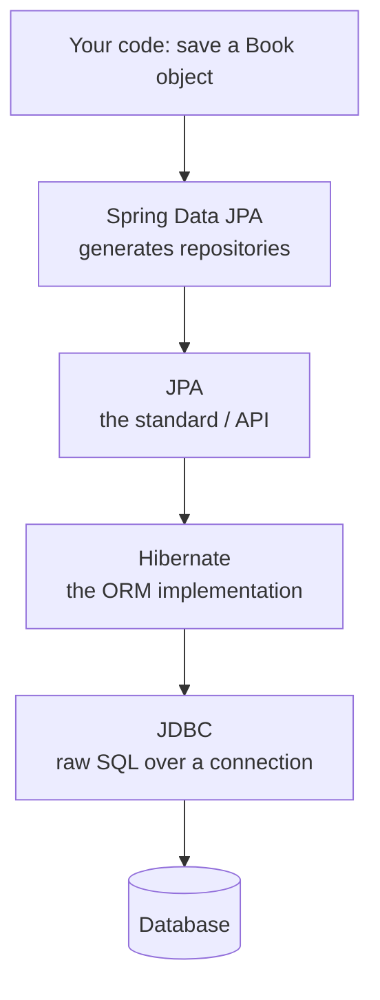

# Persistence with Spring Data JPA

Up to now your API has been making things up. A request comes in, you build a `Book` in memory, hand it
back, and the moment the process restarts, it's gone. Real apps remember - they write to a database that
survives restarts, deploys, and crashes. This phase teaches your Spring app to *persist*, and it's where a
famous piece of Spring magic shows up: you'll define a repository interface with **no implementation**,
and Spring writes the implementation for you at runtime.

That magic is wonderful right up until it surprises you. Before any annotations, let's build the mental
model of what's actually happening underneath - the day the magic bites, the only thing that saves you is
knowing what it was hiding.

## The mental model: layers all the way down

📝 The core idea is an **ORM** - Object-Relational Mapping. Your Java world is made of *objects* (`Book`
instances with fields). Your database world is made of *rows* in *tables* (a `book` table with columns). An
ORM is the translator that maps one onto the other: you work with objects in your code, and the ORM turns
your object operations into the SQL that reads and writes rows. You save a `Book` object; the ORM emits an
`INSERT`. You ask for a book by id; the ORM emits a `SELECT` and hands you back a `Book`.

If the words *table*, *row*, and *column* feel fuzzy, take ten minutes with
[/guides/what-a-database-is](/guides/what-a-database-is) first - this phase assumes you know what a row is and
that databases speak SQL.

Here's the stack you're standing on, top to bottom:



Four names, one job. **JPA** (Jakarta Persistence API) is the *standard* - a set of interfaces and
annotations that describe how Java objects map to tables. **Hibernate** is the most common *implementation*
of that standard: the actual ORM engine that generates SQL. **JDBC** is the low-level Java API Hibernate uses
to send that SQL over a database connection. And **Spring Data JPA** sits on top of all of it, removing the
last layer of boilerplate - the repository code you'd otherwise hand-write to call JPA.

💡 You only ever *write* against the top layer. But every layer below is still running, and when something is
slow or wrong, you debug *downward* - from your object call, to the SQL Hibernate emitted, to what the
database actually did. Keep this ladder in your head; we'll climb back down it at the end of the phase.

## `@Entity` - mapping a Book to a table

The first job is to tell JPA "this Java class corresponds to a database table." You do that with annotations.

```java
import jakarta.persistence.Entity;
import jakarta.persistence.GeneratedValue;
import jakarta.persistence.GenerationType;
import jakarta.persistence.Id;

@Entity
public class Book {

    @Id
    @GeneratedValue(strategy = GenerationType.IDENTITY)
    private Long id;

    private String title;
    private String author;
    private String isbn;

    protected Book() {}   // JPA requires a no-arg constructor

    public Book(String title, String author, String isbn) {
        this.title = title;
        this.author = author;
        this.isbn = isbn;
    }

    public Long getId() { return id; }
    public String getTitle() { return title; }
    public String getAuthor() { return author; }
    public String getIsbn() { return isbn; }

    public void setTitle(String title) { this.title = title; }
    public void setAuthor(String author) { this.author = author; }
    public void setIsbn(String isbn) { this.isbn = isbn; }
}
```

*What just happened:* `@Entity` marks `Book` as a persistent type - JPA now knows it maps to a table (named
`book` by default). `@Id` names the primary key field, and `@GeneratedValue(strategy = GenerationType.IDENTITY)`
tells JPA the database generates the id for you, so you never set it by hand. The plain fields each become
a column with the same name. The no-arg constructor exists because Hibernate constructs entities
*reflectively* when it reads a row back - it makes a blank `Book` and fills the fields.

The table this maps to looks like:

```sql
CREATE TABLE book (
    id     BIGINT       NOT NULL AUTO_INCREMENT PRIMARY KEY,
    title  VARCHAR(255),
    author VARCHAR(255),
    isbn   VARCHAR(255)
);
```

*What just happened:* Each field became a column, `id` became the auto-incrementing primary key matching
`GenerationType.IDENTITY`, and the `String` fields became `VARCHAR`. In development you can have Hibernate
generate this table for you; in production you'll manage the schema yourself with migrations - but the
*shape* is exactly this.

⚠️ **Why a mutable class and not a `record`?** Records are the perfect immutable data carrier
([Records & Modern Java](/guides/java-from-zero/13-records-and-modern-java)), but JPA needs a no-arg
constructor (to build a blank instance before populating it) and mutable fields (to update them later, and
so Hibernate can swap in a *lazy proxy* for relationships) - the opposite of a record's immutable, all-args
design. Entities stay as plain classes with a no-arg constructor and setters. Records are still right for
the *DTOs* you'll add in [Phase 6](06-service-layer-and-validation.md); just wrong for entities.

## Repositories - where the magic happens

Now the part that feels like a trick. To get full create/read/update/delete access to the `book` table, you
write this:

```java
import org.springframework.data.jpa.repository.JpaRepository;

public interface BookRepository extends JpaRepository<Book, Long> {
}
```

*What just happened:* That's the whole file - an **interface** with no fields, methods, or implementation.
`JpaRepository<Book, Long>` says "this is a repository for `Book` entities whose id type is `Long`." At
startup, Spring Data JPA finds this interface and **generates a concrete implementation at runtime**, then
registers it as a bean. You never write the class; Spring writes and injects it for you. Inheriting from
`JpaRepository` gives you a pile of methods for free, including:

- `save(book)` - insert or update a row, returns the saved entity (now with its generated id)
- `findById(id)` - look up one row by primary key, returns an `Optional<Book>`
- `findAll()` - read every row
- `deleteById(id)` / `delete(book)` - remove a row
- `count()`, `existsById(id)` - quick aggregates

You wire it in exactly like any other bean (the dependency injection from
[Phase 2](02-dependency-injection-and-beans.md)):

```java
import org.springframework.stereotype.Component;

import java.util.List;

@Component
public class BookSeeder {

    private final BookRepository books;

    public BookSeeder(BookRepository books) {   // Spring injects the generated impl
        this.books = books;
    }

    public void run() {
        Book saved = books.save(new Book("Dune", "Frank Herbert", "9780441013593"));
        System.out.println("saved with id = " + saved.getId());

        List<Book> all = books.findAll();
        System.out.println("books in table = " + all.size());
    }
}
```

```console
saved with id = 1
books in table = 1
```

*What just happened:* `books.save(...)` took a brand-new `Book` (no id yet), inserted a row, and returned the
same book *with its database-generated id filled in* - that's why `saved.getId()` is `1`. Then `findAll()`
read the table back. You called two methods on an interface you never implemented, and real SQL ran against a
real database. That's Spring Data JPA earning its keep.

## Derived query methods - Spring reads your method names

`findById` and `findAll` cover the basics, but real apps ask sharper questions: *all books by this author*,
*books whose title contains a search term*, *does a book with this ISBN already exist?* You could write SQL
for each. You don't have to. Spring Data parses the **name of the method** into a query.

Add method declarations to the interface - still no bodies:

```java
import org.springframework.data.jpa.repository.JpaRepository;

import java.util.List;

public interface BookRepository extends JpaRepository<Book, Long> {

    List<Book> findByAuthor(String author);

    List<Book> findByTitleContainingIgnoreCase(String query);

    boolean existsByIsbn(String isbn);
}
```

*What just happened:* You declared three methods and wrote zero implementations. Spring Data reads each
name as a tiny query language. `findByAuthor` → "select books where `author` equals the argument."
`findByTitleContainingIgnoreCase` → "where `title` contains the argument, case-insensitively" (a `LIKE`
with wildcards, lower-cased both sides). `existsByIsbn` → "is there any row whose `isbn` equals the
argument?", returning a `boolean`. The keywords (`findBy`, `existsBy`, `Containing`, `IgnoreCase`, `And`,
`Or`, `OrderBy`...) compose, and Spring builds the query from them.

Here's `findByAuthor` in use and the SQL Hibernate emits for it:

```java
List<Book> herbertBooks = books.findByAuthor("Frank Herbert");
```

```sql
SELECT b.id, b.title, b.author, b.isbn
FROM book b
WHERE b.author = ?
```

*What just happened:* The method name became a parameterized `SELECT ... WHERE author = ?`, and Spring bound
`"Frank Herbert"` to the `?` placeholder. (Parameterized - not string-concatenated - so it's safe from SQL
injection by construction.) You're showcasing `existsByIsbn` here for a reason:
[Phase 6](06-service-layer-and-validation.md) calls it to reject duplicate ISBNs before saving, so it lives
on the repository from the start.

💡 The magic is *method-name parsing*, and that's also its limit. The moment a query needs something the
naming convention can't express cleanly - a join, an aggregate, a condition too gnarly to spell as a method
name - stop fighting the name and write the query explicitly with `@Query`:

```java
import org.springframework.data.jpa.repository.Query;
import org.springframework.data.repository.query.Param;

@Query("SELECT b FROM Book b WHERE b.author = :author AND b.isbn IS NOT NULL")
List<Book> findCataloguedByAuthor(@Param("author") String author);
```

*What just happened:* `@Query` lets you write JPQL (a query language over your *entities*, not raw tables - 
note `Book`, the class, not `book`, the table) when a derived name would get unwieldy. You reach for this when
the method name stops being shorter than the query it stands for. (`nativeQuery = true` lets you drop to raw
SQL if you truly need a database-specific feature.)

## Where the magic stops - and bites

The plain part nobody puts on the brochure: **an ORM removes boilerplate, not the need to understand
your database.** The abstraction is leaky on purpose, because the database underneath is real. The first
time you treat JPA as a black box that "handles persistence," it will quietly do something expensive or
wrong. A few places it bites everyone:

**The N+1 query problem.** You load 100 books, then loop over them touching a related collection (say each
book's reviews). If that relationship is lazy, every `book.getReviews()` fires its *own* `SELECT` - so one
query to load the books becomes 1 + 100 = 101 queries. Your code looks like a simple loop; the database sees
a storm. The fix (a fetch join or an entity graph) requires knowing the storm is happening at all.

**Lazy vs. eager loading.** Relationships are loaded *lazily* by default - Hibernate hands you a proxy and
only hits the database when you actually touch the related data. That's good for performance but explodes if
you touch lazy data *after* the transaction has closed, with a `LazyInitializationException`. Which leads
straight to:

**`@Transactional` boundaries.** The window in which an entity is "live" and can lazy-load is the transaction.
Step outside it and the connection is gone. You'll meet `@Transactional` properly in
[Phase 6](06-service-layer-and-validation.md), but file this away now: *where* your transaction begins and
ends decides what your entities can and can't do.

**You still have to read the SQL.** The single most useful habit when JPA misbehaves is to make it show you
its work:

```yaml
spring:
  jpa:
    show-sql: true                 # log every SQL statement Hibernate emits
    properties:
      hibernate:
        format_sql: true           # pretty-print it
```

*What just happened:* Turning on `show-sql` logs the exact SQL Hibernate generates for every operation - 
how you *see* the N+1 storm instead of guessing, and confirm a derived method built the query you expected.
This is climbing back down the ladder: object call → generated SQL → database. When a query is slow, that
SQL is your starting point - see [/guides/why-is-my-query-slow](/guides/why-is-my-query-slow).

💡 Spring Data JPA is a fantastic productivity tool *and* a thin layer over a database you're still
responsible for. Let it write the boilerplate; don't let it talk you out of knowing what SQL it wrote.

## Recap

1. **An ORM maps objects to rows.** You work with `Book` objects; JPA/Hibernate translates that into SQL.
   The stack is Spring Data JPA → JPA (the standard) → Hibernate (the implementation) → JDBC → the database.
2. **`@Entity` maps a class to a table.** `@Id` + `@GeneratedValue` define the generated primary key; plain
   fields become columns. ⚠️ Entities are mutable classes with a no-arg constructor - *not* records, because
   the ORM needs to build blank instances and mutate fields.
3. **A repository is a magic interface.** `interface BookRepository extends JpaRepository<Book, Long>` gets a
   runtime-generated implementation with `save`, `findById`, `findAll`, `delete`, and more - you write no code.
4. **Derived queries come from method names.** `findByAuthor`, `findByTitleContainingIgnoreCase`, and
   `existsByIsbn` are parsed into SQL from their names; reach for `@Query` (JPQL) when a name gets unwieldy.
5. **The abstraction is leaky on purpose.** ⚠️ N+1 queries, lazy-vs-eager loading, and `@Transactional`
   boundaries all bite if you treat JPA as a black box - turn on `spring.jpa.show-sql=true` and read the SQL
   it emits. An ORM saves boilerplate, not the need to understand your database.

## Quick check

Make sure the model - and where it leaks - actually stuck:

```quiz
[
  {
    "q": "How does Spring Data JPA provide the implementation of BookRepository when the interface has no method bodies?",
    "choices": [
      "It generates a concrete implementation at runtime and registers it as a bean you can inject",
      "You must write the implementation class yourself before the app will start",
      "It copies a default implementation from JpaRepository into your source files",
      "It stores the queries in the database and runs them as stored procedures"
    ],
    "answer": 0,
    "explain": "Spring Data JPA finds repository interfaces at startup and generates concrete implementations at runtime, registering each as a bean. That's why you extend JpaRepository and write no code - Spring writes and injects the implementation for you."
  },
  {
    "q": "Why is a JPA @Entity written as a mutable class with a no-arg constructor instead of a Java record?",
    "choices": [
      "Hibernate needs to build a blank instance and then set its fields (and swap in lazy proxies), which a record's immutable, all-args design doesn't allow",
      "Records cannot be annotated with @Entity at all in any version of Java",
      "Records are slower to serialize to JSON than mutable classes",
      "JPA requires every entity field to be public, and records make fields private"
    ],
    "answer": 0,
    "explain": "The ORM constructs entities reflectively (a no-arg constructor) and mutates their fields when reading rows and managing lazy relationships. A record is immutable with an all-args constructor - the opposite of what JPA needs. Records are still ideal for DTOs, just not entities."
  },
  {
    "q": "What does the derived query method `existsByIsbn(String isbn)` cause Spring Data to generate?",
    "choices": [
      "A query that checks whether any book row has a matching isbn, returning a boolean",
      "A method that inserts a new book if the isbn does not already exist",
      "A list of every book sorted by isbn",
      "Nothing - exists-style methods require a hand-written @Query"
    ],
    "answer": 0,
    "explain": "Spring Data parses the method name: existsBy + Isbn becomes a query asking whether any row's isbn equals the argument, returning a boolean. Phase 6 uses exactly this to reject duplicate ISBNs before saving."
  }
]
```

---

[← Phase 4: Configuration & Profiles](04-configuration-and-profiles.md) · [Guide overview](_guide.md) · [Phase 6: The Service Layer, DTOs & Validation →](06-service-layer-and-validation.md)
