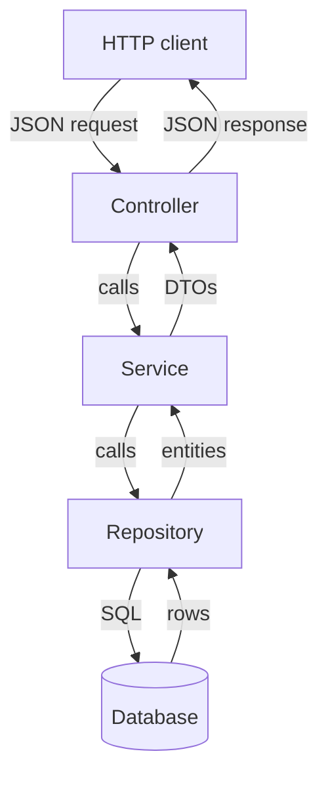

# The Service Layer, DTOs & Validation

By now your API works. Back in [Phase 3](03-rest-controllers.md) you wrote a `BookController` that took
HTTP requests, and in [Phase 5](05-persistence-with-jpa.md) you wired a `BookRepository` so those requests
hit a database. If you followed along literally, your controller probably calls the repository directly - 
request comes in, controller saves a row, controller returns it. For three endpoints, that's fine. It's
also a trap, worth seeing before it closes.

The mental model: **separation of concerns**. Each piece of your app should have exactly one job, and hand
off to the next piece for everything else. A controller's one job is to speak HTTP - not validate a book,
calculate a discount, enforce that ISBNs are unique, or manage a database transaction. The moment a
controller does two of those things, it becomes the place every future change has to touch, and every bug
hides. This phase introduces the three layers that fix that, plus the validation that guards the front door.

## Why a service layer

📝 A well-structured Spring app has **three layers**, and a request flows through them in order:

- **Controller** - speaks HTTP. Reads the request, calls down, shapes the response. Knows about status
  codes and JSON. Knows *nothing* about business rules.
- **Service** - holds the business logic. "A book can't be published in the future." "Deleting a book
  archives it instead." This is where the actual decisions live, in plain `@Service` beans.
- **Repository** - talks to the database. You met this in [Phase 5](05-persistence-with-jpa.md); it knows
  rows and queries and nothing else.

Here's the shape of it:



The rule that makes this work: **each layer only talks to the one directly below it.** Controllers never
touch repositories. Services never touch HTTP. The dependency arrows point one direction.

💡 Why bother, when calling the repository from the controller "works"? Because the controller is the
worst possible home for logic. It's hard to test (you need a fake HTTP request to exercise a price
calculation), hard to reuse (a scheduled job can't send itself an HTTP request to run the same rule), and
quietly accumulates responsibilities until nobody can read it. A `@Service` is a plain bean you can call
from a controller, a job, a message listener, or a test - directly, no HTTP required.

Moving the logic out of the Phase 3 controller - here's the "everything in the controller" version we're
leaving behind:

```java
@RestController
@RequestMapping("/api/books")
public class BookController {

    private final BookRepository books;

    public BookController(BookRepository books) {
        this.books = books;
    }

    @PostMapping
    public Book create(@RequestBody Book book) {
        // business rule jammed into the controller:
        if (books.existsByIsbn(book.getIsbn())) {
            throw new IllegalStateException("duplicate ISBN");
        }
        return books.save(book);
    }
}
```

*What just happened:* The controller is doing three jobs at once - receiving HTTP, enforcing a uniqueness
rule, and persisting. That uniqueness check is business logic standing in the doorway. Now we extract it
into a service the controller can call:

```java
@Service
public class BookService {

    private final BookRepository books;

    public BookService(BookRepository books) {
        this.books = books;
    }

    public Book create(Book book) {
        if (books.existsByIsbn(book.getIsbn())) {
            throw new DuplicateIsbnException(book.getIsbn());
        }
        return books.save(book);
    }
}
```

```java
@RestController
@RequestMapping("/api/books")
public class BookController {

    private final BookService service;

    public BookController(BookService service) {
        this.service = service;
    }

    @PostMapping
    public Book create(@RequestBody Book book) {
        return service.create(book);   // controller just delegates
    }
}
```

*What just happened:* `@Service` registers `BookService` as a bean (same dependency injection from
[Phase 2](02-dependency-injection-and-beans.md)), so Spring constructs it and injects the repository, then
injects the *service* into the controller. The controller's `create` method shrank to a single line:
receive, delegate, return. The duplicate-ISBN rule now lives in one place a test can call directly with a
plain `Book` object - no HTTP needed. (`DuplicateIsbnException` becomes a clean 409 in
[Phase 7](07-error-handling.md); for now it just signals the problem.)

## `@Transactional` - all or nothing

📝 A **transaction** is a unit of work that either fully commits or fully rolls back - there is no
"halfway." Imagine an operation that saves a book *and* decrements an inventory count in two separate
writes. If the second write fails, you do not want the first one to stick around: you'd have a book with no
matching inventory record, and your data would be quietly lying to you. A transaction guarantees that both
happen or neither does.

In Spring you don't manage transactions by hand. You annotate a method, and Spring opens a transaction
before it runs and commits when it returns (or rolls back if it throws). The natural home for
`@Transactional` is the **service layer**, because the service is where a "unit of work" is defined - one
business operation, possibly several writes.

```java
@Service
public class BookService {

    private final BookRepository books;
    private final InventoryRepository inventory;

    public BookService(BookRepository books, InventoryRepository inventory) {
        this.books = books;
        this.inventory = inventory;
    }

    @Transactional   // both writes commit together, or neither does
    public Book createWithStock(Book book, int initialStock) {
        Book saved = books.save(book);
        inventory.save(new Inventory(saved.getId(), initialStock));
        return saved;
    }

    @Transactional(readOnly = true)   // a hint: this method only reads
    public List<Book> findAll() {
        return books.findAll();
    }
}
```

*What just happened:* On `createWithStock`, Spring opens a transaction, runs both saves, and commits only
if the method finishes cleanly. If `inventory.save(...)` throws, the book save is rolled back too - no
half-written state. On `findAll`, `readOnly = true` tells Spring (and the JDBC driver) this method won't
modify anything, which lets the database skip bookkeeping and perform better. Use `readOnly = true` for
query methods, plain `@Transactional` for methods that write.

⚠️ Two gotchas that bite everyone at least once:

- **Self-invocation skips it.** `@Transactional` works through a Spring **proxy** - Spring wraps your bean
  in a generated object that starts the transaction *before handing the call to your real method*. That
  only happens when the call comes from *outside* the bean. If method `a()` in `BookService` calls
  `this.b()` (where `b()` is `@Transactional`), the call never leaves the object, never passes through the
  proxy, and `b()` runs with **no transaction at all** - silently. The fix: call across a bean boundary
  (put `b()` in another service), not `this.b()`.
- **By default, only unchecked exceptions roll back.** Spring rolls back automatically on
  `RuntimeException` and `Error`, but *not* on checked exceptions, which it lets commit. If a method that
  throws a checked exception should roll back, say so explicitly:
  `@Transactional(rollbackFor = SomeCheckedException.class)`.

## DTOs vs entities - don't expose your database

So far the controller has been accepting and returning `Book` - the JPA `@Entity` from
[Phase 5](05-persistence-with-jpa.md). That's the second trap, and it's a common one.

📝 A **DTO** (Data Transfer Object) is the shape you expose over your API - the JSON a client sends and
receives. An **entity** is the shape you *store* - a class mapped to a database table. These are two
different concerns that happen to look similar today, and the whole point of a DTO is to keep them
*separate* so they can evolve independently. A Java `record` (see
[Records & Modern Java](/guides/java-from-zero/13-records-and-modern-java)) is the perfect tool for a DTO:
it's an immutable data carrier in one line, exactly what a request or response body wants to be.

Why pay for the extra classes? Three concrete reasons:

- **Don't leak database internals.** Your entity might have an internal `createdBy` audit field, a
  soft-delete flag, or a password hash. Serialize the entity straight to JSON and you've published all of
  it. A DTO exposes only the fields you *chose* to expose.
- **Avoid over-posting.** If clients send a raw `Book` entity, a malicious or careless request can set
  fields you never meant them to - an `id`, an `internalRating`, a `featured` flag. With a DTO, only the
  fields *on the DTO* can ever be set; everything else is impossible by construction.
- **Decouple the API from the schema.** Rename a column or split a table tomorrow, and your public API
  shouldn't even flinch. The DTO is a contract with your clients; the entity is an implementation detail.
  Keep them apart and you can change one without breaking the other.

Here are the two shapes side by side, plus the mapping between them:

```java
// Entity - how we STORE a book (from Phase 5)
@Entity
public class Book {
    @Id @GeneratedValue
    private Long id;
    private String title;
    private String author;
    private String isbn;
    private String internalNotes;   // private - must never reach the API
    // getters / setters omitted
}

// DTOs - how we EXPOSE a book. Records: immutable, one line each.
public record CreateBookRequest(String title, String author, String isbn) {}

public record BookResponse(Long id, String title, String author, String isbn) {}
```

```java
@Service
public class BookService {

    private final BookRepository books;

    public BookService(BookRepository books) {
        this.books = books;
    }

    @Transactional
    public BookResponse create(CreateBookRequest req) {
        if (books.existsByIsbn(req.isbn())) {
            throw new DuplicateIsbnException(req.isbn());
        }
        Book entity = new Book();          // DTO -> entity (map only allowed fields)
        entity.setTitle(req.title());
        entity.setAuthor(req.author());
        entity.setIsbn(req.isbn());

        Book saved = books.save(entity);
        return toResponse(saved);          // entity -> DTO (expose only chosen fields)
    }

    private BookResponse toResponse(Book b) {
        return new BookResponse(b.getId(), b.getTitle(), b.getAuthor(), b.getIsbn());
    }
}
```

*What just happened:* The incoming `CreateBookRequest` has only the three fields a client is allowed to
set - no `id`, no `internalNotes` - so over-posting is impossible. The service maps that request onto a
fresh `Book` entity field by field, saves it, then maps the saved entity back into a `BookResponse` that
exposes only what we want public. `internalNotes` never appears in either DTO, so it can never leak.

⚠️ **Returning entities directly causes real pain, not just leakage.** A JPA entity often has *lazy*
relationships - a `Book` with a lazily-loaded `List<Review>` not fetched until you touch it. Hand that
entity to the JSON serializer and it tries to read every field, triggering surprise database queries
mid-serialization (or a `LazyInitializationException` once the transaction has closed). DTOs sidestep this
entirely: map exactly the data you want *inside* the transaction, and the serializer only sees a plain,
fully-populated record.

## Bean Validation - reject bad input at the door

A client just sent you a book with a blank title and an ISBN of `"x"`. Where do you catch that? Not with a
pile of `if` statements at the top of every method - that's the controller-doing-two-jobs problem again.
Spring has a declarative answer: **Bean Validation**, where you annotate the DTO with the rules its data
must satisfy, then ask Spring to enforce them automatically.

📝 You put constraint annotations on the DTO's fields, and add `@Valid` to the controller parameter. When a
request arrives, Spring validates the DTO *before your method body runs* - and if anything fails, your code
never executes; the client gets a 400 instead. The rules live with the data they describe, and the check
happens in one consistent place.

```java
import jakarta.validation.constraints.*;

public record CreateBookRequest(
    @NotBlank(message = "title is required")
    @Size(max = 200, message = "title must be at most 200 characters")
    String title,

    @NotBlank(message = "author is required")
    String author,

    @Pattern(regexp = "\\d{13}", message = "isbn must be 13 digits")
    String isbn,

    @Email(message = "must be a valid email")
    String contactEmail,

    @Min(value = 0, message = "price cannot be negative")
    int price
) {}
```

```java
@RestController
@RequestMapping("/api/books")
public class BookController {

    private final BookService service;

    public BookController(BookService service) {
        this.service = service;
    }

    @PostMapping
    public BookResponse create(@Valid @RequestBody CreateBookRequest req) {
        return service.create(req);   // only runs if validation passed
    }
}
```

*What just happened:* The constraints (`@NotBlank`, `@Size`, `@Pattern`, `@Email`, `@Min`) describe the
valid shape of a request right on the record. `@Valid` on the `@RequestBody` parameter is the switch that
tells Spring to actually run those checks before calling `create`. Send a good request and it flows
straight through; send a bad one and your method body is never entered.

When validation fails, Spring throws a `MethodArgumentNotValidException`, which by default produces a 400
Bad Request. The raw response looks roughly like this:

```json
{
  "timestamp": "2026-06-22T10:15:30.123+00:00",
  "status": 400,
  "error": "Bad Request",
  "path": "/api/books",
  "errors": [
    { "field": "title", "defaultMessage": "title is required" },
    { "field": "isbn",  "defaultMessage": "isbn must be 13 digits" }
  ]
}
```

*What just happened:* Without writing a single `if`, the bad request was rejected with a 400 and a list of
exactly which fields failed and why - your `message` strings come straight back to the client. The default
shape is a bit noisy and not something you'd ship as-is; in [Phase 7](07-error-handling.md) you'll catch
`MethodArgumentNotValidException` in one place and format a clean, consistent error body.

## Tie it together

Look at the full path a `POST /api/books` now travels, each step owned by exactly one layer:


The controller validates and translates HTTP. The service enforces the rules and owns the transaction. The
repository moves rows. Nothing knows more than it needs to.

💡 This layering is the difference between a Spring app you can grow and one you'll rewrite. Each layer has
a single, testable job: unit-test the service with a fake repository and zero HTTP, slice-test the
controller's validation without a database, and trust the repository because it's the framework's code, not
yours. That testability is what [Phase 8](08-testing-spring-boot.md) builds on - and the clean exceptions
your service throws are what [Phase 7](07-error-handling.md) turns into correct HTTP responses next.

## Recap

1. **Three layers, one job each.** Controllers speak HTTP, services hold business logic, repositories talk
   to the database - and each layer only calls the one below it. Logic in the controller is the trap this
   structure fixes.
2. **`@Service` beans hold your logic.** Move rules out of the controller into a plain bean you can call
   from anywhere - a controller, a job, or a test - with no HTTP required.
3. **`@Transactional` makes a method all-or-nothing.** Put it on service methods that write; use
   `readOnly = true` for queries. ⚠️ It works only through Spring's proxy (so `this.method()` self-calls
   skip it), and by default only unchecked exceptions trigger a rollback.
4. **DTOs decouple your API from your database.** A `record` DTO exposes only chosen fields - no leaking
   internals, no over-posting, no coupling the public contract to the schema. ⚠️ Returning entities
   directly invites lazy-loading and serialization bugs.
5. **Bean Validation guards the door.** Annotate the DTO (`@NotBlank`, `@Size`, `@Email`, `@Min`,
   `@Pattern`) and add `@Valid` on the controller parameter; Spring rejects bad input with a 400 before
   your code runs.
6. **The flow:** controller validates → maps to/passes a DTO → service (transactional) runs the logic →
   repository persists → mapped back to a DTO → returned as JSON. One job per layer is what makes the app
   testable and maintainable.

## Quick check

Make sure the layering and its two famous gotchas stuck:

```quiz
[
  {
    "q": "Why does a @Transactional method silently run with no transaction when called via this.method() from inside the same bean?",
    "choices": [
      "Because @Transactional works through a Spring proxy, and a self-invocation never leaves the object to pass through that proxy",
      "Because @Transactional only applies to controller methods, not service methods",
      "Because transactions are disabled by default and must be turned on in application.yml",
      "Because the method needs to be public and static for the annotation to take effect"
    ],
    "answer": 0,
    "explain": "Spring wraps the bean in a proxy that opens the transaction before delegating to your real method. That interception only happens for calls coming from outside the bean. A this.method() call stays inside the object, bypasses the proxy, and runs untransacted. Call across a bean boundary instead."
  },
  {
    "q": "What is the main reason to return a DTO (e.g. a record) from your controller instead of the JPA @Entity?",
    "choices": [
      "It decouples the API from the database schema and prevents leaking internal fields, over-posting, and lazy-loading serialization bugs",
      "DTOs are saved to the database faster than entities",
      "Entities cannot be converted to JSON at all without a DTO",
      "It is required by Spring - controllers reject entity return types"
    ],
    "answer": 0,
    "explain": "The DTO is your public API contract; the entity is a storage detail. Keeping them separate lets you expose only chosen fields (no leaking internals or over-posting) and avoids lazy-loading/serialization problems - and lets the schema change without breaking clients."
  },
  {
    "q": "What makes Spring actually validate an incoming request body against the constraints on its DTO?",
    "choices": [
      "Adding @Valid to the @RequestBody controller parameter, alongside the constraint annotations on the DTO fields",
      "Annotating the service method with @Transactional",
      "Putting the constraint annotations on the entity instead of the DTO",
      "Nothing - Spring validates every request body automatically"
    ],
    "answer": 0,
    "explain": "The constraints (@NotBlank, @Size, etc.) describe the rules, but @Valid on the parameter is the switch that tells Spring to enforce them before your method body runs. Without @Valid, the annotations are just metadata and no validation happens."
  }
]
```

---

[← Phase 5: Persistence with Spring Data JPA](05-persistence-with-jpa.md) · [Guide overview](_guide.md) · [Phase 7: Error Handling Done Right →](07-error-handling.md)
