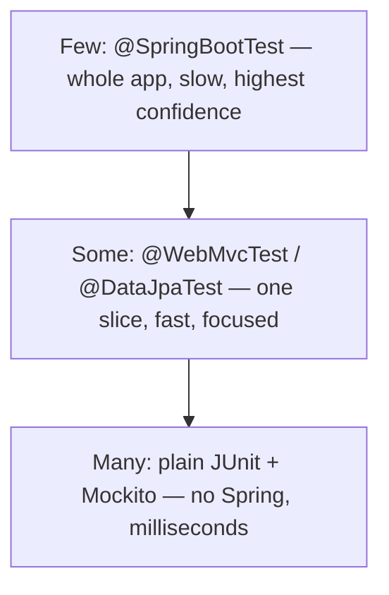

# Testing Spring Boot Apps

Back in [Phase 6](06-service-layer-and-validation.md) you split the app into three layers — controller, service, repository — and the closing line promised the payoff would be testability. This is where you collect on that promise.

**The way you tested plain Java (see [Testing, Build & Profiling](/guides/java-from-zero/16-testing-and-profiling)) still applies — JUnit, AAA, Mockito — but Spring adds a new dimension.** A Spring app isn't just classes; it's classes *wired together by a container*. So you now get a choice for every test: a plain object test with no container at all (fastest), a *slice* that boots one thin layer (fast, focused), or the whole application context booted end to end (slowest, highest confidence)? The skill here isn't any single annotation — it's knowing which to reach for, and why.

Each of those tests is only *possible* because the layers are separable — a controller that talked straight to the database couldn't be slice-tested. The clean seams from Phase 6 are what make everything below work.

## Plain unit test — the service with a mocked repository

📝 The service from Phase 6 had its dependency — the `BookRepository` — *injected through its constructor*. That single fact is what makes it trivially testable: in a test you construct the service yourself and hand it a fake repository. No Spring, no container, no database. This is a plain JUnit + Mockito test, identical in spirit to what you saw in [Mocking & Test Doubles](/guides/mocking-and-test-doubles) — Spring isn't involved at all, which is exactly why it runs in milliseconds.

Here's the service we're testing (trimmed to the duplicate-ISBN rule from Phase 6):

```java
@Service
public class BookService {

    private final BookRepository books;

    public BookService(BookRepository books) {
        this.books = books;
    }

    @Transactional
    public BookResponse create(CreateBookRequest req) {
        if (books.existsByIsbn(req.isbn())) {
            throw new DuplicateIsbnException(req.isbn());
        }
        Book entity = new Book();
        entity.setTitle(req.title());
        entity.setAuthor(req.author());
        entity.setIsbn(req.isbn());
        Book saved = books.save(entity);
        return new BookResponse(saved.getId(), saved.getTitle(),
                                saved.getAuthor(), saved.getIsbn());
    }
}
```

```java
import org.junit.jupiter.api.Test;
import org.junit.jupiter.api.extension.ExtendWith;
import org.mockito.InjectMocks;
import org.mockito.Mock;
import org.mockito.junit.jupiter.MockitoExtension;

import static org.assertj.core.api.Assertions.*;
import static org.mockito.Mockito.*;

@ExtendWith(MockitoExtension.class)
class BookServiceTest {

    @Mock BookRepository books;            // a fake repository we control
    @InjectMocks BookService service;      // Mockito builds the service with the mock

    @Test
    void rejectsDuplicateIsbn() {
        // Arrange: pretend a book with this ISBN already exists
        when(books.existsByIsbn("9780000000001")).thenReturn(true);
        var req = new CreateBookRequest("Dune", "Herbert", "9780000000001");

        // Act + Assert: the service must refuse, and must NOT try to save
        assertThatThrownBy(() -> service.create(req))
            .isInstanceOf(DuplicateIsbnException.class);
        verify(books, never()).save(any());
    }

    @Test
    void savesAndMapsToResponseWhenIsbnIsNew() {
        when(books.existsByIsbn("9780000000002")).thenReturn(false);
        var saved = new Book();            // what the repo "returns" after save
        saved.setId(42L);
        saved.setTitle("Dune");
        saved.setAuthor("Herbert");
        saved.setIsbn("9780000000002");
        when(books.save(any(Book.class))).thenReturn(saved);

        var req = new CreateBookRequest("Dune", "Herbert", "9780000000002");
        BookResponse res = service.create(req);

        assertThat(res.id()).isEqualTo(42L);
        assertThat(res.title()).isEqualTo("Dune");
    }
}
```

*What just happened:* `@ExtendWith(MockitoExtension.class)` turns on Mockito's annotations; `@Mock` builds a fake `BookRepository`, and `@InjectMocks` constructs a real `BookService` with that fake passed into the constructor — the same constructor injection from Phase 6, just driven by the test instead of Spring. The first test programs the mock to claim the ISBN exists, then asserts the service throws *and* never calls `save`. The second programs a fresh-ISBN path and verifies the entity-to-DTO mapping. No `@SpringBootTest`, no application context — pure objects, the fastest test you can write, and it should be the *bulk* of your suite.

💡 If a piece of business logic is awkward to test this way — if you find yourself needing to boot Spring just to exercise a calculation — that's usually a signal the logic is in the wrong layer. Plain-unit-testable services are a side effect of good layering, not a separate goal.

## Slice test: `@WebMvcTest` + MockMvc — just the web layer

The service test above never touched HTTP. But the controller has its own job worth testing: does `@Valid` reject a blank title? Does a `DuplicateIsbnException` come back as the right status? You *could* boot the whole app to check that, but there's a sharper tool.

📝 `@WebMvcTest` is a **slice test**: it starts *only* the web layer — your controller, the JSON serializer, the validation machinery, the exception handlers — and nothing else. No repository, no database, no service beans. Because the controller still needs a `BookService`, you supply a *mocked* one with `@MockitoBean`. Then `MockMvc` fires fake HTTP requests *in-process* and lets you assert on the status code and JSON body — focused entirely on the controller's contract, booting in a fraction of the time a full context does.

```java
import org.springframework.beans.factory.annotation.Autowired;
import org.springframework.boot.test.autoconfigure.web.servlet.WebMvcTest;
import org.springframework.test.context.bean.override.mockito.MockitoBean;
import org.springframework.test.web.servlet.MockMvc;
import org.junit.jupiter.api.Test;

import static org.mockito.Mockito.*;
import static org.springframework.test.web.servlet.request.MockMvcRequestBuilders.*;
import static org.springframework.test.web.servlet.result.MockMvcResultMatchers.*;

@WebMvcTest(BookController.class)        // boot ONLY this controller's slice
class BookControllerTest {

    @Autowired MockMvc mvc;              // fires fake HTTP requests
    @MockitoBean BookService service;    // the controller's dependency, mocked

    @Test
    void returns201AndBodyForValidRequest() throws Exception {
        when(service.create(any()))
            .thenReturn(new BookResponse(1L, "Dune", "Herbert", "9780000000001"));

        mvc.perform(post("/api/books")
                .contentType("application/json")
                .content("""
                    {"title":"Dune","author":"Herbert","isbn":"9780000000001"}
                    """))
           .andExpect(status().isCreated())
           .andExpect(jsonPath("$.id").value(1))
           .andExpect(jsonPath("$.title").value("Dune"));
    }

    @Test
    void returns400WhenTitleIsBlank() throws Exception {
        mvc.perform(post("/api/books")
                .contentType("application/json")
                .content("""
                    {"title":"","author":"Herbert","isbn":"9780000000001"}
                    """))
           .andExpect(status().isBadRequest());

        verifyNoInteractions(service);   // validation failed before the service ran
    }
}
```

```console
$ mvn -Dtest=BookControllerTest test
[INFO] Running com.example.books.BookControllerTest
[INFO] Tests run: 2, Failures: 0, Errors: 0, Skipped: 0
[INFO] BUILD SUCCESS
```

*What just happened:* `@WebMvcTest(BookController.class)` told Spring to wire up exactly one controller plus the web infrastructure around it — crucially, *not* your service or repository, so there's nothing to talk to a database. `@MockitoBean` puts a Mockito mock of `BookService` into that mini-context. `MockMvc` sends a fake `POST` straight into Spring's request-handling pipeline. The first test asserts the controller returns `201` with the right JSON. The second sends a blank title and asserts a `400` — `verifyNoInteractions(service)` proves `@Valid` rejected the request *before* the controller called the service. (Older Spring Boot spells `@MockitoBean` as `@MockBean` — same idea.)

💡 A `@WebMvcTest` is the right home for everything HTTP-shaped: status codes, JSON structure, validation, and how your `@RestControllerAdvice` from [Phase 7](07-error-handling.md) maps exceptions to responses. Keep the *business* assertions in the plain service test, where they're even cheaper.

## Slice test: `@DataJpaTest` — just the persistence layer

The mirror image of `@WebMvcTest` covers the bottom of the stack.

📝 `@DataJpaTest` boots *only* the JPA slice: your entities, your repositories, and an in-memory database (H2 by default) — and nothing above it. It's how you test that a custom query method actually returns what you think, or that a derived method name like `existsByIsbn` maps to the right SQL. Each test runs in a transaction that's **rolled back at the end**, so tests don't pollute each other — every test starts from a clean slate.

```java
import org.springframework.beans.factory.annotation.Autowired;
import org.springframework.boot.test.autoconfigure.orm.jpa.DataJpaTest;
import org.junit.jupiter.api.Test;

import static org.assertj.core.api.Assertions.*;

@DataJpaTest                              // boot ONLY the JPA slice + in-memory DB
class BookRepositoryTest {

    @Autowired BookRepository books;     // the real repository, real queries

    @Test
    void existsByIsbnFindsASavedBook() {
        Book b = new Book();
        b.setTitle("Dune");
        b.setAuthor("Herbert");
        b.setIsbn("9780000000001");
        books.save(b);

        assertThat(books.existsByIsbn("9780000000001")).isTrue();
        assertThat(books.existsByIsbn("0000000000000")).isFalse();
    }
}
```

*What just happened:* `@DataJpaTest` spun up an H2 database, created the schema from your `@Entity` mappings, and gave you a *real* `BookRepository` — not a mock. You saved a book and exercised the actual `existsByIsbn` query against a live (if in-memory) database, confirming it returns `true`/`false` correctly. When the test ends, the transaction rolls back and the row vanishes. This is where you catch query bugs a mocked repository can never reveal.

## Full integration: `@SpringBootTest` — the whole app, wired

Slices are deliberately partial. Sometimes you want the opposite: the *entire* application context, every real bean, exercised end to end the way production runs it.

📝 `@SpringBootTest` boots the **full application context** — all your real controllers, services, and repositories, wired together exactly as they are at runtime. Combined with `MockMvc` (or a real HTTP client), one test can drive a request through the controller, into the real service, down to a real repository and database, and back. It's the highest-confidence test you can write, because nothing is faked — and for the same reason it's the slowest, because there's a whole context to build.

```java
import org.springframework.boot.test.context.SpringBootTest;
import org.springframework.boot.test.autoconfigure.web.servlet.AutoConfigureMockMvc;
import org.springframework.beans.factory.annotation.Autowired;
import org.springframework.test.web.servlet.MockMvc;
import org.junit.jupiter.api.Test;

import static org.springframework.test.web.servlet.request.MockMvcRequestBuilders.*;
import static org.springframework.test.web.servlet.result.MockMvcResultMatchers.*;

@SpringBootTest                          // boot the ENTIRE app context
@AutoConfigureMockMvc
class BookApiIntegrationTest {

    @Autowired MockMvc mvc;

    @Test
    void createsThenRejectsDuplicate() throws Exception {
        String body = """
            {"title":"Dune","author":"Herbert","isbn":"9780000000001"}
            """;

        // First create succeeds end-to-end (controller -> service -> real DB)
        mvc.perform(post("/api/books").contentType("application/json").content(body))
           .andExpect(status().isCreated());

        // Second create hits the REAL duplicate-ISBN rule against the REAL row
        mvc.perform(post("/api/books").contentType("application/json").content(body))
           .andExpect(status().isConflict());   // 409 from Phase 7's handler
    }
}
```

*What just happened:* `@SpringBootTest` built the real context — no mocks anywhere — and `@AutoConfigureMockMvc` gave us a `MockMvc` to drive it. The first `POST` flows through the genuine controller, service, and repository, writing to a real (test) database. The second `POST` sends the same ISBN, and the *actual* duplicate-ISBN logic from Phase 6 and the *actual* exception handler from Phase 7 turn it into a `409`. Nothing stubbed — a pass here means the layers genuinely fit together.

### Which test, when — the pyramid

💡 The guiding shape is the **test pyramid** (covered in depth in [Unit, Integration & E2E](/guides/unit-integration-e2e)): *many* fast unit tests at the base, *some* slice tests in the middle, and a *few* full integration tests at the top.



The reasoning is economic. A full `@SpringBootTest` proves the most but costs the most — boot time per test, and a wide blast radius when it fails (the failure could be anywhere in the app). A plain service test proves one thing but tells you *exactly* where the problem is, instantly. So push every assertion to the lowest level that can hold it: business rules → service unit test; HTTP contract → `@WebMvcTest`; query → `@DataJpaTest`; and reserve `@SpringBootTest` for a handful of "does the whole thing actually fit together" checks. ⚠️ A suite that's all `@SpringBootTest` will be correct and *miserably slow* — slow enough that people stop running it, which defeats the point.

## Realistic databases with Testcontainers

There's a crack in the slice and integration tests above, and it's worth naming honestly.

⚠️ **H2 is not Postgres.** The in-memory database that `@DataJpaTest` and a default `@SpringBootTest` use is convenient, but it is *not* the database you run in production. It has subtly different SQL dialects, different handling of types and constraints, no real `JSONB`, no Postgres-specific functions. A query can pass against H2 and then fail against the real Postgres your app actually talks to — which means your "integration" test gave you false confidence about the one thing integration tests exist to verify.

📝 **Testcontainers** closes that gap. It's a library that, during the test, starts a *real* database (the actual Postgres image) inside a throwaway Docker container, points your app at it, runs the test, and tears the container down afterward. Your integration test now runs against the genuine engine, dialect and all — no more "works on H2, breaks in prod." The cost: it needs Docker and is slower than H2, which is why you use it for a few top-of-pyramid tests, not hundreds of unit tests.

```java
import org.springframework.boot.test.context.SpringBootTest;
import org.springframework.test.context.DynamicPropertyRegistry;
import org.springframework.test.context.DynamicPropertySource;
import org.testcontainers.containers.PostgreSQLContainer;
import org.testcontainers.junit.jupiter.Container;
import org.testcontainers.junit.jupiter.Testcontainers;

@SpringBootTest
@Testcontainers
class BookApiWithPostgresTest {

    @Container
    static PostgreSQLContainer<?> postgres =
        new PostgreSQLContainer<>("postgres:16");   // a REAL Postgres, in Docker

    @DynamicPropertySource
    static void datasource(DynamicPropertyRegistry registry) {
        registry.add("spring.datasource.url", postgres::getJdbcUrl);
        registry.add("spring.datasource.username", postgres::getUsername);
        registry.add("spring.datasource.password", postgres::getPassword);
    }

    // ... your @Test methods now run against real Postgres ...
}
```

*What just happened:* the `@Container` field declares a real `postgres:16` instance that Testcontainers starts in Docker before the tests run. `@DynamicPropertySource` is the bridge: it reads the container's randomly-assigned URL, username, and password *after* it boots and feeds them into Spring's datasource properties, so the application context connects to that container instead of H2. From there your tests are ordinary `@SpringBootTest` tests — except every query now hits the same database engine production uses. When the suite finishes, the container is destroyed and leaves nothing behind.

💡 Every test in this phase was possible because the layers from [Phase 6](06-service-layer-and-validation.md) could be isolated, faked, or swapped one at a time. Untestable code is almost always *badly layered* code. When a test is hard to write, it's usually telling you the truth about your design.

## Recap

1. **Three tiers of tests, by how much they boot.** Plain JUnit + Mockito (no Spring), slice tests (`@WebMvcTest`, `@DataJpaTest` — one layer), and `@SpringBootTest` (the whole context). Constructor injection from Phase 6 is what makes the plain unit test trivial.
2. **Unit-test the service with a mocked repository.** `@Mock` + `@InjectMocks`, no container — milliseconds per test. This should be the bulk of your suite, and it's where business rules belong.
3. **`@WebMvcTest` + MockMvc tests the web layer alone.** Boots one controller with the service `@MockitoBean`-ed, fires fake HTTP requests, and asserts status codes and JSON — the place for validation and exception-handler tests.
4. **`@DataJpaTest` tests the persistence layer alone.** Real repository against an in-memory DB, each test rolled back; catches query bugs a mocked repository never could.
5. **`@SpringBootTest` boots everything for end-to-end confidence.** Highest confidence, slowest, widest blast radius. ⚠️ Follow the test pyramid — many unit, some slice, few full — or your suite becomes too slow to run.
6. **Testcontainers gives you the real database.** ⚠️ H2 isn't Postgres; for trustworthy integration tests, run a real Postgres in Docker via `@Container` + `@DynamicPropertySource`. 💡 Untestable code is usually badly layered code — the clean seams from Phase 6 are what made all of this possible.

## Quick check

Make sure the three tiers — and when to reach for each — actually stuck:

```quiz
[
  {
    "q": "You want to verify that POST /api/books returns 400 when the title is blank, without booting your repository or database. Which test fits best?",
    "choices": [
      "@WebMvcTest with the service mocked via @MockitoBean, driven by MockMvc",
      "A plain JUnit + Mockito test of BookService",
      "@DataJpaTest against the in-memory database",
      "@SpringBootTest with Testcontainers"
    ],
    "answer": 0,
    "explain": "Validation and HTTP status codes are the web layer's contract. @WebMvcTest boots only the controller plus the validation/serialization machinery, mocks the service with @MockitoBean, and uses MockMvc to fire a fake request and assert the 400 — no repository or database involved, and far faster than a full context."
  },
  {
    "q": "Why is the plain unit test of BookService (with @Mock repository and @InjectMocks) so fast compared to the other styles?",
    "choices": [
      "It doesn't start a Spring application context at all — it just constructs the service with a fake repository, the same constructor injection Spring would use",
      "Spring caches the context so the first run is slow but the rest are instant",
      "Mockito runs tests on multiple threads in parallel automatically",
      "It skips the JIT warmup that slows down @SpringBootTest"
    ],
    "answer": 0,
    "explain": "The service takes its repository through its constructor (Phase 6), so the test builds the service itself and passes in a Mockito mock — no container, no database, no auto-configuration. There's nothing to boot, which is why it runs in milliseconds and forms the base of the pyramid."
  },
  {
    "q": "Your @DataJpaTest passes against the default in-memory H2 database. Why might you still reach for Testcontainers?",
    "choices": [
      "H2 isn't the database you run in production; Testcontainers starts a real Postgres in Docker so dialect and behavior differences can't give you false confidence",
      "Testcontainers makes the tests run faster than H2",
      "@DataJpaTest cannot save entities without Testcontainers",
      "H2 cannot roll back transactions between tests"
    ],
    "answer": 0,
    "explain": "H2 has a different SQL dialect and feature set from Postgres, so a query can pass on H2 and fail in production. Testcontainers spins up the real Postgres image in a throwaway container and points the app at it, so your integration tests exercise the actual engine — at the cost of needing Docker and being slower, which is why you reserve it for a few top-of-pyramid tests."
  }
]
```

---

[← Phase 7: Error Handling Done Right](07-error-handling.md) · [Guide overview](_guide.md) · [Phase 9: Security with Spring Security →](09-security-with-spring-security.md)
