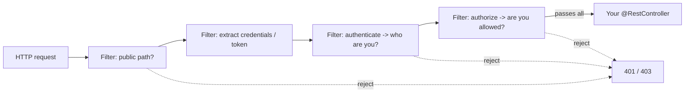

# Security with Spring Security

Spring Security intimidates almost everyone. People who write JPA mappings and transactional services without breaking a sweat open the security config, see a wall of `.authorizeHttpRequests(...)` and `.hasRole(...)` and something called a "filter chain," and quietly back away. The reputation is earned - for years the API was genuinely awkward, and most tutorials hand you a magic blob of config without explaining the machine underneath.

Before a single line of config, here's the one idea that turns Spring Security from voodoo into something you can reason about:

> **Spring Security is a chain of servlet filters that every request passes through *before* it reaches your controller.**

That's the whole secret. Hold that picture and everything else in this phase falls into place.

## The filter chain - the mental model that fixes everything

📝 A **servlet filter** is a piece of code that wraps every incoming HTTP request *before* your controller runs. Spring Security installs a whole ordered **chain** of them. A request comes in and walks through the chain one filter at a time - each filter asks a single question and either lets the request continue or stops it cold.

The questions look like this, roughly in order:

- *Is this path public (like `/login` or `/public/**`)?* If so, wave it through.
- *Is there a session, a token, or login credentials attached?* If so, figure out **who** this is.
- *Now that we know who they are, are they **allowed** to hit this URL?* If not, reject with 403.

Only if the request survives every filter does it finally reach your `@RestController`. If any filter says no, the request is turned away right there - your controller code never even runs.



*What just happened:* The request runs a gauntlet of filters, each with one job, and only a request that clears all of them reaches your controller. This is why your controller almost never contains security code - by the time a request gets there, the chain has *already* decided it's authenticated and authorized. When you write a `SecurityFilterChain` bean, you're not writing magic; you're configuring *which filters run* and *what they check*. Every confusing config method maps back to one of those filter questions.

## Authentication vs authorization - two different questions

These two words sound alike, get abbreviated to the nearly-identical authN and authZ, and are constantly confused - including in production code that conflates them and ships a security hole. They are *not* the same question, and the filter chain treats them as separate steps for exactly that reason.

📝 **Authentication (authN) = "who are you?"** It's the login step: you prove your identity with a password, a token, an API key. The output is a verified identity (or a rejection). **Authorization (authZ) = "are you allowed to do this?"** It happens *after* authentication, and it checks whether the now-known user has permission for *this specific action* - usually via **roles** (`ADMIN`, `USER`) or finer-grained permissions.

A worked example makes the split obvious: logging into your bank's app is authentication - the app now knows it's you. Being told "you can view your own account but not transfer from someone else's" is authorization. You're fully authenticated the whole time; you're just not authorized for that one action. Mix these up - checking *that* someone is logged in but never *what* they're allowed to do - and any logged-in user can do anything. One of the most common real-world security bugs.

This distinction is foundational enough that it has its own dedicated guide: [Authentication vs Authorization](/guides/auth-vs-authz). For now, the rule to carry forward: **authenticate first (who), authorize second (what), never collapse the two.**

## Configuring access - the SecurityFilterChain bean

Time for config - and now it won't feel like magic, because you know it's just describing filter behavior. Modern Spring Security (6.x) is configured by declaring a `SecurityFilterChain` **bean** (the old `WebSecurityConfigurerAdapter` you'll see in stale tutorials is gone - ignore it). You're handed a builder and you describe which paths are public, which need any logged-in user, and which need a specific role.

```java
import org.springframework.context.annotation.Bean;
import org.springframework.context.annotation.Configuration;
import org.springframework.security.config.annotation.web.builders.HttpSecurity;
import org.springframework.security.web.SecurityFilterChain;

@Configuration
public class SecurityConfig {

    @Bean
    public SecurityFilterChain filterChain(HttpSecurity http) throws Exception {
        http
            .authorizeHttpRequests(auth -> auth
                .requestMatchers("/public/**", "/login").permitAll()   // anyone
                .requestMatchers("/api/admin/**").hasRole("ADMIN")      // ADMIN role only
                .anyRequest().authenticated()                          // everything else: must be logged in
            )
            .httpBasic(basic -> {});   // accept HTTP Basic credentials for now

        return http.build();
    }
}
```

*What just happened:* `authorizeHttpRequests` is the **authorization filter** from our diagram, configured rule by rule. Rules are matched **top to bottom, first match wins**: `/public/**` and `/login` are open to everyone, `/api/admin/**` requires the `ADMIN` role, and `anyRequest().authenticated()` says every other path needs a logged-in user. ⚠️ Put specific rules *before* the broad `anyRequest()` catch-all - a catch-all placed too early swallows the rules below it. Also note: `hasRole("ADMIN")` looks for an authority named `ROLE_ADMIN` - Spring adds the `ROLE_` prefix for you, which trips up everyone once.

## Passwords & users - never store plaintext

Authorization rules are useless if anyone can log in as anyone. So the chain needs to *authenticate* - and that means storing and checking passwords. Here is the single most important rule in this entire phase, in bold because people still get it wrong:

📝 **Never store passwords as plaintext. Store a salted hash, and let a `PasswordEncoder` do it.** Spring's standard choice is **BCrypt**: a deliberately slow, salted hashing algorithm. When a user registers you store `encoder.encode(rawPassword)`; when they log in Spring calls `encoder.matches(rawInput, storedHash)`. The original password is never written down anywhere, so a database leak doesn't hand an attacker everyone's credentials. *Why* hashing (not encryption), *why* slow, and *why* salted is its own rich topic - see [How Passwords Are Stored](/guides/how-passwords-are-stored).

To teach the chain *where* your users live, you provide a `UserDetailsService` - a single method that loads a user by username and returns their stored hash plus their roles. Spring's authentication filter calls it, compares the password, and on success records who you are.

```java
import org.springframework.context.annotation.Bean;
import org.springframework.security.core.userdetails.User;
import org.springframework.security.core.userdetails.UserDetailsService;
import org.springframework.security.crypto.bcrypt.BCryptPasswordEncoder;
import org.springframework.security.crypto.password.PasswordEncoder;

@Bean
public PasswordEncoder passwordEncoder() {
    return new BCryptPasswordEncoder();   // salted, deliberately slow
}

@Bean
public UserDetailsService users(PasswordEncoder encoder) {
    var admin = User.withUsername("admin")
        .password(encoder.encode("s3cret"))   // store the HASH, never the raw value
        .roles("ADMIN")                        // becomes authority ROLE_ADMIN
        .build();
    return new InMemoryUserDetailsManager(admin);
}
```

*What just happened:* The `PasswordEncoder` bean tells Spring to hash with BCrypt everywhere. `UserDetailsService` defines a single user whose password is *stored as a BCrypt hash*, not the raw string - when "admin" logs in, the filter hashes their input and compares hashes. `InMemoryUserDetailsManager` is perfect for a demo; a real app implements `UserDetailsService` to load users from your database via the repository pattern from [Phase 6](06-service-layer-and-validation.md). `.roles("ADMIN")` is what makes the earlier `hasRole("ADMIN")` rule match this user.

A quick word on the two built-in login styles you'll choose between. **HTTP Basic** (`httpBasic`) sends the username and password on *every* request in a header - dead simple, common for machine-to-machine APIs. **Form login** (`formLogin`) shows a login page, authenticates once, and tracks you with a session cookie afterward - the right fit for browser apps with human users.

⚠️ **None of this is safe without HTTPS.** HTTP Basic literally puts your password (base64-encoded, which is *not* encryption) in a header on every request; form login ships a session cookie around. Over plain HTTP, anyone on the network can read both. In production, terminate TLS and serve everything over HTTPS - non-negotiable. If "TLS" is fuzzy, [HTTPS and TLS](/guides/https-and-tls) explains exactly what it protects and how.

## Stateless APIs & JWT - the overview

The session-cookie model assumes the server *remembers* you between requests (it keeps session state in memory). For a REST API serving mobile apps and other services, that's often the wrong shape - you'd rather each request carry its own proof and the server remember nothing.

📝 **A stateless API carries identity on every request instead of relying on a server-side session.** The dominant approach is the **JWT (JSON Web Token)**: at login the server hands the client a signed token encoding who they are and when it expires; the client sends it back in an `Authorization: Bearer <token>` header on every subsequent request. A custom filter (slotted right into the chain you already understand) validates the signature and expiry, and if it checks out, marks the request authenticated - *without any session lookup*.

```http
GET /api/orders HTTP/1.1
Host: api.example.com
Authorization: Bearer eyJhbGciOiJIUzI1Ni
```

*What just happened:* The client attaches its token in the `Authorization` header. A JWT-validation filter near the front of the chain reads it, verifies the signature with the server's secret key, checks it hasn't expired, and - if valid - populates the authenticated identity so the authorization rules downstream can do their job. No session, no server-side memory of this user. That's the whole appeal: any server instance can validate the token, so you scale horizontally without sticky sessions.

We're deliberately *not* writing a full JWT implementation here, and you should be wary of any tutorial that casually does. ⚠️ The footguns are real: **where the client stores the token** (`localStorage` is XSS-exposed; `HttpOnly` cookies dodge that but invite CSRF), **expiry and revocation** (a stateless token can't be "logged out" server-side without extra machinery like a denylist or refresh tokens), and the cardinal sin - **rolling your own crypto or token parsing**. Use a vetted, maintained library (`jjwt` or Nimbus) and lean on it.

For finer control than URL rules give you, **method-level security** lets you guard individual methods. Enable it with `@EnableMethodSecurity` and annotate:

```java
@PreAuthorize("hasRole('ADMIN')")
public void deleteUser(Long id) { ... }
```

*What just happened:* `@PreAuthorize` runs its check *before* the method body executes - same authorization question as the URL rules, just expressed at the method instead of the path. It shines when authorization depends on the actual arguments (`@PreAuthorize("#id == authentication.name")` to let users act only on their own data), which URL patterns can't express.

💡 **Security is the worst possible place to be clever.** The framework's defaults - BCrypt, filter chain ordering, CSRF protection, vetted token libraries - encode years of hard-won lessons and patched vulnerabilities. Configure the battle-tested machine; don't reinvent it. The most secure code you'll write here is the code you *didn't* write.

## Recap

1. **The filter chain is the whole mental model.** Spring Security is an ordered chain of servlet filters every request passes *before* reaching your controller; each filter asks one question (public? authenticated? authorized?) and lets the request continue or stops it. Every config method maps back to a filter.
2. **AuthN ≠ authZ.** Authentication is "who are you?" (login); authorization is "are you allowed?" (roles/permissions), and it comes second. Conflating them - checking that someone's logged in but not what they can do - is a classic hole. See [Authentication vs Authorization](/guides/auth-vs-authz).
3. **Configure access with a `SecurityFilterChain` bean.** `permitAll()` for public paths, `authenticated()` for any logged-in user, `hasRole("ADMIN")` for role-gated paths. Rules match top-down, first match wins - put specifics before the `anyRequest()` catch-all.
4. **Never store plaintext passwords.** Use a `PasswordEncoder` (BCrypt: salted and slow), load users via a `UserDetailsService`, and pick HTTP Basic (machine APIs) or form login (browsers). ⚠️ All of it depends on HTTPS in production - see [How Passwords Are Stored](/guides/how-passwords-are-stored) and [HTTPS and TLS](/guides/https-and-tls).
5. **Stateless APIs use JWTs.** The client sends a signed token in `Authorization: Bearer ...` on each request; a filter validates it, no session needed. ⚠️ Mind token storage, expiry/revocation, and never roll your own crypto. `@PreAuthorize` adds method-level checks.
6. **Don't be clever with security.** Lean on the framework's battle-tested defaults; the safest code is the code the framework already wrote and patched for you.

## Quick check

Make sure the one idea that unlocks Spring Security - and its two most-confused concepts - actually stuck:

```quiz
[
  {
    "q": "What is the core mental model for how Spring Security works?",
    "choices": [
      "It's a chain of servlet filters that every request passes through before reaching your controller, each checking one thing",
      "It encrypts your controller methods so only authorized code can call them",
      "It rewrites your @RestController at compile time to add login checks",
      "It runs as a separate server that proxies requests to your application"
    ],
    "answer": 0,
    "explain": "Spring Security installs an ordered chain of servlet filters. A request walks through them one at a time - is this path public? who are you? are you allowed? - and only a request that clears every filter reaches your controller. Every config method maps back to configuring one of those filters."
  },
  {
    "q": "Which statement correctly distinguishes authentication from authorization?",
    "choices": [
      "Authentication is 'who are you?' (login); authorization is 'are you allowed to do this?' (roles/permissions), and it happens after authentication",
      "Authentication is for APIs and authorization is for web pages",
      "They are two names for the same login step and can be used interchangeably",
      "Authorization happens first to decide whether to even bother authenticating"
    ],
    "answer": 0,
    "explain": "Authentication verifies identity (the login step). Authorization, which runs afterward on a now-known user, decides whether that user may perform a specific action via roles or permissions. Collapsing the two - confirming someone is logged in but never checking what they can do - is a common security hole."
  },
  {
    "q": "Why should you never store a user's password as plaintext, and what does a PasswordEncoder like BCrypt do instead?",
    "choices": [
      "It stores a salted, slow hash of the password; on login Spring hashes the input and compares hashes, so a database leak doesn't expose real passwords",
      "It encrypts passwords with a reversible cipher so they can be decrypted when needed",
      "It compresses passwords to save database space",
      "It sends passwords to an external service for verification on every login"
    ],
    "answer": 0,
    "explain": "BCrypt produces a salted, deliberately slow one-way hash. You store the hash, and at login Spring hashes the submitted password and compares hashes - the raw password is never written down. So even a full database leak doesn't hand an attacker usable credentials. (Hashing is one-way, not reversible encryption.)"
  }
]
```

---

[← Phase 8: Testing Spring Boot Apps](08-testing-spring-boot.md) · [Guide overview](_guide.md) · [Phase 10: Production: Actuator, Packaging & Deployment →](10-production-actuator-and-deploy.md)
