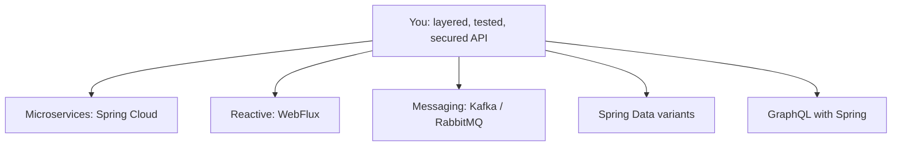

# Where to Go Next

Stop for a second and look at what you can actually do now. You can stand up a REST API with real controllers, wire its pieces together with dependency injection instead of `new` everywhere, persist data through Spring Data JPA, separate your service layer from your web layer, validate input, return honest HTTP status codes, write tests that boot the context or slice into one layer, lock endpoints down with Spring Security, and package the whole thing into a runnable JAR with health checks and metrics that you can ship. That is not a toy. That is the shape of the work that pays Spring developers — and "Java developer" in a job posting very often means exactly the person who can do what you just learned to do.

So this last phase isn't more annotations. It's the map of where the road forks from here, an honest word on each branch, and the one thing that turns all of this from *read* into *yours*: building something and finishing it. The Spring world is enormous, and it's tempting to feel you have to swallow all of it. You don't. Pick the branch your target job actually uses, go deep there, and leave the rest as names you'd recognize.

## The branches from here



*What this shows:* five directions lead out from where you stand. None of them is a do-over — every one builds on the controllers, beans, and config you already understand. The honest advice is the same as it was for picking a project: go deep on one, and let your target job decide which.

## Microservices with Spring Cloud — the enterprise direction

The monolith you can build today is a single deployable. Lots of large organizations instead run dozens of small services that talk to each other, and **Spring Cloud** is the toolkit for the plumbing that makes that bearable: a **config server** so configuration lives in one place instead of scattered across services, **service discovery** so services find each other without hard-coded addresses, and an **API gateway** as the single front door that routes and secures traffic.

This is where a great deal of enterprise Java lives, so if you're aiming at a big shop, it's high-leverage. Be honest with yourself about the trade, though: microservices buy you independent deployment and scaling at the cost of real operational complexity — network calls that fail, distributed tracing, data spread across services. Worth learning. Not worth reaching for on day one of a project that a single well-built service would handle.

## Reactive with WebFlux — non-blocking for high concurrency

Everything you built so far is the classic **Spring MVC** model: one thread per request, and that thread waits while the database answers. That's simple to reason about and it's the right default for most applications. **Spring WebFlux** is the other model — **non-blocking**, where a small pool of threads juggles many in-flight requests instead of parking on each one. It shines when you have huge numbers of concurrent connections that spend most of their time waiting (think streaming, or a gateway fanning out to many slow downstreams).

The honest caveat: reactive code is a genuinely different way of thinking (you compose `Mono` and `Flux` pipelines rather than writing straight-line code), and it's harder to debug. Reach for it when you have a concurrency problem that blocking can't solve — not because "non-blocking" sounds faster.

## Messaging — Kafka and RabbitMQ for event-driven systems

So far your services talk by one calling another and waiting for the answer. **Messaging** flips that: a service drops an event onto a queue or topic and moves on, and other services consume it whenever they're ready. This is how you build **asynchronous, event-driven** systems that stay responsive and decoupled — the order service announces "order placed" and doesn't care who's listening. **RabbitMQ** is a classic message broker; **Apache Kafka** is the de facto event-streaming backbone of modern systems. Spring Boot has first-class starters for both.

💡 This is one of the most useful patterns to have in your pocket, and it's worth understanding the concepts *before* the Spring specifics — what a queue is, what delivery guarantees mean, why async changes how you reason about failure. The [Webhooks & Message Queues](/guides/webhooks-and-message-queues) guide is the mental model; the Spring starters are how you wire it up once you have it.

## Spring Data variants — beyond the relational database

You learned Spring Data JPA against a relational database, but the same repository idea stretches across very different stores. **Spring Data MongoDB** gives you the familiar repository abstraction over a document database when your data is more naturally nested than tabular. **Spring Data Redis** puts an in-memory store in reach for caching, sessions, and fast counters. The pleasant surprise here is how little is new: once you understand repositories and how Spring Data derives queries, picking up a new backing store is mostly learning *that store's* trade-offs, not a new framework.

## GraphQL with Spring — a different API shape

REST isn't the only way to expose an API. **GraphQL** lets the client ask for exactly the fields it wants in one request, which can be a real win for rich front-ends that would otherwise make many REST calls. **Spring for GraphQL** is the official integration, and it slots into the same controller-and-service thinking you already have — you're defining a schema and resolvers instead of endpoints. A good branch to know exists; whether it's worth depth depends entirely on whether the teams you want to join use it.

## Demystify further — learn core Spring

💡 Here's the move that truly kills the remaining magic. Spring Boot is **auto-configured Spring** — under every starter and every "it just works" is plain Spring Framework that Boot generated for you. If you want the fog to lift completely, go *down* a layer and learn the **core Spring Framework**: writing `@Configuration` classes by hand, watching the **bean lifecycle** happen on purpose, seeing the **servlet layer** that Boot's embedded server quietly stands up. Do this *after* this guide, not instead of it — Boot is how the job actually gets done — but it's the difference between trusting the magic and understanding it.

The [Spring Framework (core)](/guides/spring-framework-from-zero) guide is exactly that demystifier: the "less-magic Spring," where you write the configuration Boot auto-generates. And if you want to zoom out further — why a framework like Spring exists at all, what problem it's solving by taking control away from your `main` method — [What a Framework Even Is](/guides/what-a-framework-even-is) is the mental model the whole stack rests on.

## What to actually build

Reading got you here. *Building* is what makes it stick — and the trick is something small enough to finish but real enough to teach you the messy parts. Three honest suggestions, roughly in order:

- **A full CRUD API with auth, a real database, and tests.** Endpoints to create, read, list, update, and delete; persistence through Spring Data JPA; login secured with Spring Security; a handful of tests that prove it works. This one consolidates the *entire* guide into a single thing you can point at and say "I built that." Start here.
- **A second service that calls the first.** Once one service works, stand up another that talks to it over HTTP. You'll feel the first real taste of microservices — service-to-service calls, what happens when the other side is down — without the full Spring Cloud apparatus.
- **Add a message queue between them.** Replace one of those direct calls with an event on RabbitMQ or Kafka, so the first service announces something and the second reacts on its own time. Now you've felt synchronous *and* asynchronous communication, which is most of what distributed systems are.

Whatever you pick, the real instruction is one word: **finish**. One rough project carried all the way to "it runs and I can show it" teaches you more than three polished half-builds abandoned at 80%. Choose the one that excites you and take it end to end, even if it's small.

## A last word, and what to read

Two resources are worth a permanent bookmark. The **official Spring guides at spring.io/guides** are short, focused, task-shaped walkthroughs maintained by the people who build Spring — and the **reference documentation** behind them is genuinely good when you need the real answer instead of a forum guess. When something behaves strangely, the reference docs almost always explain *why*, which is the habit that separates people who fight the framework from people who work with it.

And remember the through-line of this whole guide: the magic was never magic. It was layers — a servlet container, a bean container wiring your objects, auto-configuration making sensible defaults, starters pulling in coherent sets of dependencies. You can see every one of those layers now. You came in wary of the spells; you're leaving able to read what's underneath them, build a real application on top, and reason about it when it breaks. That's a hireable Spring skill. Go build the small thing, finish it, and ship it. You're ready.

## Recap

1. **You can build and ship a real Spring app** — a layered, tested, secured REST API in a runnable JAR. That's the shape of the work Spring developers are hired to do.
2. **The branches from here:** Spring Cloud (microservices), WebFlux (reactive/non-blocking), messaging with Kafka or RabbitMQ (event-driven), Spring Data variants (MongoDB, Redis), and GraphQL — go deep on the one your target job uses.
3. **Each branch builds on what you know** — controllers, beans, repositories, and config carry over; none of these is starting from scratch.
4. **To truly kill the magic, learn core Spring** — `@Configuration` by hand, the bean lifecycle, the servlet layer — *after* this guide, via [Spring Framework (core)](/guides/spring-framework-from-zero) and [What a Framework Even Is](/guides/what-a-framework-even-is).
5. **Build one real thing and finish it** — a full CRUD API with auth, a database, and tests; then a second service; then a message queue between them. Finishing beats polishing.
6. **Next reading:** the official guides and reference docs at spring.io. The magic was never magic — it's the layers you now understand.

## Quick check

Test yourself on the decisions that matter most as you leave this guide:

```quiz
[
  {
    "q": "What is the honest reason to reach for Spring WebFlux over the classic Spring MVC model?",
    "choices": [
      "You have a real high-concurrency problem where many requests spend most of their time waiting",
      "Reactive code is simpler to read and debug than straight-line code",
      "Spring MVC is deprecated and WebFlux is its required replacement",
      "Non-blocking always makes every application faster"
    ],
    "answer": 0,
    "explain": "WebFlux is non-blocking and shines under large numbers of concurrent, mostly-waiting connections. It's a genuinely different (and harder to debug) way of thinking, so reach for it when blocking can't solve your concurrency problem — not because 'non-blocking' sounds faster."
  },
  {
    "q": "What is the relationship between Spring Boot and the core Spring Framework?",
    "choices": [
      "Spring Boot is auto-configured Spring — under every starter is plain Spring Framework it generated for you",
      "Spring Boot replaced the Spring Framework, which no longer exists",
      "They are unrelated frameworks that happen to share a name",
      "Core Spring is a newer rewrite that sits on top of Spring Boot"
    ],
    "answer": 0,
    "explain": "Boot is auto-configured Spring. Learning the core framework — manual @Configuration, the bean lifecycle, the servlet layer — is the way to see what Boot automates, best done after this guide rather than instead of it."
  },
  {
    "q": "What's the most important rule when choosing what to build next?",
    "choices": [
      "Pick one small-but-real project and finish it end to end",
      "Start a microservices system so you cover the most ground at once",
      "Only build something that uses all five branches together",
      "Avoid auth and databases until you've read the full reference docs"
    ],
    "answer": 0,
    "explain": "One rough project finished teaches more than three polished half-builds abandoned at 80%. Start with a full CRUD API with auth, a database, and tests — it consolidates the whole guide — and take it all the way to shipping."
  }
]
```

---

[← Phase 10: Production: Actuator, Packaging & Deployment](10-production-actuator-and-deploy.md) · [Guide overview](_guide.md)
