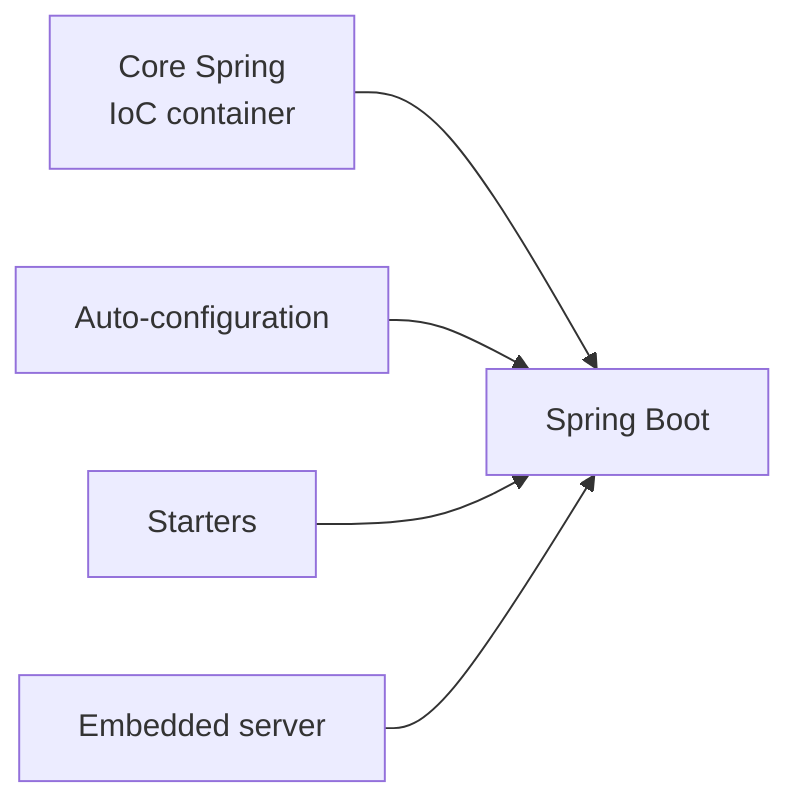

# Spring Without Boot - Why Core Spring?

If you came here from Spring Boot, you already have a working app and a comfortable feeling that the framework "handles things." This guide deliberately takes that comfort away - temporarily - so you can see what's underneath. We're going to build a Spring application *without* Boot: more typing, more visible wiring, and at the end, a much deeper understanding of what Boot was doing on your behalf the whole time.

Think of this as the **roots guide**. The [Spring Boot guide](/guides/spring-boot-from-zero) showed you the fast, pleasant path. Here we walk the slow path once, on purpose, so when you go back to Boot you'll read its annotations with X-ray vision - you'll *know* what each one replaced.

We'll use one running example across the whole guide: a `NotificationService` that needs to send messages through a `MessageSender` interface, with implementations like `EmailSender` and `SmsSender`. It's a small domain, but it's exactly the shape that makes dependency injection, qualifiers, scopes, and AOP worth learning. The web layer doesn't arrive until phase 7 - for now everything runs in a plain `main`.

## The reveal: what Spring Boot actually is

Let's name the thing this whole guide is built around, because once it's clear, everything else falls into place.

📝 **Spring Boot = core Spring Framework + auto-configuration + starters + an embedded server.** That's the entire formula. Boot is not a separate framework that competes with Spring; it's Spring with three convenience layers bolted on top. Strip those three layers away and what remains - the part that actually constructs and connects your objects - is **core Spring**, and that's what this guide is about.

> 💡 **Key point.** When you write a Boot app, the IoC container doing the real work is plain Spring. Boot's contribution is removing the setup: it picks your dependencies (starters), configures libraries with sane defaults (auto-configuration), and starts a web server for you (embedded server). Take those away and you do that setup yourself - but the engine underneath is identical.

So this isn't a different stack. It's the *same* stack with the conveniences peeled off so you can watch each gear turn.

## What core Spring is (and isn't)

📝 The **heart of the Spring Framework is the IoC container** - the part that creates your objects, figures out what each one depends on, and wires them together. (We give the container its own deep dive in [Phase 2: The IoC Container & ApplicationContext](02-the-ioc-container.md); for now, just hold the idea that *something* builds and connects your objects for you.) Everything else Spring offers - data access, transactions, web, security - is built around that container.

When you drop Boot, here's specifically what disappears:

- **No auto-configuration.** Nothing inspects your classpath and sets up defaults. If you want a feature, you add the library and configure it yourself.
- **No embedded server.** There's no Tomcat starting up. A core-Spring app is a plain Java program with a `main` method (a web server comes later, and you wire it deliberately).
- **No magic defaults.** No port 8080 appearing, no JSON serializer auto-selected. You get exactly what you ask for and nothing more.

What you *do* get is the container. To pull it in, you add one dependency yourself - `spring-context`, the module that contains the container - instead of letting a Boot starter do it:

```xml
<dependency>
    <groupId>org.springframework</groupId>
    <artifactId>spring-context</artifactId>
    <version>6.1.0</version>
</dependency>
```

*What just happened:* you declared a direct dependency on `spring-context`, Spring's core container module, and you pinned the version yourself (`6.1.0`). Notice the contrast with Boot: there's no `spring-boot-starter-*` here, no parent project managing versions for you, and no bundle of related libraries arriving alongside it. You asked for the container, you got the container - that's the whole transaction. This single dependency is enough to stand up an application context, which is exactly what we'll do next.

## Standing up an ApplicationContext by hand

In Boot, the line `SpringApplication.run(...)` creates the container for you. Without Boot, you create it yourself - and seeing that one line of "magic" expand into explicit code is the whole point of this section.

First, the domain. A service that depends on an interface, and one implementation of that interface:

```java
public interface MessageSender {
    void send(String to, String message);
}
```

```java
import org.springframework.stereotype.Component;

@Component
public class EmailSender implements MessageSender {
    @Override
    public void send(String to, String message) {
        System.out.println("EMAIL to " + to + ": " + message);
    }
}
```

```java
import org.springframework.stereotype.Service;

@Service
public class NotificationService {
    private final MessageSender sender;

    public NotificationService(MessageSender sender) {   // dependency injected by the container
        this.sender = sender;
    }

    public void notifyUser(String user) {
        sender.send(user, "Welcome aboard!");
    }
}
```

*What just happened:* `NotificationService` asks for a `MessageSender` in its constructor instead of building one - that's constructor injection, exactly as in the Boot guide. `EmailSender` is flagged `@Component` so the container will create it, and `NotificationService` is flagged `@Service` for the same reason. So far this is identical to Boot code; the annotations work the same because they *are* the same - they're core Spring annotations, not Boot ones.

Now the part Boot hides. We need a configuration class that tells the container where to look for these components, and then a `main` that builds the container by hand:

```java
import org.springframework.context.annotation.ComponentScan;
import org.springframework.context.annotation.Configuration;

@Configuration
@ComponentScan(basePackages = "com.example.notify")
public class AppConfig {
}
```

```java
import org.springframework.context.annotation.AnnotationConfigApplicationContext;

public class Main {
    public static void main(String[] args) {
        var context = new AnnotationConfigApplicationContext(AppConfig.class);   // build the container

        NotificationService service = context.getBean(NotificationService.class); // pull a bean out
        service.notifyUser("ada@example.com");                                     // use it

        context.close();
    }
}
```

```console
EMAIL to ada@example.com: Welcome aboard!
```

*What just happened:* this is the entire lifecycle, in the open. `new AnnotationConfigApplicationContext(AppConfig.class)` constructs the container and points it at `AppConfig`. Because `AppConfig` carries `@ComponentScan`, the container walks the `com.example.notify` package, finds `EmailSender` and `NotificationService`, creates one of each, and - seeing that `NotificationService` needs a `MessageSender` - passes the `EmailSender` bean into its constructor. Then `context.getBean(...)` hands you the fully-wired service and you call it. Every step here - create container, scan, instantiate, inject - is precisely what `SpringApplication.run(...)` does in one line.

## What you had to do that Boot did automatically

Step back and tally the work. To get that one line of output, you personally had to:

1. **Pick the dependency.** You chose `spring-context` and its version. Boot's starter would have brought it in (with a managed version) the moment you added `spring-boot-starter-web`.
2. **Write a configuration class.** `AppConfig` with `@ComponentScan` is something Boot's `@SpringBootApplication` bundles in automatically (it includes a component scan rooted at your main class's package).
3. **Create the context yourself.** You wrote `new AnnotationConfigApplicationContext(...)` and called `getBean(...)` and `close()` by hand. Boot's `SpringApplication.run(...)` did all of that - and kept the context alive for you.
4. **Skip the web server.** There is no web server here. Boot would have started embedded Tomcat from the web starter; you got a program that prints to the console and exits.

> 💡 **Insight.** Boot didn't add *power* - every capability you'll use in this guide is core Spring. Boot removed *ceremony*. Each item on that list above is a piece of setup Boot performed silently. None of it is hard; there's just a lot of it, and Boot's whole value proposition is doing it for you so you can start with business logic instead of plumbing.

Here's the relationship in one picture:



This guide lives entirely in that leftmost box. Everything to its right is convenience layered on top.

## Why bother learning this

Fair question - if Boot does all of this for you, why spend a guide undoing it? Because the people who are genuinely good with Spring are the ones who can name what's in each box when something goes wrong.

> 💡 **Insight.** Knowing core Spring pays off in exactly the moments Boot's convenience runs out: a bean isn't found and you understand it's a component-scan path problem, not "Spring being weird." A startup error mentions the `ApplicationContext` and you know precisely what that is and when it's built. An annotation behaves unexpectedly and you can reason about it, because you've seen the container that reads it. Boot's "magic" stops being magic once you've built the machine by hand once.

There's a concrete payoff waiting, too: when you finish this guide and reopen the [Spring Boot guide](/guides/spring-boot-from-zero), you'll read `@SpringBootApplication` and `SpringApplication.run(...)` and see straight through them to the container, the scan, and the wiring you now understand. Same code, completely different level of comprehension.

Next, we go inside that leftmost box and take the container itself apart - what the `ApplicationContext` really is, how it manages beans, and the lifecycle from construction to shutdown.

## Recap

- **Spring Boot = core Spring + auto-configuration + starters + embedded server.** Boot isn't a rival framework; it's Spring with three convenience layers on top. This guide works in the core-Spring box, with those layers removed.
- **The heart of core Spring is the IoC container** - the engine that creates and connects your objects. Without Boot there's no auto-config, no embedded server, and no magic defaults; you add `spring-context` yourself and configure what you need.
- **You build the `ApplicationContext` by hand** with `new AnnotationConfigApplicationContext(AppConfig.class)`, where a `@Configuration` class with `@ComponentScan` tells the container where to find your `@Component`/`@Service` beans. `getBean(...)` then hands you a fully-wired object.
- **Everything you did manually, Boot does silently:** pick the dependency, write the config class, create and manage the context, and start (or skip) a server. Boot removed ceremony, not power.
- **Learning this buys you debugging clarity** - you'll understand errors, bean-not-found problems, and annotation behavior - and you'll re-read the Boot guide with X-ray vision.

## Quick check

Make sure the core mental model landed before moving on to the container itself:

```quiz
[
  {
    "q": "What is Spring Boot, in terms of core Spring?",
    "choices": [
      "A replacement framework that removes the IoC container",
      "Core Spring plus auto-configuration, starters, and an embedded server",
      "A separate web server that runs Spring apps",
      "An older version of Spring before annotations existed"
    ],
    "answer": 1,
    "explain": "Boot is core Spring with three convenience layers added on top - auto-configuration, starters, and an embedded server. The IoC container underneath is plain Spring."
  },
  {
    "q": "In a core-Spring app with no Boot, what creates the ApplicationContext?",
    "choices": [
      "Spring Boot's auto-configuration starts it automatically",
      "An embedded Tomcat server builds it on the first request",
      "You create it yourself, e.g. new AnnotationConfigApplicationContext(AppConfig.class)",
      "It is created lazily the first time you call new on any class"
    ],
    "answer": 2,
    "explain": "Without Boot, you construct the context by hand in main. That explicit line is exactly what SpringApplication.run(...) does for you in a Boot app."
  },
  {
    "q": "Which of these did you have to do by hand here that Boot would have done for you?",
    "choices": [
      "Write the business logic inside notifyUser",
      "Implement the MessageSender interface",
      "Add the spring-context dependency, write a @ComponentScan config class, and create the context",
      "Decide that NotificationService should depend on an interface"
    ],
    "answer": 2,
    "explain": "Picking the dependency, writing the configuration/component-scan class, and creating and closing the context are all setup Boot performs silently. The business logic and interface-based design are yours either way."
  }
]
```

---

[Guide overview](_guide.md) · [Phase 2: The IoC Container & ApplicationContext →](02-the-ioc-container.md)
