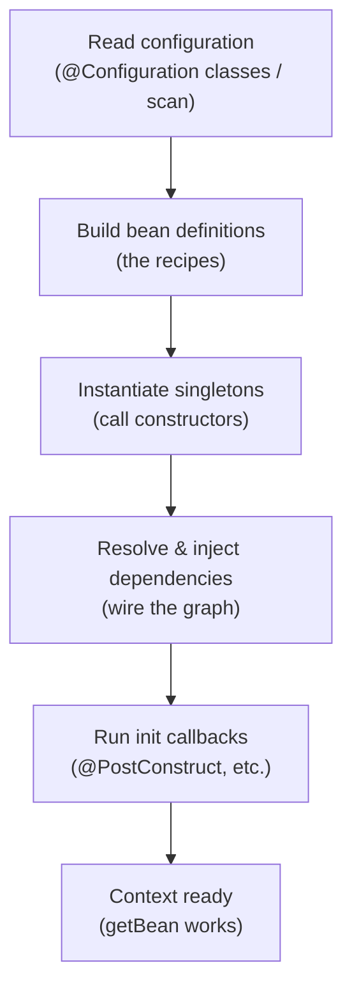

# The IoC Container & ApplicationContext

In [Phase 1](01-spring-without-boot.md) you stood up an `ApplicationContext` by hand and watched it
hand you back a fully-assembled object. That object came out of *the container* — and the container is
the single thing the entire rest of Spring is built on. Defining beans, dependency injection, scopes,
AOP, `@Transactional` — every one of those is "the container doing one more job for you." So before we
add features, we're going to look hard at the machine itself: what it is, what it holds, and what
actually happens when it boots.

Here's the mental model to carry through the whole phase: **the container is a factory that owns your
objects.** You don't `new` them; you give the container recipes, and it builds them, wires them
together, and manages them for as long as your app runs. Everything else is detail on top of that one
sentence.

## Inversion of Control, concretely

📝 In [What a Framework Even Is](/guides/what-a-framework-even-is) we met the principle "don't call us,
we'll call you" — a framework runs the show and calls into *your* code. **Inversion of Control** is that
principle applied to *object creation*: instead of your code building the objects it depends on, a
container builds them and hands each object the things it needs.

Picture our domain — a `NotificationService` that sends messages through a `MessageSender` (say, an
`EmailSender`). Without a container, *your* code does all the assembly:

```java
public class App {
    public static void main(String[] args) {
        MessageSender sender = new EmailSender("smtp.acme.com", 587);  // you build this
        NotificationService service = new NotificationService(sender); // you build this
        service.notify("ada@example.com", "Welcome aboard!");          // ...and you wire them
    }
}
```
*What just happened:* your `main` is the assembler. It decides every concrete class (`EmailSender`),
every constructor argument, and the exact order things get built — sender first, then service, because
the service needs the sender. For two objects this is fine. For a real app with fifty interdependent
objects, this hand-wiring becomes a sprawling, brittle web that you maintain by hand.

With IoC, you stop being the assembler. You describe the objects and let the container build the web:

```java
public class App {
    public static void main(String[] args) {
        ApplicationContext context =
            new AnnotationConfigApplicationContext(AppConfig.class); // hand over the recipes
        NotificationService service = context.getBean(NotificationService.class);
        service.notify("ada@example.com", "Welcome aboard!");        // already wired
    }
}
```
*What just happened:* you handed the container a configuration class and asked it for a
`NotificationService`. The container had already built the `EmailSender`, built the
`NotificationService`, and injected the former into the latter — *before* you asked. Control over
"who builds what, in what order" moved out of your `main` and into the container. That's the inversion.

## What a bean really is

📝 A **bean** is an object that the Spring container instantiates, configures, injects dependencies
into, and manages for its whole lifecycle. That last part matters: a bean isn't just "an object Spring
made once" — it's an object Spring *owns*, from creation through any init/destroy callbacks until the
context shuts down.

The crucial corner that trips people up: **not every object in your app is a bean.** Only the objects
the container owns are beans. In our example, `EmailSender` and `NotificationService` are beans — the
container made them and manages them. But a `Notification` value object you `new` up inside a method to
represent one message? That's just a plain object. The container never sees it, so it's not a bean.

⚠️ "Is this a bean?" has exactly one test: *did the container create and manage it?* If you wrote
`new` yourself and the container knows nothing about it, it is not a bean — and none of Spring's
features (injection, scopes, AOP) apply to it.

Internally the container keeps **two** things, and it's worth separating them in your head:

- **Bean definitions** — the *recipes*. "There is a bean of type `EmailSender`; here is how to build
  it; it depends on nothing." Definitions are metadata, built first, before any object exists.
- **Bean instances** — the actual constructed objects, created *from* the definitions.

📝 The container reads all the definitions first, then uses them to instantiate the real objects. Keep
that order in mind — it's exactly what the bootstrap sequence below walks through.

## BeanFactory vs ApplicationContext

You'll see two container types named in Spring docs, and the distinction is simpler than it looks.

📝 **`BeanFactory`** is the bare-bones container interface — the minimum: hold bean definitions, create
beans on demand (lazily), inject their dependencies. That's it. It's the foundational contract.

📝 **`ApplicationContext`** *extends* `BeanFactory` and adds the production features you actually rely
on every day:

- **Eager singleton instantiation** — builds your singleton beans at startup, so wiring errors surface
  immediately instead of on first use.
- **Application events** — publish/subscribe between beans.
- **Internationalization (i18n)** — message source resolution.
- **AOP integration** — the hook that makes `@Transactional` and friends work (Phase 6).
- **Environment & property resolution** — profiles, `@Value`, configuration.

💡 In practice you **always use `ApplicationContext`** (concretely
`AnnotationConfigApplicationContext` for Java config, as in Phase 1). `BeanFactory` is the bare engine;
`ApplicationContext` is the engine wrapped in everything that makes Spring *Spring*. Boot's
`SpringApplication.run(...)` returns an `ApplicationContext` too — same container, just bootstrapped
for you.

## How the container bootstraps

When you construct an `ApplicationContext`, a fixed sequence runs. Knowing it turns startup errors from
mysteries into "oh, it failed at *that* step."



Walk it through our domain:

1. **Read configuration** — the container reads `AppConfig` (and any component scan) to discover what
   beans should exist.
2. **Build bean definitions** — it records two recipes: one for `EmailSender`, one for
   `NotificationService` (noting that the latter needs a `MessageSender`).
3. **Instantiate singletons** — it constructs `EmailSender` first, because `NotificationService`
   can't be built until its dependency exists.
4. **Resolve & inject dependencies** — it constructs `NotificationService`, passing the already-built
   `EmailSender` into its constructor.
5. **Run init callbacks** — any `@PostConstruct` methods fire on the freshly-built beans.
6. **Context ready** — the graph is fully assembled; calls like `getBean` now return wired objects.

```console
Building EmailSender bean...
Building NotificationService bean (injecting EmailSender)...
ApplicationContext ready — 2 beans
```
*What just happened:* the container did the assembly you used to write in `main`, in dependency order,
at startup. By the time the context is "ready," `NotificationService` already holds its `EmailSender`.
And because `ApplicationContext` instantiates singletons *eagerly* (step 3), a typo like "no bean of
type `MessageSender` found" blows up at startup — not three hours later when a request finally hits
that code path.

## Getting beans & the mental shift

Once the context is ready, you *can* pull a bean out by hand:

```java
NotificationService service = context.getBean(NotificationService.class);
```
*What just happened:* you asked the container for the bean of type `NotificationService`, and it
returned the fully-wired singleton it built at startup. Note what you did *not* do: you never wrote
`new NotificationService(...)`, and you never built the `EmailSender` to pass in. The container already
owns the assembled graph; `getBean` just hands you a reference to a node in it.

💡 But here's the mental shift: **you rarely call `getBean` at all.** You typically call it exactly
once — at the very top, to grab the root object that kicks off your app (in Phase 1, that was the whole
program; in a web app, the framework does even this for you). *Inside* your beans, you never reach into
the container — you declare a constructor dependency and let injection deliver it, exactly the way
`NotificationService` receives its `MessageSender`. Reaching for `getBean` inside your own beans is a
code smell: it means a class is pulling from the container instead of declaring what it needs.

So the real picture: the container is the **assembler of your entire object graph.** You describe the
nodes (beans) and their dependencies; it builds and connects all of them at startup; your code just
*uses* the wired objects.

💡 This is why we called the container the foundation. It's the "factory of factories" — the one thing
Boot bootstraps for you, and the thing every other Spring feature stands on. Dependency injection
(Phase 4) is the container resolving constructor parameters. Scopes (Phase 5) are the container
deciding how many instances to make and how long to keep them. AOP (Phase 6) is the container handing
you a proxy in place of your bean. Master the container, and the rest of Spring stops being a pile of
annotations and becomes one machine doing variations on a single job.

## Recap

1. **Inversion of Control, concretely:** instead of your code building its dependencies with `new`,
   the container builds them and injects them — control over "who builds what, in what order" moves
   from your code into the container.
2. **A bean** is an object the container instantiates, configures, injects, and manages for its whole
   lifecycle. Not every object is a bean — only the ones the container owns. Objects you `new`
   yourself are invisible to Spring.
3. **The container holds two things:** bean *definitions* (the recipes, built first) and bean
   *instances* (the objects, built from the recipes).
4. **`BeanFactory`** is the bare container (lazy, minimal); **`ApplicationContext`** extends it with
   eager singletons, events, i18n, AOP integration, and environment support. 💡 You always use
   `ApplicationContext`.
5. **Bootstrap order:** read config → build definitions → instantiate singletons → resolve & inject
   dependencies → run init callbacks → ready. Eager singletons mean wiring errors fail fast at startup.
6. **You rarely call `getBean`:** you fetch the root object once and let injection wire everything
   else. The container is the assembler of your whole object graph — the foundation every other Spring
   feature is built on.

## Quick check

Make sure the container model has landed before we start defining beans by hand:

```quiz
[
  {
    "q": "What distinguishes a 'bean' from any other object in your app?",
    "choices": [
      "The container created, configured, and manages it for its lifecycle",
      "It is any object created with the `new` keyword",
      "It must implement a special Spring Bean interface",
      "It is any object that has a constructor with parameters"
    ],
    "answer": 0,
    "explain": "A bean is an object the Spring container owns — instantiated, injected, and managed by it. An object you `new` yourself is invisible to the container and is therefore not a bean."
  },
  {
    "q": "Why do you almost always use ApplicationContext instead of BeanFactory directly?",
    "choices": [
      "ApplicationContext extends BeanFactory with eager singletons, events, i18n, AOP integration, and environment support",
      "BeanFactory cannot create beans at all",
      "ApplicationContext is the only one that supports dependency injection",
      "BeanFactory was removed in modern Spring versions"
    ],
    "answer": 0,
    "explain": "BeanFactory is the bare container contract. ApplicationContext builds on it with the production features you actually use — including eager singleton instantiation that surfaces wiring errors at startup."
  },
  {
    "q": "In the bootstrap sequence, what happens right before dependencies are injected?",
    "choices": [
      "Singleton beans are instantiated (their constructors are called)",
      "Init callbacks like @PostConstruct run",
      "The context is marked ready and getBean works",
      "Bean instances are converted into bean definitions"
    ],
    "answer": 0,
    "explain": "The order is: read config → build definitions → instantiate singletons → resolve & inject dependencies → run init callbacks → ready. Objects must exist before their dependencies can be wired into them."
  }
]
```

---

[← Phase 1: Spring Without Boot — Why Core Spring?](01-spring-without-boot.md) · [Guide overview](_guide.md) · [Phase 3: Defining Beans: @Configuration & @Bean →](03-defining-beans.md)