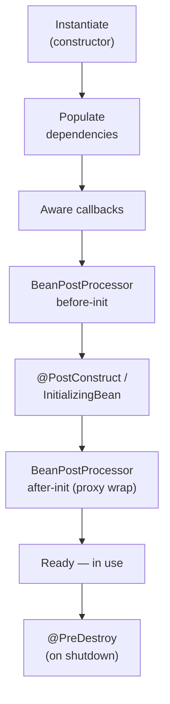

# Bean Scopes & Lifecycle

[Phase 4](04-dependency-injection-deep.md) was about *which* bean lands in a slot. This phase is about
two questions the container answers underneath that: **how many copies of a bean exist, and how long
does each one live?** Those are the two dials Spring gives you — *scope* (how many) and *lifecycle*
(birth to death) — and almost every confusing Spring behavior, from "why is my data leaking between
requests" to "why does `@Transactional` even work," traces back to one of them.

**A bean isn't an object you made once — it's an object the container keeps on a schedule it controls.**
The container decides how many to build and when to build, initialize, hand out, and tear down each one.
Scope is the "how many" rule; lifecycle is the "when" timeline.

## Scopes: how many instances exist

📝 A **scope** tells the container how many instances of a bean to create and how widely to share them.
There are a handful, but two carry almost all the weight.

📝 **`singleton`** — the **default**. The container builds **exactly one** instance for the whole
container and hands that same instance to *everyone* who asks. Every injection point that wants a
`NotificationService` gets the *same* object. You don't write anything to get this; it's what you've
had all along.

📝 **`prototype`** — the container builds a **brand-new instance every time** the bean is requested.
Ask for it twice, get two distinct objects. Nothing is shared.

The web scopes only exist inside a web application, and each ties a bean's life to a web concept:

- **`request`** — one instance per HTTP request (dies when the request ends).
- **`session`** — one instance per user HTTP session.
- **`application`** — one instance per `ServletContext` (the whole web app).

You declare a non-default scope with `@Scope`:

```java
import org.springframework.context.annotation.Scope;
import org.springframework.stereotype.Service;

@Service
@Scope("prototype")
public class NotificationService {
    private final MessageSender sender;

    public NotificationService(MessageSender sender) {
        this.sender = sender;
    }
}
```
*What just happened:* `@Scope("prototype")` overrides the default, so the container now mints a fresh
`NotificationService` on every request for one. Without that annotation, `NotificationService` would be
a singleton — the single shared instance you've been getting since Phase 1.

⚠️ The singleton default is the single biggest surprise for newcomers. People picture "I have a
`NotificationService`" as "each part of my app has *its own*." It doesn't. **One** `NotificationService`
serves the entire application — every controller, every thread, every request shares that one object.
That's efficient and almost always what you want. But it has a sharp edge, and it's the next section.

## The singleton thread-safety implication

⚠️ Because a singleton is **one shared instance**, and a server handles many requests **on many threads
at once**, your singleton bean is touched by multiple threads simultaneously. The moment that bean holds
**mutable instance state**, you have a data race: two threads reading and writing the same field with no
coordination.

Here's the trap, made concrete:

```java
@Service
public class NotificationService {        // singleton — ONE instance, MANY threads
    private String lastRecipient;         // ⚠️ shared mutable state across all threads

    public void notify(String to, String message) {
        this.lastRecipient = to;          // thread A writes...
        sender.send(to, message);
        log("sent to " + this.lastRecipient);  // ...thread B may have overwritten it
    }
}
```
*What just happened:* `lastRecipient` looks like a harmless instance field, but because every thread
shares this one bean, thread A can set it to `"ada@..."` and, before A reads it back, thread B sets it
to `"grace@..."`. Now A logs the wrong recipient. There's no exception — just silently corrupted data
under load, the worst kind of bug to chase.

💡 The fix is a discipline, not an annotation: **keep singleton beans stateless.** A bean should hold
its *collaborators* (the injected `MessageSender`, config values) — things set once at startup and never
mutated — and nothing else. Per-call data belongs in **local variables** (each thread gets its own
stack), and per-request or per-user data belongs in a **`request`/`session`-scoped bean** built exactly
for that job. Stateless singletons are automatically thread-safe because there's no shared mutable state
to race over. This is *why* the web scopes exist: they give per-request state a home so your singletons
don't have to (and shouldn't) hold it.

## The prototype gotcha

Now the gotcha that bites people who reach for `prototype` to *avoid* the sharing problem. It's the most
counterintuitive behavior in this phase, so slow down here.

⚠️ **Injecting a prototype bean into a singleton does NOT give you a fresh instance per call.** You get
**one** prototype instance, resolved **once** at injection time, and then reused forever.

```java
@Service                                  // singleton (default)
public class NotificationService {
    private final RequestContext ctx;     // RequestContext is @Scope("prototype")

    public NotificationService(RequestContext ctx) {
        this.ctx = ctx;                   // resolved ONCE, when this singleton was built
    }

    public void notify(String to, String message) {
        ctx.recordCall(to);               // same ctx object every single time ⚠️
    }
}
```
*What just happened:* you marked `RequestContext` as prototype hoping each `notify` call gets a fresh
one. But `NotificationService` is a singleton, built **once** at startup — so its constructor runs once,
its dependencies are resolved **once**, and the prototype it received is frozen into the field. The
"new instance every request" rule fired exactly once (at injection) and never again. Every call reuses
the same `ctx`. The scope didn't do what you expected because **injection happens once, not per
method-call.**

💡 The fix: don't capture the instance — ask the container *each time you need one*. The clean tool is
`ObjectProvider`:

```java
import org.springframework.beans.factory.ObjectProvider;

@Service
public class NotificationService {
    private final ObjectProvider<RequestContext> ctxProvider;

    public NotificationService(ObjectProvider<RequestContext> ctxProvider) {
        this.ctxProvider = ctxProvider;   // a factory, not an instance
    }

    public void notify(String to, String message) {
        RequestContext ctx = ctxProvider.getObject();  // FRESH prototype each call ✅
        ctx.recordCall(to);
    }
}
```
*What just happened:* instead of injecting a `RequestContext`, you injected an `ObjectProvider` — a tiny
factory that calls back into the container. Each `ctxProvider.getObject()` asks for a new prototype, so
now you genuinely get a fresh instance per call. (Older code uses *lookup method injection* via
`@Lookup`, or method-level `@Scope(proxyMode = ...)`; `ObjectProvider` is the modern, readable choice.)
The lesson generalizes: **the lifecycle of an injected bean follows the scope of the bean it's injected
*into*, unless you reach back into the container deliberately.**

## The bean lifecycle

So far "lifecycle" has been a word; now let's make it the concrete sequence the container runs for every
bean. 📝 From birth to readiness:

1. **Instantiate** — the container calls the constructor (this is where constructor injection happens).
2. **Populate dependencies** — setter/field dependencies are filled in.
3. **Aware callbacks** — if the bean implements `*Aware` interfaces (`BeanNameAware`,
   `ApplicationContextAware`, ...), the container hands it those references.
4. **`BeanPostProcessor` — before-init** — every post-processor gets a crack at the bean (next section).
5. **Initialization callbacks** — `@PostConstruct` methods run, then `InitializingBean.afterPropertiesSet()`.
6. **`BeanPostProcessor` — after-init** — post-processors run again (this is where proxies get wrapped).
7. **Ready** — the fully-built bean is in service.
8. **Destruction** — on context shutdown, `@PreDestroy` methods (then `DisposableBean.destroy()`) run.



The hook you'll actually use day-to-day is `@PostConstruct` — a method that runs *after* the bean is
fully constructed and injected, so it's the right place for setup or validation that needs the
dependencies present:

```java
import jakarta.annotation.PostConstruct;
import jakarta.annotation.PreDestroy;

@Service
public class NotificationService {
    private final MessageSender sender;
    private final String fromAddress;

    public NotificationService(MessageSender sender,
                               @Value("${notifications.from:}") String fromAddress) {
        this.sender = sender;
        this.fromAddress = fromAddress;
    }

    @PostConstruct
    void validateConfig() {               // runs once, after injection, before first use
        if (fromAddress.isBlank()) {
            throw new IllegalStateException("notifications.from must be configured");
        }
        System.out.println("NotificationService ready, sending as " + fromAddress);
    }

    @PreDestroy
    void shutdown() {                     // runs on context close
        System.out.println("NotificationService shutting down");
    }
}
```
*What just happened:* `validateConfig` can't be a constructor check that's *fully* trustworthy in every
injection style (with setter/field injection the fields aren't set yet at construction time), so Spring
gives you `@PostConstruct` — guaranteed to run *after* everything is wired. Here it fails fast at startup
if `notifications.from` is missing, turning a silent misconfiguration into a loud, early error.
`@PreDestroy` is the mirror image: cleanup when the container shuts down.

```console
NotificationService ready, sending as noreply@acme.com
... app runs ...
NotificationService shutting down
```
*What just happened:* the init callback fired once during bootstrap (right after injection), and the
destroy callback fired once on shutdown — bookends around the bean's working life. ⚠️ Note: prototype
beans get init callbacks but **not** destroy callbacks — the container hands a prototype off and forgets
it, so it never calls `@PreDestroy`. Cleanup for prototypes is your responsibility.

## `BeanPostProcessor` — the extension point that powers everything

You've now seen "`BeanPostProcessor`" twice in the lifecycle (steps 4 and 6). It's worth understanding,
because **it's the seam Spring itself uses to perform almost all of its magic** — and once you see it,
the magic stops being magic.

📝 A `BeanPostProcessor` is a hook the container calls **for every bean**, twice, around initialization:
once *before* the init callbacks and once *after*. Its two methods receive the bean and can return it
unchanged — or return **something else entirely** in its place.

```java
import org.springframework.beans.factory.config.BeanPostProcessor;

public class LoggingPostProcessor implements BeanPostProcessor {
    public Object postProcessBeforeInitialization(Object bean, String name) {
        return bean;                      // inspect/tweak before @PostConstruct
    }
    public Object postProcessAfterInitialization(Object bean, String name) {
        return bean;                      // return bean — OR a proxy that wraps it
    }
}
```
*What just happened:* the container calls these for `NotificationService`, `EmailSender`, and every
other bean during step 4 and step 6 of the lifecycle. This one's a no-op, but notice the crucial power:
`postProcessAfterInitialization` returns an `Object`. If it returns a *wrapper* instead of the original
bean, the container stores the wrapper — and everyone who injects that bean gets the wrapper, none the
wiser.

💡 That return-a-wrapper trick is **exactly how Spring implements proxies.** When you put
`@Transactional` on a method, a `BeanPostProcessor` spots it at step 6 and returns a **proxy** that opens
a transaction, calls your real method, then commits — in place of your bean. Same mechanism powers
`@Async`, caching, security, and the AOP you'll meet next phase.

So the big realization: **the "magic" annotations aren't magic — they're `BeanPostProcessor`s doing
work at a precise point in the lifecycle.** You now know *where* every annotation plugs in: the container
walks each bean through the timeline, and at steps 4 and 6 it lets these processors inspect, configure,
or wrap it. That's the whole trick. (One practical aside: 💡 `@Lazy` on a bean tells the container to
delay its instantiation until first use instead of building it eagerly at startup — handy for expensive
beans you might never touch, though it trades away fail-fast startup checks for that bean.)

Phase 6 zooms all the way into that "wrap it in a proxy" step — what a proxy is, how Spring builds one,
and why understanding it is the key to `@Transactional` and every cross-cutting concern.

## Recap

1. **Scope = how many.** `singleton` (the **default**) is one shared instance for the whole container;
   `prototype` is a new instance per request; `request`/`session`/`application` tie a bean's life to a
   web concept. Declare non-defaults with `@Scope`.
2. **Singletons are shared across all threads,** so mutable instance state is a data race. Keep
   singletons **stateless** — hold collaborators and config, put per-call data in locals and
   per-request data in a request/session-scoped bean.
3. **Prototype-in-singleton gotcha:** injection happens once, so a singleton captures **one** prototype
   forever. Use `ObjectProvider.getObject()` to fetch a fresh instance per call. An injected bean's
   effective lifetime follows the scope it's injected *into*.
4. **The lifecycle** runs: instantiate → populate → aware → `BeanPostProcessor` before → `@PostConstruct`
   → `BeanPostProcessor` after → ready → `@PreDestroy` on shutdown. Use `@PostConstruct` for setup that
   needs dependencies present (e.g. validating config). Prototypes get init but **not** destroy callbacks.
5. **`BeanPostProcessor`** is the hook the container calls around every bean's initialization, and it can
   return a *replacement* — that's how Spring injects `@Value`, and how it wraps beans in proxies for
   `@Transactional`/AOP. The "magic" annotations are post-processors firing at a known lifecycle moment.

## Quick check

Make sure the two dials — scope and lifecycle — and the gotchas have landed:

```quiz
[
  {
    "q": "What is the default scope of a Spring bean, and what does it mean?",
    "choices": [
      "singleton — the container creates one shared instance for the whole container and gives it to everyone who asks",
      "prototype — a new instance is created for every injection point",
      "request — a new instance per HTTP request",
      "There is no default; you must always declare @Scope"
    ],
    "answer": 0,
    "explain": "singleton is the default: exactly one instance per container, shared everywhere. Because it's shared across all threads, you must keep it stateless to stay thread-safe."
  },
  {
    "q": "You mark RequestContext as @Scope(\"prototype\") and inject it into a singleton NotificationService via the constructor. Each notify() call uses the SAME RequestContext. Why?",
    "choices": [
      "Injection happens once (when the singleton is built), so the prototype is resolved a single time and frozen into the field",
      "Prototype scope is ignored unless the class is annotated @Lazy",
      "Spring caches prototype beans by type after the first call",
      "The constructor is re-run on every method call, but returns a cached object"
    ],
    "answer": 0,
    "explain": "A singleton's constructor runs once at startup, so its dependencies resolve once. The 'new instance per request' rule fired exactly once — at injection. Use ObjectProvider.getObject() to fetch a fresh prototype per call."
  },
  {
    "q": "How does Spring make @Transactional work — wrapping your bean in a proxy that manages the transaction?",
    "choices": [
      "A BeanPostProcessor returns a proxy in place of the bean during the after-initialization step of the lifecycle",
      "The compiler rewrites your method at build time",
      "@PostConstruct opens the transaction when the bean is created",
      "The JVM intercepts every annotated method via bytecode flags"
    ],
    "answer": 0,
    "explain": "BeanPostProcessor.postProcessAfterInitialization can return a replacement object. Spring returns a proxy that opens/commits the transaction around your real method — the same mechanism behind @Async, caching, and AOP."
  }
]
```

---

[← Phase 4: Dependency Injection, Deep](04-dependency-injection-deep.md) · [Guide overview](_guide.md) · [Phase 6: Spring AOP & Proxies →](06-spring-aop-and-proxies.md)