# Spring AOP & Proxies

This is the phase where the rest of Spring stops being magic. You've used `@Transactional` in
[Spring Boot From Zero](/guides/spring-boot-from-zero) and trusted it to wrap your method in a transaction,
and maybe sprinkled `@Async` on something and watched it run on another thread. They felt like spells - 
annotate a method and behavior appears from nowhere. By the end of this phase you'll know exactly where
that behavior comes from, why it sometimes *doesn't* appear, and why one specific way of calling your own
method silently breaks it.

**Spring never edits your class. When a bean needs extra behavior, Spring hands out a wrapper instead of
the real object - and the wrapper does the extra work before delegating to you.** That wrapper is called a
*proxy*. Once you can see the proxy in the call path, every "why didn't my annotation fire?" answers itself.

We'll keep our cast from [Phase 4](04-dependency-injection-deep.md): a `NotificationService` that sends
messages through a `MessageSender`. This time the interesting part isn't *what* it does - it's the
cross-cutting behavior we want to bolt on without touching its code.

## Cross-cutting concerns

📝 Some behavior doesn't belong to any one method - it cuts *across* many of them. Logging every call.
Timing how long methods take. Starting a database transaction. Checking the user is allowed in. None of that
is the *business logic* of `NotificationService`, yet all of it wants to happen *around* its methods (and
around the methods of a dozen other services too).

The naive approach is to paste it into every method:

```java
public void notify(String to, String message) {
    long start = System.currentTimeMillis();      // timing noise
    System.out.println("ENTER notify");           // logging noise
    try {
        sender.send(to, message);                 // ← the one line that matters
    } finally {
        System.out.println("EXIT notify (" + (System.currentTimeMillis() - start) + "ms)");
    }
}
```

*What just happened:* one line of actual work is buried under four lines of plumbing. Now imagine that same
plumbing copy-pasted into every method of every service. It's noise, it drifts out of sync, and changing the
log format means editing a hundred methods. This repeated, scattered, non-business behavior is what we call a
**cross-cutting concern**.

📝 **Aspect-Oriented Programming (AOP)** is the answer: define that cross-cutting behavior *once*, in one
place, and declare *where* it should apply - instead of pasting it everywhere. Three words you'll need:

- **Aspect** - the module that holds the cross-cutting behavior (the timing/logging code, living in one class).
- **Advice** - the actual code that runs, and *when* it runs (before the method, after it, or around it).
- **Pointcut** - the expression that says *which* methods the advice applies to ("every method in the service package").

## A simple aspect

Here's the timing-and-logging plumbing pulled out of `notify` and turned into an aspect that applies to the
*entire* service package - no edit to `NotificationService` at all.

```java
import org.aspectj.lang.ProceedingJoinPoint;
import org.aspectj.lang.annotation.Around;
import org.aspectj.lang.annotation.Aspect;
import org.springframework.stereotype.Component;

@Aspect
@Component
public class TimingAspect {

    // Pointcut: "any method in any class under com.example.service"
    @Around("execution(* com.example.service..*(..))")
    public Object timeIt(ProceedingJoinPoint pjp) throws Throwable {
        String name = pjp.getSignature().toShortString();
        System.out.println("ENTER " + name);
        long start = System.currentTimeMillis();
        try {
            return pjp.proceed();                 // ← run the real method
        } finally {
            long ms = System.currentTimeMillis() - start;
            System.out.println("EXIT  " + name + " (" + ms + "ms)");
        }
    }
}
```

*What just happened:* `@Aspect` marks this class as a holder of advice; `@Component` makes it a bean so
Spring finds it (you'd also enable AOP with `@EnableAspectJAutoProxy` on a `@Configuration` class - Boot does
this for you). The `@Around` advice wraps the *target* method: its `execution(...)` string is the
**pointcut** picking every method under the service package, and `pjp.proceed()` is the moment the real
method actually runs. Everything before `proceed()` happens on the way in; everything in the `finally`
happens on the way out. `NotificationService` knows nothing about any of this.

Call `notificationService.notify("a@b.com", "hi")` and you'd see:

```console
ENTER NotificationService.notify(..)
EMAIL -> a@b.com: hi
EXIT  NotificationService.notify(..) (3ms)
```

*What just happened:* the `EMAIL ->` line is your real method running inside `proceed()`. The `ENTER`/`EXIT`
lines came from the aspect, sandwiched around it - yet `NotificationService.notify` still contains only the
single line that matters. That's AOP's payoff: the concern lives in one class and applies everywhere the
pointcut matches. This is the *readable face* of AOP. Now the question that actually matters: how does code
in one class run "around" a method in a completely different class that never mentions it?

## How it actually works: proxies

Here's the reveal the whole phase is built on. 📝 **Spring does not rewrite `NotificationService`. It does
not inject the aspect into it. Instead, when a bean's methods are matched by some advice, Spring replaces the
bean it hands out with a *proxy* - a generated object that wraps your real bean, intercepts every incoming
call, runs the advice, and then delegates to the real method.**

Remember `BeanPostProcessor` from [Phase 5](05-bean-scopes-and-lifecycle.md)? This is its biggest payoff. A
`BeanPostProcessor` gets a chance to inspect and *replace* each bean after it's created but before it's
handed out. Spring's AOP infrastructure registers exactly such a processor: it sees that
`NotificationService` matches an aspect's pointcut, and in the post-processing step it swaps your raw bean
for a proxy that wraps it. So everywhere `NotificationService` gets injected - into a controller, another
service, a test - what actually lands in that slot is **the proxy**, not your object.

```mermaid
flowchart LR
  Caller[Some caller] -->|notify&#40;&#41;| Proxy[NotificationService proxy]
  Proxy -->|run advice ENTER + timer| Proxy
  Proxy -->|proceed&#40;&#41;| Real[real NotificationService]
  Real -->|return| Proxy
  Proxy -->|run advice EXIT| Caller
```



*What just happened:* the caller thinks it's holding a `NotificationService` and calls `notify()` normally.
The call actually lands on the **proxy**, which runs the advice (log + start timer), calls `proceed()` to
reach your real method, gets the result back, runs the rest of the advice (stop timer + log), and returns.
Your real object never knew it was wrapped. The interception only works because the proxy *is* the thing
everyone holds a reference to.

📝 Spring builds that proxy one of two ways, and which one matters later:

- **JDK dynamic proxy** - used when your bean implements an **interface**. Java's built-in
  `java.lang.reflect.Proxy` creates a new class implementing the *same interface*, forwarding each method to
  the advice and then your bean. The proxy is a sibling implementation of the interface, *not* a subclass of
  your class.
- **CGLIB proxy** - used when there's **no interface** (or Spring is configured to always use it, which Boot
  defaults to). CGLIB generates a runtime **subclass** of your concrete class and overrides each method to
  insert the advice. Because it works by subclassing and overriding, a `final` class or `final` method
  *can't* be proxied this way - there's nothing to override.

💡 The practical takeaway: if you program to interfaces, you might get a JDK proxy that is *not* an instance
of your concrete class (so `(EmailSenderImpl) bean` would fail - cast to the interface instead). With CGLIB
you get a subclass, so concrete-type casts work but `final` blocks proxying. Either way, the object other
beans hold is a stand-in, not your original.

## This is how @Transactional, @Async, and @Cacheable work

💡 Here's the payoff that makes all of Boot's "magic" annotations click at once. **They are all just
advice running in a proxy.** There is nothing else to them.

- **`@Transactional`** - Spring's transaction infrastructure registers advice whose pointcut is "any method
  annotated `@Transactional`." The proxy's advice opens a transaction *before* calling `proceed()`, then
  **commits** if your method returns normally or **rolls back** if it throws. Your method body just does its
  work; the begin/commit/rollback lives entirely in the proxy wrapped around it.
- **`@Async`** - the advice doesn't call `proceed()` on the caller's thread at all. It hands the real method
  off to a thread pool and returns immediately (a `Future`, or nothing). The "it runs on another thread"
  behavior is the proxy choosing *where* to invoke your method.
- **`@Cacheable`** - before calling `proceed()`, the advice checks a cache for the method's arguments. Hit?
  It returns the cached value and never touches your method. Miss? It calls `proceed()` and stores the
  result on the way out.

```java
@Service
public class NotificationService {

    @Transactional                 // advice: begin tx → proceed() → commit / rollback
    public void notifyAndLog(String to, String message) {
        sender.send(to, message);
        auditRepo.save(new AuditRecord(to));   // both writes in one transaction
    }
}
```

*What just happened:* there is no transaction code in this method - and yet both writes commit together or
roll back together. The `@Transactional` proxy is doing it: open a transaction, `proceed()` into your body,
commit on clean return. You're seeing the exact mechanism behind the [service-layer transactions in Spring
Boot](/guides/spring-boot-from-zero). The annotation was never a spell - it was a marker telling Spring's
proxy where to wrap.

## The self-invocation gotcha, explained at the root

Now the famous bug - the one that bites every Spring developer at least once, the one flagged back in the
[Spring Boot service-layer phase](/guides/spring-boot-from-zero). You now have everything you need to
understand *why* it happens, not just that it does.

⚠️ **Calling a `@Transactional` (or `@Async`, or `@Cacheable`) method from another method in the *same
class* does nothing.** No transaction. No new thread. No cache. Silently.

```java
@Service
public class NotificationService {

    public void notifyAll(List<String> recipients) {
        for (String to : recipients) {
            sendOne(to);                 // ⚠️ internal call - bypasses the proxy
        }
    }

    @Transactional
    public void sendOne(String to) {     // expected to run in its own transaction...
        sender.send(to, "hi");
        auditRepo.save(new AuditRecord(to));
    }
}
```

*What just happened:* you'd expect each `sendOne` to run in its own transaction. It doesn't - every call runs
with **no transaction at all**. Here's the root cause, now that you can see the proxy. The advice lives on
the proxy, *not* on your real object. When some outside caller invokes `notifyAll`, that call goes through
the proxy fine. But inside `notifyAll`, the call `sendOne(to)` is really `this.sendOne(to)` - and `this` is
your **real object**, not the proxy. The call goes straight from one method to another inside the same
object; it never leaves through the proxy, so the `@Transactional` advice never gets a chance to run.

```mermaid
flowchart LR
  Caller -->|notifyAll&#40;&#41;| Proxy[proxy]
  Proxy -->|proceed| Real[real bean]
  Real -->|this.sendOne&#40;&#41; - stays inside| Real
```



*What just happened:* the entry to `notifyAll` passes through the proxy, but the inner `this.sendOne()` is an
internal jump that the proxy never sees. No proxy in the path means no advice - and `@Transactional` *is*
advice. This is the whole gotcha in one sentence: **advice only fires when the call crosses the proxy
boundary, and `this.method()` never crosses it.**

The fixes all share one idea - make the call go *through* the proxy:

**Fix 1 - split into another bean.** Move the annotated method to a separate bean and inject it. Now the call
crosses a real bean boundary, which means it goes through *that* bean's proxy.

```java
@Service
public class NotificationService {
    private final SingleSender singleSender;   // injected: this is the PROXY of SingleSender

    public NotificationService(SingleSender singleSender) {
        this.singleSender = singleSender;
    }

    public void notifyAll(List<String> recipients) {
        for (String to : recipients) {
            singleSender.sendOne(to);          // ✅ goes through SingleSender's proxy
        }
    }
}

@Service
public class SingleSender {
    @Transactional
    public void sendOne(String to) { /* ... */ }
}
```

*What just happened:* `singleSender` is injected, so it's the *proxy* of `SingleSender`. Calling
`singleSender.sendOne(to)` is an external call that crosses the proxy boundary, so the `@Transactional`
advice fires and each call gets its own transaction. This is usually the cleanest fix - and it often reveals
a sensible separation of responsibilities you were missing anyway.

**Fix 2 - self-inject the proxy.** If you really want the method to stay in the same class, inject the bean
into *itself* and call through that reference instead of `this`.

```java
@Service
public class NotificationService {
    private final NotificationService self;    // the PROXY of this very bean

    public NotificationService(@Lazy NotificationService self) {
        this.self = self;
    }

    public void notifyAll(List<String> recipients) {
        for (String to : recipients) {
            self.sendOne(to);                  // ✅ through the proxy, not this
        }
    }

    @Transactional
    public void sendOne(String to) { /* ... */ }
}
```

*What just happened:* `self` is the proxy-wrapped version of this same bean (`@Lazy` breaks the chicken-and-egg
of injecting a bean into its own constructor). Calling `self.sendOne(to)` routes through the proxy, so the
advice runs. It works, but it's a bit of a head-scratcher to read - most teams prefer Fix 1.

💡 Every "why didn't my annotation fire?" in Spring has the same shape: *was there a proxy in the call
path?* Private methods can't be advised (the proxy can't override them). Internal `this.` calls skip
advice. A `new SomeService()` you constructed yourself has no proxy at all. Once you picture the proxy
standing between caller and bean, the whole category of mysteries collapses into one question.

## Recap

1. **Cross-cutting concerns** - logging, timing, transactions, security - repeat across many methods and
   aren't business logic. AOP lets you define them once and declare *where* they apply, instead of pasting
   them everywhere.
2. **Aspect / advice / pointcut.** An *aspect* holds the behavior, *advice* is the code that runs and when
   (`@Around` wraps the method via `proceed()`), and a *pointcut* (`execution(...)`) selects which methods it
   applies to.
3. **Proxies are the mechanism.** Spring never edits your class. A `BeanPostProcessor` swaps your bean for a
   *proxy* that intercepts calls, runs the advice, then delegates to your real method. The object injected
   everywhere is the proxy.
4. **JDK dynamic proxy vs CGLIB.** JDK proxies wrap a bean that implements an *interface* (sibling
   implementation); CGLIB *subclasses* a concrete class (so `final` classes/methods can't be proxied). Boot
   defaults to CGLIB.
5. **`@Transactional`, `@Async`, `@Cacheable` are all just advice in a proxy.** The proxy begins/commits a
   transaction, dispatches to a thread pool, or checks a cache *around* your untouched method body. That's
   the whole "magic."
6. **Self-invocation skips it.** ⚠️ Advice fires only when a call crosses the proxy boundary. `this.method()`
   stays inside the real object and never reaches the proxy, so the annotation silently does nothing. Fix by
   splitting into another bean, or self-injecting the proxy.

## Quick check

Make sure the proxy mental model and its famous gotcha have stuck:

```quiz
[
  {
    "q": "How does Spring make @Around advice run around a method in a class that doesn't mention the aspect at all?",
    "choices": [
      "A BeanPostProcessor replaces the bean with a proxy that intercepts calls, runs the advice, then delegates to the real method",
      "Spring rewrites your class's bytecode at compile time to paste the advice into each method",
      "Spring injects the aspect as a field into your class and calls it from each method",
      "The advice runs on a separate thread that watches your method execute"
    ],
    "answer": 0,
    "explain": "Spring doesn't edit your class. Its AOP BeanPostProcessor swaps your bean for a proxy that wraps it; the proxy runs the advice and calls proceed() to reach your real method. The proxy is what every other bean actually holds."
  },
  {
    "q": "Method a() and @Transactional method b() are in the same bean. a() calls this.b(). What transaction does b() run in?",
    "choices": [
      "None - this.b() stays inside the real object and never crosses the proxy boundary, so the @Transactional advice never fires",
      "Its own new transaction, exactly as if called from outside",
      "The same transaction a() is already in, because they share an object",
      "It throws an exception because @Transactional methods can't be called internally"
    ],
    "answer": 0,
    "explain": "The advice lives on the proxy, not the real object. An internal this.b() call goes object-to-object without leaving through the proxy, so no advice runs and b() executes with no transaction at all. Fix it by calling across a bean boundary (or a self-injected proxy)."
  },
  {
    "q": "When does Spring use a CGLIB proxy instead of a JDK dynamic proxy?",
    "choices": [
      "When the bean has no interface to implement (or Spring is configured to always use CGLIB) - it generates a runtime subclass, so final classes/methods can't be proxied",
      "When the bean implements at least one interface",
      "Only for @Async methods; @Transactional always uses JDK proxies",
      "Never - Spring only supports JDK dynamic proxies"
    ],
    "answer": 0,
    "explain": "JDK dynamic proxies require an interface (they create a sibling implementation). With no interface - or when forced, which Boot defaults to - Spring uses CGLIB, which subclasses your concrete class and overrides its methods. Because it overrides, final classes and final methods can't be proxied."
  }
]
```

---

[← Phase 5: Bean Scopes & Lifecycle](05-bean-scopes-and-lifecycle.md) · [Guide overview](_guide.md) · [Phase 7: Spring MVC Without Boot →](07-spring-mvc-without-boot.md)
