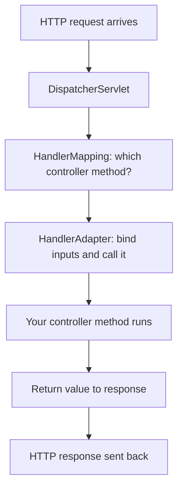

# Spring MVC Without Boot

In [Phase 6](06-spring-aop-and-proxies.md) you saw how Spring wraps your beans in proxies to add behavior without touching your code. That was the last piece of *core* Spring's machinery. Now we point that machinery at the web — and here's the thing worth holding onto from the start: **the controllers you wrote in Spring Boot were never the magic.** They were ordinary classes the whole time. What Boot quietly did was stand up the *plumbing* around them. This phase rebuilds that plumbing by hand so you can see exactly what was happening behind the curtain.

**Every Spring web app has one object at its front door that catches every single request and decides where it goes.** That object is the `DispatcherServlet`. Once you understand it, the rest of Spring MVC stops feeling like a pile of annotations and starts feeling like one clean idea.

(One scoping note: Spring MVC is built *on top of* the Java Servlet API — the lower-level contract for how a Java web server hands HTTP requests to your code. That layer is its own roots topic; here we sit one floor up and treat "a request arrives" as the starting point.)

## The DispatcherServlet — the front controller

📝 Spring MVC is built around a single servlet called the **`DispatcherServlet`**. It receives *every* HTTP request that comes into your app, no matter the URL, and its only job is to route that request to the right method on the right controller. This is a classic design pattern called the **front controller**: instead of scattering "which request goes where" logic across many entry points, you funnel everything through one place that owns the routing.

Think of it like the front desk of a large office building. Visitors don't wander the halls looking for the right room — they all stop at one desk, state who they're there to see, and get directed. The `DispatcherServlet` is that desk for HTTP.

Here's the path a request takes once it reaches it:



📝 Notice that *you* only own one box in that diagram — the controller method. Everything else is infrastructure Spring provides. Your code is the answer to "what should happen for this request"; the `DispatcherServlet` and friends handle "how did this request get here and how does the answer get back out."

💡 If `DispatcherServlet` sounds familiar, it should — it was the one object in the [Spring Boot REST controllers phase](/guides/spring-boot-from-zero) that you "never wrote." Boot registered it for you. We're about to write that registration ourselves.

## Wiring it by hand

Without Boot, nobody starts a web server for you and nobody registers the `DispatcherServlet`. You do both. There are three historical ways to do this — an old-school `web.xml` file, a programmatic `WebApplicationInitializer`, and the convenience base class `AbstractAnnotationConfigDispatcherServletInitializer` that wraps the common case. We'll use the last one, because it's the clearest expression of the idea.

First, a web configuration class that turns on Spring MVC:

```java
import org.springframework.context.annotation.ComponentScan;
import org.springframework.context.annotation.Configuration;
import org.springframework.web.servlet.config.annotation.EnableWebMvc;

@Configuration
@EnableWebMvc
@ComponentScan(basePackages = "com.example.web")
public class WebConfig {
    // Empty for now — @EnableWebMvc brings in sensible defaults.
}
```

*What just happened:* `@Configuration` marks this as a bean-definition class (the same kind you met back in [Phase 3](03-defining-beans.md)). `@EnableWebMvc` is the important one: it tells Spring to register the whole standard set of MVC infrastructure beans — the handler mappings, the JSON converters, all of it — into this context. `@ComponentScan` points Spring at the package where your controllers live so it can find and register them as beans. An empty class body is fine; the annotations do the work.

Now the piece that registers the `DispatcherServlet` itself and maps it to URLs:

```java
import org.springframework.web.servlet.support.AbstractAnnotationConfigDispatcherServletInitializer;

public class AppInitializer
        extends AbstractAnnotationConfigDispatcherServletInitializer {

    @Override
    protected Class<?>[] getRootConfigClasses() {
        return null;   // no separate root context for this small app
    }

    @Override
    protected Class<?>[] getServletConfigClasses() {
        return new Class<?>[] { WebConfig.class };   // the web context
    }

    @Override
    protected String[] getServletMappings() {
        return new String[] { "/" };   // DispatcherServlet handles every URL
    }
}
```

*What just happened:* When your app starts, the servlet container finds this initializer and calls it. `getServletConfigClasses()` hands it your `WebConfig`, so the `DispatcherServlet` builds a Spring context from it. `getServletMappings()` returns `"/"`, which means "route *all* incoming URLs through this servlet" — that's what makes it the front controller for the whole app. You have now done, in about fifteen lines, the registration that Boot performs invisibly.

💡 This is the reveal in miniature: **everything in these two classes is what Spring Boot's web auto-configuration generates for you, plus the embedded Tomcat that Boot also starts to run it all.** Without Boot you'd deploy this into a servlet container (like a standalone Tomcat) yourself. With Boot, the server is embedded and the config is automatic — but it's the same `DispatcherServlet`, the same `@EnableWebMvc` defaults, underneath.

## Controllers — exactly what you already wrote

Here is the part that should feel anticlimactic, and that's the point.

```java
import org.springframework.web.bind.annotation.GetMapping;
import org.springframework.web.bind.annotation.PathVariable;
import org.springframework.web.bind.annotation.RestController;

@RestController
public class GreetingController {

    @GetMapping("/greeting/{name}")
    public Greeting greet(@PathVariable String name) {
        return new Greeting("Hello, " + name + "!");
    }
}
```

*What just happened:* This is identical to the controller code from the [Spring Boot guide](/guides/spring-boot-from-zero) — same `@RestController`, same `@GetMapping`, same `@PathVariable`. Spring finds it via the `@ComponentScan` in `WebConfig`, registers it as a bean, and the `DispatcherServlet` routes `GET /greeting/Ada` to `greet`, pulling `Ada` out of the path. The return value, a plain `Greeting` object, gets serialized to JSON automatically.

A request and its response:

```http
GET /greeting/Ada HTTP/1.1
Host: localhost:8080
```

```json
{ "message": "Hello, Ada!" }
```

*What just happened:* The `Greeting` object came back as JSON, field by field — the same Jackson serialization you saw in Boot. ⚠️ The crucial observation: **not one line of this controller changed between Boot and no-Boot.** Boot never modified how you write MVC code. It only configured the surroundings. The controller was always plain Spring.

## The pieces the DispatcherServlet orchestrates

When a request lands, the `DispatcherServlet` doesn't do everything itself — it delegates to a small cast of specialist beans, each registered by that `@EnableWebMvc` you added. You rarely touch these directly, but knowing their names demystifies the whole flow:

- **HandlerMapping** — answers "which controller method handles this URL and HTTP method?" It's the lookup table built from all your `@GetMapping`/`@PostMapping` annotations.
- **HandlerAdapter** — actually *invokes* the chosen method, binding the path variables, query params, and request body into your method's parameters first.
- **Message converters** — translate between Java objects and the wire format. For a JSON API this is Jackson, turning your return value into JSON and an incoming body into an object.
- **View resolvers** — for apps that render HTML templates rather than JSON, these map a returned view name to an actual template file. (A pure REST API skips these.)
- **Exception resolvers** — catch exceptions thrown in your controllers and turn them into proper HTTP error responses.

📝 All of these are just beans in the web context. `@EnableWebMvc` registers a sensible default of each. Boot's auto-configuration registers the *same* defaults plus a few extras (and steps back the moment you define your own) — which is why a Boot REST app "just works" with Jackson and error handling you never configured.

## The reveal

Step back and put it all together. In the Boot guide, the entire web setup was: add the web starter dependency, write a controller, run the app. That felt like almost nothing. Here's what those three steps actually were:

1. **The web starter** → started an embedded Tomcat to receive HTTP, and registered the `DispatcherServlet` as the front controller. *(You just did this with `AppInitializer`.)*
2. **`@EnableWebMvc`-equivalent auto-config** → registered all the MVC beans: handler mappings, Jackson converters, exception resolvers. *(You just did this with `WebConfig`.)*
3. **Your controller** → the one part that was never magic, identical in both worlds.

💡 **Spring Boot's "web magic" is two things you've now built by hand — a server and a `DispatcherServlet` — plus a pile of default beans you've now seen by name.** Boot didn't invent a new web framework; it pre-wired *this* one. That's the pattern for everything Boot does, and it's exactly where the final phase picks up.

## Recap

1. **The `DispatcherServlet` is the front controller.** One servlet catches every request and routes it to the right controller method — the front-controller pattern. You own only the controller method; everything else is infrastructure.
2. **Without Boot you wire the web layer yourself.** A `@Configuration` class with `@EnableWebMvc` registers the MVC beans, and a `WebApplicationInitializer` (or `AbstractAnnotationConfigDispatcherServletInitializer`) registers the `DispatcherServlet` and maps it to `/`.
3. **Controllers are unchanged from Boot.** `@RestController`, `@GetMapping`, `@PathVariable`, `@RequestBody` work identically — Boot configured MVC, it didn't change how you write it.
4. **The DispatcherServlet delegates to specialist beans.** HandlerMapping picks the method, HandlerAdapter invokes it, message converters handle JSON, view resolvers handle templates, exception resolvers handle errors — all registered by `@EnableWebMvc`.
5. **Boot's web magic = embedded server + DispatcherServlet + default MVC beans.** You just built the second and third by hand; the controller was never the magic part.

## Quick check

Test the front-controller picture before moving on:

```quiz
[
  {
    "q": "What is the role of the DispatcherServlet in a Spring MVC application?",
    "choices": [
      "It is the front controller — one servlet that receives every request and routes it to the correct controller method",
      "It is the database connection pool that controllers use to query data",
      "It is the JSON library that serializes return values into response bodies",
      "It is one controller method per URL that you write yourself"
    ],
    "answer": 0,
    "explain": "The DispatcherServlet implements the front-controller pattern: a single servlet that catches every incoming request and dispatches it to the matching controller method. JSON serialization is done by message converters (Jackson), and you write the controller methods it routes to."
  },
  {
    "q": "In a non-Boot Spring MVC app, what does @EnableWebMvc on your @Configuration class do?",
    "choices": [
      "Registers the standard set of MVC infrastructure beans (handler mappings, message converters, etc.) into the web context",
      "Starts an embedded Tomcat server to listen for HTTP requests",
      "Replaces the need to write any controllers at all",
      "Connects the application to a database automatically"
    ],
    "answer": 0,
    "explain": "@EnableWebMvc brings in Spring MVC's default infrastructure beans — HandlerMapping, HandlerAdapter, message converters, and so on. It does not start a server (that's the container's job, or embedded Tomcat under Boot), and you still write your own controllers."
  },
  {
    "q": "Comparing a Boot REST app to the hand-wired version in this phase, what is true about the controller code itself?",
    "choices": [
      "It is identical — Boot configured MVC for you but never changed how controllers are written",
      "Boot controllers use special annotations that don't exist in core Spring",
      "The hand-wired version requires you to parse HTTP and serialize JSON manually",
      "Boot controllers must extend the DispatcherServlet class"
    ],
    "answer": 0,
    "explain": "The controller code is exactly the same in both worlds — same @RestController, @GetMapping, @PathVariable. Boot's contribution was the surrounding plumbing (embedded server, DispatcherServlet, default MVC beans), not the controller itself."
  }
]
```

---

[← Phase 6: Spring AOP & Proxies](06-spring-aop-and-proxies.md) · [Guide overview](_guide.md) · [Phase 8: From Core Spring to Spring Boot →](08-from-core-spring-to-boot.md)
