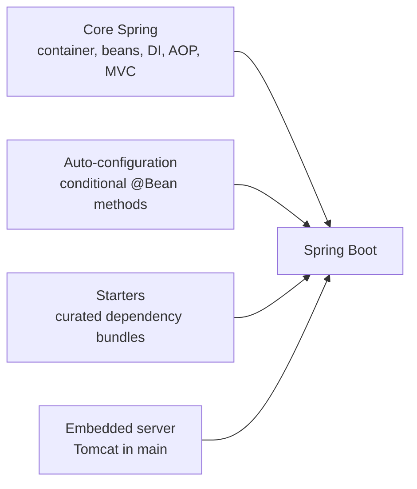

# From Core Spring to Spring Boot

Think back to where you started. Spring Boot felt like a black box - you sprinkled some annotations, ran `main`, and somehow a web server appeared, beans wired themselves up, and a database connection materialized out of thin air. It worked, but you couldn't have told anyone *why*.

Look at what you can do now. You can stand up an `ApplicationContext` by hand. You can declare beans with `@Configuration` and `@Bean`, or let component scanning find them. You can wire dependencies through the constructor and explain exactly how `@Autowired` resolves them. You understand singleton versus prototype scope and the full bean lifecycle, callbacks and all. You know that `@Transactional` and `@Async` work because Spring wraps your bean in a **proxy** - and you know the self-invocation gotcha that trips up developers who *don't* know that. You can wire a `DispatcherServlet` and a `@Controller` without Boot anywhere in sight.

That's the whole machine, and you've had your hands inside it. This final phase isn't new material - it's the payoff. We're going to assemble everything you've learned into one sentence that makes Spring Boot stop being magic forever.

## The full equation, assembled

💡 Here's the headline, and it's worth reading slowly:

**Spring Boot = core Spring (everything in this guide) + auto-configuration + starters + an embedded server.**

That's it. There's no fourth secret ingredient. Every piece on the right-hand side is something you can now name and explain:

- **Core Spring** - the IoC container, beans, dependency injection, scopes, lifecycle, AOP, MVC. The engine. You built this by hand.
- **Auto-configuration** - conditional `@Bean` methods. Boot ships hundreds of `@Configuration` classes whose `@Bean` definitions only fire *if certain conditions are met* (a class is on the classpath, a property is set, you haven't already defined that bean yourself). It's exactly the `@Bean` work from [Phase 3](03-defining-beans.md) - written ahead of time, gated by conditions.
- **Starters** - curated dependency bundles. `spring-boot-starter-web` isn't code; it's a `pom.xml` that pulls in a coherent set of jars (Spring MVC, Jackson, an embedded server, validation) that are known to work together. It saves you from hand-picking compatible versions.
- **Embedded server** - instead of building a WAR and deploying it into an external Tomcat, Boot starts Tomcat *inside* your `main` method. Same servlet container you met in [Phase 7](07-spring-mvc-without-boot.md), started for you in-process.

And the annotation that ties the bow? `@SpringBootApplication` is three annotations you already know stacked together: `@Configuration` + `@ComponentScan` + `@EnableAutoConfiguration`. Configure beans, scan for components, switch on the conditional auto-config. Nothing you haven't done by hand.



*What this shows:* four inputs, one output. Boot is an assembly, not an invention. You now understand every input.

## What you can do that Boot-only developers can't

💡 This is the real prize, and it's the difference between using Spring and *understanding* it.

When a Boot-only developer hits a wiring failure - `NoSuchBeanDefinitionException`, or two beans of the same type and no `@Primary` - they're stuck staring at a stack trace that reads like a foreign language. You can read it. You know what the container was trying to do, where it looks for candidates, and why it gave up. You can debug the wiring because you've *done* the wiring.

A confusing stack trace full of `$$EnhancerBySpringCGLIB$$` frames? You know that's a proxy, you know why it's there, and you know to read past it to your actual code. An annotation that mysteriously *didn't* fire - the classic "my `@Transactional` method isn't rolling back"? You'll spot the self-invocation immediately, because you understand the call has to go *through* the proxy and an internal `this.method()` call never does.

And when the defaults aren't right, you can override auto-config - define your own bean and Boot's conditional one quietly steps aside (`@ConditionalOnMissingBean`), exactly as designed. You know when to lean on Boot and when to drop down to manual configuration, because you can see both layers at once.

That's senior-level Spring fluency. Not "I memorized more annotations" - "I understand the mechanism, so I can reason about anything the framework does."

## Where to go from here

A few straightforward directions, depending on what you want next:

- **Re-read [Spring Boot From Zero](/guides/spring-boot-from-zero) with new eyes.** This is the single highest-leverage thing you can do. Every annotation in that guide now has a visible mechanism underneath it. `@RestController`? A `@Controller` plus `@ResponseBody`, registered as a bean, dispatched by a `DispatcherServlet` you can now picture. Auto-configured `DataSource`? A conditional `@Bean`. The fog won't just thin - it'll lift.
- **Go one layer deeper: the Servlet API.** Underneath `DispatcherServlet` is the raw Java servlet model - `HttpServletRequest`, `HttpServletResponse`, filters, the servlet container contract. It's the foundation the whole web side of Spring stands on. You don't *need* it day to day, but knowing it exists (and roughly how it works) completes the picture from the metal up.
- **Explore Spring's ecosystem.** Spring Security, Spring Data, Spring Cloud, Spring for GraphQL - they're all built on the core you now understand. Filters and proxies (Security), the repository abstraction and its lifecycle (Data), beans and config wired across services (Cloud). The core isn't a prerequisite you'll outgrow; it's the foundation every one of them rests on.

## What to build - and a last word

📝 Reading got you here. Building is what locks it in. Two concrete suggestions, either of which will cement everything:

- **Take a Boot app and rebuild a slice of it without Boot.** Pick a tiny endpoint or service from something you've built with Boot. Now stand up the same thing with a manual `ApplicationContext`, hand-written `@Configuration`, and your own `DispatcherServlet` wiring. It's more typing - that's the point. Every line you write by hand is a line you'll *recognize* the next time Boot writes it for you. Nothing maps the two layers together like doing it once.
- **Write a tiny AOP aspect and watch it intercept.** Define an aspect that logs around a method call, register it, and step through with a debugger. Watching the proxy receive the call, run your advice, and *then* delegate to your real bean turns "proxies are how `@Transactional` works" from a fact you read into a thing you've seen with your own eyes.

When you want the authoritative answer on anything, the **Spring Framework reference documentation** is genuinely excellent - it explains the *why* behind the behavior, which is the habit that separates people who fight the framework from people who work with it.

The through-line of this whole guide: **Boot was never magic - it's the core Spring you now understand, configured for you.** You're leaving able to read what's underneath every annotation, assemble a Spring app from scratch, and reason about it when it breaks. Go build the small thing, and watch the magic stay gone.

## Recap

1. **Spring Boot = core Spring + auto-configuration + starters + an embedded server.** Four inputs you can now name and explain - Boot is an assembly, not an invention.
2. **Each input maps to something you learned:** auto-config is conditional `@Bean` methods; starters are curated dependency bundles; the embedded server is Tomcat started in `main`; `@SpringBootApplication` = `@Configuration` + `@ComponentScan` + `@EnableAutoConfiguration`.
3. **You can now do what Boot-only devs can't** - debug wiring failures, read proxy-laden stack traces, diagnose why an annotation didn't fire (self-invocation), override auto-config, and know when to drop to manual config.
4. **Re-read the [Spring Boot guide](/guides/spring-boot-from-zero) next** - every annotation now has a visible mechanism. Then go deeper (the Servlet API) or wider (Security, Data, Cloud), all built on this same core.
5. **Build to cement it:** rebuild a slice of a Boot app *without* Boot, or write a tiny AOP aspect and watch the proxy intercept. The reference docs are your authoritative source.

## Quick check

One last check - the ideas that turn Boot from magic into mechanism:

```quiz
[
  {
    "q": "What does the equation 'Spring Boot = ...' actually add on top of core Spring?",
    "choices": [
      "Auto-configuration, starters, and an embedded server",
      "A brand-new IoC container that replaces the core one",
      "A different dependency injection system unrelated to core Spring",
      "Nothing - Boot and core Spring are completely separate frameworks"
    ],
    "answer": 0,
    "explain": "Boot is core Spring plus three things: auto-configuration (conditional @Bean methods), starters (curated dependency bundles), and an embedded server (Tomcat started in main). The container, beans, DI, and MVC underneath are exactly the core Spring you learned."
  },
  {
    "q": "Spring Boot's auto-configuration is, mechanically, mostly what?",
    "choices": [
      "Conditional @Bean methods that fire only when certain conditions are met",
      "Runtime bytecode generation with no configuration classes involved",
      "A separate scripting language Boot interprets at startup",
      "Hard-coded beans that can never be overridden"
    ],
    "answer": 0,
    "explain": "Auto-config is the same @Bean work from Phase 3, written ahead of time and gated by conditions (a class on the classpath, a property set, or - via @ConditionalOnMissingBean - you not having already defined that bean). That's why defining your own bean cleanly overrides Boot's."
  },
  {
    "q": "What does @SpringBootApplication decompose into?",
    "choices": [
      "@Configuration + @ComponentScan + @EnableAutoConfiguration",
      "@Controller + @Service + @Repository",
      "@Autowired + @Qualifier + @Primary",
      "@Transactional + @Async + @Scope"
    ],
    "answer": 0,
    "explain": "It's three annotations you already know stacked together: configure beans (@Configuration), scan for components (@ComponentScan), and switch on the conditional auto-config (@EnableAutoConfiguration). Nothing you haven't done by hand."
  }
]
```

---

[← Phase 7: Spring MVC Without Boot](07-spring-mvc-without-boot.md) · [Guide overview](_guide.md)