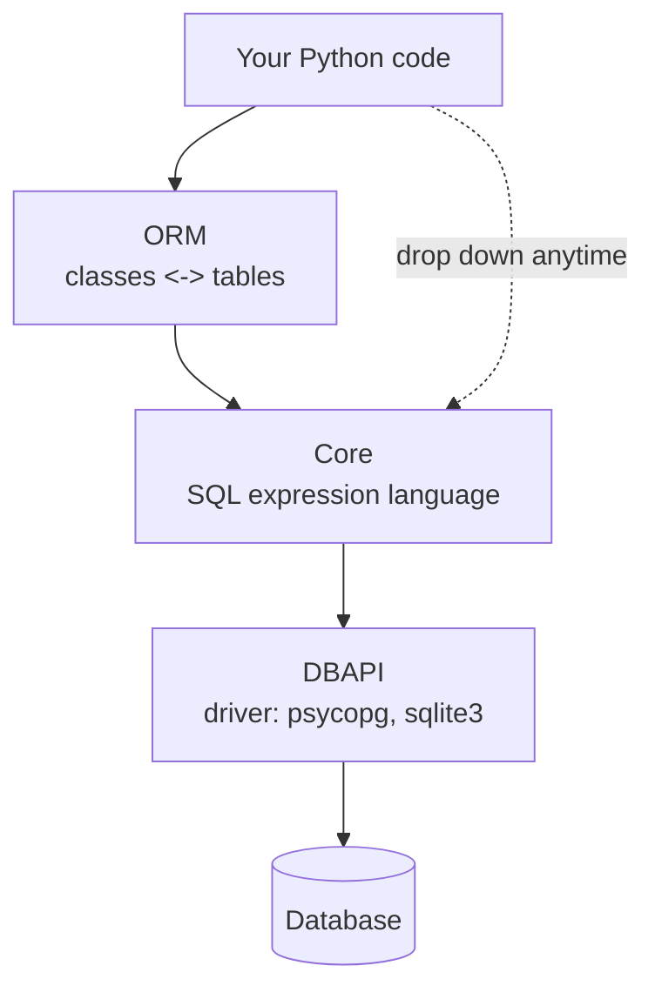

# What SQLAlchemy Is (Core vs ORM)

If you've written Python that touches a database, you've almost certainly bumped into SQLAlchemy - maybe
directly, maybe hiding under Flask-SQLAlchemy or SQLModel without you realizing it. It has a reputation for
being big and a little intimidating, and there's a reason: it's not one thing, it's *two* things stacked on
top of each other. Most of the confusion people have with SQLAlchemy - "wait, why are there two ways to do
this?" - comes from not knowing that up front.

Here's the one idea this whole guide hangs on: **SQLAlchemy is a toolkit with two layers.** Get that
picture in your head now and everything else - engines, sessions, queries, relationships - slots into
place. The real domain (authors and books) starts in [Phase 2](02-the-engine-and-connecting.md).

## What SQLAlchemy actually is

📝 **SQLAlchemy** - Python's premier database toolkit. It's the most powerful and flexible
object-relational mapper in the Python ecosystem, and it's the engine underneath much of the rest: when you
use Flask-SQLAlchemy in [Flask](/guides/flask-from-zero) or SQLModel in [FastAPI](/guides/fastapi-from-zero),
*they are wrapping SQLAlchemy*. Learn it once and you understand what those convenience layers are doing.

The "ORM" part of that name is the same idea you'd meet in any language. If you've read the
[Hibernate & JPA guide](/guides/hibernate-and-jpa-from-zero), this transfers directly - only the language
changes.

📝 **ORM (Object-Relational Mapper)** - a library that maps your **classes to tables** and your **objects to
rows**. You declare the correspondence once ("this `Author` class maps to the `authors` table"), then work
with plain Python objects: ask for an author, get an `Author`; save one, and the ORM writes the `INSERT` for
you. It generates the SQL so you don't hand-write it.

That mapping exists because your Python code thinks in **objects** (an `Author` has a name and holds a list
of `Book`s) while a [database](/guides/what-a-database-is) thinks in **tables** (rows, columns, and foreign
keys - numbers in one table pointing at another). Two different shapes for the same data. The ORM's job is to
translate between them so you don't have to do it by hand on every query.

## The two layers - the key mental model

Here is the picture worth memorizing. SQLAlchemy is built in two layers, one sitting on top of the other.

📝 **Core** - a Pythonic SQL expression language. It lets you build and run SQL *programmatically* - you
construct queries out of Python objects and operators instead of gluing together SQL strings. Core is the
foundation: it owns the connection, the dialects (PostgreSQL vs SQLite vs MySQL), and the actual execution.

📝 **The ORM** - the object layer built *on top of* Core. It maps your classes to tables and lets you work in
objects (`session.add(author)`), and underneath it leans on Core to generate and run the real SQL.



*What just happened:* the diagram is the whole guide in one image. Your code usually enters through the ORM
(top), which translates objects into Core expressions, which Core turns into real SQL and hands to the
**DBAPI** - Python's low-level database driver - which talks to the database. The dotted line matters:
because the ORM is built *on* Core, you can always drop straight down to Core when you need to, in the same
program, against the same connection.

💡 **The ORM is built on Core, and you never lose access to it.** This is the freedom that makes SQLAlchemy
different from a "magic box" ORM. When the ORM's high-level approach gets awkward - a bulk update, a gnarly
report - you reach down to Core (or raw SQL) without leaving the library or fighting it. One toolkit, two
altitudes, and you choose which one fits the task.

## Core vs ORM - when to reach for each

So you have two layers. Which do you actually use? The practical rule of thumb:

- **ORM** - for your application's domain objects: CRUD on `Author` and `Book`, navigating relationships,
  the everyday "load this, change it, save it" work. This is where *most* application code lives.
- **Core (or raw SQL)** - for bulk operations (update ten thousand rows at once), complex reporting and
  analytics queries, or any time you want precise control over the exact SQL generated.

A tiny taste of the *shape* of each - don't worry about the details, just feel the difference. The ORM deals
in objects:

```python
# ORM: you think in objects, not tables.
author = session.get(Author, 1)          # -> an Author object
author.name = "Ursula K. Le Guin"        # change a Python attribute
session.commit()                         # ORM writes the UPDATE for you
```

*What just happened:* you fetched an `Author` as a Python object, edited an attribute like any other object,
and committed. You never wrote `UPDATE authors SET name = ...` - the ORM noticed the change and generated
that SQL itself. This is the object world: rows feel like instances.

Core deals in tables and SQL expressions instead:

```python
# Core: you build a SQL statement out of Python objects.
from sqlalchemy import select

stmt = select(authors_table).where(authors_table.c.name == "Ursula K. Le Guin")
result = connection.execute(stmt)        # runs the SELECT, hands back rows
```

*What just happened:* here there's no `Author` object at all - you composed a `SELECT` from a table object
and a `.where(...)` condition, then executed it to get back raw rows. It's closer to SQL, more explicit, and
gives you exact control over the statement. Same library, deliberately lower altitude.

Notice both used `select()` - that's Core's expression language, and the ORM borrows it too. The two layers
share machinery, which is exactly why dropping between them is seamless.

## How it compares to the Django ORM

If you've used Django, a fair question is "how is this different?" The plain one-liner: **Django's ORM is
part of Django and built for it; SQLAlchemy is standalone and used everywhere outside Django** - under
FastAPI, under Flask, in data scripts, in anything Python.

The deeper difference is philosophy. Django's ORM favors *convention* - it's tightly integrated and hides a
lot to keep simple cases short. SQLAlchemy favors *explicit* - it shows you the layers (Core under the ORM),
gives you more power and control, and asks you to be a bit more deliberate in exchange. Neither is "better";
they're different bargains. But if you're working outside Django, SQLAlchemy is the standard, and its
explicitness is what lets you drop to Core when you need to.

## A note on SQLAlchemy 2.0

One thing that trips up beginners isn't SQLAlchemy itself - it's *old tutorials*. SQLAlchemy had a major
style shift, and the internet is full of both versions.

📝 **SQLAlchemy 2.0 style** - the modern API this guide uses throughout: `select()` for queries,
`Mapped[...]` and `mapped_column()` to declare ORM models, and a `Session` you use with explicit blocks.
It's clearer and type-friendly. Older **1.x** tutorials look noticeably different - they use a `Query`
object (`session.query(Author).filter(...)`) and bare `Column(...)` declarations.

So when you're searching for help and see `session.query(...)` or `Column(Integer, primary_key=True)` with no
type hints, you're looking at the old style. It still runs, but it's not what we'll write. This guide stays
in 2.0 the whole way so you learn one consistent, current shape.

💡 **Two layers, one toolkit - that's the frame.** Core (the SQL expression foundation) and the ORM (objects
on top), in modern 2.0 style. Hold that picture and the rest of this guide is just filling it in: next we'll
meet the **engine** - the thing that actually owns the connection to your database and sits at the bottom of
both layers.

## Recap

1. **SQLAlchemy is Python's premier database toolkit** - the most powerful ORM in the ecosystem, and the
   library that Flask-SQLAlchemy and SQLModel wrap.
2. An **ORM** maps **classes to tables** and **objects to rows**, generating the SQL so you work in objects
   instead of hand-writing queries (the same idea as Hibernate, just in Python).
3. The key mental model: **two layers**. **Core** is a Pythonic SQL expression language (the foundation);
   the **ORM** maps classes to tables and is built *on top of* Core.
4. Use the **ORM** for everyday domain objects and CRUD; drop to **Core** (or raw SQL) for bulk operations,
   complex reports, and fine-grained control - and you can switch between them freely in the same program.
5. **vs Django:** Django's ORM is tied to Django and leans on convention; SQLAlchemy is standalone, more
   explicit and powerful, and the standard everywhere outside Django.
6. This guide uses modern **SQLAlchemy 2.0** style (`select()`, `Mapped`/`mapped_column`, `Session`); older
   1.x tutorials show `Query` and bare `Column`, which look different - don't let them confuse you.

## Quick check

Three questions on the framing that has to stick before Phase 2:

```quiz
[
  {
    "q": "What are the two layers SQLAlchemy is built from?",
    "choices": [
      "Core (a Pythonic SQL expression language) and the ORM (maps classes to tables), with the ORM built on top of Core",
      "A frontend layer and a backend layer that run in separate processes",
      "The ORM and Django, which SQLAlchemy combines into one library",
      "A read layer and a write layer that connect to different databases"
    ],
    "answer": 0,
    "explain": "SQLAlchemy is a toolkit with two layers: Core is the foundational SQL expression language, and the ORM maps classes to tables on top of it. Because the ORM sits on Core, you can always drop down to Core when you need to."
  },
  {
    "q": "When does it make sense to drop down from the ORM to Core (or raw SQL)?",
    "choices": [
      "For bulk operations, complex reporting queries, or when you need fine control over the exact SQL",
      "Never - the ORM can do everything and Core is deprecated",
      "Only when the ORM is completely unavailable in your version",
      "For all everyday CRUD, since the ORM is just for setup"
    ],
    "answer": 0,
    "explain": "The ORM is best for everyday domain objects and CRUD. Core (or raw SQL) shines for bulk updates, heavy reporting/analytics queries, and any case where you want precise control over the generated SQL - and you can switch between them in the same program."
  },
  {
    "q": "You find a tutorial using `session.query(Author).filter(...)` and `Column(Integer, primary_key=True)`. What's going on?",
    "choices": [
      "It's the older 1.x style; this guide uses modern 2.0 (`select()`, `Mapped`/`mapped_column`, `Session`)",
      "It's a different library entirely, not SQLAlchemy",
      "It's the Core layer, which always looks like that",
      "It's invalid code that will not run at all"
    ],
    "answer": 0,
    "explain": "`session.query(...)` and bare `Column(...)` are the 1.x style. It still runs, but it looks different from the modern 2.0 API this guide uses throughout - `select()`, `Mapped[...]`, `mapped_column()`, and `Session`. Knowing the difference keeps old tutorials from confusing you."
  }
]
```

---

[Guide overview](_guide.md) · [Phase 2: The Engine & Connecting →](02-the-engine-and-connecting.md)
